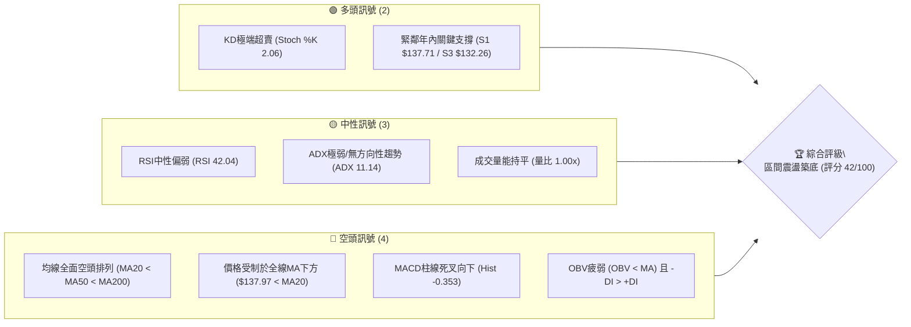
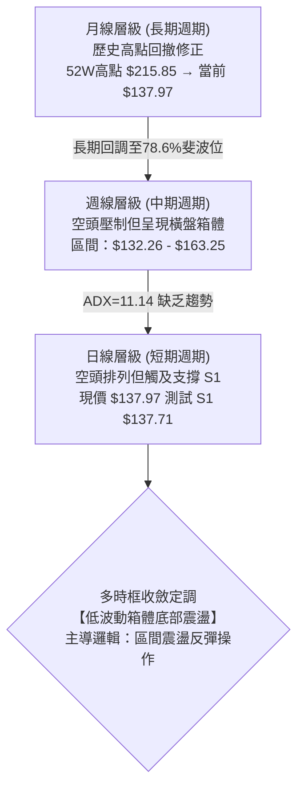
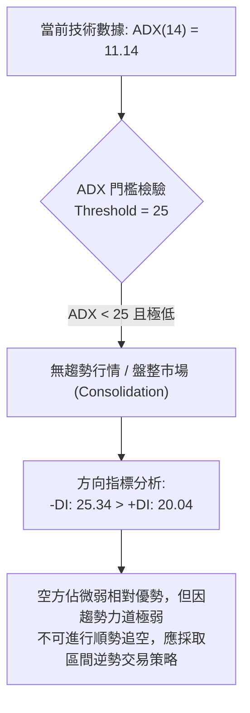
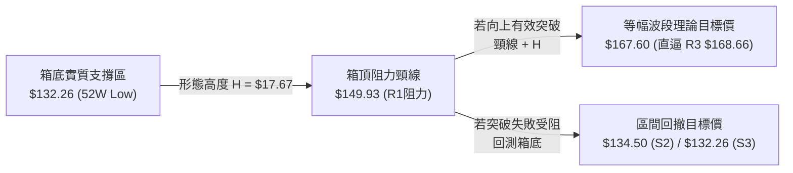
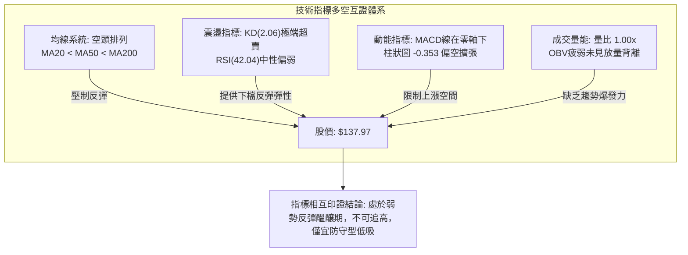
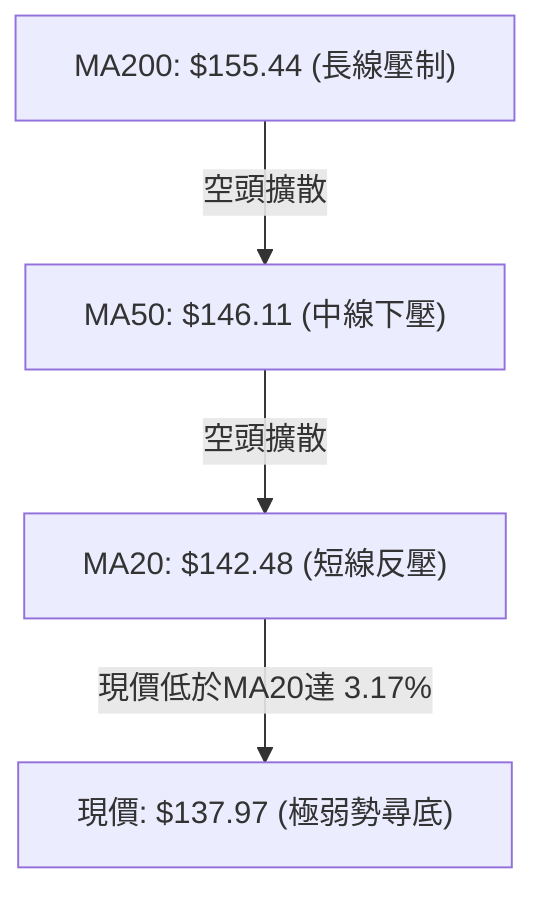
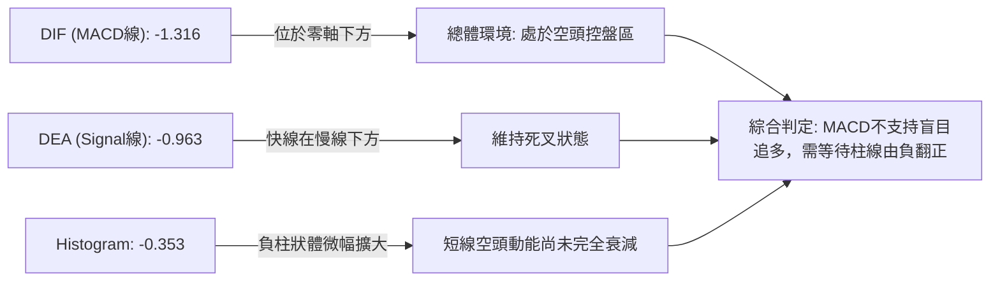
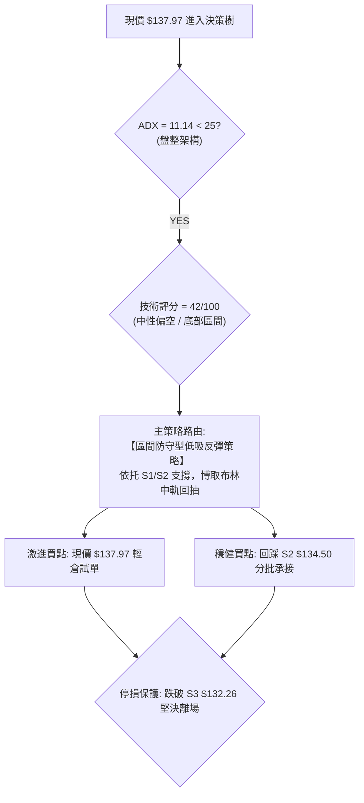
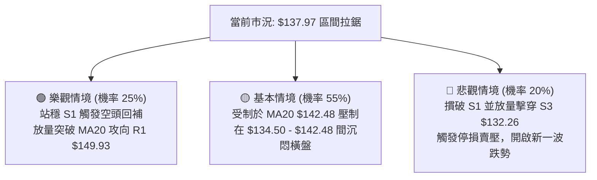

# VST 技術分析報告

> **報告日期**：2026-09-24 ｜ **語言**：繁體中文 ｜ **數據來源**：Yahoo Finance ｜ **當前價格**：$137.97

---

## 目錄

| 章節 | 內容 |
|------|------|
| [1. 技術面概覽](#1-技術面概覽) | 訊號儀表板、核心指標、評分卡 |
| [2. 趨勢分析](#2-趨勢分析) | 多時框趨勢、長中短期走勢 |
| [3. 圖表形態分析](#3-圖表形態分析) | 形態識別、K線組合、目標價 |
| [4. 支撐與阻力](#4-支撐與阻力) | 關鍵價位、斐波那契回調 |
| [5. 技術指標深度解讀](#5-技術指標深度解讀) | MA/RSI/MACD/布林/成交量 |
| [6. 動能與波動率](#6-動能與波動率) | 動能評估、ATR、Beta |
| [7. 多時框架總結](#7-多時框架總結) | 時框架評分矩陣 |
| [8. 交易策略建議](#8-交易策略建議) | 多空策略、風險報酬比 |
| [9. 風險提示與監控](#9-風險提示與監控) | 監控指標、風險場景 |

---

## 1. 技術面概覽

### 🎯 技術訊號儀表板



### 📊 核心指標速覽表

| 指標類別 | 指標名稱 | 當前數值 | 訊號 | 解讀 |
|----------|----------|----------|:----:|------|
| **價格** | 當前收盤價 | $137.97 | 🔴 | 位於52週區間下緣 6.8% 處，貼近一年低點 |
| **均線** | MA20 (短天期) | $142.48 | 🔴 | 價格低於MA20達 -3.17%，短線反彈第一道動態壓力 |
| **均線** | MA50 (中天期) | $146.11 | 🔴 | 中期生命線下行，壓制中期反彈結構 |
| **均線** | MA200 (長天期) | $155.44 | 🔴 | 長期牛熊分水嶺失守，長線格局轉為弱勢防守 |
| **動能** | RSI(14) | 42.04 | 🟡 | 位於中性偏弱區間，未破30超賣，亦無背離徵兆 |
| **動能** | Stoch %K / %D | 2.06 / 17.72 | 🟢 | 極度超賣狀態，短線具備技術性均值回歸彈升動能 |
| **動能** | MACD (12,26,9) | -1.316 / -0.963 | 🔴 | MACD位於零軸下且柱狀圖 -0.353，空方佔據微幅優勢 |
| **趨勢強度** | ADX(14) | 11.14 | 🟡 | 數值遠低於 25，表明缺乏單邊趨勢，屬典型的低波動震盪盤 |
| **通道位置** | Bollinger %B | 0.25 | 🟡 | 價格運行於中軌($142.48)與下軌($133.45)之間下半區 |
| **波動** | ATR(14) | $4.48 | 🟡 | 日內波動幅度佔股價 3.25%，波動率處於中等收斂階段 |
| **成交量** | 20日量比 | 1.00x | 🟡 | 當日量 4,392,700 股與20日均量相當，無機構異常掃貨或出逃 |

### 🏆 技術評分卡

```
╔══════════════════════════════════════════════════════════════════╗
║                   技術評分卡 — VST (2026-09-24)                 ║
╠══════════════════════════════════════════════════════════════════╣
║ 趨勢強度 (ADX/方向)   ████░░░░░░░░░░░░░░░░  20/100 🔴 弱勢無方向 ║
║ 動能指標 (RSI/KD/MACD)████████░░░░░░░░░░░░  40/100 🟡 KD超賣修正 ║
║ 支撐穩定度 (S1/S2/S3) ██████████████░░░░░░  70/100 🟢 臨近強支撐 ║
║ 成交量配合 (OBV/量比) ████████░░░░░░░░░░░░  40/100 🔴 量能未放大 ║
║ 形態完整度 (區間震盪) ██████████░░░░░░░░░░  50/100 🟡 箱底測試中 ║
║ 均線排列 (空頭排列)   ████░░░░░░░░░░░░░░░░  20/100 🔴 全線空頭壓 ║
╠══════════════════════════════════════════════════════════════════╣
║ 綜合技術評分          ████████░░░░░░░░░░░░  42/100 🟡 區間低吸觀 ║
╚══════════════════════════════════════════════════════════════════╝
```

---

## 2. 趨勢分析

### 🌐 多時框趨勢分析



### 📈 長期趨勢 — 12個月走勢圖（Unicode）

VST 過去 12 個月（2025-10 至 2026-09）經歷了從歷史高檔區間快速回調、隨後進入長達半年以上低位震盪的過程。

```
VST 月線收盤走勢圖（過去12個月：2025-10 至 2026-09）
價格軸 ($)
$195 ┤  ● (10月 $187.21)
$185 ┤
$175 ┤        ● (11月 $177.83)        ● (02月 $173.13)
$165 ┤
$155 ┤              ● (12月 $160.62)        ● (04月 $157.36)  ● (05月 $159.74)  ● (06月 $158.37)
$145 ┤                    ● (01月 $157.65)        ● (03月 $149.87)              ● (07月 $147.95)
$135 ┤                                                                                    ● (08月 $137.15) ─● (09月 $137.97 現價)
     └─────────────────────────────────────────────────────────────────────────────────────────────────────
       25-10   25-11   25-12   26-01   26-02   26-03   26-04   26-05   26-06   26-07   26-08   26-09
```

#### 走勢特徵分析表格

| 週期階段 | 月份區間 | 價格區間 ($) | 區間漲跌幅 | 走勢特徵與技術含義 |
|:---------|:---------|:-------------|:----------:|:------------------|
| **高檔派發期** | 2025-10 ~ 2025-12 | $187.21 → $160.62 | -14.20% | 從歷史天價回落，月K線連續收陰，均線高檔反轉向下。 |
| **反彈試探期** | 2026-01 ~ 2026-02 | $157.65 → $173.13 | +9.82% | 02月月線回抽確認空頭反壓，受制於長期均線後再度承壓。 |
| **中樞整理期** | 2026-03 ~ 2026-06 | $149.87 → $158.37 | +5.67% | 股價於 $150.00~$160.00 密集構建橫盤中樞，波動率持續收窄。 |
| **箱底回踩期** | 2026-07 ~ 2026-09 | $147.95 → $137.97 | -6.74% | 破位回測近一年低點 $132.26，目前在 $137.71 處試圖企穩。 |

### 📊 中期趨勢（週線分析）

從近 20 週數據觀察，VST 處於寬幅箱體內弱勢運行。多空反覆在 $135.00 至 $163.00 之間拉鋸。

```
近期週線壓力與支撐結構示意圖
════════════════════════════════════════════════════════════════════
$163.25 ───────┬─────────────────────── 高點阻力區間 (06-28 / 07-26 雙頂)
               │   ▲
               │   │ (寬幅震盪區間: 振幅約 $31.00)
$148.00~$150.00├───┴─────────────────── 中軌密集反壓 (09-06 $149.06 / 09-13 $148.14)
               │   ▼
$137.97 ───────┼◄── (當前價格：回測下軌支撐)
$132.26~$134.50┴─────────────────────── 52週低點 / S3 核心鐵底防線
════════════════════════════════════════════════════════════════════
```

### ⚡ 趨勢強度評估（ADX 解讀）



#### ADX 趨勢強度對照表

| 指標變數 | 當前讀數 | 標準評估區間 | 趨勢狀態判定 | 操作指導原則 |
|:---------|:--------:|:------------|:------------|:------------|
| **ADX (14)** | **11.14** | < 20 (極弱/無趨勢) | 處於強烈休眠與動能耗盡期 | 禁止使用順勢突破追單，以邊界逆勢策略為主 |
| **+DI (14)** | **20.04** | 0 ~ 100 | 多頭進攻力道不足 | 難以發動連續上攻行情 |
| **-DI (14)** | **25.34** | 0 ~ 100 | 空方略高於多方 5.30 點 | 空方雖主導但無法推動加速暴跌 |

---

## 3. 圖表形態分析

### 🔍 形態識別系統

依據嚴格規則，所有形態必須具備可驗證數據，無足夠樣本時不做過度臆測：

| 形態類別 | 信心度 | 判斷依據（引用數據） | 完成度 | 目標價（附嚴謹計算式） |
|:---------|:------:|:----------------------|:------:|:-----------------------|
| **箱體矩形整理 (Rectangle Bottom)** | **75%** | 底部密集獲支撐於 S2($134.50)~S3($132.26)，頂部受制於 R1($149.93) | 70% | 區間上軌 $149.93。若向上突破：頸線 $149.93 + (箱體高 $149.93 - 低 $132.26 = $17.67) = **$167.60** (貼近 R3 $168.66) |
| **雙重底潛力 (Double Bottom)** | **55%** | 第一隻腳為 2026-08-23 週收盤 $135.99 (低點觸及 S3 $132.26)，當前回踩 S1 $137.71 尋求第二隻腳 | 45% | 待放量突破中間頸線 $149.06 (2026-09-06高點)，推算目標：$149.06 + ($149.06 - $132.26 = $16.80) = **$165.86** |
| **大型頭肩底** | **< 30%** | 數據不足 | 0% | *訊號不足，僅做指標型解讀，不預設該形態* |

### 🕯️ 重要K線形態分析

| 週/月區間 | 收盤價 | K線形態 | 技術解讀 | 多空訊號 |
|:----------|:------:|:--------|:---------|:--------:|
| **2026-08-23** | $135.99 | 長下影長陰探底線 | 週線一度下殺直逼 52W 低點 $132.26 後獲得低接買盤收復，確認底部買盤存在 | 🟢 止跌初顯 |
| **2026-09-06** | $149.06 | 帶量長陽反彈K線 | 週線大漲並向上逼近 R1 $149.93，成交量放大至 2,213 萬股，確立區間上緣反壓 | 🟢 多頭反攻 |
| **2026-09-13** | $148.14 | 高檔十字倒錘星 | 受制於 78.6% 斐波回調位 $150.15 與 R1，長上影線顯示獲利了結與解套賣壓沈重 | 🔴 遇阻回落 |
| **2026-09-20** | $140.44 | 中陰線回調走勢 | 空方反撲，摜破 MA20 均線，週 MACD 柱線再度轉負 (-0.010)，動能減弱 | 🔴 空方回壓 |
| **2026-09-27** | $137.97 | 縮量十字星測試線 | 最新收盤成交量縮減至 1,367 萬股，回測 S1 支撐位 $137.71，賣壓顯著減緩 | 🟡 震盪整理 |

### 📉 ASCII 走勢形態示意圖

```
VST 潛在雙底 / 矩形箱底形態結構圖
──────────────────────────────────────────────────────────────────────────
$150.00 ───────┬───────────────────────────────┬────── 頸線 / 箱頂反壓 (R1 $149.93)
               │                               ▲
               │                             ╱   ╲
               │      ▲                    ╱       ╲
               │    ╱   ╲                ╱           ╲
$140.00 ───────┼──╱───────╲────────────╱───────────────●── 現價 $137.97 (測試S1)
               │ ╱         ╲          ╱
$132.26 ───────┴●───────────●────────┴───────────────────── 雙底底線 (52W Low $132.26)
               第1腳 (08-23)       第2腳構建中 (09-24)
──────────────────────────────────────────────────────────────────────────
```

### 🎯 形態目標價計算

以確立度最高的「箱體區間震盪」進行形態測量推算：



---

## 4. 支撐與阻力

### 🗺️ 關鍵價位分布圖（Unicode）

```
VST 價位結構分布圖（OHLCV 實際計算聚類）
══════════════════════════════════════════════════════════════════════
$168.66 ║████████████████████████████████████████║ 強阻力 R3 (波段天花板)
$164.19 ║▓▓▓▓▓▓▓▓▓▓▓▓▓▓▓▓▓▓▓▓▓▓▓▓▓▓▓▓▓▓▓         ║ 斐波那契 61.8% 反壓
$155.69 ║████████████████████████████            ║ 阻力 R2 (MA200密集防守線)
$150.15 ║▓▓▓▓▓▓▓▓▓▓▓▓▓▓▓▓▓▓                      ║ 斐波那契 78.6% 回調位
$149.93 ║████████████████████████████████████████║ 關鍵阻力 R1 (近一年波段高點聚類)
════════╬════════════════════════════════════════╬═════════════════════
$137.97 ╠════════════════════════════════════════╣ ◄ 當前市價 ($137.97)
════════╬════════════════════════════════════════╬═════════════════════
$137.71 ║▓▓▓▓▓▓▓▓▓▓▓▓▓▓▓▓▓▓▓▓▓▓▓▓▓▓▓▓▓▓▓▓▓▓▓▓    ║ 立即支撐 S1 (-0.19%，短線多頭陣地)
$134.50 ║████████████████████████████            ║ 次級支撐 S2 (-2.52%，近一年回踩平台)
$132.26 ║████████████████████████████████████████║ 強支撐 S3 (-4.14%，52週絕對鐵底)
══════════════════════════════════════════════════════════════════════
```

### 🚧 阻力位分析表

所有阻力數值完全取自 OHLCV 波段高點聚類數據：

| 阻力級別 | 價位 | 距離現價 | 形成原因與籌碼意義 | 突破難度 | 重要性 |
|:---------|:----:|:--------:|:------------------|:--------:|:------:|
| **R1** | **$149.93** | +8.67% | 近一年波段高點聚類，與 78.6% 斐波位($150.15)重合，密集套牢區 | 🔴 極高 | ★★★★★ |
| **R2** | **$155.69** | +12.84% | 長期生命線 MA200($155.44)共振區，牛熊分界反壓帶 | 🟡 中高 | ★★★★☆ |
| **R3** | **$168.66** | +22.24% | 2026年上半年多次反彈高點聚類，具備強烈形態技術阻力 | 🔴 極高 | ★★★☆☆ |

### 🛡️ 支撐位分析表

所有支撐數值完全取自 OHLCV 波段低點聚類數據：

| 支撐級別 | 價位 | 距離現價 | 形成原因與籌碼意義 | 守住機率 | 重要性 |
|:---------|:----:|:--------:|:------------------|:--------:|:------:|
| **S1** | **$137.71** | -0.19% | 近一年波段密集低點，現價正貼線運行，短線第一防線 | 🟡 60% | ★★★★☆ |
| **S2** | **$134.50** | -2.52% | 布林下軌($133.45)上方密集成交緩衝平台 | 🟢 75% | ★★★★☆ |
| **S3** | **$132.26** | -4.14% | 52週歷史最低點，機構防守底線，此處失守將引發估值重置 | 🟢 88% | ★★★★★ |

### 📐 斐波那契回調位分析

依據 52 週絕對區間（低點 $132.26 至 高點 $215.85，總垂直落差 $83.59）計算之官方回調位：

```
斐波那契回調階梯與現價定位
  0.0%  (52W High) ─── $215.85 
 23.6%             ─── $196.12 
 38.2%             ─── $183.92 
 50.0%             ─── $174.05 
 61.8%             ─── $164.19 
 78.6%             ─── $150.15 ────── 關鍵分水嶺 (R1 緊鄰於此)
[現價落點區間]      ─── $137.97 ◄───── 位於 78.6% 與 100.0% 之間 (超深幅修正區)
100.0%  (52W Low)  ─── $132.26 
```

- **位置意義解讀**：現價 $137.97 位於 78.6% ($150.15) 與 100.0% ($132.26) 之間，目前僅處於 52 週歷史波動區間的 **6.8%** 分位點。
- **技術含義**：在傳統技術分析中，深度回撤跌破 61.8% ($164.19) 後，股票已完全喪失原先的多頭主升段動能，轉入「深度價值重估與底部清洗」階段。78.6% 回調位 ($150.15) 已轉化為極為沉重的中期壓力牆，而下方 100% 基準點 ($132.26) 則是不可跌破的多頭最後堡壘。

---

## 5. 技術指標深度解讀

### 🎛️ 指標訊號總覽



### 📈 移動平均線排列分析



#### 各期均線狀態表

| 均線名稱 | 當前價格 | 與現價乖離 | 走勢特徵 | 訊號評級 |
|:---------|:--------:|:----------:|:---------|:--------:|
| **MA 5** | $140.59 | -1.86% | 短線下行斜率趨緩，即將扣抵低價區 | 🔴 空頭抵抗 |
| **MA 10** | $141.98 | -2.83% | 穩定下壓，短線壓制首當其衝 | 🔴 空頭壓制 |
| **MA 20** | $142.48 | -3.17% | 與布林中軌重合，短線空方防守中樞 | 🔴 核心反壓 |
| **MA 60** | $147.78 | -6.64% | 中期均線平緩下墜，阻斷中級波段展開 | 🔴 中期偏空 |
| **MA 120** | $151.22 | -8.76% | 長期均線下彎，顯示半年來買盤皆處於虧損狀態 | 🔴 長期轉弱 |
| **MA 200** | $155.44 | -11.24% | 牛熊分界線下行，確立中期空頭修正趨勢 | 🔴 總體偏空 |

*均線排列判定：MA20 < MA50 < MA200，形成標準空頭排列，所有均線均位於現價上方構成層層動態反壓。*

### 📉 RSI(14) 與 KD 分析

#### RSI 進度條與狀態解讀
```
RSI(14) 當前讀數: 42.04
0 ─────── 30 ──────────────── 42.04 ───────────── 70 ─────── 100
[ 超賣區 ] │   弱勢震盪區間   │        強勢區間  │ [ 超買區 ]
░░░░░░░░░░███████████████████░░░░░░░░░░░░░░░░░░░░
```

- **背離判斷**：
  - *日線層級*：近期價格自 09-06 高點回落，RSI 同步自 54.6 降至 42.04，**未出現底背離或頂背離**，屬正常的動能隨價格回撤。
  - *週線層級*：2026-08-23 週收盤 $135.99 (RSI 26.1)，最新收盤 $137.97 (RSI 42.0)，呈現「價格微幅抬高、RSI顯著回升」的隱性背離修復態勢。

#### 隨機指標 (Stochastic KD) 解讀
- **Stoch %K: 2.06 ｜ Stoch %D: 17.72**
- %K 值進入 10 以下的罕見極端超賣區域（2.06 屬於嚴重超賣鈍化邊界），表示短線殺跌動能已接近耗竭，極易引發技術性跌深反彈或空頭回補。

### 📊 MACD(12/26/9) 訊號解讀



- **MACD狀態**：雙線處於零軸下方（DIF -1.316 < DEA -0.963），柱狀圖為 -0.353，顯示空方仍持有發牌權。然而負值絕對值並未持續暴跌擴散，顯示這是一次低斜率的空頭牽引，而非崩跌式下殺。

### 📦 布林通道分析

```
VST 日線布林通道結構圖 (Bandwidth = $18.07)
══════════════════════════════════════════════════════════════════════
$151.52 ────────────────────────────────────────── 上軌 (Upper Band)
                     │
                     │  中上軌弱勢區
$142.48 ────────────────────────────────────────── 中軌 (MA20 Baseline)
                     │
         $137.97 ─── ● (現價位於中下軌區，%B = 0.25)
                     │
$133.45 ────────────────────────────────────────── 下軌 (Lower Band)
══════════════════════════════════════════════════════════════════════
```

- **通道帶寬與位置**：
  - 上軌：**$151.52** ｜ 中軌：**$142.48** ｜ 下軌：**$133.45**
  - **%B = 0.25**：股價位於下軌上方約 25% 處，未跌破下軌，並非處於「破軌加速下殺」形態，而是在下軌區間獲得支撐緩衝。
  - 下軌 $133.45 恰好與波段支撐 S2($134.50) 及 S3($132.26) 形成三重複合防守帶。

### 💹 成交量分析（量價配合度）

- **量能概況**：
  - 當日成交量：**4,392,700 股**
  - 20日均量：**4,388,470 股** (量比 **1.00x**)
  - 50日均量：**4,524,742 股**
- **OBV 能量潮解讀**：
  - 目前呈現 **OBV < MA**，代表資金累積線處於均線下方，機構買盤並未進場大舉吸籌。
  - 整體量價呈現「跌時量縮、反彈量平」的存量博弈結構，顯示市場籌碼處於觀望僵局。

---

## 6. 動能與波動率

### ⚡ 動能評估四象限

```
動能與波動率定位矩陣
       高波動率 (High Volatility)
           │
     Q3    │    Q4
  強動能   │  弱動能
  高風險   │  破位下殺
───────────┼───────────
     Q1    │    Q2
  主升突破 │ ★ VST 當前定位: Q2
  最佳買點 │  (弱動能、低波動 - 底部盤整期)
           │
       低波動率 (Low Volatility)
```

| 象限 | 動能強度 | 波動率水準 | 當前狀態判定 | 戰略操作指引 |
|:----:|:--------:|:----------:|:------------:|:------------|
| **Q1** | 強 (ADX>25) | 低 | — | 最佳趨勢建立期 |
| **Q2** | **弱 (ADX=11.14)** | **低 (ATR收斂)** | **✓ VST 所在位置** | **謹慎觀望，或以窄幅停損進行箱底低吸** |
| **Q3** | 強 (ADX>25) | 高 | — | 高波動趨勢噴發 |
| **Q4** | 弱 (ADX<25) | 高 | — | 恐慌拋售，避免進場 |

### 📊 ATR 波動率分析

- **ATR(14) 數值**：**$4.48**（佔當前股價之 **3.25%**）。
- **日內波動特徵**：日均波幅約 $4.50 美元，代表個股具備足夠的日內波段價差，但相較於 2025 年高檔時顯著降溫。
- **動態停損距離設計**：
  - 順勢交易常規停損：以 **1.5 × ATR** 計算 = $4.48 × 1.5 = **$6.72**
  - 緊密箱體防守停損：以 **1.0 × ATR** 計算 = $4.48 × 1.0 = **$4.48**
  - 現價 $137.97 扣除 1.0 ATR 為 **$133.49**，與 S2($134.50) 及布林下軌($133.45)高度吻合。

### 📐 Beta 與市場相關性

- **Beta 係數**：**1.414**
- **市場屬性剖析**：
  - 雖名義上屬於公用事業板塊 (Utilities - Independent Power Producers)，但高達 1.414 的 Beta 顯示其波動性遠高於標普500大盤。
  - 由於兼具 AI 數據中心電力需求題材與批發電價波動屬性，該股具備高彈性成長股的交易特徵，在大盤下行時回撤幅度通常加大。

---

## 7. 多時框架總結

### 📋 時框架評分表

| 時框架 | 趨勢方向 | 動能指標狀態 | 均線排列 | 圖表形態 | 綜合評分 | 戰略建議 |
|:-------|:--------:|:------------:|:--------:|:--------:|:--------:|:---------|
| **月線 (長期)** | 🔴 空頭修正 | 弱勢 (高檔回跌破61.8%) | 跌破中天期均線 | 深度回撤修正波 | 35/100 | 長期投資者保持觀望 |
| **週線 (中期)** | 🟡 橫盤整理 | 中性 (RSI 42.0, 柱狀微負) | 承壓於MA20/50 | 寬幅箱體 ($132-$163) | 45/100 | 箱體區間高拋低吸 |
| **日線 (短期)** | 🔴 弱勢觸底 | 超賣反彈 (KD=2.06) | 空頭排列 (壓在MA20下) | 測試 S1 支撐帶 | 42/100 | 短線博取超跌均值回歸 |

### 🔲 綜合訊號矩陣

```
時框與指標共振分析矩陣
════════════════════════════════════════════════════════════════════
項目           長期 (月線)      中期 (週線)      短期 (日線)      共振判定
────────────────────────────────────────────────────────────────────
趨勢走向       🔴 下行修正      🟡 區間拉鋸      🔴 均線壓制      弱勢偏空
動能水準       🔴 處於退潮      🟡 中性修復      🟢 KD極端超賣    動能衝突
支撐位表現     🟡 逼近78.6%     🟢 箱底具承接力  🟢 貼近S1關鍵位   下檔有撐
籌碼量能       🔴 OBV持續下行   🟡 週量能收斂    🟡 量比持平1.0x  量能匱乏
════════════════════════════════════════════════════════════════════
```

### ⚖️ 多時框收斂結論

依據多時框收斂規則：
1. **行情性質判定**：當前 ADX(14) 讀數僅為 **11.14**（遠小於 25 的趨勢門檻值），判定當前市場處於**「典型無趨勢的區間盤整行情（Consolidation Regime）」**。
2. **主導時框優先級**：在盤整行情中，不可採用中長線順勢跟隨法則，而**必須以日線與週線的震盪區間（日線布林通道上下軌 $133.45 ~ $151.52 及波段支撐阻力 S2/S3 ~ R1）為主要交易邊界**。
3. **唯一方向性結論**：**【中性偏弱、區間底部防守反彈（震盪操作）】**。禁止追空（因 KD 極端超賣且逼近 52 週鐵底 S3），但亦不可過度樂觀長線持股；所有操作均應定位於「箱底支撐低吸、反彈至均線壓力分批獲利了結」的區間震盪策略。

---

## 8. 交易策略建議

### 🗺️ 策略決策流程圖



### 🧭 策略路由

- **當前主策略方向 = 【中性偏空區間操作 — 偏向箱底防守低吸反彈】（依綜合評分 42/100）**
- **策略邏輯定調**：綜合評分處於 40–60 中性區間，且 ADX 為 11.14 極弱趨勢。嚴禁執行突破追單，策略核心為利用日線超賣（KD=2.06）並緊貼 S1($137.71) 的地理優勢，以緊密止損博取向布林中軌 MA20($142.48) 及 R1($149.93) 的技術性修復。

### 🎯 價格情境階梯（Price Scenarios）

完全引用第 4 章及 OHLCV 關鍵價位：

| 觸發條件 | 第一目標 (T1) | 第二目標 (T2) | 後續延伸 (T3) | 情境技術含義 |
|:---------|:-------------:|:-------------:|:-------------:|:-------------|
| **站穩現價突破 MA20 ($142.48)** | **R1 ($149.93)** | **R2 ($155.69)** | **R3 ($168.66)** | 短線超跌反彈轉為中級波段修復 |
| **維持在 $134.50 ~ $142.48 內** | — | — | — | 典型低波動區間震盪築底 |
| **跌破 S1 ($137.71) 探底** | **S2 ($134.50)** | **S3 ($132.26)** | 創52W新低 | 破位下殺，所有多頭波段單必須停損 |

### 📊 情境機率分佈

| 情境類型 | 預估機率 | 主要技術與量化依據 |
|:---------|:--------:|:------------------|
| **箱底反彈 / 均值回歸** | **50%** | Stoch %K 跌至 2.06 極度超賣；現價貼近 S1 $137.71；短線下跌動能暫歇 |
| **區間橫盤震盪** | **35%** | ADX 僅 11.14 缺乏單邊動能；成交量維持 1.00x 平衡；布林帶上下軌收斂中 |
| **向下破位探底** | **15%** | 均線呈空頭排列，MACD 處於零軸下；若大盤劇震易帶動 Beta 1.414 破底測試 S3 |

### 🟢 主策略詳情

本策略專注於區間箱底的低吸操作，分為「激進現價型」與「穩健回踩型」：

| 策略要素 | 策略 A（現價超跌反彈單） | 策略 B（極限箱底埋伏單） |
|:---------|:------------------------|:------------------------|
| **進場條件** | 依據 KD=2.06 超賣，現價獲 S1 支撐 | 耐心等待價格二次回探 S2 支撐 |
| **進場價格** | **$137.97**（當前市價） | **$134.50**（S2 波段支撐位） |
| **第一目標價 (T1)** | **$142.48**（MA20 / 布林中軌） | **$142.48**（MA20 反壓） |
| **第二目標價 (T2)** | **$149.93**（R1 阻力 / 箱頂區） | **$149.93**（R1 核心阻力） |
| **止損價格** | **$134.00**（跌破 S2 支撐緩衝點） | **$131.50**（明確跌穿 52W 低點 S3） |
| **風險額度 (每股)** | $3.97 | $3.00 |
| **報酬額度 (至T2)** | $11.96 | $15.43 |
| **風險報酬比 (R:R)**| **1 : 3.01** | **1 : 5.14** |
| **預估勝率** | **50%** | **65%** |
| **建議倉位** | **總資金 5% ~ 8%**（輕倉試單） | **總資金 10% ~ 12%**（防守型底倉） |

### 🔴 反向風險觸發點（對沖提示）

- **全面空頭轉化點**：若日K線收盤價**實體跌破 $132.26 (S3 / 52W Low)**，宣告雙底築底形態徹底失敗，區間支撐全面瓦解。
- **對沖處置動作**：立即出清所有多頭抄底部位，嚴禁加碼攤平；激進交易者可在反抽確認無法站回 $134.50 時，反手建立以跌破放量為基礎的空頭部位，下看未探明之深水區。

### ⭐ 整體訊號強度評星

```
╔══════════════════════════════════════════════════════════════════╗
║ 做多訊號強度：★★☆☆☆  (2.5/5星 — 僅屬超跌反彈，非大級別反轉)      ║
║ 做空訊號強度：★★☆☆☆  (2.0/5星 — 逼近強支撐區，勝率與空間有限)    ║
║ 整體可信度：  ★★★☆☆  (3.5/5星 — 震盪行情指標有效性高)            ║
╚══════════════════════════════════════════════════════════════════╝
```

---

## 9. 風險提示與監控

### ✅ 關鍵監控指標 Checklist

```
╔══════════════════════════════════════════════════════════════════╗
║               VST 每日盤後關鍵技術監控 Checklist                 ║
╠══════════════════════════════════════════════════════════════════╣
║ [ ] 價格防守線：收盤價是否持續維持於 S1 $137.71 之上？          ║
║ [ ] 極端防禦線：盤中最低價是否守住 52週鐵底 S3 $132.26？       ║
║ [ ] 反彈攻堅線：日K線是否放量站上 MA20 $142.48？               ║
║ [ ] 動能修復線：Stoch %K 是否完成黃金交叉由超賣區回升至 20 以上？ ║
║ [ ] MACD 轉向：MACD 柱狀體是否由 -0.353 縮減至負翻正？          ║
║ [ ] 趨勢甦醒線：ADX(14) 是否由 11.14 抬頭突破 20 形成新方向？     ║
║ [ ] 異常放量監控：日成交量是否突發放大至 1.5x 均量 (650萬股以上)？ ║
╚══════════════════════════════════════════════════════════════════╝
```

### ⚠️ 風險場景分析



### 🛡️ 風險管理重要提醒

1. **Beta 槓桿風險**：VST 的 Beta 高達 1.414，對美股整體市場（如標普500指數）的回跌高度敏感。若大盤指數走弱，個股極易被拖累下穿支撐。
2. **財報與估值背景**：雖然 Forward P/E 為 13.31 且分析師共識目標價高達 $217.58，但當前技術面由短期空頭排列主導，**絕對不可因分析師目標價而忽視短期破位停損紀律**。
3. **倉位管理法則**：由於 ADX 處於 11.14 低動能狀態，盤整往往耗時長久，持倉成本與心理壓力較高。單一反彈策略倉位嚴格控制在總投資組合的 **10% 以內**，嚴禁在跌破 S3 $132.26 時進行任何形式的逆勢加碼。

---

## 📋 報告總結

```
╔══════════════════════════════════════════════════════════════════╗
║                       VST 技術分析報告總結                       ║
╠══════════════════════════════════════════════════════════════════╣
║ 報告日期：2026-09-24                                             ║
║ 當前價格：$137.97                                                ║
║ 分析評級：⚖️ 中性觀望 / 區間箱底防守 (技術評分: 42/100)          ║
╠══════════════════════════════════════════════════════════════════╣
║ 關鍵結論：                                                       ║
║ ├─ 長期趨勢：🔴 空頭修正中，跌破 61.8% 斐波那契回調位            ║
║ ├─ 中期趨勢：🟡 寬幅箱體震盪 ($132.26 ~ $163.25)                ║
║ ├─ 短期趨勢：🔴 均線空頭排列，但 KD(2.06) 進入極端超賣區        ║
║ ├─ 關鍵支撐：S1: $137.71 ｜ S2: $134.50 ｜ S3: $132.26 (鐵底)   ║
║ ├─ 關鍵阻力：R1: $149.93 ｜ R2: $155.69 ｜ R3: $168.66          ║
║ └─ 動態中軌：MA20 $142.48 (短線第一道核心壓力)                   ║
╠══════════════════════════════════════════════════════════════════╣
║ 最優策略組合：                                                   ║
║ 1. 🥇 最佳機會：策略 A (現價 $137.97 輕倉低吸博取反彈至 $142.48) ║
║ 2. 🥈 次選機會：策略 B (掛單 S2 $134.50 處埋伏，停損設 $131.50)  ║
║ 3. 🥉 保守選擇：完全空倉觀望，直至價格有效站穩 MA20 ($142.48)   ║
╚══════════════════════════════════════════════════════════════════╝
```

---

> ⚠️ **免責聲明**：本報告為 AI 自動生成之技術分析，所有數據及估算均基於提供的歷史價格資訊。本報告**僅供研究與學術參考**，**不構成任何投資建議**。投資有風險，入市需謹慎。

---

*報告生成時間：2026-09-24 ｜ 數據來源：Yahoo Finance ｜ 分析框架：多時框技術分析*