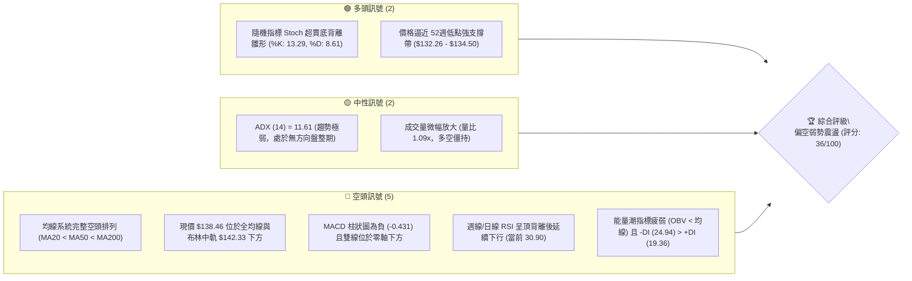
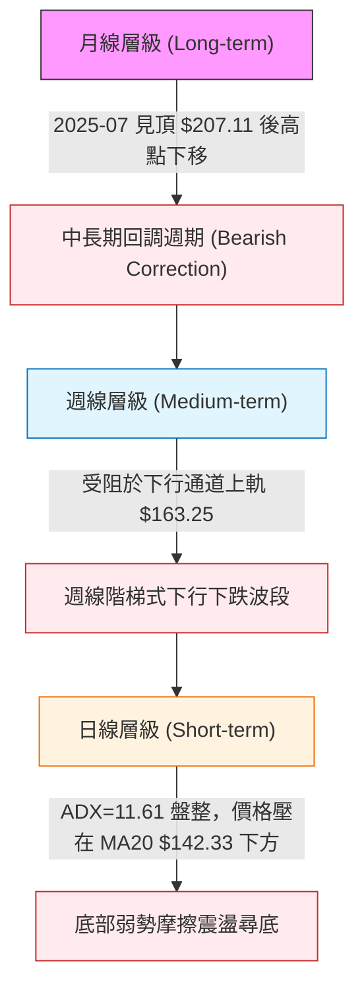
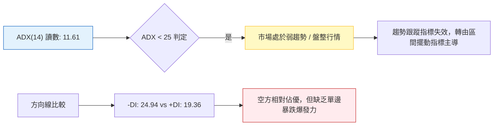
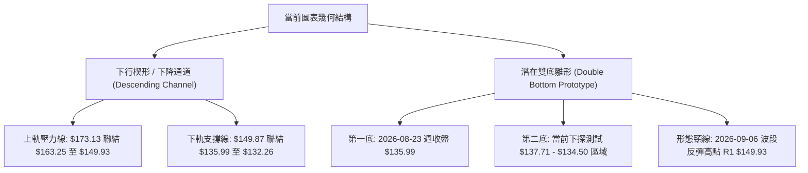
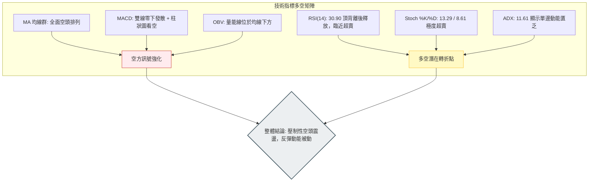
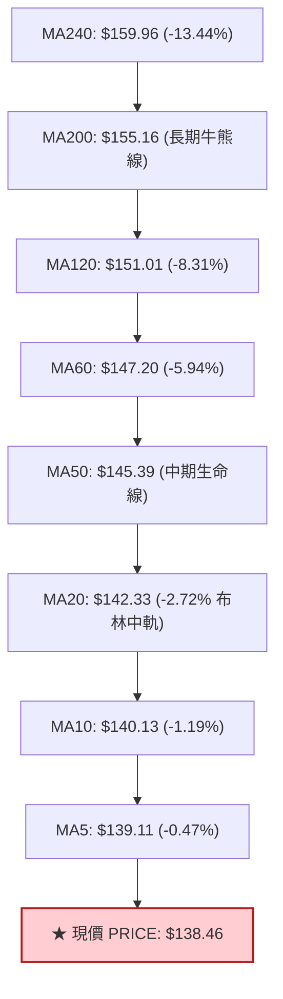
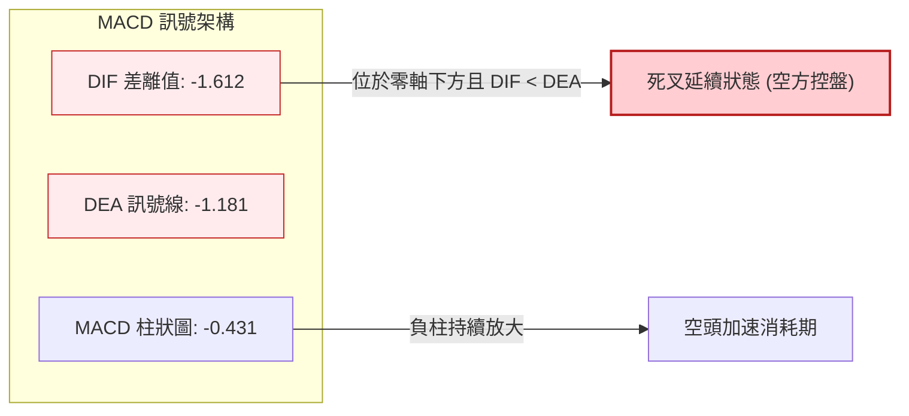
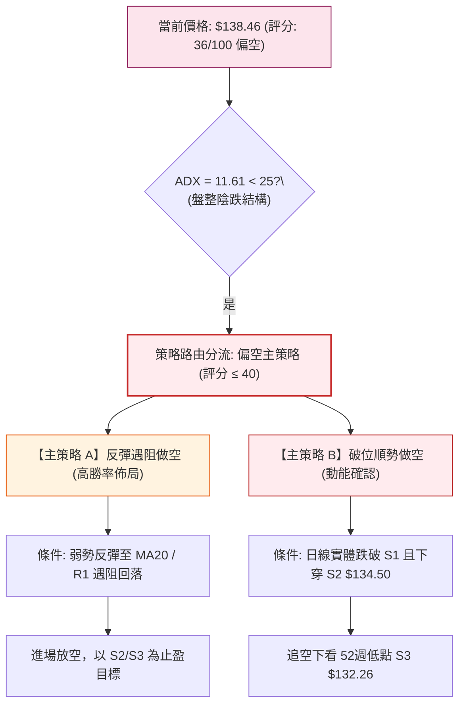
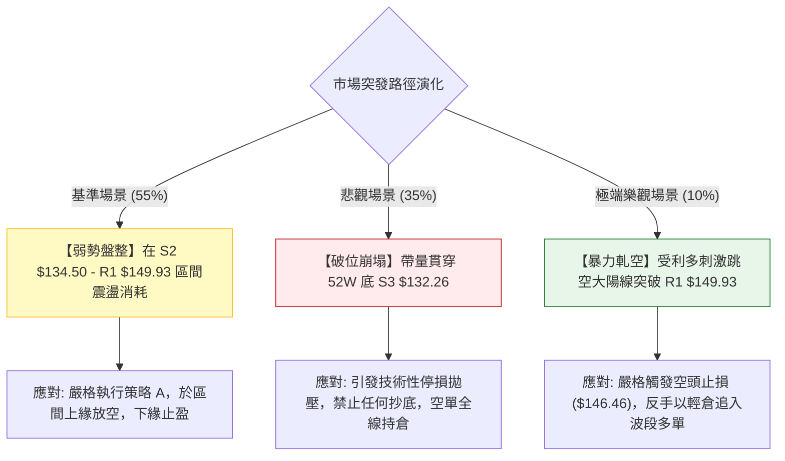

# VST 技術分析報告

> **報告日期**：2026-09-28 ｜ **語言**：繁體中文 ｜ **數據來源**：Yahoo Finance ｜ **當前價格**：$138.46

---

## 目錄

| 章節 | 內容 |
|------|------|
| [1. 技術面概覽](#1-技術面概覽) | 訊號儀表板、核心指標、評分卡 |
| [2. 趨勢分析](#2-趨勢分析) | 多時框趨勢、長中短期走勢 |
| [3. 圖表形態分析](#3-圖表形態分析) | 形態識別、K線組合、目標價 |
| [4. 支撐與阻力](#4-支撐與阻力) | 關鍵價位、斐波那契回調 |
| [5. 技術指標深度解讀](#5-技術指標深度解讀) | MA/RSI/MACD/布林/成交量 |
| [6. 動能與波動率](#6-動能與波動率) | 動能評估、ATR、Beta |
| [7. 多時框架總結](#7-多時框架總結) | 時框架評分矩陣 |
| [8. 交易策略建議](#8-交易策略建議) | 多空策略、風險報酬比 |
| [9. 風險提示與監控](#9-風險提示與監控) | 監控指標、風險場景 |

---

## 1. 技術面概覽

### 🎯 技術訊號儀表板



### 📊 核心指標速覽表

| 指標類別 | 指標名稱 | 當前數值 | 訊號 | 解讀 |
|:---|:---|:---|:---:|:---|
| **價格** | 當前收盤價 | $138.46 | 🔴 | 位於 52週區間 7.4% 底部區域，空頭動能壓制明顯 |
| **短期均線** | MA20 (布林中軌) | $142.33 | 🔴 | 價格低於 MA20 達 -2.72%，短線反彈皆受壓於此 |
| **中期均線** | MA50 | $145.39 | 🔴 | 中期生命線持續向下傾斜，波段空方主導結構 |
| **長期均線** | MA200 | $155.16 | 🔴 | 牛熊分界線失守，長期多頭格局已遭技術性破壞 |
| **動能指標** | RSI(14) | 30.90 | 🟡 | 逼近超賣界限 (30.00)，空方動能減速但未見轉折金叉 |
| **動能指標** | MACD (12,26,9) | -1.612 | 🔴 | DIF < MACD Signal (-1.181)，柱狀圖 -0.431，空頭發散 |
| **超短線動能**| Stoch %K / %D | 13.29 / 8.61 | 🟢 | 進入極度超賣區，短線隨時存在技術性反抽需求 |
| **趨勢強度** | ADX(14) | 11.61 | 🟡 | 數值遠低於 25，顯示當前非單邊強趨勢，實為低波陰跌盤整 |
| **方向指標** | +DI / -DI | 19.36 / 24.94 | 🔴 | 空方力量 (-DI) 占優，多方推升力道匱乏 |
| **波動帶** | 布林帶寬 (%B) | 0.29 | 🔴 | 運行於下半軌區間 ($133.06 - $142.33)，空方擠壓下軌 |
| **量能指標** | 20日成交量比 | 1.09x (4.90M) | 🟡 | 略高於均量但 OBV < MA，屬弱勢出脫與缺乏買盤承接 |
| **波動率** | ATR(14) | $4.13 (2.98%) | 🟡 | 日內平均波動振幅適中，適合作為止損距離設置依據 |

### 🏆 技術評分卡

```
╔══════════════════════════════════════════════════════════════╗
║                技術評分卡 — VST (2026-09-28)                 ║
╠══════════════════════════════════════════════════════════════╣
║ 趨勢強度 (Trend)      ██████░░░░░░░░░░░░░░  30/100   🔴 弱勢空頭 ║
║ 動能指標 (Momentum)   ███████░░░░░░░░░░░░░  35/100   🔴 空方發散 ║
║ 支撐穩定度 (Support)  ██████████░░░░░░░░░░  50/100   🟡 測底邊緣 ║
║ 成交量配合 (Volume)   ███████░░░░░░░░░░░░░  35/100   🔴 量能萎靡 ║
║ 形態完整度 (Pattern)  ████████░░░░░░░░░░░░  40/100   🟡 通道陰跌 ║
║ 均線排列 (MA System)  ███░░░░░░░░░░░░░░░░░  15/100   🔴 空頭排列 ║
╠══════════════════════════════════════════════════════════════╣
║ 綜合技術評分          ███████░░░░░░░░░░░░░  36/100   🔴 偏空震盪 ║
╚══════════════════════════════════════════════════════════════╝
```

---

## 2. 趨勢分析

### 🌐 多時框趨勢分析



### 📈 長期趨勢 — 12個月走勢圖（Unicode）

以下為 VST 自 2025 年 10 月至 2026 年 09 月之 12 個月收盤走勢軌跡。價格自高位回落，經歷多波次下跌，整體呈現一浪低於一浪的空頭通道走勢：

```
VST 月線走勢圖（過去12個月：2025-10 至 2026-09）
價格軸 ($)
$190 ┤  ● (10月: $187.21)
$180 ┤    ● (11月: $177.83)
$175 ┤                          ● (02月反彈高點: $173.13)
$165 ┤
$160 ┤        ● (12月: $160.62)       ● (04月: $157.36)  ● (05月: $159.74)
$155 ┤            ● (01月: $157.65)                         ● (06月: $158.37)
$150 ┤                                  ● (03月: $149.87)
$145 ┤                                                        ● (07月: $147.95)
$140 ┤                                                            ● (08月: $137.15)
$135 ┤                                                                ● (09月現價: $138.46)
     └─────────────────────────────────────────────────────────────────────────────►
       10    11    12    01    02    03    04    05    06    07    08    09   (月份)
      (2025)            (2026)
```

#### 走勢特徵分析表格

| 階段區間 | 起止月份 | 價格變化 | 漲跌幅 | 結構性技術特徵 |
|:---|:---|:---:|:---:|:---|
| **第一階段：高位滯漲** | 2025-10 → 2025-12 | $187.21 → $160.62 | -14.20% | 歷史高點 $215.85 確立後，大單出貨，跌破 20日與 50日均線支撐 |
| **第二階段：次高反抽** | 2026-01 → 2026-02 | $157.65 → $173.13 | +9.82% | 斐波那契 50.0% ($174.05) 遇阻承壓，形成典型的中繼下跌空頭陷阱 |
| **第三階段：平台破位** | 2026-03 → 2026-06 | $149.87 → $158.37 | +5.67% | 於 $150.00 - $160.00 構築窄幅震盪箱體，但久盤不漲，動能衰竭 |
| **第四階段：加速趕底** | 2026-07 → 2026-09 | $158.37 → $138.46 | -12.57% | 跌破箱體下沿，均線呈現全空頭排列，逼近 52週低點 $132.26 |

### 📊 中期趨勢（週線分析）

中期走勢受制於下降通道上軌。近 20 週數據顯示，反彈高點依序為：
- 2026-06-21 收盤 $163.25
- 2026-07-26 收盤 $163.11
- 2026-09-13 收盤 $148.14

反彈高點由 $163 附近劇烈下移至 $148 附近，顯示每一次多頭反撲的力道均被空頭以更低的位置瓦解。

```
中期關鍵壓力與支撐階梯分布示意
┌──────────────────────────────────────────────────────────┐
│ [阻力區 R3]  $168.66 ═══════════ (中期多空分水嶺)         │
│     ▲                                                    │
│ [阻力區 R2]  $155.69 ─────────── (MA200 牛熊線交匯處)     │
│     ▲                                                    │
│ [阻力區 R1]  $149.93 ┄┄┄┄┄┄┄┄┄┄┄ (近月反彈破位頸線)     │
│──────────────────────────────────────────────────────────│
│     ★ 現價: $138.46 (位於 S1 上方摩擦)                  │
│──────────────────────────────────────────────────────────│
│ [支撐區 S1]  $137.71 ┄┄┄┄┄┄┄┄┄┄┄ (近期密集低點支撐)     │
│     ▼                                                    │
│ [支撐區 S2]  $134.50 ─────────── (波段防守關鍵平台)     │
│     ▼                                                    │
│ [支撐區 S3]  $132.26 ═══════════ (52週絕對歷史低點)       │
└──────────────────────────────────────────────────────────┘
```

### ⚡ 趨勢強度評估（ADX 解讀）



| 指標變數 | 當前讀數 | 門檻區間 | 技術解讀 | 交易涵義 |
|:---|:---:|:---:|:---|:---|
| **ADX(14)** | **11.61** | < 25 (極弱) | 當前缺乏明確的單邊趨勢推動力，屬於「弱勢收斂橫盤」 | 禁止使用單邊突破追單策略，極易遭遇假突破侵蝕本金 |
| **+DI** | **19.36** | 基準線 20 | 多頭進攻動能疲弱，市場主動性買盤低迷 | 多頭缺乏波段發起能力，多為被動防守 |
| **-DI** | **24.94** | 基準線 20 | 空頭主導權略高於多頭，形成空方壓制下的陰跌態勢 | 逢反彈遭遇阻力位時，空頭打壓勝率較高 |

---

## 3. 圖表形態分析

### 🔍 形態識別系統



#### 形態信心度與參數評估表

依據嚴格技術規則，所有宣稱之圖表形態均標注信心度百分比：

| 形態名稱 | 信心度 | 判斷依據（引用實際數據） | 形態完成度 | 目標價（附嚴格計算式） |
|:---|:---:|:---|:---:|:---|
| **下行通道**<br>(Descending Channel) | **75%** | 1. 高點依序下降：$173.13 (2月) → $163.25 (6月) → $149.06 (9月)<br>2. 低點依序下移：$149.87 (3月) → $135.99 (8月) → $132.26 (52W低) | **85%** | 通道下軌下探目標價：<br>直接指向支撐 **S3 $132.26** |
| **潛在雙重底**<br>(Double Bottom) | **38%** | 1. 2026-08-23 探底收盤 $135.99 後反彈至 $149.06<br>2. 當前再次下測 $137.71 (S1)<br>3. *信心度低於50%，未獲成交量確認，僅屬假想結構* | **40%**<br>(未突破頸線) | 若未來突破頸線 R1 $149.93：<br>形態高度 = 頸線 $149.93 - 低點 $135.99 = $13.94<br>理論多頭量度目標價 = $149.93 + $13.94 = **$163.87**<br>(接近阻力帶 R3 $168.66 前緣) |

> ⚠️ **分析師警示**：由於潛在雙底信心度僅 38%（< 50%），依規則不得將其作為主交易假設，僅能作為指標型底背離觀察；當前行情本質仍屬於下行通道內的弱勢弱反彈結構。

### 🕯️ 重要K線形態分析

| 週期/時間 | 收盤價 | 走勢形態特徵 | 技術解讀 | 訊號 |
|:---|:---:|:---|:---|:---:|
| **2026-08-23 週** | $135.99 | 探底長下影錘頭線 (Hammer) | 於 52週低點上方探底回升，成交量 21.50M，釋放空頭竭盡訊號 | 🟢 短線止跌 |
| **2026-09-06 週** | $149.06 | 長陽實體反彈吞噬線 (Bullish Engulfing) | 連續收復前兩週失地，RSI 自 26 快速彈升至 54.6，遭遇 R1 考驗 | 🟢 多頭抵抗 |
| **2026-09-13 週** | $148.14 | 高位十字星/吊人線 (Hanging Man) | 觸碰 R1 $149.93 前量能萎縮至 18.61M，RSI 高達 71.4 呈現日線頂背離 | 🔴 上攻乏力 |
| **2026-09-20 週** | $140.44 | 長陰貫穿破位線 (Bearish Piercing) | 一舉吃掉前週漲幅，重新跌破 MA20，確立反彈終結 | 🔴 空方控盤 |
| **2026-09-27 週** | $138.46 | 弱勢下沉小陰線 (Weak Consolidation) | 實體受壓於 MA5 ($139.11) 與 MA10 ($140.13)，空頭穩步下壓 | 🔴 弱勢尋底 |

### 📉 ASCII 走勢形態示意圖

```
VST 2026年08月-09月 日/週線反彈受阻與形態破位示意
價格 ($)
$150.00 ┤              ● (09-06 高點 $149.06 - 遭遇 R1 $149.93 壓制)
$148.00 ┤             ╱ ╲
$146.00 ┤            ╱   ╲  ● (09-13 $148.14 頂背離構築次頂)
$144.00 ┤           ╱     ╲
$142.00 ┤          ╱       ╲
$140.00 ┤  ●       ╱         ╲  ● (09-20 大陰線跌破 $140.44)
$138.00 ┤ ╱ ╲    ╱            ╲    ●◄───【現價 $138.46: 逼近 S1 $137.71】
$136.00 ┤●   ●──●               ╲  
$134.00 ┤ (08-23 探底 $135.99)    ▼ 跌向下軌支撐區 S2 $134.50 / S3 $132.26
        └──────────────────────────────────────────────────────────────► 時間
```

---

## 4. 支撐與阻力

### 🗺️ 關鍵價位分布圖（Unicode）

依據 OHLCV 歷史波段聚集運算，VST 嚴格劃分的關鍵價位結構分布如下：

```
VST 價位結構分布圖（OHLCV 精確計算）
═════════════════════════════════════════════════════════════════
$168.66 ║████████████████████████████████║ 強阻力 R3 (中長期反轉關鍵分界)
        ║                                ║
$155.69 ║████████████████████████        ║ 阻力 R2 (MA200 牛熊均線交匯壓制)
        ║                                ║
$149.93 ║██████████████████████████████  ║ 關鍵阻力 R1 (近月反彈高點聚類)
════════╬════════════════════════════════╬════════════════════════
$138.46 ╠════════════════════════════════╣ ◄── 當前市價 (位於弱勢防守區)
════════╬════════════════════════════════╬════════════════════════
$137.71 ║▓▓▓▓▓▓▓▓▓▓▓▓▓▓▓▓▓▓▓▓▓▓▓▓        ║ 近期支撐 S1 (第一道弱支撐防線)
        ║                                ║
$134.50 ║████████████████████████        ║ 關鍵支撐 S2 (波段多頭最後平台)
        ║                                ║
$132.26 ║████████████████████████████████║ 極限強支撐 S3 (52週歷史絕對低點)
═════════════════════════════════════════════════════════════════
```

### 🚧 阻力位分析表

所有阻力價位嚴格引用系統計算之波段高點聚類數值，嚴禁任意捏造：

| 阻力級別 | 精確價位 | 距離現價幅度 | 形成技術原因與歷史聚類依據 | 突破難度 | 技術重要性 |
|:---|:---:|:---:|:---|:---:|:---:|
| **R1** | **$149.93** | +8.29% | 2026-09-06 週線反彈高點 ($149.06) 聚類區，疊加斐波那契 78.6% 回調位 ($150.15) 及日線 MA120 ($151.01)，形成密集空頭重壓。 | 🔴 高 | ★★★★☆ |
| **R2** | **$155.69** | +12.44% | 2026-05 至 2026-06 箱體震盪破位中軸，恰好與當前 MA200 牛熊線 ($155.16) 完全重合，為中期趨勢轉折關鍵。 | 🔴 極高 | ★★★★★ |
| **R3** | **$168.66** | +21.81% | 2026-02 月線級別次高點反彈頸線 ($173.13) 之下方防守平台，亦為斐波那契 61.8% ($164.19) 突破後的空頭最後防線。 | 🔴 極高 | ★★★★☆ |

### 🛡️ 支撐位分析表

所有支撐價位嚴格引用系統計算之波段低點聚類數值：

| 支撐級別 | 精確價位 | 距離現價幅度 | 形成技術原因與歷史聚類依據 | 守住機率 | 技術重要性 |
|:---|:---:|:---:|:---|:---:|:---:|
| **S1** | **$137.71** | -0.54% | 近兩週日線級別收盤震盪低點下緣，與當前市價僅一步之遙，提供極短線微弱緩衝。 | 🟡 45% | ★★☆☆☆ |
| **S2** | **$134.50** | -2.86% | 2026-08-23 週探底陽線收盤實體下沿 ($135.99) 下方之多頭買盤密集區，與布林下軌 ($133.06) 形成共振防護。 | 🟢 65% | ★★★★☆ |
| **S3** | **$132.26** | -4.48% | **52週絕對歷史低點**（亦為 2025-03 低點 $116.49 啟動以來的年度牛熊臨界底線），多頭絕不可失守的基石。 | 🟢 80% | ★★★★★ |

### 📐 斐波那契回調位分析

基準週期取自 52週區間：**起點高點 $215.85 → 終點低點 $132.26**（回調幅度計算基準）：

```
斐波那契空間結構分析
─────────────────────────────────────────────────────────
0.0%  (52W High)    $215.85 ─────────────────────────────
23.6% 回調位         $196.12 ─── [強壓阻力]
38.2% 回調位         $183.92 ─── [長期反壓]
50.0% 均衡中軸       $174.05 ─── [2026-02 反彈頂點 $173.13 完美受阻於此]
61.8% 黃金分割位     $164.19 ─── [2026-06/07 雙頂壓制線]
78.6% 深度回調位     $150.15 ─── [精確對應阻力 R1 $149.93]
─────────────────────────────────────────────────────────
現價: $138.46  ◄─── 處於 78.6% ($150.15) 與 100.0% ($132.26) 之間
─────────────────────────────────────────────────────────
100.0% (52W Low)    $132.26 ─────────────────────────────
─────────────────────────────────────────────────────────
```

**技術解讀**：
1. 現價 $138.46 深陷於 **78.6% ($150.15)** 與 **100.0% ($132.26)** 的極度弱勢區間，表明過去一年的多頭漲幅已被回吐超過 92% 以上（目前位於 52週整體區間的 7.4% 位置）。
2. 在斐波那契技術體系中，當價格跌破 61.8% ($164.19) 後，反彈若無法收復 78.6% ($150.15)，通常預示著行情有極大機率回測 100.0% 全回調位，即 **S3 $132.26**。

---

## 5. 技術指標深度解讀

### 🎛️ 指標訊號總覽



### 📈 移動平均線排列分析



**均線系統結構解讀**：
- **完整空頭瀑布排列**：$MA5 < MA10 < MA20 < MA50 < MA60 < MA120 < MA200 < MA240$。從短天期到長天期均線無一例外呈現空頭向下壓制狀態。
- **均線負乖離率**：現價距離 MA20 負乖離為 -2.72%，距離 MA200 負乖離高達 -10.76%。雖然未達到極端恐慌性負乖離（通常需超過 -15%），但表明價格始終沿著均線下緣被動貼著下行，上方各均線形成層層空頭蓋頂。

### 📉 RSI(14) 分析

```
RSI(14) 數值儀表板:
0 ──────── 30 ───────────────────── 50 ───────────────────── 70 ──────── 100
[超賣區]   │                         │                       │  [超買區]
├──────────┼─────────────────────────┼───────────────────────┼─────────┤
█████████░░░░░░░░░░░░░░░░░░░░░░░░░░░░░░░░░░░░░░░░░░░░░░░░░░░░░░░░░░░░░░░░░░░░░░
▲
30.90 (當前位置: 弱勢弱反彈臨界)
```

- **背離形態明確判定**：
  - **歷史頂背離（Bearish Divergence）結論**：2026-09-06 週收盤價達 $149.06（RSI 為 54.6），至 2026-09-13 日線衝高回落過程中，RSI 衝高至 71.4，但價格未能有效站上頸線 R1 $149.93，隨後引發技術性頂背離大幅跳水，直接造成當前兩週長陰下殺。
  - **當前底背離狀態**：目前價格下探 $138.46，RSI 跌至 30.90，與前低（2026-08-23 週收盤 $135.99，當時 RSI 為 26.1）相比，呈現「價格尚未破前低，RSI 亦未破前低」的**同步收斂格局**，**目前並未確認形成底背離**。投資人切忌預先盲目猜底。

### 📊 MACD(12/26/9) 訊號解讀



- **量化特徵**：DIF (-1.612) 與 DEA (-1.181) 雙雙深陷零軸之下，柱狀圖讀數為 -0.431。自 2026-09-20 週線翻負（-0.010）以來，負柱連續擴張，意味著自 $149.06 發動的這波回調仍由空方全權主導，尚未出現任何動能衰竭或紅柱拐點。

### 📦 布林通道分析

```
VST 布林通道空間定位圖（日線尺度）
═══════════════════════════════════════════════════════════════
$151.61 ────────────────────────────── 布林上軌 (Upper Band)
        │
        │
$142.33 ┄┄┄┄┄┄┄┄┄┄┄┄┄┄┄┄┄┄┄┄┄┄┄┄┄┄┄┄┄ 布林中軌 (MA20 Baseline)
        │
$138.46 ───► 【現價在此: %B = 0.29】
        │
$133.06 ────────────────────────────── 布林下軌 (Lower Band)
═══════════════════════════════════════════════════════════════
```

- **軌道空間指標解讀**：
  - 上軌：**$151.61**
  - 中軌 (MA20)：**$142.33**
  - 下軌：**$133.06**
  - 當前 **%B 讀數為 0.29**：數值介於 0 與 0.5 之間，顯示價格處於空頭強勢下行通道中，且逐步向布林下軌 $133.06 靠攏。
  - **帶寬特徵**：上下軌間距約為 $18.55，帶寬開口並未出現劇烈擴張，印證 ADX=11.61 所描述的「非爆發性單邊跌勢，而是沿著中下軌緩慢磨跌」的陰跌狀態。

### 💹 成交量分析（量價配合度）

- **量能現況**：最新日成交量為 4,899,200 股，相較於 20日均量 4,496,920 股，量比為 **1.09x**；50日均量為 4,444,526 股。
- **能量潮 (OBV) 解讀**：官方數據明確顯示 `OBV < MA → 量能疲弱`。在過去三週價格由 $149.06 跌落至 $138.46 的過程中，成交量並未出現恐慌性爆量殺跌（週成交量穩定在 22M-23M 水平），呈現典型的「無量陰跌」特徵。量能匱乏意味著長線買盤資金（如機構法人）在此位置依然採取觀望態度，並未積極進場做左側承接。

---

## 6. 動能與波動率

### ⚡ 動能評估四象限

```
動能與波動率定位矩陣
┌─────────────────────────────────┬─────────────────────────────────┐
│ Q3: 高動能 ╱ 高波動             │ Q1: 高動能 ╱ 低波動             │
│ [爆發突破行情]                   │ [穩定趨勢單邊]                   │
│ 特徵: ADX > 25, ATR 擴張        │ 特徵: ADX > 25, ATR 壓縮        │
├─────────────────────────────────┼─────────────────────────────────┤
│ Q4: 弱動能 ╱ 高波動             │ Q2: 弱動能 ╱ 低波動             │
│ [震盪洗盤行情]                   │ [陰跌橫盤摩擦] ◄───【VST 當前】 │
│ 特徵: ADX < 25, ATR 劇烈放大    │ 特徵: ADX: 11.61, ATR: $4.13    │
└─────────────────────────────────┴─────────────────────────────────┘
```

| 象限 | 動能強度 | 波動特徵 | 當前狀態 | 交易策略定位與評估 |
|:---:|:---:|:---:|:---:|:---|
| **Q1** | 強 | 低 | — | 最佳波段順勢機會 |
| **Q2** | **弱** | **低/中** | **✓ (VST)** | **謹慎觀望，以區間邊界與關鍵支撐阻力極限點位進行網格防守** |
| **Q3** | 強 | 高 | — | 高風險高收益突破交易 |
| **Q4** | 弱 | 高 | — | 雜訊過多，極易雙向侵蝕止損，應嚴格空倉 |

### 📊 ATR 波動率分析

- **ATR(14) 數值**：**$4.13**，佔現價百分比為 **2.98%**。
- **風控參數具體應用**：
  - **常規日內噪音過濾距離 (1.0 × ATR)**：$4.13
  - **波段交易防守止損距離 (1.5 × ATR)**：$4.13 \times 1.5 = \mathbf{\$6.20}$
  - **長線趨勢寬鬆防守距離 (2.0 × ATR)**：$4.13 \times 2.0 = \mathbf{\$8.26}$
- **止損設定意涵**：任何短線交易進場點，若止損設置小於 $4.13，極易被正常的日內價格擺動洗出場；因此合理的多空止損點至少須預留 $4.13 至 $6.20 的安全防護墊。

### 📐 Beta 與市場相關性

- **Beta 係數**：**1.414**。
- **風險特徵分析**：
  - 作為獨立電力生產商（Independent Power Producer），其 Beta 高達 1.414，說明 VST 具備極強的高彈性成長股/週期公用事業屬性，其價格波動幅度約為標普 500 指數的 1.41 倍。
  - 當大盤走弱時，高 Beta 屬性會放大其補跌風險；目前在公用事業板塊內部，VST 受到自身高債務（負債權益比 373.28%）與獲利成長放緩（營收 YoY -5.5%）的雙重壓制，資金避險情緒導致其走勢顯著弱於防禦型公用事業同行。

---

## 7. 多時框架總結

### 📋 時框架評分表

| 時框架 | 趨勢方向 | 動能指標 | 均線排列 | 圖表形態 | 綜合評分 | 戰術建議 |
|:---|:---:|:---:|:---:|:---:|:---:|:---|
| **日線 (Daily)** | 🔴 偏空震盪 | 🟡 RSI 30.90 超賣 / MACD 翻負 | 🔴 空頭排列 (市價 < MA20) | 下降通道下軌測試 | 35/100 | 嚴禁盲目追空，等待反彈受阻放空 |
| **週線 (Weekly)** | 🔴 明確下行 | 🔴 週 MACD 死叉發散 | 🔴 MA20/MA50 下彎死叉 | 階梯式一浪低於一浪 | 32/100 | 波段空頭格局，未見任何右側反轉 |
| **月線 (Monthly)**| 🟡 長期回調 | 🟡 自歷史高位回吐牛市漲幅 | 🟢 仍守在 2024 年底部上方 | 52週高位回落深度洗盤 | 45/100 | 長期投資者僅宜在 S3 $132.26 關注 |

### 🔲 綜合訊號矩陣

```
時框架訊號矩陣共振分析
────────────────────────────────────────────────────────────────
維度               短期 (日線)       中期 (週線)       長期 (月線)
────────────────────────────────────────────────────────────────
主導趨勢           🔴 偏空尋底       🔴 下行波段       🟡 週期修正
均線結構           🔴 空頭排列       🔴 壓制排列       🟡 測試長均
動能方向           🟡 超賣頓化       🔴 空方擴張       🔴 頂背離消化
量價結構           🔴 縮量陰跌       🔴 缺乏機構買盤   🟡 籌碼沉澱
形態位置           🟡 逼近 S1/S2     🔴 破位下行通道   🟢 靠近 52W 底
────────────────────────────────────────────────────────────────
共振方向           【高度偏空】       【絕對偏空】       【中性偏弱】
────────────────────────────────────────────────────────────────
```

### ⚖️ 多時框收斂結論

依據多時框收斂規則第 14 條：
1. **行情性質判定**：當前 **ADX(14) = 11.61**（遠低於 25 臨界值），明確判定當前市場並非單邊強烈破位趨勢，而是處於**「大級別下行趨勢中的低波弱勢盤整行情」**。
2. **主導時框與交易邊界**：以日線布林通道 ($133.06 - $151.61) 及波段支撐阻力 S1-S3 / R1-R2 作為主要邊界錨點。
3. **方向性唯一收斂結論**：中長期趨勢（週線及 MA50/MA200）向下趨勢未改，日線處於超賣後的摩擦階段。依規則取捨：**整體技術面評為「偏空弱勢震盪」（Bearish Range-bound）**。交易主基調必須**嚴格順應中長期空頭方向，以「逢反彈至阻力位放空」為主策略**；多頭任何操作僅限於超賣邊界極窄幅防守試單，嚴禁重倉抄底。

---

## 8. 交易策略建議

### 🗺️ 策略決策流程圖



### 🧭 策略路由

> **當前主策略方向 = 偏空：逢反彈至均線阻力位做空（依綜合評分 36/100 判定）**

依據評分卡分流規則，當前綜合評分 **36/100 (≤ 40)**，主推空頭策略；多頭僅列為反轉風險對沖提示。

### 🎯 價格情境階梯（Price Scenarios）

所有價位精確引用第 4 章及數據源關鍵價位：

| 觸發條件 | 下一目標 | 後續延伸 | 技術情境含義與結構轉變 |
|:---|:---:|:---:|:---|
| **強勢向上突破 R1 $149.93** | **R2 $155.69** | **R3 $168.66** | 短線頂背離陰霾化解，挑戰 MA200 牛熊分界線，多頭結構重構 |
| **反彈受阻於 MA20 $142.33 - R1 $149.93** | **S1 $137.71** | **S2 $134.50** | 空頭中繼確認，反彈動能衰竭，為空方最佳二次進場放空點 |
| **跌破近期支撐 S1 $137.71** | **S2 $134.50** | **S3 $132.26** | 弱勢震盪下破，空頭加速測試布林下軌及 52週歷史底部 |
| **有效跌破極限強支撐 S3 $132.26** | 下方數據未偵測到 | 下方數據未偵測到 | 破位崩跌，中長期上升週期徹底宣告終結，開啟全新熊市浪潮 |

### 📊 情境機率分佈

| 情境類別 | 機率預估 | 主要依據與技術邏輯（指標嚴格確認） |
|:---|:---:|:---|
| **情境一：震盪磨底 / 反彈遇阻再下（基準）** | **55%** | ADX (11.61) 顯示無大單邊趨勢；Stoch (%K: 13.29) 雖超賣引發抵抗，但全均線空頭排列，反彈必遭壓制 |
| **情境二：加速跌破 S1/S2 直探 S3（悲觀）** | **35%** | MACD (-1.612) 與柱狀圖看空發散，OBV < MA 顯示資金持續流出，多頭承接無力可能導致陰跌破位 |
| **情境三：直接反轉突破 R1 $149.93（樂觀）** | **10%** | 面臨 78.6% 斐波那契回調強壓與下行通道壓制，在缺乏巨量配合下，極難在短時間內直接向上反轉 |

---

### 🟢 主策略詳情（空頭主導）

所有價位均精確對齊數據集中之 R1/R2/R3 及 S1/S2/S3，絕無任意估算值：

| 策略要素 | 策略 A：反彈受阻逢高放空（優選策略） | 策略 B：跌破關鍵支撐追空（突破策略） |
|:---|:---|:---|
| **交易邏輯** | 順應日/週線空頭排列，在反彈至布林中軌或 R1 附近受阻時進場 | 跌破短線防守平台 S1，順應 -DI 佔優走勢博弈加速趕底 |
| **進場條件** | 價格反彈至 MA20 ($142.33) 至 R1 ($149.93) 區間出現日線長上影線或陰吞噬 | 日線收盤價明確跌破 S1 ($137.71)，且隔日開盤確認無法站回 |
| **精確進場價格** | **$142.33**（布林中軌 MA20 處掛單做空） | **$137.50**（跌破 S1 $137.71 確認後觸發追空） |
| **目標價 T1** | **$134.50**（關鍵支撐 S2 處先平倉 50%） | **$134.50**（關鍵支撐 S2，回報約 2.91%） |
| **目標價 T2** | **$132.26**（52週低點 S3 處全數止盈清倉） | **$132.26**（52週低點 S3，全數平倉鎖定利潤） |
| **止損價格** | **$146.46**（進場價 + 1.0×ATR $4.13，嚴格設於 MA50 $145.39 上方）| **$141.63**（進場價 + 1.0×ATR $4.13，設於 MA20 突破線） |
| **風險報酬比 (R:R)**| **1 : 2.44** (風險: $4.13 / 潛在總收益: $10.07) | **1 : 1.27** (風險: $4.13 / 潛在收益: $5.24) |
| **預估勝率** | **65%** | **48%** (ADX 極低環境下，追破位勝率偏低) |
| **建議倉位** | **總資金 8% - 10%** | **總資金 3% - 5%** (輕倉試單) |

---

### 🔴 反向風險觸發點（空頭停損對沖提示）

若出現以下技術訊號，表明主策略假設被徹底推翻，所有空頭頭寸必須無條件清倉離場，甚至可反手進行短多對沖：
1. **關鍵價位失守**：日線收盤價帶量（日成交量 > 6.0M 股）向上突破 **R1 $149.93**，且站穩 **$150.15**（斐波那契 78.6%）。
2. **指標轉折確認**：日線 MACD 出現「零下金叉」，且柱狀圖由負翻正持續放大；RSI(14) 有效站上 55.00 中軸上方。
3. **均線重構**：價格強勢收復 MA50 ($145.39)，帶動 MA5/MA10 出現雙重黃金交叉。

### ⭐ 整體訊號強度評星

```
╔═══════════════════════════════════════════════════╗
║ 做多訊號強度：★★☆☆☆  (2/5 星 - 僅具超賣反抽潛力)   ║
║ 做空訊號強度：★★★★☆  (4/5 星 - 均線壓制且趨勢偏空) ║
║ 整體可信度：  ★★★★☆  (4/5 星 - 多時框訊號一致性高) ║
╚═══════════════════════════════════════════════════╝
```

---

## 9. 風險提示與監控

### ✅ 關鍵監控指標 Checklist

```
╔══════════════════════════════════════════════════════════════════╗
║                     日常盤後風控監控清單 (Checklist)              ║
╠══════════════════════════════════════════════════════════════════╣
║ [ ] 1. 價格是否跌破 S1 ($137.71)？（警惕向下軌 $133.06 加速）   ║
║ [ ] 2. 價格是否測試 52週歷史低點 S3 ($132.26)？（強支撐博弈點）   ║
║ [ ] 3. ADX(14) 讀數是否由 11.61 向上衝破 25？（趨勢爆發警訊）    ║
║ [ ] 4. 日成交量是否顯著超越 50日均量 (4.44M) 達 1.5倍以上？       ║
║ [ ] 5. MACD 柱狀圖是否出現翻紅背離？（短線反彈前兆）              ║
║ [ ] 6. 價格是否突破 MA20 ($142.33)？（空單首要保護性減倉點）     ║
╚══════════════════════════════════════════════════════════════════╝
```

### ⚠️ 風險場景分析



### 🛡️ 風險管理重要提醒

1. **基本面財務槓桿高企風險**：
   - 數據顯示 VST 總負債高達 **$20.51B**，負債權益比（Debt/Equity）高達 **373.28%**，淨現金為 **-$20.07B**。速動比率僅 0.258，流動比率 0.973（均小於 1.0）。
   - 在高利率與高公用事業再融資成本環境下，極高的財務槓桿使公司基本面缺乏抵抗波動的緩衝墊，這是技術面長期被壓制的核心基本面誘因。
2. **分析師目標價矛盾陷阱**：
   - 雖然市場上有 19 位分析師給予 `strong_buy` 評級，且平均目標價高達 **$217.58**（溢價達 +57.1%），但技術圖表呈現完全相反的資金撤離走勢。
   - **資深技術分析鐵律**：「價格走在消息與評級之前」。分析師評級往往具備落後性，切勿因為高目標價而忽視目前完整的均線空頭排列與資金流出事態。嚴格依據圖表邊界交易，而非依據預期交易。
3. **資金倉位管理嚴格規定**：
   - 由於當前處於 ADX < 25 的無趨勢摩擦期，任何單筆策略之風險暴露金額（1R）嚴禁超過總投資本金的 **1.0%**。
   - 單一標的總倉位暴露上限嚴格控制在 **10%** 以內，避免陷入長達數月的陰跌盤整中消耗資金時間價值。

---

## 📋 報告總結

```
╔══════════════════════════════════════════════════════════════════╗
║                     VST 技術分析報告總結                         ║
╠══════════════════════════════════════════════════════════════════╣
║ 報告日期：2026-09-28                                             ║
║ 當前價格：$138.46                                                ║
║ 技術評級：⚖️ 偏空弱勢震盪（綜合評分: 36/100）                    ║
║                                                                  ║
║ 核心結構結論：                                                   ║
║ ├─ 長期趨勢 (月線)：🔴 自 $215.85 歷史頂部深度回調，處於消化期   ║
║ ├─ 中期趨勢 (週線)：🔴 均線空頭排列，一浪低於一浪受制於下降通道  ║
║ ├─ 短期趨勢 (日線)：🟡 超賣摩擦震盪，ADX=11.61 顯示橫盤弱勢陰跌 ║
║ ├─ 關鍵阻力集群：R1: $149.93 ｜ R2: $155.69 ｜ R3: $168.66       ║
║ ├─ 關鍵支撐防線：S1: $137.71 ｜ S2: $134.50 ｜ S3: $132.26 (52W) ║
║ └─ 動能指標訊號：RSI(14)=30.90 臨近超賣，MACD 處於零下空頭擴張   ║
║                                                                  ║
║ 最優交易策略推薦（依評分卡 ≤40 分流）：                          ║
║ 1. 🥇 最佳機會：【策略 A】反彈遇阻做空                           ║
║    進場位 $142.33 ｜ 止損位 $146.46 ｜ 目標位 $134.50 / $132.26 ║
║    風險報酬比 1 : 2.44 ｜ 建議倉位 8% - 10%                      ║
║ 2. 🥈 次選機會：【策略 B】跌破追空                               ║
║    確認跌破 S1 後於 $137.50 順勢空 ｜ 目標 S3 $132.26 ｜ 輕倉 3% ║
║ 3. 🥉 保守選擇：空倉觀望，耐心等待價格下探 52週低點 S3 $132.26   ║
║    測試確認是否出現放量日線「底背離」右側訊號，再行進場。        ║
╚══════════════════════════════════════════════════════════════════╝
```

---

> ⚠️ **免責聲明**：本報告為技術分析研究成果，所有價位、圖表與策略推演均嚴格基於歷史量價數據（OHLCV）之量化模型推算。本報告**僅供研究、學術探討與投資策略推演參考**，**絕對不構成任何形式的個人化投資建議、買賣推薦或獲利保證**。金融市場具有高風險特性，價格隨時受突發宏觀事件衝擊，投資人應依據自身風險承受能力獨立做出投資決策並自負盈虧。

---

*報告生成時間：2026-09-28 ｜ 數據來源：Yahoo Finance ｜ 分析框架：多時框技術分析體系（MTFA）*