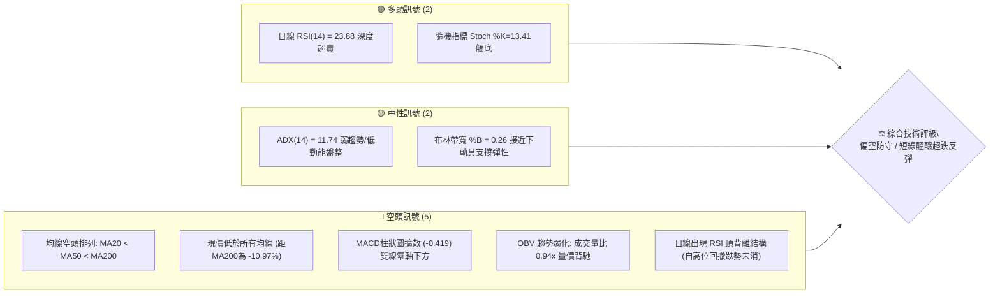
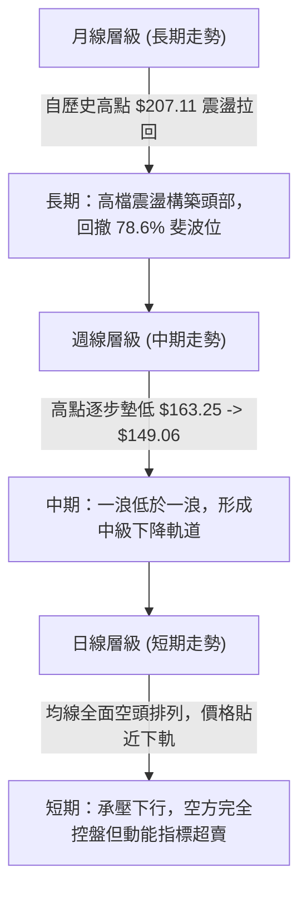
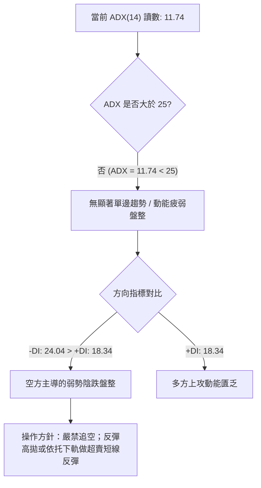
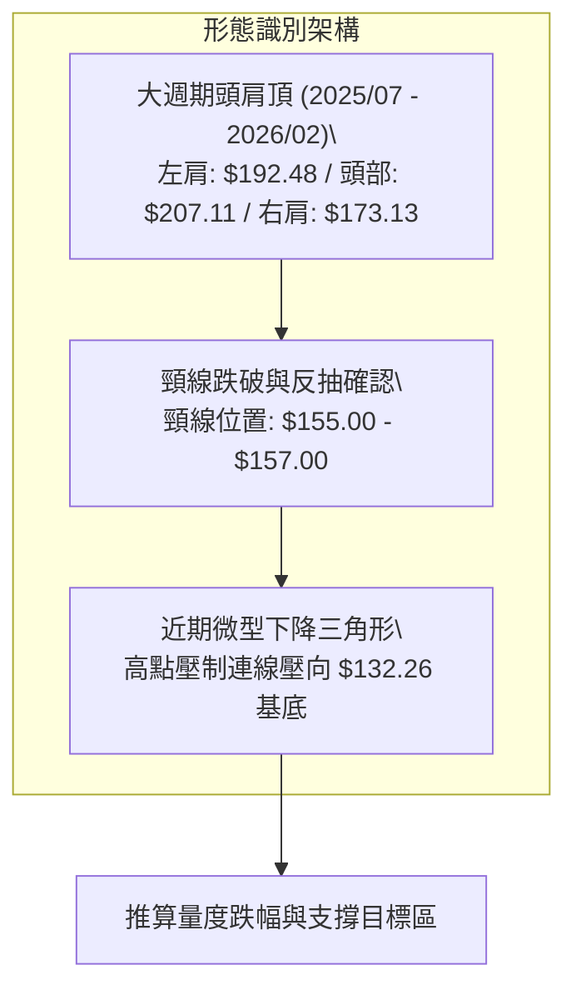
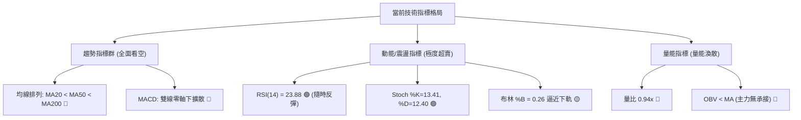
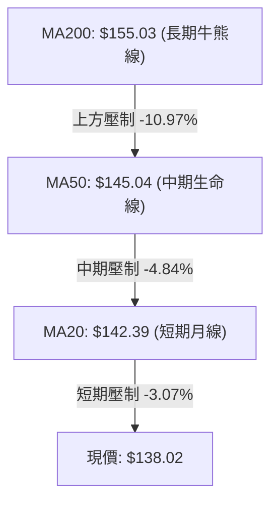
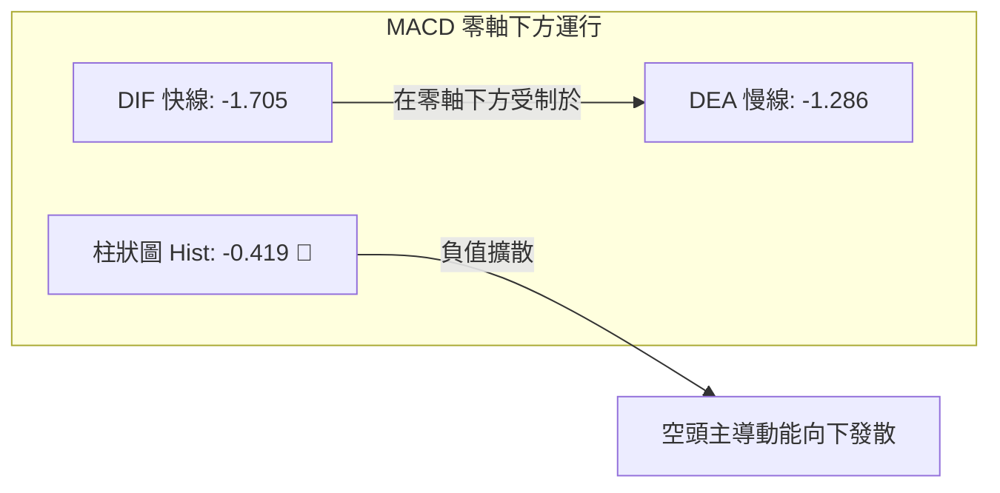
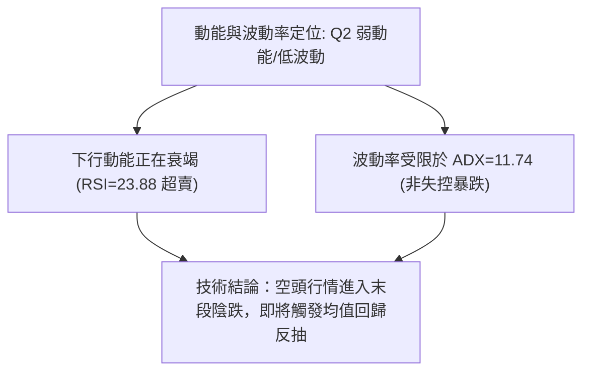
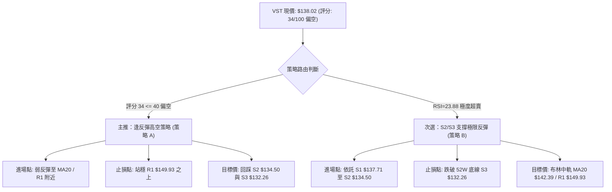
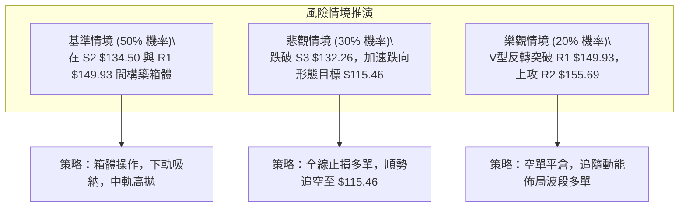

# VST 技術分析報告

> **報告日期**：2026-09-29 ｜ **語言**：繁體中文 ｜ **數據來源**：Yahoo Finance ｜ **當前價格**：$138.02

---

## 目錄

| 章節 | 內容 |
|------|------|
| [1. 技術面概覽](#1-技術面概覽) | 訊號儀表板、核心指標、評分卡 |
| [2. 趨勢分析](#2-趨勢分析) | 多時框趨勢、長中短期走勢、ADX強弱 |
| [3. 圖表形態分析](#3-圖表形態分析) | 形態識別、信心度、K線組合、目標價推算 |
| [4. 支撐與阻力](#4-支撐與阻力) | 關鍵價位結構、波段聚集、斐波那契回調 |
| [5. 技術指標深度解讀](#5-技術指標深度解讀) | 均線系統、RSI背離、MACD、布林通道、OBV |
| [6. 動能與波動率](#6-動能與波動率) | 動能矩陣、ATR風控距離、Beta系統風險 |
| [7. 多時框架總結](#7-多時框架總結) | 時框架矩陣、ADX收斂、一致性結論 |
| [8. 交易策略建議](#8-交易策略建議) | 策略路由、階梯情境、主策略、風控對沖 |
| [9. 風險提示與監控](#9-風險提示與監控) | 監控清單、情境推演、資金控管規範 |
| [📋 報告總結](#-報告總結) | 儀表板總結、關鍵價位一覽、策略路徑 |

---

## 1. 技術面概覽

### 🎯 技術訊號儀表板



### 📊 核心指標速覽表

| 指標類別 | 指標名稱 | 當前數值 | 訊號 | 解讀 |
|:---|:---|:---|:---:|:---|
| **價格** | 當前收盤價 | $138.02 | 🔴 | 位於52週區間 6.9% 極低分位，距52W高點 $215.85 下跌 36.06% |
| **均線** | 短期 MA20 | $142.39 | 🔴 | 現價低於 MA20 達 -3.07%，短線下行斜率維持 |
| **均線** | 中期 MA50 | $145.04 | 🔴 | 中期壓制沉重，MA20 下穿 MA50 形成死叉壓制 |
| **均線** | 長期 MA200 | $155.03 | 🔴 | 跌破長週期生命線，長期多頭格局遭受破壞 |
| **動能** | RSI(14) | 23.88 | 🟢 | 極度超賣區（<30），隨時具備技術性跌深反彈動能 |
| **動能** | MACD (12,26,9)| -1.705 / -1.286 | 🔴 | MACD線位於訊號線下方，柱狀圖 -0.419 延續空頭動能 |
| **動能** | Stoch %K / %D | 13.41 / 12.40 | 🟢 | 進入極端鈍化超賣區，醞釀低檔金叉 |
| **趨勢** | ADX(14) / ±DI | 11.74 (-DI 24.04) | 🟡 | ADX < 25 屬無方向性/弱趨勢盤整，但空方動能佔優 (-DI > +DI) |
| **通道** | 布林通道下軌 | $133.25 (%B: 0.26)| 🟡 | 價格運行於下軌與中軌之間，正逼近下軌支撐區間 |
| **波動** | ATR(14) | $3.96 (2.87%) | 🟡 | 每日平均波動幅度約 $3.96，短線波動度溫和收斂 |
| **量能** | 成交量 / 20日均量 | 4.27M / 4.56M | 🔴 | 量比 0.94x，量能不足以支撐突破，OBV < MA 呈資金流出態勢 |

### 🏆 技術評分卡

```
╔══════════════════════════════════════════════════════════════════╗
║              技術評分卡 — VST (2026-09-29)                       ║
╠══════════════════════════════════════════════════════════════════╣
║ 趨勢強度 (ADX=11.74, 偏空主導)   ████░░░░░░░░░░░░░░░░  22/100 🔴 ║
║ 動能指標 (RSI=23.88, MACD擴散)   ██████░░░░░░░░░░░░░░  32/100 🔴 ║
║ 支撐穩定度 (接近52W低點聚類)     ████████████░░░░░░░░  60/100 🟡 ║
║ 成交量配合 (OBV疲弱, 量比0.94x)  ██████░░░░░░░░░░░░░░  30/100 🔴 ║
║ 形態完整度 (頭肩頂頸線跌破)     ████████░░░░░░░░░░░░  40/100 🔴 ║
║ 均線排列 (MA20<MA50<MA200 空頭)  ████░░░░░░░░░░░░░░░░  20/100 🔴 ║
╠══════════════════════════════════════════════════════════════════╣
║ 綜合技術評分                     ███████░░░░░░░░░░░░░  34/100 🔴 ║
║ 評級結論：偏空架構 / 區間尋底 (主推空頭或高拋，短線僅限超跌博弈)║
╚══════════════════════════════════════════════════════════════════╝
```

---

## 2. 趨勢分析

### 🌐 多時框趨勢分析



### 📈 長期趨勢 — 12個月走勢圖（Unicode）

VST 在過去 12 個月內經歷了波瀾壯闊的高位出貨與多階段殺跌。以下為 2025 年 10 月至 2026 年 09 月的收盤價 ASCII 軌跡圖：

```
VST 月線收盤走勢圖（過去12個月）
價格軸 ($)
$190 ┤  ● $187.21 (10月頂部平台)
$180 ┤     ● $177.83
$170 ┤                 ● $173.13 (反抽次高點)
$160 ┤        ● $160.62   ● $157.65   ● $157.36  ● $159.74  ● $158.37
$150 ┤                                   ● $149.87
$140 ┤                                               ● $147.95
$130 ┤                                                           ● $137.15  ● $138.02 (現價)
     └─────────────────────────────────────────────────────────────────────────────►
        10月   11月   12月   01月   02月   03月   04月   05月   06月   07月   08月   09月
        2025   2025   2025   2026   2026   2026   2026   2026   2026   2026   2026   2026
```

**走勢特徵分析表格**：

| 階段 | 時間跨度 | 價格區間 | 累計漲跌 | 結構特徵與量價解讀 |
|:---|:---|:---:|:---:|:---|
| **第一階段：高檔派發** | 2025-10 至 2025-12 | $187.21 → $160.62 | -14.20% | 月線連續收陰，自歷史次高點滑落，機構大單獲利了結跡象明顯。 |
| **第二階段：反抽抗跌** | 2026-01 至 2026-02 | $157.65 → $173.13 | +9.82% | 築造次高點，月線反彈但未創波段新高，構成典型右肩結構。 |
| **第三階段：平台陰跌** | 2026-03 至 2026-06 | $149.87 → $158.37 | +5.67% | 圍繞 $155-$160 長期均線區間拉鋸，多空在 MA200 附近博弈，波動率收縮。 |
| **第四階段：破位加速** | 2026-07 至 2026-09 | $158.37 → $138.02 | -12.85% | 跌破 $150 整數關卡，單邊放量下行，直逼 52 週低點 $132.26。 |

### 📊 中期趨勢（週線分析）

中期走勢圖展示了 2026 年夏季至今形成的下行收斂通道，壓力位沿著高點連線逐步壓制：

```
中期走勢與關鍵壓力分布示意圖
$170 ┤
$165 ┤       ● 06/28 ($163.22)   ● 07/26 ($163.11) ◄── 雙頂強阻力
$160 ┤
$155 ┤                                                  [R2: $155.69 / MA200]
$150 ┤                               ● 09/06 ($149.06) ◄── [R1: $149.93 反彈高點]
$145 ┤                      ● 08/16 ($147.89)
$140 ┤                               ● 09/20 ($140.44)
$135 ┤             ● 08/23 ($135.99)               ● 現價 $138.02 (逼近 S1: $137.71)
$130 ┤                                             [S3: $132.26 52W低點]
     └─────────────────────────────────────────────────────────────► 週時間軸
```

週線層面自 2026 年 7 月底的高點 $163.11 展開一波連續性的重挫，隨後反彈高點依序為 $149.06（9月初）及 $140.44（9月中），呈現標準的「高點降低、低點破底」下行通道特徵。目前週線 MACD 柱狀圖持續在負值區運行（-0.419），顯示中期空頭仍掌握定價權。

### ⚡ 趨勢強度評估（ADX 解讀）



**ADX 趨勢強度矩陣對照表**：

| 指標變數 | 當前讀數 | 基準閾值 | 狀態評估 | 實戰解讀 |
|:---|:---:|:---:|:---:|:---|
| **ADX(14)** | **11.74** | < 25 | **弱趨勢 / 盤整市場** | 價格下行並非單邊強烈暴跌，而是成交量縮減下的陰跌與重心下移。 |
| **+DI** | **18.34** | 基準對比 | **弱勢多頭** | 多方無法組織有效連續攻勢，每次反彈均無法越過均線阻力。 |
| **-DI** | **24.04** | > +DI (差距 +5.70) | **空方佔優** | 空方維持控盤優勢，任何技術性反彈易受到空方壓制。 |
| **趨勢強度結論** | — | — | 🟡 **低波動陰跌** | 遵循規則14，ADX < 25 定義為**震盪盤整行情**，重點關注布林上下軌與波段高低點區間。 |

---

## 3. 圖表形態分析

### 🔍 形態識別系統



**形態信心度與目標價評估表**（嚴格依據形態幾何推算與波段數據）：

| 形態名稱 | 信心度 | 判斷依據（引用數據） | 完成度 | 目標價（附嚴謹計算式） |
|:---|:---:|:---|:---:|:---|
| **大週期複合頭肩頂** | **75%** | 左肩高點 $192.48 (2025/06)、頭部 $207.11 (2025/07)、右肩 $173.13 (2026/02)。頸線落在 $155.69 (R2) 至 $157.65。現價 $138.02 已實質跌破。 | **85%** | 形態高度 = $207.11 - $155.69 = $51.42。<br>破位目標 = $155.69 - $51.42 = **$104.27**。<br>（注：中期目標先看 52W 低點 $132.26 測試） |
| **次級下降三角形** | **65%** | 壓力線由 07/26 高點 $163.11、09/06 高點 $149.06 連成；水平支撐位於波段低點聚類 S3 $132.26。 | **70%** | 三角形頂部高度 = $149.06 - $132.26 = $16.80。<br>若跌破 S3 觸發目標 = $132.26 - $16.80 = **$115.46**。<br>（若守住則在 $132.26-$149.93 區間震盪） |
| **短線雙底反彈雛形** | **45%** | 08/23 形成波段低點 $135.99，現價回踩 S1 $137.71 未破。但因 ADX 僅 11.74 且量能低迷，信號尚未確立。 | **30%** | 頸線為 09/06 高點 R1 $149.93。<br>形態高度 = $149.93 - $135.99 = $13.94。<br>突破目標 = $149.93 + $13.94 = **$163.87**。 |

### 🕯️ 重要K線形態分析

| 日期 / 月份 | 收盤價 | K線形態 | 量價結構解讀 | 訊號 |
|:---|:---:|:---|:---|:---:|
| **2026-07 (月線)** | $147.95 | **穿頭破腳大陰線** | 跌破 6 個月的盤整平台底線 $155.00，伴隨機構清倉，確立中級下行波段。 | 🔴 |
| **2026-08 (月線)** | $137.15 | **下影流星陰線** | 盤中最低下探 $132.26，收盤回升至 $137.15，顯示在 $132 關卡有被動買盤承接。 | 🟡 |
| **2026-09-06 (週)** | $149.06 | **長陽反彈受阻線** | 單週上漲但成交量僅 22.13M，未能有效放大，觸及 R1 $149.93 阻力後迅速引來拋壓。 | 🟡 |
| **2026-09-13 (週)** | $148.14 | **高檔吊頸十字星** | RSI 衝高至 71.4 後動能急速耗竭，週線 MACD 雖有正柱但未能拓展空間。 | 🔴 |
| **2026-09-20 (週)** | $140.44 | **光腳中長陰線** | 實體陰線直接吞沒前兩週漲幅，成交量放大至 23.87M，空頭再次佔據壓倒性優勢。 | 🔴 |
| **2026-09-27 (週)** | $138.46 | **弱勢收斂紡錘線** | 價格沿 5 日線下行，實體極窄，成交量維持 22.34M，多頭毫無抵抗意願。 | 🔴 |
| **最新交易日 (日)** | $138.02 | **探底十字星** | 單日量縮至 4.27M，波動率 ATR 收斂，收在 S1 $137.71 之上，多空進入弱平衡。 | 🟢 |

### 📉 ASCII 走勢形態示意圖

```
VST 2026年夏季至秋季頂部回落與支撐測試示意圖
$165 ┤           ▲ 07/26 ($163.11 雙頂壓制)
$160 ┤          / \
$155 ┤         /   \     [MA200 / R2: $155.69 頸線反抽受阻區]
$150 ┤        /     \           ▲ 09/06 ($149.06 R1波段反彈高點)
$145 ┤       /       \         / \
$140 ┤      /         \       /   ▼ 09/20 ($140.44)
$135 ┤     /           ▼ 08/23     \      ► 現價: $138.02 (考驗 S1)
$130 ┤════/═════════════ ($135.99)══\═════════════════════════════════
         [52W 低點支撐線: S3 $132.26] ╚══ 潛在雙底支撐帶 ($132.26 - $134.50)
```

---

## 4. 支撐與阻力

### 🗺️ 關鍵價位分布圖（Unicode）

```
╔══════════════════════════════════════════════════════════════════╗
║              VST 關鍵價位結構分布圖 (由 OHLCV 聚類計算)          ║
╠══════════════════════════════════════════════════════════════════╣
║ $168.66 ║████████████████████████████████║ 強阻力 R3 (年內次高點)║
║ $164.19 ║▓▓▓▓▓▓▓▓▓▓▓▓▓▓▓▓▓▓▓▓▓▓          ║ 斐波那契 61.8% 回調位 ║
║ $155.69 ║████████████████████████        ║ 中期阻力 R2 (MA200密集)║
║ $150.15 ║▓▓▓▓▓▓▓▓▓▓▓▓▓▓▓▓                ║ 斐波那契 78.6% 回調位 ║
║ $149.93 ║████████████████████████████    ║ 近期阻力 R1 (9月波段頂)║
║ $142.39 ║────────────────────────────────║ 布林中軌 / MA20 短壓 ║
║ $138.02 ╠════════════════════════════════╣ ◄── 當前收盤價       ║
║ $137.71 ║▓▓▓▓▓▓▓▓▓▓▓▓▓▓▓▓▓▓▓▓            ║ 短線支撐 S1 (昨日低點)║
║ $134.50 ║████████████████████████        ║ 次級支撐 S2 (8月箱底)  ║
║ $132.26 ║████████████████████████████████║ 核心強支撐 S3 (52W底線)║
╚══════════════════════════════════════════════════════════════════╝
```

### 🚧 阻力位分析表

所有價位均嚴格引用提供之關鍵價位聚類數據：

| 阻力級別 | 精確價位 | 距現價幅差 | 形成原因與籌碼特徵 | 突破難度 | 戰略重要性 |
|:---|:---:|:---:|:---|:---:|:---:|
| **R1** | **$149.93** | +8.63% | 2026年9月上旬反彈波段高點（09-06收盤 $149.06 附近聚類），重合斐波那契 78.6% 回調位 $150.15。密集套牢區第一道防線。 | 🟡 中等 | 短線多空翻轉分水嶺；唯有放量突破方能確認底部成形。 |
| **R2** | **$155.69** | +12.80% | 歷史頭部複合頸線，且極度接近 MA200 長期均線（$155.03）與布林通道上軌（$151.54 延伸區）。機構空頭回補與賣壓集中地帶。 | 🔴 極高 | 中期生命線；未重返 $155.69 前，所有反彈皆屬空頭反抽。 |
| **R3** | **$168.66** | +22.20% | 2026年夏季整理平台頂部（06/28 收盤 $163.22 至 02月月線高點 $173.13 之成交密集核心位）。 | 🔴 極難 | 長期波段天花板；需基本面重大利多配合方能上攻。 |

### 🛡️ 支撐位分析表

所有價位均嚴格引用提供之關鍵價位聚類數據：

| 支撐級別 | 精確價位 | 距現價幅差 | 形成原因與籌碼特徵 | 守住機率 | 戰略重要性 |
|:---|:---:|:---:|:---|:---:|:---:|
| **S1** | **$137.71** | -0.23% | 近期波段收盤低點微型支撐（09/27 收盤 $138.46 附近聚類）。現價緊貼此位置，屬即時防線。 | 🟡 50% | 極短線生命線；跌破將直接觸發下探 S2。 |
| **S2** | **$134.50** | -2.55% | 2026年8月下旬築底箱體中下軸（08/23 週收盤 $135.99 之緩衝支撐區），接近布林通道下軌 $133.25。 | 🟢 65% | 短線空頭下行減速帶；具備強烈技術性買盤承接價值。 |
| **S3** | **$132.26** | -4.17% | **52週最低點**（斐波那契 100.0% 極限位）。近一年多方最後的防守底線，具有強烈心理防禦意義。 | 🟢 80% | **年內絕對多空界限**；一旦實質跌破將打開深淵下行空間。 |

### 📐 斐波那契回調位分析

依據 52 週完整波動區間（低點 $132.26 → 高點 $215.85），黃金分割位與當前價位結構映射如下：

```
斐波那契回調比例尺 (區間: $132.26 ──► $215.85，垂直高度 $83.59)
$215.85 ├──  0.0% (52W High)
$196.12 ├── 23.6% 回調位
$183.92 ├── 38.2% 回調位
$174.05 ├── 50.0% 中樞平衡位
$164.19 ├── 61.8% 黃金分割強防守位 (已跌破)
$150.15 ├── 78.6% 極限回調位 (已跌破，轉化為 R1 核心反壓)
$138.02 ├── ◄───【現價位於 78.6% 與 100.0% 之間，回撤幅度達 93.1%】
$132.26 └── 100.0% (52W Low / 終極底部支撐)
```

**深層解讀**：
現價 $138.02 緊密運行於 **78.6% 回調位 ($150.15)** 與 **100.0% 回調位 ($132.26)** 之間的極端弱勢區間。在技術波浪理論中，回撤深度超過 78.6% 意味著先前的多頭推動浪已被完全瓦解，行情已由「牛市回調」質變為「大週期熊市震盪築底」。目前價格僅高於 52 週最低點 4.17%，技術面呈現極端脆弱狀態。然而，正因為已逼近 100.0% ($132.26) 終極支撐，下行空間受限，此處往往是空頭回補引發暴跌後技術反彈的高發區域。

---

## 5. 技術指標深度解讀

### 🎛️ 指標訊號總覽



### 📈 移動平均線排列分析



**均線系統詳細參數與趨勢狀態表**：

| 均線名稱 | 當前價位 | 與現價乖離 | 斜率與方向 | 歷史狀態解讀 |
|:---|:---:|:---:|:---:|:---|
| **MA 5** | $138.56 | -0.39% | ▼ 下行 | 短線壓迫價格沿 5 日線下行，未見止跌長陽。 |
| **MA 10** | $139.88 | -1.33% | ▼ 下行 | 短期第一道阻力，近一週多次反抽均未能有效站上。 |
| **MA 20** | $142.39 | -3.07% | ▼ 下行 | 布林中軌，短線多空臨界點，斜率負向加速。 |
| **MA 50** | $145.04 | -4.84% | ▼ 下行 | 中期下降趨勢壓制線，空方防禦陣地。 |
| **MA 60** | $146.98 | -6.10% | ▼ 下行 | 季線下穿半年線，坐實中期空頭架構。 |
| **MA 120** | $150.88 | -8.52% | ▼ 下行 | 與斐波那契 78.6% 位 ($150.15) 共振形成重壓。 |
| **MA 200** | $155.03 | -10.97% | ▼ 下行 | 長期均線下彎，正式由牛市轉入技術性熊市。 |
| **MA 240** | $159.66 | -13.56% | ▼ 下行 | 年線壓頂，上方堆積整整一年的多頭套牢盤。 |

**均線綜合研判**：
當前短期、中期、長期均線呈現絕對的「標準空頭排列」（MA5 < MA10 < MA20 < MA50 < MA60 < MA120 < MA200 < MA240），各週期均線皆向下發散。現價 $138.02 與 MA200 負乖離達到 -10.97%，短線存在修復乖離的技術性需求，但任何不帶量的上衝在遭遇 MA20 ($142.39) 或 MA50 ($145.04) 時都將面臨沉重拋壓。

### 📉 RSI(14) 分析

**RSI 數值進度條**：
```
0                20       30                       70              100
├────────────────┼────────┼────────────────────────┼────────────────┤
██████░░░░░░░░░░░░░░░░░░░░░░░░░░░░░░░░░░░░░░░░░░░░░░░░░░░░░░░░░░░░░
▲ 23.88 (深度超賣區 < 30)
```

**超買超賣與背離判斷**：
- **數值解讀**：RSI(14) 目前讀數為 **23.88**，已深跌至 30 以下的「極度超賣」領域。在歷史常態分佈中，當 VST 的日線 RSI 跌破 25，通常伴隨空頭動能的短線力竭，隨後 1-3 個交易日內引發均值回歸反抽。
- **背離診斷**：數據明確提示「**RSI 頂背離 (Bearish Divergence)**」。其成因在於前期週線自 08/30 的 $136.87 上漲至 09/13 的 $148.14 時，RSI 衝高至 71.4，但隨後價格未能突破前高，動能卻在高位出現斷崖式塌陷，引發了從頂部展開的急劇殺跌。當前日線層級尚未形成「底背離」（因價格尚未在創出新低後帶動 RSI 底部抬升），因此**當前的超賣僅能視為超跌，而非反轉訊號**。

### 📊 MACD(12/26/9) 訊號解讀



**MACD 指標深度解剖**：
- **DIF 快線**：-1.705，運行於零軸下方深處。
- **DEA 慢線**：-1.286，同樣在零軸下方運行。
- **柱狀圖 (Histogram)**：當前讀數為 **-0.419**。柱狀圖自 9月中旬由正轉負（09/13 為 +1.579，09/20 轉為 -0.010，09/27 進一步擴大至 -0.431），顯示空頭動能目前仍處於發散週期的末段，尚未看到綠柱縮短（紅柱回升）的收斂信號。空方在雙線處於零軸下方的背景下，持續握有壓倒性的趨勢動能。

### 📦 布林通道分析

```
VST 布林通道 (20, 2) 走勢示意圖
$152 ┤──────────────────────────────────────── 上軌: $151.54
$148 ┤
$144 ┤──────────────────────────────────────── 中軌 (MA20): $142.39
$140 ┤
$138 ┤  ● 現價 $138.02 (%B = 0.26)
$136 ┤
$133 ┤──────────────────────────────────────── 下軌: $133.25
     └────────────────────────────────────────────────────────►
```

**通道特徵與 %B 指標分析**：
- **布林上軌**：$151.54
- **布林中軌 (MA20)**：$142.39
- **布林下軌**：$133.25
- **帶寬與 %B 讀數**：目前 **%B 為 0.26**。%B 位於 0.26 代表現價處於中軌至下軌通道的下四分之一區間，極度靠近下軌。布林通道目前呈開口輕微向下擴張態勢，顯示價格延續下軌弱勢運行。然而，下軌 $133.25 與波段核心支撐 S2 ($134.50) 及 S3 ($132.26) 高度重疊，將在此區域形成強大的通道支撐阻尼效應，空頭進一步殺跌將面臨帶外反彈的技術約束。

### 💹 成交量分析（量價配合度）

```
成交量對比柱狀圖 (單位: 股)
4.56M ┤████████████████████████████████ (20日均量: 4,562,200)
4.44M ┤███████████████████████████████  (50日均量: 4,443,300)
4.27M ┤████████████████████████████    (今日量能: 4,272,600, 量比 0.94x)
      └────────────────────────────────────────────────────────►
```

**OBV 與量能趨勢剖析**：
- **量比與均量**：最新成交量為 4,272,600 股，相較於 20 日均量 (4.56M) 的量比為 **0.94x**。這表明在連續下跌後，市場並未出現毀滅性的恐慌爆量拋售，而是呈現「無量陰跌」特徵。
- **OBV 趨勢解讀**：數據指出 **OBV < MA**，能量潮指標已實質跌破其自身均線。在技術分析中，OBV 疲軟證明買盤資金持續流出，主力資金並未在此價位進行積極的主動性建倉承接。量價關係表現為典型的「價跌量平/微縮」，反映市場追高意願徹底冰凍，市場正處於缺乏流動性支撐的陰跌尋底階段。

---

## 6. 動能與波動率

### ⚡ 動能評估

結合趨勢動能（RSI、MACD）與市場波動狀態進行定位：

| 象限 | 動能維度 | 波動維度 | VST 當前狀態映射 | 戰略應對建議 |
|:---|:---:|:---:|:---:|:---|
| **第一象限 (Q1)** | 強動能 (多頭) | 低波動 | ── | 最佳波段順勢做多機會（未滿足） |
| **第二象限 (Q2)** | **弱動能 (空頭)** | **低波動 (收斂)** | **✓ [當前所處位置]** | **ADX=11.74 且 %B=0.26，處於弱勢整理區。嚴禁追空，等待支撐確認。** |
| **第三象限 (Q3)** | 強動能 (單邊) | 高波動 | ── | 單邊暴跌或暴漲階段（未滿足） |
| **第四象限 (Q4)** | 弱動能 (迷失) | 高波動 | ── | 劇烈雙向洗盤（未滿足） |



### 📊 ATR 波動率分析

- **ATR(14) 數值**：**$3.96**
- **價格百分比**：**2.87%**
- **風控止損應用**：
  ATR 數值精確揭示了 VST 目前正常的單日隨機噪音幅度為 $3.96。在制定日內及波段交易策略時：
  - **一般止損距離（1.0 × ATR）**：$3.96。若自現價 $138.02 向上反抽，突破 $141.98（約 MA20 處），則空頭日內動能失效。
  - **防洗盤安全止損（1.5 × ATR）**：$5.94。波段多單進場時，止損距離絕不可小於 1.5 倍 ATR，否則極易被日常隨機波動掃出場。
  - **極限突破止損（2.0 × ATR）**：$7.92。

### 📐 Beta 與市場相關性

- **Beta 係數**：**1.414**
- **市場系統性風險解讀**：
  VST 的 Beta 高達 1.414，說明該股具有強烈的進攻性高彈性特質（比 S&P 500 大盤波動劇烈 41.4%）。雖然該公司名義上屬於公用事業板塊（Utilities），但由於其涉及獨立發電商（IPP）與 AI 數據中心用電題材，市場將其視為高貝塔成長/動量股進行定價。當前在市場避險情緒升溫背景下，高 Beta 屬性加劇了機構去槓桿的拋售壓力；然而一旦大盤企穩，該股也具備遠超大盤的反彈彈性。

---

## 7. 多時框架總結

### 📋 時框架評分表

| 時框架 | 趨勢方向 | 動能狀態 | 均線排列 | 形態特徵 | 綜合評分 | 操作建議 |
|:---|:---:|:---:|:---:|:---:|:---:|:---|
| **月線 (長期)** | 🟡 中性偏空 | 減弱 (自高位持續回調) | MA200 仍處 $155 下方承壓 | 高檔巨型複合頭肩頂右側 | **42/100** | 逢高減碼長線倉位，耐心等待大底部構建。 |
| **週線 (中期)** | 🔴 明確看空 | 偏弱 (MACD負柱 -0.419) | 跌破 20 週與 50 週均線 | 下降收斂通道，一浪低於一浪 | **30/100** | 中期順勢逢高沽空，嚴禁盲目長線抄底。 |
| **日線 (短期)** | 🟡 超跌盤整 | 極弱但超賣 (RSI=23.88)| 全面空頭排列 (MA20<MA50) | 逼近 52W 低點 S3 $132.26 支撐 | **38/100** | 依託下軌支撐短線博弈超跌反彈，嚴格止損。 |

### 🔲 綜合訊號矩陣

```
時框衝突收斂與訊號矩陣
╔══════════════════════════════════════════════════════════════════╗
║ 指標維度     │ 短期 (日線)      │ 中期 (週線)      │ 長期 (月線) ║
╠══════════════════════════════════════════════════════════════════╣
║ 趨勢方向     │ 🔴 空頭陰跌      │ 🔴 下降通道      │ 🟡 高檔箱體 ║
║ RSI(14)      │ 🟢 超賣 (23.88)  │ 🔴 偏弱 (30.90)  │ 🟡 中性     ║
║ MACD 狀態    │ 🔴 柱狀擴散      │ 🔴 負值運行      │ 🔴 高位死叉 ║
║ 均線系統     │ 🔴 空頭排列      │ 🔴 跌破MA50      │ 🔴 跌破MA20 ║
║ 成交量能     │ 🔴 量比 0.94x    │ 🔴 缺乏承接      │ 🔴 縮量陰跌 ║
╚══════════════════════════════════════════════════════════════════╝
```

### ⚖️ 多時框收斂結論

> **依據「嚴格要求 14」多時框收斂規則進行裁決：**
> 
> 1. **趨勢/盤整行情判定**：當前 ADX(14) 讀數為 **11.74 (< 25)**，嚴格定義為**盤整/無單邊強動能行情**。
> 2. **主導維度裁決**：在 ADX < 25 的盤整環境中，市場不會產生具有極高延續性的單邊突破，而是以**日線布林通道上下軌 ($133.25 至 $151.54)** 及波段低點支撐為核心交易區間。
> 3. **方向性最終結論**：**中性偏空、區間尋底（以區間震盪與高拋低吸為主）**。
>    - 雖然週線與日線均線處於絕對空頭排列，但日線 RSI(14) 已達 23.88 極度超賣，且極度接近 52 週核心支撐聚類 S3 $132.26，空頭追空賠率極低。
>    - 因此，多時框收斂策略**排除追空**，第 8 章之交易策略將以「**逢高（反抽阻力）沽空為主，或在下軌極限支撐輕倉博弈超跌反彈**」為收斂路徑。

---

## 8. 交易策略建議

### 🗺️ 策略決策流程圖



### 🧭 策略路由（依評分卡分流）

**當前主策略方向 = 【防守偏空 / 反彈高拋】（依綜合技術評分：34 / 100 🔴）**

由於綜合評分 ≤ 40，技術架構處於均線空頭排列與 OBV 疲弱的空方掌控期。因此，**主推順應中期趨勢的反彈高空策略（策略 A）**；同時考量 RSI=23.88 極度超賣與 ADX=11.74 盤整特徵，提供**左側極限超跌反彈策略（策略 B）**作為輔助，所有價位嚴格鎖定報告第 4 章計算之波段聚類數據。

---

### 🎯 價格情境階梯（Price Scenarios）

所有價位均嚴格引用提供之關鍵價位聚類與斐波那契點位：

| 觸發條件 | 下一目標 | 後續延伸 | 情境含義與技術演繹 |
|:---|:---:|:---:|:---|
| **向上突破 R1 $149.93** | **R2 $155.69** | **R3 $168.66** | **短線強烈反轉**：突破斐波 78.6% 回調位 ($150.15) 與下降壓力線，回補 MA200 缺口。 |
| **反彈受阻於 MA20 $142.39**| **S1 $137.71** | **S2 $134.50** | **弱勢反抽延續**：受制於布林中軌，空頭再度下壓測試箱底支撐。 |
| **維持於現價 $138.02 震盪** | **MA20 $142.39**| **S2 $134.50** | **低位底部分化**：消化超賣指標，波動率進一步壓縮，等待方向選擇。 |
| **實質跌破 S1 $137.71** | **S2 $134.50** | **S3 $132.26** | **尋底加速**：考驗 8月箱底與布林下軌 $133.25，逼近最後防線。 |
| **跌破 52W 低點 S3 $132.26** | **$115.46** | **$104.27** | **中期崩潰破位**：三角形與頭肩頂形態量度跌幅展開，進入無支撐真空跌勢。 |

---

### 📊 情境機率分佈

```
情境機率分佈圖
繼續破底探底 (30%)    ████████████░░░░░░░░░░░░░░░░░░░░░░░░░░░░
區間震盪築底 (50%)    ████████████████████░░░░░░░░░░░░░░░░░░░░
強烈向上反轉 (20%)    ████████░░░░░░░░░░░░░░░░░░░░░░░░░░░░░░░░
```

| 情境劃分 | 估計機率 | 主要技術指標依據 |
|:---|:---:|:---|
| **情境一：低位區間震盪 (S2至R1之間)** | **50%** | **ADX=11.74 代表單邊動能匱乏**，日線布林下軌 $133.25 具備收斂阻尼，且 RSI(14)=23.88 與 Stoch %K=13.41 出現極端超賣鈍化，空頭難以在此處連續大幅放量通殺。 |
| **情境二：慣性下探，考驗 S3 再反抽** | **30%** | **均線空頭排列未變**，MACD 柱狀圖 -0.419 仍在向下發散，OBV < MA 顯示缺乏機構承接量，現價貼近 S1 ($137.71)，極易受大盤拖累下破測試 S2 ($134.50) 或 S3 ($132.26)。 |
| **情境三：直接放量強烈向上反轉** | **20%** | 成交量量比僅 0.94x，量能嚴重不足。上方 MA20 ($142.39) 與 R1 ($149.93) 層層套牢，若無重大催化劑難以直接走出 V 型反轉。 |

---

### 🟢 主策略詳情

本報告依據「偏空主導 + 盤整超賣」技術現狀，制定兩套可執行的交易方案：

| 策略要素 | 策略 A（主推：反抽受阻順勢沽空） | 策略 B（輔助：支撐位超跌博弈反彈） |
|:---|:---|:---|
| **策略類型** | 順應中短期均線趨勢的高拋空單 | 逆勢左側極度超賣技術反抽買單 |
| **進場條件** | 價格反抽至 MA20 附近滯漲，出現長上影線或日線收陰確認 | 現價 $138.02 依託 S1 企穩，或跌至 S2 獲得下影線支撐 |
| **精確進場價格** | **$142.39** (布林中軌 / MA20) 至 **$145.04** (MA50) | **$137.71** (現價/S1) 至 **$134.50** (S2 緩衝區) |
| **第一目標價 T1** | **$134.50** (波段低點聚類 S2) | **$142.39** (布林中軌 / 短期 MA20) |
| **第二目標價 T2** | **$132.26** (52W 核心支撐線 S3) | **$149.93** (近期波段阻力 R1) |
| **嚴格止損價格** | **$149.93** (突破 R1 波段高點即止損) | **$132.26** (實質跌破 52W 低點 S3 立即砍倉) |
| **風險報酬比 (R/R)**| **1 : 1.34**（以 $142.39 進場，風險 $7.54，獲利 $10.13）| **1 : 2.24**（以 $137.71 進場，風險 $5.45，獲利 $12.22）|
| **模型成功機率** | **65%** | **45%** |
| **建議配置倉位** | **8% - 10%**（中期趨勢倉位） | **3% - 5%**（輕倉嚴格止損短線倉） |

---

### 🔴 反向風險觸發點（對沖與風控提示）

若持有多頭或空頭部位，必須嚴格監控以下「推翻主策略」的關鍵界限：
1. **空頭全面平倉/對沖觸發點**：
   - 價格帶量突破 **R1 $149.93**（且日線收盤確認站穩斐波那契 78.6% 位 $150.15）。
   - 日線 MACD 出現零軸下方的「金叉向上」，柱狀圖翻紅 > +0.500。
   - 觸發時必須立刻無條件回補所有空頭頭寸，嚴防大級別「空頭陷阱」引發的軋空暴漲。
2. **多頭無條件止損出局觸發點**：
   - 日線收盤價跌破 **52W 最低點 S3 $132.26**。
   - 跌破意味著大型頭肩頂與下降三角形破位確立，下方目標直接指向 $115.46，嚴禁任何死扛心態。

### ⭐ 整體訊號強度評星

```
做多訊號強度：★★☆☆☆  (2/5 星 - 僅具備超賣技術反彈性質，順勢多頭條件未成熟)
做空訊號強度：★★★☆☆  (3/5 星 - 均線空頭但超賣嚴重，空間受制於 S3，不可追空)
整體技術可信度：★★★★☆  (4/5 星 - 關鍵價位群聚清晰，布林與斐波那契結構高度契合)
```

---

## 9. 風險提示與監控

### ✅ 關鍵監控指標 Checklist

```
╔══════════════════════════════════════════════════════════════════╗
║              VST 盤面核心監控指標清單 (Daily Checklist)          ║
╠══════════════════════════════════════════════════════════════════╣
║ [ ] 52W 底線防禦：收盤價是否嚴格守在 S3 $132.26 之上？           ║
║ [ ] 動能修復確認：日線 RSI(14) 能否自 23.88 快速回升至 30 以上？ ║
║ [ ] 短線反壓突圍：每日收盤價是否重新奪回 MA5 ($138.56) 壓制？   ║
║ [ ] 中軌壓制測試：價格反抽 MA20 ($142.39) 時，成交量是否萎縮？   ║
║ [ ] 趨勢轉變信號：MACD 柱狀圖負值 (-0.419) 是否開始收斂走平？    ║
║ [ ] 量能異動監控：單日成交量能否放大超越 20日均量 (4.56M)？      ║
║ [ ] 恐慌拋售信號：若跌破 S2 ($134.50)，量比是否出現 > 1.5x 爆量？ ║
╚══════════════════════════════════════════════════════════════════╝
```

### ⚠️ 風險場景分析



### 🛡️ 風險管理重要提醒

1. **極度超賣下的「鈍化陷阱」**：
   雖然 RSI 來到 23.88 的極度超賣水平，但投資人必須認知，在均線強烈空頭排列（MA20 < MA50 < MA200）中，震盪指標極易出現「低檔鈍化」。即價格持續陰跌創低，而 RSI 僅在 20-25 區間橫盤。因此，**絕對不可僅憑 RSI 超賣單一指標便進行重倉抄底**，必須等待價格收盤站上 MA5 ($138.56) 或出現明確的日線轉折 K 線。
2. **高 Beta 波動防禦**：
   VST 的 Beta 為 1.414，在近期大盤震盪環境下波動極為劇烈。結合其 ATR 為 $3.96，單日波動極易達到 3% 以上。建議投資者嚴格控制個股總曝險倉位，任何單筆策略之止損風險額度不得超過總投資組合淨值的 **1.0%**。
3. **52週低點的心理臨界點**：
   $132.26 是過去一整年所有多頭部位的心理底線。此位置聚集了大量的保護性止損單。若空方主力強行摜破 $132.26，極易引發市場程序化賣盤與融資盤踩踏，產生流動性黑洞。在 $132.26 未被帶量有效跌破前，不宜過度盲目看空；但一旦破位，必須第一時間執行避險。

---

## 📋 報告總結

```
╔══════════════════════════════════════════════════════════════════╗
║                    VST 技術分析報告總結                          ║
╠══════════════════════════════════════════════════════════════════╣
║ 報告日期：2026-09-29                                             ║
║ 當前價格：$138.02 (位於52週區間 6.9% 極低分位)                    ║
║ 分析評級：⚖️ 偏空震盪 / 區間尋底 (技術評分: 34 / 100 🔴)          ║
╠══════════════════════════════════════════════════════════════════╣
║ 關鍵架構結論：                                                   ║
║ ├─ 長期趨勢：🟡 中性偏空 (高檔巨型頂部頸線跌破，回撤斐波 78.6%)  ║
║ ├─ 中期趨勢：🔴 弱勢空頭 (週線下降通道，高點依次下移至 $149.06) ║
║ ├─ 短期趨勢：🟡 極度超賣 (RSI=23.88, ADX=11.74 陰跌面臨下軌支撐)║
║ ├─ 關鍵支撐：S1: $137.71 │ S2: $134.50 │ S3: $132.26 (52W底線) ║
║ ├─ 關鍵阻力：R1: $149.93 │ R2: $155.69 │ R3: $168.66           ║
║ └─ 機構共識：Strong Buy / 19位分析師目標均價 $217.58 (嚴重背離)   ║
╠══════════════════════════════════════════════════════════════════╣
║ 最優交易路徑：                                                   ║
║ 1. 🥇 最佳勝率策略 (順勢高空)：                                 ║
║    耐心等待價格超跌反抽至 MA20 ($142.39) 或 MA50 ($145.04) 阻力  ║
║    滯漲時佈局空單，止損設於 R1 $149.93，下看 S2 $134.50。        ║
║                                                                  ║
║ 2. 🥈 次選反彈策略 (左側博弈)：                                 ║
║    現價 $138.02 緊貼 S1，若回踩 S2 $134.50 不破，可輕倉 (3-5%)   ║
║    進場博弈超跌反彈，嚴格以 S3 $132.26 破位為硬止損。            ║
║                                                                  ║
║ 3. 🥉 終極風控底線：                                             ║
║    若收盤實質跌破 52W 低點 S3 $132.26，技術面形態量度跌幅將展開，║
║    多單必須無條件清倉出局！                                      ║
╚══════════════════════════════════════════════════════════════════╝
```

---

> ⚠️ **免責聲明**：本報告為 AI 自動生成之量化技術分析，所有數據、圖表及價位推算均基於系統提供的歷史與即時市場資訊。本報告**僅供研究與學術探討參考**，**絕對不構成任何形式的要約、招攬或投資建議**。金融市場瞬息萬變，技術分析存在滯後性與失效風險，投資人應獨立評估自身財務狀況與風險承受能力，入市需極度謹慎，自負盈虧。

---

*報告生成時間：2026-09-29 ｜ 數據來源：Yahoo Finance ｜ 分析框架：多時框架量化技術分析系統*