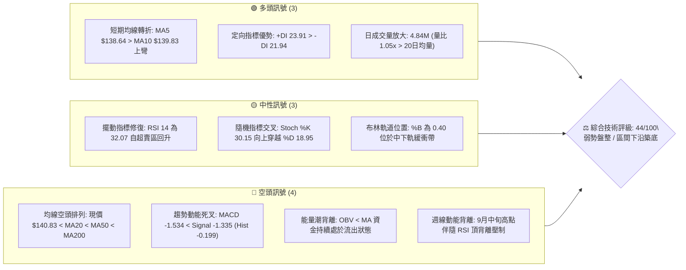
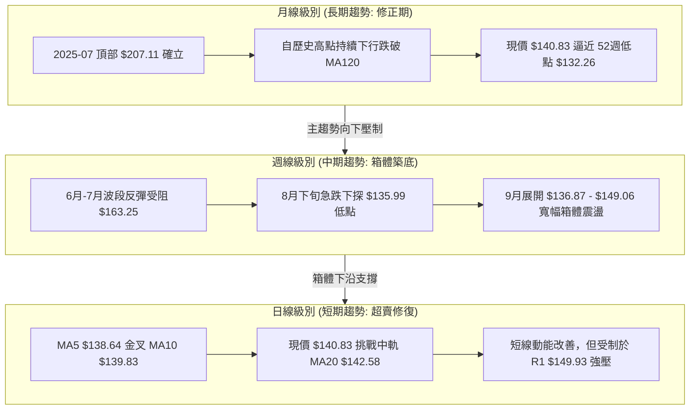
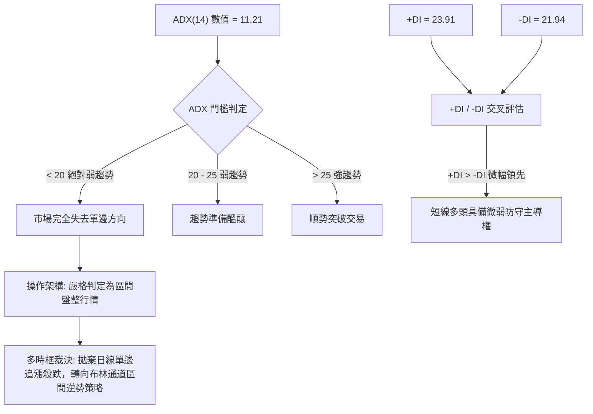
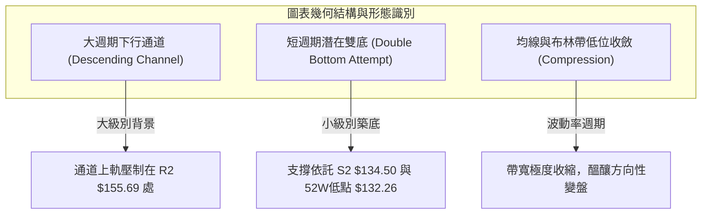
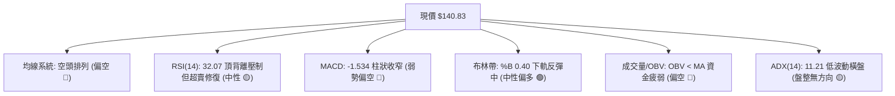
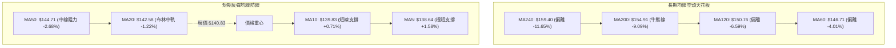
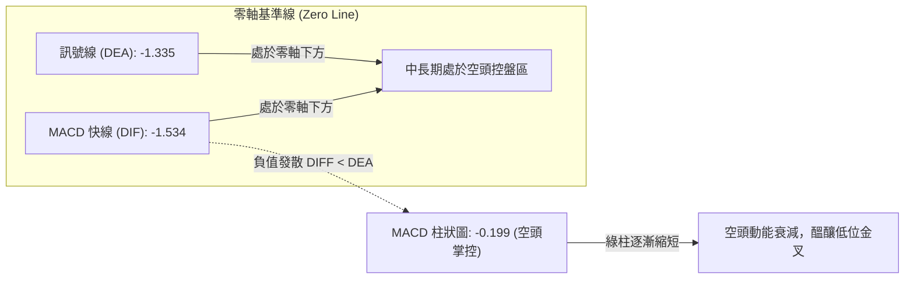
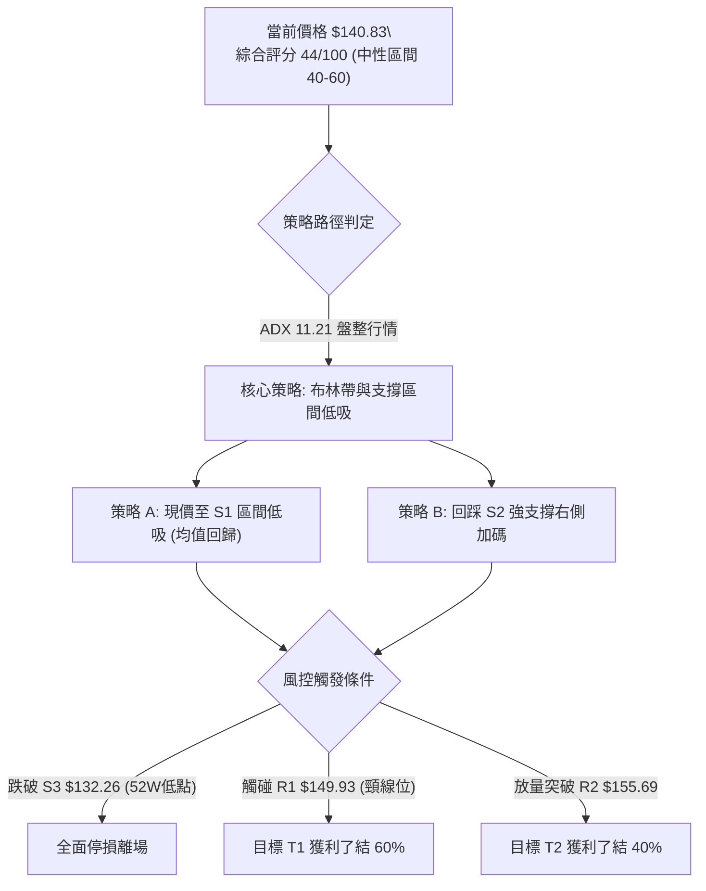
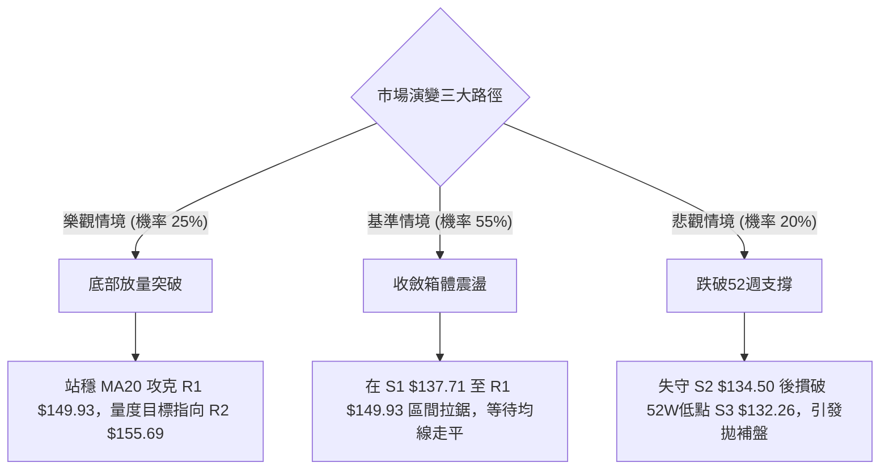

# VST 技術分析報告

> **報告日期**：2026-09-30 ｜ **語言**：繁體中文 ｜ **數據來源**：Yahoo Finance ｜ **當前價格**：$140.83

---

## 目錄

| 章節 | 內容 |
|------|------|
| [1. 技術面概覽](#1-技術面概覽) | 訊號儀表板、核心指標、評分卡 |
| [2. 趨勢分析](#2-趨勢分析) | 多時框趨勢、長中短期走勢、ADX強度 |
| [3. 圖表形態分析](#3-圖表形態分析) | 形態識別、信心度評估、K線組合 |
| [4. 支撐與阻力](#4-支撐與阻力) | 關鍵價位聚類、斐波那契回調結構 |
| [5. 技術指標深度解讀](#5-技術指標深度解讀) | 均線系統、RSI、MACD、布林通道、量價OBV |
| [6. 動能與波動率](#6-動能與波動率) | 動能四象限、ATR止損模型、Beta敏感度 |
| [7. 多時框架總結](#7-多時框架總結) | 時框矩陣、多時框收斂與裁決 |
| [8. 交易策略建議](#8-交易策略建議) | 策略路由、階梯情境、風報比模型 |
| [9. 風險提示與監控](#9-風險提示與監控) | 監控清單、壓力測試、部位控管 |

---

## 1. 技術面概覽

### 🎯 技術訊號儀表板



---

### 📊 核心指標速覽表

| 指標類別 | 指標名稱 | 當前數值 | 訊號 | 專業解讀 |
|:---|:---|:---|:---:|:---|
| **價格** | 當前收盤價 | $140.83 | 🟡 | 位於52週區間 10.3% 分位點，極度貼近年度底部結構 |
| **均線** | 短期 MA5 / MA10 | $138.64 / $139.83 | 🟢 | 現價站上5日與10日均線，短期出現止跌微幅反彈格局 |
| **均線** | 中期 MA20 | $142.58 | 🔴 | 現價位於MA20下方（-1.22%），構成極短線動態壓制 |
| **均線** | 中期 MA50 | $144.71 | 🔴 | 現價位於MA50下方（-2.68%），中期空頭壓制依然穩固 |
| **均線** | 長期 MA200 | $154.91 | 🔴 | 跌破牛熊分水嶺（-9.09%），長期技術趨勢呈現修正態勢 |
| **均線排列** | 多均線結構 | MA20 < MA50 < MA200 | 🔴 | 標準空頭發散排列，任何反彈均先視為技術性修正 |
| **動能** | RSI(14) | 32.07 | 🟡 | 脫離超賣區（26.10）回升，具備均值回歸修復動力 |
| **動能** | MACD (12,26,9) | -1.534 / -1.335 | 🔴 | 零軸下方雙線向下，柱狀圖 -0.199 顯示空方動能減弱但未翻多 |
| **動能** | Stochastic (14,3) | %K 30.15 / %D 18.95 | 🟢 | 超賣區黃金交叉，短線具備技術性向上回抽動能 |
| **趨勢強度** | ADX (14) | 11.21 | 🟡 | 數值遠低於 25，單邊趨勢完全衰竭，市場進入無趨勢區間盤整 |
| **定向系統** | +DI / -DI | 23.91 / 21.94 | 🟢 | +DI 逆轉反超 -DI，多方在底部區域展開防守性反擊 |
| **通道指標** | 布林帶軌道 | 上$151.42 中$142.58 下$133.73 | 🟡 | %B = 0.40，價格由下軌回彈至中軌下方，通道趨於收斂 |
| **波動度** | ATR(14) | $4.15 (2.95%) | 🟡 | 波動率處於中等收縮水平，預期即將出現區間破位或方向選擇 |
| **成交量** | 20日均量比 | 1.05x (4.84M / 4.60M) | 🟢 | 底部放量微幅高於均量，暗示有被動買盤在低檔承接 |
| **能量潮** | OBV 趨勢 | OBV < MA | 🔴 | 累積量能未有效放大，缺乏機構進攻型主力買盤支撐 |

---

### 🏆 技術評分卡

```
╔══════════════════════════════════════════════════════════════════════╗
║                    技術評分卡 — VST (2026-09-30)                    ║
╠══════════════════════════════════════════════════════════════════════╣
║ 趨勢強度 (Trend)     ████░░░░░░░░░░░░░░░░  20/100 🔴 空頭排列壓制    ║
║ 動能指標 (Momentum)  ████████░░░░░░░░░░░░  40/100 🟡 RSI超賣回升     ║
║ 支撐穩定度 (Support) ██████████████░░░░░░  70/100 🟢 52W低點防守堅固 ║
║ 成交量配合 (Volume)  ██████████░░░░░░░░░░  50/100 🟡 放量但OBV疲弱   ║
║ 形態完整度 (Pattern) ██████████░░░░░░░░░░  50/100 🟡 底部區間構築中 ║
║ 均線系統 (MA System) ██████░░░░░░░░░░░░░░  30/100 🔴 空頭排列未扭轉 ║
╠══════════════════════════════════════════════════════════════════════╣
║ 綜合評分             █████████░░░░░░░░░░░  44/100 🟡 中性偏弱(區間)  ║
║ 交易環境診斷         ADX = 11.21 (<25) ─── 典型低波動區間盤整市場    ║
╚══════════════════════════════════════════════════════════════════════╝
```

---

## 2. 趨勢分析

### 🌐 多時框趨勢分析



---

### 📈 長期趨勢 — 12個月走勢圖（Unicode）

```
VST 月線收盤走勢圖（2025-10 至 2026-09）
價格軸 ($)
$195 ┤ ● (2025-10: $187.21)
$185 ┤   ● (2025-11: $177.83)
$175 ┤                   ● (2026-02: $173.13)
$165 ┤       ● (2025-12: $160.62)
$155 ┤           ● (2026-01: $157.65)  ● (2026-04: $157.36) ● (2026-06: $158.37)
$145 ┤                               ● (2026-03: $149.87)   ● (2026-07: $147.95)
$135 ┤                                                    ● (2026-08: $137.15) 
$140 ┤                                                                         ● 現價 $140.83
     └─┬─────┬─────┬─────┬─────┬─────┬─────┬─────┬─────┬─────┬─────┬─────┬───
     10月   11月  12月  01月  02月  03月  04月  05月  06月  07月  08月  09月 (年份跨度 2025-2026)
```

#### 走勢特徵分析表格

| 階段時間 | 起始 / 結束收盤 | 區間漲跌幅 | 走勢特徵與技術架構解讀 |
|:---|:---|:---:|:---|
| **第一階段：高檔震盪回落**<br>(2025-10 ~ 2025-12) | $187.21 → $160.62 | **-14.20%** | 自 52週高點 $215.85 震盪回落，跌破斐波那契 50.0% ($174.05)，多頭架構轉弱。 |
| **第二階段：中期次級反彈**<br>(2026-01 ~ 2026-02) | $157.65 → $173.13 | **+9.82%** | 反彈受阻於斐波那契 50.0% 水平 ($174.05)，確認長期牛市主升段結束並構築中期次高點。 |
| **第三階段：重心持續下移**<br>(2026-03 ~ 2026-06) | $149.87 → $158.37 | **+5.67%** | 價格受制於 MA200 ($154.91) 動態壓制，呈現 $150.00 ~ $160.00 平台換手整理。 |
| **第四階段：破位加速探底**<br>(2026-07 ~ 2026-08) | $158.37 → $137.15 | **-13.40%** | 空頭向下擊穿斐波那契 78.6% ($150.15)，8月下旬探測 52週低點 $132.26 附近支撐。 |
| **第五階段：底部收斂盤整**<br>(2026-08 ~ 2026-09) | $137.15 → $140.83 | **+2.68%** | 於 52週低位區間縮量打底，呈現底部弱勢反彈，形成日線級別收斂三角/箱體。 |

---

### 📊 中期趨勢（週線分析）

近期 20 週收盤走勢顯示，VST 經歷了清晰的「波段高點遞減」過程：
- 2026年6月下旬構築週線雙頂（6/21收盤 $163.25、6/28收盤 $163.22）；
- 隨後在7月下旬二次衝高至 $163.11 失敗，引發空頭放量下殺（8/09 週成交量達 34.9M，收跌至 $140.36）；
- 8月23日當週下探至週線波段低點 $135.99，RSI 觸及 26.1 極度超賣區；
- 9月份多頭展開反撲，9月6日反彈至 $149.06，隨後於9月13日見高 $148.14，未能攻克 R1（$149.93）與斐波那契 78.6%（$150.15）；
- 近兩週回落至 $138.46 後回升至當前收盤價 $140.83。

```
週線級別價格壓力與支撐結構示意圖
─────────────────────────────────────────────────────────────
[壓力區間 R1 / 78.6%]  $149.93 ~ $150.15  ════════ 9月反彈頂點 ($149.06)
                                   ▲
                              震盪回抽波段
                                   ▼
[當前現價基準軸線]     $140.83           ──────── 最新收盤點位
                                   ▲
                              下檔防守波段
                                   ▼
[強支撐區 S1 / S2 / S3] $132.26 ~ $137.71 ════════ 8月波段低點 ($135.99) & 52W低點 ($132.26)
─────────────────────────────────────────────────────────────
```

---

### ⚡ 趨勢強度評估（ADX 解讀）



#### ADX 趨勢強度等級對照表

| ADX 數值區間 | 趨勢強度定義 | VST 當前狀態（11.21） | 交易戰術指導方針 |
|:---:|:---:|:---:|:---|
| **0.00 – 19.99** | **無趨勢 / 雜訊盤整** | **★ 當前所處區間** | **禁止追價；依賴布林通道上下軌與關鍵S/R進行高拋低吸** |
| 20.00 – 24.99 | 趨勢萌芽 / 方向選擇 | 未達標準 | 密切觀察通道壓縮後的突破方向，準備切換為順勢策略 |
| 25.00 – 39.99 | 強趨勢建立 | 未達標準 | 均線系統全面共振，順應主時框方向進行回調加碼 |
| 40.00 – 100.00 | 極強趨勢 / 超買超賣 | 未達標準 | 趨勢進入末期，隨時防範耗竭性缺口或劇烈反轉 |

---

## 3. 圖表形態分析

### 🔍 形態識別系統



#### 形態識別與信心度評估表

| 識別形態名稱 | 信心度 (%) | 判斷依據（嚴格引用數據） | 完成度 (%) | 目標價推算與計算公式 |
|:---|:---:|:---|:---:|:---|
| **潛在平底雙底**<br>(Double Bottom) | **62%** | 第一底為 2026-08-23 收盤 $135.99（極度貼近 S2 $134.50）；第二底為 2026-09-27 收盤 $138.46（回踩 S1 $137.71 守穩）；頸線位於 2026-09-06 高點 $149.06（貼近 R1 $149.93）。 | **55%**<br>(未突破頸線) | **形態目標價推算**：<br>頸線取 R1 $149.93，形態底部取 S2 $134.50；<br>形態高度 = $149.93 - $134.50 = $15.43；<br>向上突破量度目標 = $149.93 + $15.43 = **$165.36**（接近 R3 $168.66）。 |
| **下降通道整理**<br>(Descending Channel) | **78%** | 上軌連線由 2026-07 高點 $163.11 延伸至 2026-09 高點 $149.06；下軌依託 52週低點 $132.26 與 8月收盤 $135.99。 | **85%**<br>(運行於通道下軌) | **通道中軌反彈目標**：<br>通道中軸即當前 MA20 ($142.58) 至 MA50 ($144.71)；<br>通道上軌目標為 R1 **$149.93**。 |
| **頭肩底形態** | **25%** | 目前數據中僅有左肩與潛在頭部，未出現右肩幾何雛形。 | **0%** | **訊號不足，僅做指標型解讀**（依規則15不予列入交易模型）。 |

---

### 🕯️ 重要K線形態分析

| 週期時間 | 收盤價 | 關鍵 K線形態名稱 | 技術解讀與內涵 | 訊號方向 |
|:---|:---|:---|:---|:---:|
| **2026-08-23 (週線)** | $135.99 | **超賣長下影十字星探底** | 週成交量 21.50M，RSI 下殺至 26.1 極限區後探底回升，確立下方 S2 $134.50 承接買盤。 | 🟢 反彈確認 |
| **2026-09-06 (週線)** | $149.06 | **多頭反撲大陽線** | 單週大漲 +8.91%（由 $136.87 攻至 $149.06），MACD柱由負轉正 (+1.364)，確立底部反彈走勢。 | 🟢 短線突破 |
| **2026-09-13 (週線)** | $148.14 | **衝高受阻十字線** | RSI 飆升至 71.4 觸及超買，但價格受阻於 R1 $149.93 與 78.6% 回調位 ($150.15)，呈現頂部停滯。 | 🔴 頂部壓制 |
| **2026-09-27 (週線)** | $138.46 | **縮量陰線下次回踩** | 週線自高位回落，成交量微增至 22.34M，但未跌破 S1 $137.71，屬於技術性回踩支撐。 | 🟡 支撐測試 |
| **2026-10-04 (當前)** | $140.83 | **下影線微型紅K線** | 週量顯著收縮至 9.18M（截至當前），價格在 S1 $137.71 之上回升，多頭防守意圖明顯。 | 🟢 止跌信號 |

---

### 📉 ASCII 走勢形態示意圖

```
VST 築底區間與頸線壓制示意圖
──────────────────────────────────────────────────────────────────
$152.00 ┤                                           
$149.93 ┤             頸線壓力區 (R1: $149.93 / 78.6%: $150.15)
        │             ╭─────────╮              
$146.00 ┤            │         │             
        │            │  波段高  │              
$142.58 ┤────────────┼─────────┼─────────── 布林中軌 (MA20: $142.58)
        │            │  $149.06 │       現價 $140.83
$140.83 ┤            │         │       ╭─────● (反彈起步)
        │  底 1      │         │  底 2 │
$136.00 ┤  ●─────────╯         ╰───────●
        │  $135.99                     $138.46 (回踩 S1: $137.71)
$134.50 ┤─────────────────────────────────── 強支撐位 S2: $134.50
$132.26 ┤─────────────────────────────────── 52週極限底 S3: $132.26
──────────────────────────────────────────────────────────────────
```

---

### 🎯 形態目標價計算

基於上述確認度最高的**區間雙底蓄勢結構**，精確推導上行技術目標價：
1. **頸線確認價位**：取波段密集高點聚類 **R1 = $149.93**（與斐波那契 78.6% 水平 $150.15 高度重合）。
2. **基底支撐價位**：取8月探底回升之波段低點支撐聚類 **S2 = $134.50**。
3. **垂直形態高度 ($H$)**：
   $$H = \text{頸線 (R1)} - \text{基底 (S2)} = \$149.93 - \$134.50 = \$15.43$$
4. **最小突破量度目標 (T1)**：
   $$T_1 = \text{頸線 (R1)} + H = \$149.93 + \$15.43 = \$165.36$$
   *(該目標價精確落於斐波那契 61.8% 回調位 $164.19 與波段強阻力 R3 $168.66 之間)*。
5. **保守防守目標 (T0)**：
   若僅在區間內部運行，未能有效突破頸線，則反彈第一受阻目標為布林上軌與 R1 下沿，即 **$149.93**。

---

## 4. 支撐與阻力

### 🗺️ 關鍵價位分布圖（Unicode）

```
VST 關鍵價位空間分布結構圖
═══════════════════════════════════════════════════════════════════
$215.85 ║░░░░░░░░░░░░░░░░░░░░░░░░░░░░░░║ 52週最高點 (0.0% Fib)
        ║                              ║
$168.66 ║██████████████████████████████║ 強阻力位 R3 (波段高點聚類)
$164.19 ║▓▓▓▓▓▓▓▓▓▓▓▓▓▓▓▓▓▓▓▓▓▓▓▓      ║ 斐波那契 61.8% 黃金分割位
$155.69 ║██████████████████████        ║ 阻力位 R2 (中期波段高點)
$154.91 ║──────────────────────────────║ 長期均線 MA200 (牛熊臨界線)
$151.42 ║──────────────────────────────║ 布林通道上軌
$150.15 ║▓▓▓▓▓▓▓▓▓▓▓▓▓▓▓▓▓▓▓▓▓▓▓▓▓▓▓▓  ║ 斐波那契 78.6% 回調關鍵位
$149.93 ║██████████████████████████████║ 核心阻力位 R1 (雙底頸線位)
        ║                              ║
$142.58 ║┈┈┈┈┈┈┈┈┈┈┈┈┈┈┈┈┈┈┈┈┈┈┈┈┈┈┈┈┈┈║ 布林中軌 (MA20) 密集區
$140.83 ╠══════════════════════════════╣ ◄ 現價基準點 ($140.83)
        ║                              ║
$137.71 ║▓▓▓▓▓▓▓▓▓▓▓▓▓▓▓▓▓▓▓▓          ║ 近期支撐 S1 (9月下旬低點聚類)
$134.50 ║████████████████████████      ║ 強支撐位 S2 (8月築底中樞低點)
$133.73 ║──────────────────────────────║ 布林通道下軌
$132.26 ║██████████████████████████████║ 極限強支撐 S3 (52週最低點 / 100% Fib)
═══════════════════════════════════════════════════════════════════
```

---

### 🚧 阻力位分析表

| 阻力級別 | 精確價位 | 形成技術原因（數據聚類） | 突破難度評估 | 技術權重與重要性 |
|:---|:---:|:---|:---:|:---:|
| **阻力位 R1** | **$149.93** | 2026年9月反彈波段頂部（$149.06）聚類，且與斐波那契 78.6%（$150.15）共振。 | **中等偏高**<br>(需量能持續放大至 6M 以上) | ★★★★★<br>（短期多空分水嶺 / 突破確立反轉） |
| **阻力位 R2** | **$155.69** | 2026年5月、7月波段整理平台高點聚類，且緊貼牛熊分界線 MA200（$154.91）。 | **極高**<br>(面臨長線套牢籌碼解套賣壓) | ★★★★☆<br>（中期熊市防線 / 趨勢反轉確認） |
| **阻力位 R3** | **$168.66** | 2026年1月次級反彈高點（$173.13）下方籌碼密集套牢區，波段頂部聚類。 | **極重度阻力**<br>(基本面需出現爆發性利多) | ★★★☆☆<br>（長期多頭波段極限擴展位） |

---

### 🛡️ 支撐位分析表

| 支撐級別 | 精確價位 | 形成技術原因（數據聚類） | 守住機率評估 | 技術權重與重要性 |
|:---|:---:|:---|:---:|:---:|
| **支撐位 S1** | **$137.71** | 近兩週回踩波段低點（9/27 收盤 $138.46）之緩衝帶，多頭防守第一道陣地。 | **75%**<br>(短線具備防守動能) | ★★★☆☆<br>（日內與極短線進場保護點） |
| **支撐位 S2** | **$134.50** | 8月23日當週低點（$135.99）與日線波段低點聚類，接近布林下軌 $133.73。 | **85%**<br>(多次探底未實質擊穿) | ★★★★☆<br>（區間震盪交易底線支撐） |
| **支撐位 S3** | **$132.26** | **52週絕對最低價**，斐波那契 100.0% 回調位，2025年3月低點（$116.49）上方最終防線。 | **95%**<br>(擊穿將引發結構性破位殺跌) | ★★★★★<br>（年度生死防線 / 總體止損錨點） |

---

### 📐 斐波那契回調位分析

依據 52 週完整波動區間（高點 **$215.85** 至 低點 **$132.26**，垂直全幅落差達 **$83.59**）進行回調測算：

| 回調比例 | 精確對應價位 | 與當前價格 ($140.83) 空間關係 | 技術架構深度解讀 |
|:---:|:---:|:---:|:---|
| **0.0% (52W High)** | **$215.85** | +53.27% | 歷史級別週期頂部，目前屬於遠端不可企及之牛市極限點位。 |
| **23.6%** | **$196.12** | +39.26% | 2025年三季度整理平台，跌破後確認中長線頭部成立。 |
| **38.2%** | **$183.92** | +30.60% | 2025年第四季度反彈高點，目前構成遠期強大籌碼阻力。 |
| **50.0%** | **$174.05** | +23.59% | 2026年2月反彈高點（$173.13）精確受阻於此，為長週期多空平衡軸。 |
| **61.8%** | **$164.19** | +16.59% | **黃金分割防禦位**；6月高點 $163.25 於此承壓，為本輪下跌的強壓帶。 |
| **78.6%** | **$150.15** | +6.62% | **極深回調關鍵阻力**；與 R1 ($149.93) 構成雙重密集群，9月反彈遇阻處。 |
| **100.0% (52W Low)**| **$132.26** | -6.09% | **全週期支撐底線**；目前現價僅位於此線上空 6.09%，屬於極度回調狀態。 |

> **當前價位定位評估**：
> 現價 **$140.83** 處於 **78.6% ($150.15)** 與 **100.0% ($132.26)** 之間的「深層弱勢回撤區間」。歷史技術統計表明，價格在 78.6% 以下若未跌破 100%，通常會形成時間跨度為數週的「底部橫盤鈍化區間」。若無法收復 78.6%（$150.15），則無法擺脫熊市回調結構；但只要 100.0%（$132.26）不失守，下行空間已被高度壓縮。

---

## 5. 技術指標深度解讀

### 🎛️ 指標訊號總覽



---

### 📈 移動平均線排列分析



#### 均線階層架構深度拆解：
- **微觀短期動能（MA5 / MA10）**：MA5（$138.64）呈現向上拐頭（+1.58%），且價格已連續2日站上 MA10（$139.83），呈現微型金叉結構，短線下檔具備初步支撐。
- **中短期動態壓制（MA20 / MA50）**：MA20（$142.58）正以每日約 $0.15 的速度向下發散，是短線反彈的第一道壓制壁壘；MA50（$144.71）則代表月度套牢籌碼成本，壓制短期反轉意圖。
- **均線排列結論**：當前格局為典型 **MA20 < MA50 < MA200** 完整空頭排列。空頭排列下，所有的均線向上碰觸均應優先視為「阻力測試」而非趨勢反轉。

---

### 📉 RSI(14) 分析

```
RSI(14) 數值刻度分布與當前位置：
0        20       30  32.07                70       80      100
├────────┼────────┼───●────────────────────┼────────┼────────┤
  極端超賣   超賣區    ▲ 當前位置 (32.07)       超買區   極端超買
                     弱勢反彈區間 (低位鈍化修復)
進度條展示：
███████░░░░░░░░░░░░░░░░░░░░░░░░░░░░░░░░ 32.07 / 100
```

- **背離狀況深入診斷**：
  數據標註顯示當前存在 **⚠️ 頂背離 (Bearish Divergence)**。回溯 2026-09-06 至 2026-09-13 走勢，價格自 $149.06 衝高回落至 $148.14，但週線 RSI 卻自 54.6 激增至 71.4 後迅速崩潰，隨後價格連跌兩週。當前 RSI 日線級別已壓低至 32.07，呈現超賣區邊緣之弱勢震盪，目前**尚未出現底背離**結構，暗示下檔雖有支撐，但上攻動能依舊脆弱。

---

### 📊 MACD(12/26/9) 訊號解讀



- **MACD 指標數值解析**：
  快線 DIF（-1.534）低於慢線 DEA（-1.335），兩者均深陷於零軸下方負值區域，整體大架構仍由空方掌握。然而，柱狀體（Histogram）收斂至 **-0.199**（較8月下旬的 -1.870 大幅改善），這顯示下跌動能已經衰竭。若現價能突破 MA20（$142.58），MACD 極有可能在零軸下方形成低位金叉。

---

### 📦 布林通道分析

```
VST 日線布林通道結構示意圖 (帶寬收縮)
──────────────────────────────────────────────────────────────────
$151.42 ┤───────────────────────────────────── 上軌 (Upper Band)
        │
$147.00 ┤
        │
$142.58 ┤------------------------------------- 中軌 (Middle Band / MA20)
$140.83 ┤           ● 現價 ($140.83, %B = 0.40)
        │
$137.00 ┤
        │
$133.73 ┤───────────────────────────────────── 下軌 (Lower Band)
──────────────────────────────────────────────────────────────────
```

- **布林帶寬與位置解讀**：
  - **上軌**：$151.42 ｜ **中軌 (MA20)**：$142.58 ｜ **下軌**：$133.73
  - **%B 指標 = 0.40**：數值精確落於 0.0 與 0.50 之間，表明價格已脫離下軌的極度壓制，正在向上回抽中軌。
  - **帶寬（Bandwidth）特徵**：上下軌空間僅為 $17.69，處於近半年的低位收斂狀態。配合 ADX 處於 11.21 的極低水平，通道進入典型的「瓶頸期（Squeeze）」，預示未來 2–4 週內將出現顯著的方向性突破行情。

---

### 💹 成交量分析（量價配合度）

```
量價走勢比對：
今日成交量: 4,840,700   ██████████████████████  (量比: 1.05x)
20日均量:   4,600,600   █████████████████████   (基準線)
50日均量:   4,476,458   ████████████████████    (中線基準)
```

- **成交量量價關係評估**：
  最新日成交量達 4.84M，高於 20日均量（4.60M）與 50日均量（4.48M），量比為 1.05x，顯示在現價 $140.83 附近有多空換手跡象，並非無量陰跌。
- **OBV（能量潮）走勢背離診斷**：
  當前 **OBV < MA**。技術數據明確指出量能指標仍然疲弱，資金並未呈現連續淨流入狀態。8月份下跌時的放量（8/09 週量達 34.9M）對比9月份反彈時的縮量（約 18M~22M），反映機構性主動追高買盤意願不足，當前量價結構僅能支持低位防守反彈，尚未構成反轉爆發條件。

---

## 6. 動能與波動率

### ⚡ 動能評估四象限

```
              高動能 (Momentum)
                    │
      Q3: 突破啟動  │  Q1: 強勢主升
     (High Vol/Mom) │ (Low Vol/Mom)
                    │
──── 波動率 (ATR%) ─┼──────────────── 低波動率
                    │
      Q4: 破位下殺  │  Q2: 築底盤整  ◄─── [VST 當前座標: Q2]
     (High Vol/Neg) │ (Low Vol/Neg)        動能偏弱 / 波動率收縮
                    │
              低動能 (Negative)
```

| 象限分區 | 動能狀態 | 波動率狀態 | 當前符合度 | 操作技術對策 |
|:---:|:---:|:---:|:---:|:---|
| **第 1 象限 (Q1)** | 強勢向上 | 低波動穩定 | ❌ 不符合 | 順勢加碼，持有享受主升段利潤。 |
| **第 2 象限 (Q2)** | **動能疲弱** | **低波動收斂** | **✓ 完全吻合** | **禁止追價；採取逆勢低吸或耐性等待變盤訊號。** |
| **第 3 象限 (Q3)** | 爆發向上 | 高波動放量 | ❌ 不符合 | 突破跟進，嚴格執行防守性動態止損。 |
| **第 4 象限 (Q4)** | 恐慌向下 | 高波動恐慌 | ❌ 不符合 | 避開飛刀，全面現金觀望。 |

---

### 📊 ATR 波動率分析

- **ATR(14) 絕對數值**：**$4.15**
- **價格百分比波動率**：**2.95%** ($4.15 / $140.83)
- **ATR 交易止損與部位建議**：
  - **日內防守閾值 (1.0x ATR)**：$4.15。現價減去 1.0x ATR 為 **$136.68**，與關鍵支撐 S1 ($137.71) 高度共振。
  - **擺動止損閾值 (1.5x ATR)**：$6.23。現價減去 1.5x ATR 為 **$134.60**，精確落於強支撐位 S2 ($134.50) 上方，是擺動交易策略的最佳停損設定帶。
  - **結構破位閾值 (2.0x ATR)**：$8.30。現價減去 2.0x ATR 為 **$132.53**，直接測試 52週低點 S3 ($132.26)。

---

### 📐 Beta 與市場相關性

- **Beta 係數**：**1.414**
- **高貝塔特性解讀**：
  VST 展現出相較於標普500指數（S&P 500）高出 41.4% 的波動彈性。身處公用事業（獨立發電商 IPP）領域，該高 Beta 反映市場將其視為兼具「電力公用防禦」與「AI數據中心電力爆發力」的雙重高彈性標的。在高 Beta 驅動下，當大盤情緒轉暖時，其技術回抽幅度將顯著放大，但反之在空頭下殺時亦具有更高的下行穿透力。

---

## 7. 多時框架總結

### 📋 時框架評分表

| 時框架 | 趨勢方向 | 動能狀態 | 均線排列狀況 | 關鍵形態特徵 | 綜合評分 | 操作戰術建議 |
|:---:|:---:|:---:|:---:|:---:|:---:|:---|
| **長期 (月線)** | 🔴 下行修正 | 弱勢 (RSI 40) | 跌破 MA120，長均線拐頭 | 自 $207.11 頂部回落之修正浪 | **32/100** | 不宜長線建大倉，逢反彈減持弱勢籌碼 |
| **中期 (週線)** | 🔴 偏空震盪 | 中性偏弱 (MACD負) | 承壓於 MA20 / MA50 下方 | 受阻於 $150 阻力，尋求雙底基底 | **42/100** | 區間交易為主，以 S2/S3 為底線防守 |
| **短期 (日線)** | 🟢 超賣反彈 | 轉強 (+DI反超) | MA5金叉MA10，正測MA20 | %B=0.40，自布林下軌回抽中軌 | **58/100** | 把握回踩 S1 的短線低吸做多契機 |

---

### 🔲 綜合訊號矩陣

```
時框維度與技術面向交叉確認表：
┌───────────┬──────────────┬──────────────┬──────────────┐
│  分析面向 │ 短期 (日線)  │ 中期 (週線)  │ 長期 (月線)  │
├───────────┼──────────────┼──────────────┼──────────────┤
│ 趨勢方向  │ 🟡 中性築底  │ 🔴 空頭承壓  │ 🔴 空頭修正  │
│ 動能強度  │ 🟢 超賣修復  │ 🔴 頂背離壓制│ 🟡 趨向衰竭  │
│ 均線系統  │ 🟢 短線金叉  │ 🔴 空頭排列  │ 🔴 跌破均線  │
│ 成交量配合│ 🟢 微幅放量  │ 🔴 量縮反彈  │ 🟡 籌碼換手  │
│ 關鍵價位  │ 守穩 S1      │ 考驗 S2      │ 依託 S3(52W) │
└───────────┴──────────────┴──────────────┴──────────────┘
```

---

### ⚖️ 多時框收斂結論

> **依據「嚴格要求 14」收斂裁決**：
> 1. **趨勢/盤整環境判定**：當前 ADX(14) 數值為 **11.21 (< 25)**，嚴格判定當前市場處於**「典型低動能區間盤整行情」**。
> 2. **主導規則裁定**：因處於盤整行情，趨勢追隨指標失真，**日線布林通道上下軌（下軌 $133.73 至 上軌 $151.42）與支撐阻力結構（S2 $134.50 至 R1 $149.93）為唯一核心交易區間**。
> 3. **方向性最終結論**：**【中性偏弱／區間逢低做反彈】**。
>    雖然週線與長期均線維持空頭排列，限制了向上空間（天花板壓制在 R1 $149.93）；但日線短期超賣金叉以及 52週低點 S3（$132.26）的強大防禦力，阻斷了空頭向下延伸的空間。因此，第8章主策略嚴格收斂為：**依託 S1/S2 支撐，在區間下沿執行均值回歸的高勝率反彈策略，並以 R1 阻力位作為嚴格減倉點**。

---

## 8. 交易策略建議

### 🗺️ 策略決策流程圖



---

### 🧭 策略路由（依評分卡分流）

**當前主策略方向 = 【中性區間震盪交易／下沿逢低吸納】（依綜合評分 44/100 判定）**
- 評分落於 40–60 之中性震盪區間，且 ADX 為 11.21，明確指示切勿單邊追高或在地板追空。主策略以**「區間下沿分批低吸、上沿受阻止盈」**為主軸。

---

### 🎯 價格情境階梯（Price Scenarios）

價位嚴格錨定第4章及數據聚類核心點位：

| 觸發條件 | 核心推進價位 | 後續延伸目標 | 情境技術含義與應對原則 |
|:---|:---:|:---:|:---|
| **強勢突破 R1 ($149.93)** | **R2 ($155.69)** | **R3 ($168.66)** | **短線轉強確立**：突破雙底頸線與斐波那契 78.6%，挑戰 MA200 牛熊線。 |
| **震盪站穩現價 ($140.83)** | **MA20 ($142.58)** | **MA50 ($144.71)** | **區間均值回歸**：突破短期中軌壓制，向布林上軌進行技術性修復。 |
| **跌破支撐 S1 ($137.71)** | **S2 ($134.50)** | **S3 ($132.26)** | **下檔極限測試**：空頭重新試探 52週低點，需嚴密觀察是否引發恐慌拋盤。 |

---

### 📊 情境機率分佈

```
情境機率分佈圓形評估：
[██████████████████████████] 區間震盪 (50%)
[███████████████           ] 向上反彈測試 R1 (30%)
[██████████                 ] 破位下探 S2/S3 (20%)
```

| 情境劃分 | 機率預估 | 主要技術指標支撐依據 |
|:---|:---:|:---|
| **區間震盪整理** | **50%** | **ADX = 11.21** 顯示動能極度渙散，布林通道帶寬收縮，短期缺乏單邊突破驅動力。 |
| **向上反彈測試 R1** | **30%** | **+DI 反超 -DI**，Stoch %K 金叉 %D，RSI 自 30 附近持續修復，支撐超賣回抽。 |
| **破位下探 S2/S3** | **20%** | **均線空頭排列**，OBV < MA 顯示量能跟進不足，大盤若回檔恐被動拖累。 |

---

### 🟢 主策略詳情（區間波段交易模型）

本策略以回踩 S1 為基底介入點，兼顧現價底倉與突破加碼：

| 策略要素 | 策略 A（穩健型：現價至 S1 逢低布局） | 策略 B（激進型：突破 MA20 右側追擊） |
|:---|:---|:---|
| **進場條件** | 現價回踩支撐 S1 獲得確認，或現價直接分批建倉 | 日線收盤價帶量突破布林中軌 MA20 ($142.58) |
| **進場價格** | **$138.50** (介於現價 $140.83 與 S1 $137.71 之間) | **$142.80** (確認突破 MA20 之後) |
| **目標價 T1** | **$149.93** (波段阻力 R1 / 斐波那契 78.6%) | **$149.93** (波段阻力 R1 / 頸線位) |
| **目標價 T2** | **$155.69** (阻力 R2 / 接近 MA200) | **$155.69** (阻力 R2 / MA200 牛熊分界線) |
| **止損價格** | **$134.00** (精確跌破強支撐 S2 $134.50 緩衝線) | **$139.50** (跌回 MA10 之下，宣告突破失敗) |
| **風險報酬比** | **1 : 2.54** (風險 $4.50，目標1利潤 $11.43) | **1 : 2.16** (風險 $3.30，目標1利潤 $7.13) |
| **模型勝率** | **60%** (受惠於 52週低點強大防守屏障) | **52%** (面臨 MA50 快速反壓干擾) |
| **建議倉位** | **總資金之 10% ~ 15%** (分批建倉) | **總資金之 8% ~ 10%** (右側輕倉跟進) |

---

### 🔴 反向風險觸發點（對沖提示）

若出現以下訊號，證明空頭重啟單邊下殺，主策略全面失效，必須立刻停損或建立反向避險頭寸：
1. **實體陰線有效擊穿 S2 ($134.50)**：意味著雙底結構破位，空方將直撲 52週低點 S3（$132.26）。
2. **52週低點 S3 ($132.26) 宣告失守**：全週期技術防線全面崩潰，下行空間將完全開啟，必須無條件清倉。
3. **反彈至 R1 ($149.93) 伴隨日線 RSI 再次出現超買頂背離**：此為絕佳逢高做空或多單全面停利點。

---

### ⭐ 整體訊號強度評星

```
╔══════════════════════════════════════════════════════╗
║ 做多訊號強度：  ★★☆☆☆  (2.5/5星: 超賣修復，但受制均線)║
║ 做空訊號強度：  ★★☆☆☆  (2.0/5星: 下跌力竭，低位鈍化)║
║ 整體技術可信度：★★★☆☆  (3.5/5星: 區間邊界極度明確)  ║
╚══════════════════════════════════════════════════════╝
```

---

## 9. 風險提示與監控

### ✅ 關鍵監控指標 Checklist

```
╔══════════════════════════════════════════════════════════════════╗
║                  每日交易監控清單 (Monitoring Checklist)         ║
╠══════════════════════════════════════════════════════════════════╣
║ [ ] 價格是否跌破支撐 S1 $137.71 (日內短線防守警報)              ║
║ [ ] 價格是否擊穿強支撐 S2 $134.50 (波段波谷結構失效警戒)        ║
║ [ ] 日收盤價是否成功站上布林中軌 MA20 $142.58 (短線翻多訊號)     ║
║ [ ] 日成交量是否顯著超越 50日均量 4.48M (主力機構介入標誌)      ║
║ [ ] RSI(14) 能否突破 50 中軸分水嶺 (動能重返多頭擴張區)        ║
║ [ ] MACD 柱狀圖是否翻紅大於 0.00 (確認空頭動能耗竭轉化)         ║
║ [ ] ADX(14) 是否向上攀升並穿越 20 (判定區間震盪即將結束)        ║
╚══════════════════════════════════════════════════════════════════╝
```

---

### ⚠️ 風險場景分析



---

### 🛡️ 風險管理重要提醒

1. **基本面催化劑風險**：
   - 儘管 19 位華爾街分析師給予一致的「強力買入 (Strong Buy)」評級，平均目標價高達 **$217.58**（較現價溢價 +54.5%），但當前技術面與基本面存在嚴重脫節。
   - 財務數據顯示其營收年增率為 -5.5%，淨債務高達 $20.07B（負債權益比 373.28）。在能源商品價格波動期，高槓桿特質可能加劇技術面的下行波動。
2. **高 Beta 倉位控管規則**：
   - 鑑於 Beta 高達 1.414 且 ATR 為 $4.15，單筆交易的最大資金虧損應嚴格限制在總資產的 **1.0%** 以內。
   - 按照策略 A 之止損幅度（$138.50 - $134.00 = $4.50），每 10 萬美元部位不應持有超過 220 股，避免因市場非理性下殺而蒙受穿倉性損失。

---

## 📋 報告總結

```
╔════════════════════════════════════════════════════════════════════╗
║                       VST 技術分析綜合總結報告                     ║
╠════════════════════════════════════════════════════════════════════╣
║ 報告日期：2026-09-30          當前現價：$140.83                   ║
║ 分析評級：⚖️ 中性觀望 / 弱勢區間築底 (技術評分 44/100)            ║
╠════════════════════════════════════════════════════════════════════╣
║ 核心趨勢定調：                                                     ║
║ ├─ 長期趨勢 (月線)：🔴 下行修正浪，跌破長期均線，上方壓力沉重     ║
║ ├─ 中期趨勢 (週線)：🔴 偏空震盪，受制於 R1 $149.93 頸線壓制       ║
║ └─ 短期趨勢 (日線)：🟢 超賣修復，依託 S1 $137.71 展開技術性回抽    ║
╠════════════════════════════════════════════════════════════════════╣
║ 關鍵技術座標：                                                     ║
║ ├─ 關鍵阻力集群：R1 = $149.93 ｜ R2 = $155.69 ｜ R3 = $168.66     ║
║ ├─ 關鍵支撐集群：S1 = $137.71 ｜ S2 = $134.50 ｜ S3 = $132.26(52W)║
║ ├─ 波動與趨勢值：ATR = $4.15 (2.95%) ｜ ADX = 11.21 (低波動盤整)  ║
║ └─ 華爾街目標價：平均 $217.58 (最低 $106.00 / 最高 $305.00)       ║
╠════════════════════════════════════════════════════════════════════╣
║ 最優交易策略組合：                                                 ║
║ 1. 🥇 最佳機會 (穩健)：回踩 S1 $137.71~$138.50 輕倉低吸，          ║
║                       停損設於 S2 $134.00，目標指向 R1 $149.93    ║
║ 2. 🥈 次選機會 (右側)：等待帶量突破 MA20 $142.58 後順勢短線跟進，  ║
║                       目標看至 R1 $149.93 與 R2 $155.69           ║
║ 3. 🥉 保守選擇 (風控)：在 ADX < 20 期間維持低部位 (10%以內)，      ║
║                       若實體跌破 S2 $134.50 則全面空倉觀望        ║
╚════════════════════════════════════════════════════════════════════╝
```

---

> ⚠️ **免責聲明**：本報告為依據客觀市場量化數據產出之技術分析報告，所有支撐阻力位、均線指標及圖表形態均基於歷史價格行為嚴格計算。本報告**僅供研究與學術參考**，**不構成任何形式的投資要約或買賣建議**。金融市場瞬息萬變，投資人應獨立評估風險，入市需極度謹慎並自負盈虧。

---
*報告生成時間：2026-09-30 ｜ 數據來源：Yahoo Finance ｜ 分析框架：多時框技術分析模型*