# VST 技術分析報告

> **報告日期**：2026-10-01 ｜ **語言**：繁體中文 ｜ **數據來源**：Yahoo Finance ｜ **當前價格**：$138.35

---

## 目錄

| 章節 | 內容 |
|------|------|
| [1. 技術面概覽](#1-技術面概覽) | 訊號儀表板、核心指標、評分卡 |
| [2. 趨勢分析](#2-趨勢分析) | 多時框趨勢、長中短期走勢、ADX 解讀 |
| [3. 圖表形態分析](#3-圖表形態分析) | 形態識別、信心度評估、K線組合、目標價 |
| [4. 支撐與阻力](#4-支撐與阻力) | 關鍵價位結構、斐波那契回調精確分析 |
| [5. 技術指標深度解讀](#5-技術指標深度解讀) | MA/RSI/MACD/布林通道/量價配合 |
| [6. 動能與波動率](#6-動能與波動率) | 動能四象限、ATR 波動度、Beta 敏感度 |
| [7. 多時框架總結](#7-多時框架總結) | 時框架矩陣、ADX 規則收斂結論 |
| [8. 交易策略建議](#8-交易策略建議) | 策略路由、價格階梯、主策略與對沖點 |
| [9. 風險提示與監控](#9-風險提示與監控) | 監控清單、情境模擬、倉位風控 |
| [10. 報告總結](#-報告總結) | 核心結論與最佳策略組合儀表板 |

---

## 1. 技術面概覽

### 🎯 技術訊號儀表板

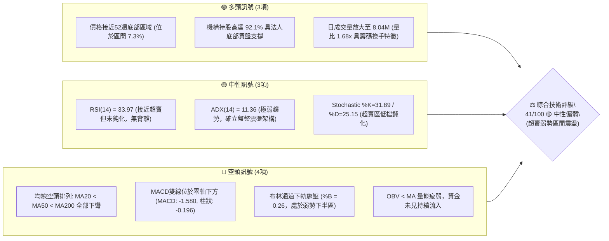

---

### 📊 核心指標速覽表

| 指標類別 | 指標名稱 | 當前數值 | 訊號 | 解讀與技術意義 |
|----------|----------|----------|------|----------------|
| **價格** | 當前收盤價 | $138.35 | 🔴 | 位於52週區間($132.26–$215.85)的 7.3%，處於極低位階 |
| **均線系統** | MA20 (月線) | $142.60 | 🔴 | 價格低於MA20達 -2.98%，短線承壓 |
| **均線系統** | MA50 (季線) | $144.23 | 🔴 | 價格低於MA50達 -4.08%，中期趨勢走空 |
| **均線系統** | MA200 (年線)| $154.74 | 🔴 | 價格顯著低於MA200達 -10.59%，長期走勢轉弱 |
| **動能指標** | RSI(14) | 33.97 | 🟡 | 位於弱勢區間，接近 30 臨界超賣線，尚未出現底背離 |
| **動能指標** | MACD (12,26,9) | -1.580 / -1.384 | 🔴 | DIF < DEA 位於零軸下方，柱狀圖 -0.196 顯示空頭動能主導 |
| **趨勢強度** | ADX(14) | 11.36 | 🟡 | 數值遠低於 25，顯示缺乏明確單邊趨勢，行情轉為弱勢盤整 |
| **通道指標** | 布林通道 | $133.81 ~ $151.39 | 🔴 | %B 為 0.26，價格緊貼下軌與中軌之間弱勢滑行 |
| **量能指標** | 最新成交量 | 8,040,700 股 | 🟢 | 量比 1.68x（高於20日均量 4.79M），低檔出現放量承接跡象 |
| **波動指標** | ATR(14) | $4.27 | 🟡 | 日均波動幅度為 3.08%，波動度適中，風險防禦區間清晰 |

---

### 🏆 技術評分卡

```
╔══════════════════════════════════════════════════════════════╗
║                技術評分卡 — VST (2026-10-01)                  ║
╠══════════════════════════════════════════════════════════════╣
║ 趨勢強度 (Trend)     ██████░░░░░░░░░░░░░░  30/100 🔴 空頭弱勢 ║
║ 動能指標 (Momentum)  ███████░░░░░░░░░░░░░  36/100 🔴 動能偏空 ║
║ 支撐穩定度 (Support) █████████████░░░░░░░  65/100 🟢 底部穩固 ║
║ 成交量配合 (Volume)  ████████░░░░░░░░░░░░  40/100 🟡 低檔放量 ║
║ 形態完整度 (Pattern) ██████████░░░░░░░░░░  50/100 🟡 構築平台 ║
║ 均線排列 (MAs)       █████░░░░░░░░░░░░░░░  25/100 🔴 典型空頭 ║
╠══════════════════════════════════════════════════════════════╣
║ 綜合評分             ████████░░░░░░░░░░░░  41/100 🟡 中性偏弱 ║
║ 操作維度建議         弱勢區間箱型震盪，切忌追高，以回踩低吸為主 ║
╚══════════════════════════════════════════════════════════════╝
```

---

## 2. 趨勢分析

### 🌐 多時框趨勢分析

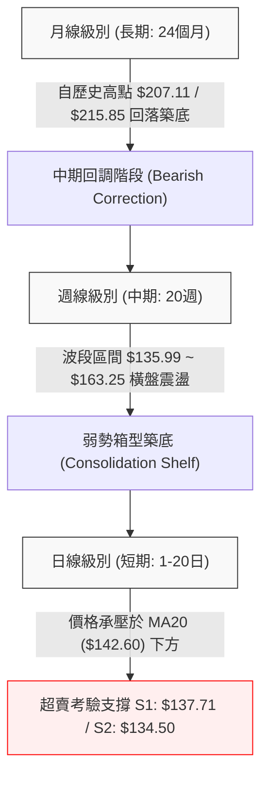

---

### 📈 長期趨勢 — 12個月走勢圖（Unicode）

以下為 VST 過去 12 個月（2025-10 至 2026-09）之月線收盤價格軌跡與關鍵轉折點標注：

```
VST 月線走勢圖（2025-10 至 2026-09）
價格軸 ($)
$210 ┤                                
$200 ┤                                
$190 ┤  ● $187.21 (2025-10)          
$180 ┤     ● $177.83                 
$170 ┤                 ● $173.13 (2026-02 次高反彈)
$160 ┤        ● $160.62   ● $157.65     ● $157.36  ● $159.74  ● $158.37
$150 ┤                                      ● $149.87                   
$140 ┤                                                        ● $147.95     ● $138.35 ←【現價】
$130 ┤                                                                   ● $137.15 (2026-08低點)
     └─────────────────────────────────────────────────────────────────────────────
        10月   11月   12月   01月   02月   03月   04月   05月   06月   07月   08月   09月
        2025  2025   2025   2026   2026   2026   2026   2026   2026   2026   2026   2026
```

#### 走勢特徵分析表格

| 階段區間 | 時間跨度 | 起訖價位 | 區間漲跌幅 | 核心形態與籌碼特徵 |
|----------|----------|----------|------------|--------------------|
| **高位派發期** | 2025-10 ~ 2025-12 | $187.21 → $160.62 | -14.20% | 自 2025-07 歷史峰值 $207.11 持續下行，長線資金獲利了結 |
| **次高反彈期** | 2026-01 ~ 2026-02 | $157.65 → $173.13 | +9.82% | 跌破年線後的技術性抽頭，受阻於 $174.05（斐波 50% 水平）|
| **箱型下移期** | 2026-03 ~ 2026-06 | $149.87 → $158.37 | +5.67% | 圍繞 $155.00 中軸進行窄幅盤整，成交量能顯著收縮 |
| **加速探底期** | 2026-07 ~ 2026-09 | $147.95 → $138.35 | -6.49% | 連續破位考驗 52 週低點 $132.26，目前在 $137.00–$138.00 築底 |

---

### 📊 中期趨勢（週線分析）

從近 20 週收盤走勢觀察，VST 處於「收斂箱體尋底」階段：
- **波動區間**：波段高點為 2026-06-21/28 創造的 $163.25，波段最低為 2026-08-23 的 $135.99。
- **近週動態**：2026-09-13 曾衝高至 $148.14（RSI 高達 71.4），但隨即在兩週內拉回至 $138.35，回吐全部漲幅，週 MACD 柱狀圖由正轉負（+1.579 → -0.196），顯示空頭壓制力道依然強勁。

```
週線近期壓力與支撐結構示意圖：
[壓力 R1] ─── $149.93 ─── 近期波段反彈受阻高點 (2026-09-06 高點 $149.06 聚類)
               ▲
               │  [震盪帶]  MA20 ($142.60) / 布林中軌形成層層壓制
               ▼
[現  價] ─── $138.35 ─── 貼近波段下邊界，空方動能減弱
               ▲
               │  [防禦帶]  52週低點防線 ($132.26 ~ $135.99)
               ▼
[支撐 S1] ─── $137.71 ─── 2026-08-30 收盤支撐與近一年低點聚類
```

---

### ⚡ 趨勢強度評估（ADX 解讀）

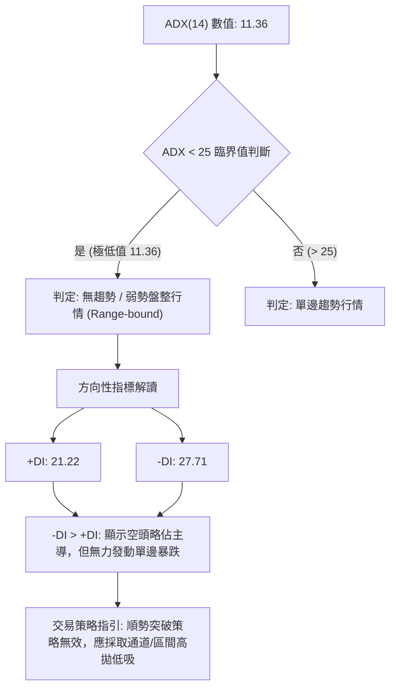

#### ADX 趨勢強度對照表

| 指標名稱 | 實際數值 | 參考閾值 | 技術狀態 | 交易策略意涵 |
|----------|----------|----------|----------|--------------|
| **ADX** | **11.36** | 0 ~ 20 | 極弱 / 橫盤無趨勢 | 禁止追漲殺跌；趨勢跟隨模型（均線突破）頻繁假突破 |
| **+DI** | **21.22** | > 25 強勢 | 多頭動能匱乏 | 反彈空間受限，難以直接突破上方重壓力位 |
| **-DI** | **27.71** | > 25 強勢 | 空方微幅主導 | 賣壓雖重但缺乏趨勢性加速推力，易在強支撐位引發反抽 |

---

## 3. 圖表形態分析

### 🔍 形態識別系統

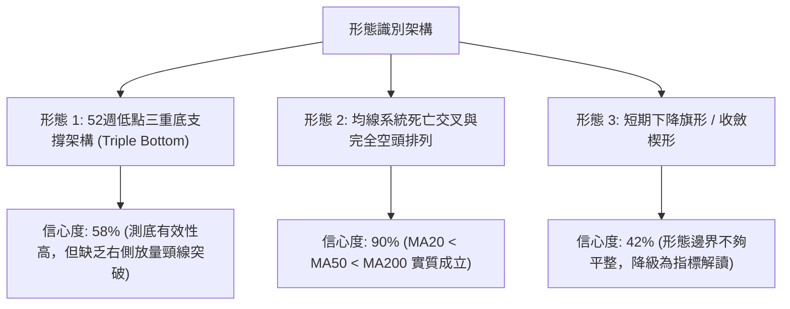

#### 形態信心度與目標價計算表（依據規則 15）

| 識別形態 | 信心度 (%) | 判斷依據（數據引用） | 形態完成度 (%) | 目標價計算公式與精確數值 |
|----------|------------|----------------------|----------------|--------------------------|
| **雙重底／區間箱底** | **58%** | 兩次下探低點 $135.99（08-23）與 $137.15（08月收盤），緊鄰支撐 S3: $132.26 | 50% | 頸線 R1: $149.93，高度 = $149.93 - $132.26 = $17.67。<br>向上目標 = $149.93 + $17.67 = **$167.60**（直逼 R3: $168.66） |
| **均線完全空頭排列** | **90%** | MA5 ($138.72) < MA20 ($142.60) < MA50 ($144.23) < MA200 ($154.74) | 100% | 均線反壓下移，第一回抽目標為 MA20: **$142.60**；反轉目標為 MA200: **$154.74** |
| **收斂楔形整理** | **42%** | 高點下移（$163.22 → $149.06），低點下移（$147.95 → $135.99），數據採樣較少 | 35% | *訊號不足（<50%），依規則不進行幾何預測，轉為布林通道區間指標解讀* |

---

### 🕯️ 重要K線形態分析

| 時間週期 | 收盤價 | K線組合形態 | 技術解讀 | 訊號強度 |
|----------|--------|-------------|----------|----------|
| 2026-08-23 週線 | $135.99 | 長下影長陰線 | 創下波段新低後引發短線超賣抄底盤，確認 S2 ($134.50) 附近買盤存在 | 🟡 支撐確認 |
| 2026-09-06 週線 | $149.06 | 長陽實體反包 | 週成交量 22.1M，MACD 柱狀由負翻正 (+1.364)，完成短線超跌反彈 | 🟢 短線轉強 |
| 2026-09-13 週線 | $148.14 | 高位流星倒錘頭 | RSI 達 71.4 觸發獲利回吐，上影線觸碰 R1 ($149.93) 未能站穩 | 🔴 短線見頂 |
| 2026-09-27 週線 | $138.46 | 連續兩週縮量陰跌 | 跌破 MA20，週 RSI 回落至 30.9，空頭重新掌握主導權但動能衰竭 | 🔴 弱勢尋底 |
| 當前即時日線 | $138.35 | 低檔十字星孕線 | 跌勢放緩，成交量放大至 8.04M（量比 1.68x），出現潛在變盤節點 | 🟡 變盤觀望 |

---

### 📉 ASCII 走勢形態示意圖

```
VST 關鍵圖表形態：潛在箱體三重底 vs 下降反壓線
════════════════════════════════════════════════════════════════════════
$170 ┤                                                               
$165 ┤       ● 高點 1 ($163.25)                                      
$160 ┤      / \                                                      
$155 ┤─────/───\─────────────── 頸線區域 / R2 ($155.69) ───────────────
$150 ┤    /     \      ● 高點 2 ($149.06 / R1: $149.93)              
$145 ┤   /       \    / \                                            
$140 ┤  /         \  /   \           ★ 現價 $138.35 (低檔橫盤)      
$135 ┤─●───────────●───────●──────── 底線支撐帶 S1: $137.71 / S2: $134.50
     │ 底點1     底點2     底點3                                     
$130 ┤ ($135.99) ($136.87) ($138.35) ── 強防線 S3 ($132.26 / 52W Low)  
════════════════════════════════════════════════════════════════════════
```

---

## 4. 支撐與阻力

### 🗺️ 關鍵價位分布圖（Unicode）

```
╔══════════════════════════════════════════════════════════════════════╗
║                    VST 價位結構分布圖與籌碼聚類                      ║
╠══════════════════════════════════════════════════════════════════════╣
║ $168.66 ║██████████████████████████████║ 強阻力 R3 (波段重大頭部反壓)║
║ $164.19 ║▓▓▓▓▓▓▓▓▓▓▓▓▓▓▓▓▓▓▓▓▓▓▓▓      ║ 斐波那契 61.8% 黃金分割回撤位║
║ $155.69 ║████████████████████          ║ 阻力 R2 (中期下降通道上軌壓制) ║
║ $154.74 ║▓▓▓▓▓▓▓▓▓▓▓▓▓▓▓▓▓▓            ║ 長期生命線 MA200 反壓位       ║
║ $150.15 ║▓▓▓▓▓▓▓▓▓▓▓▓▓▓▓▓              ║ 斐波那契 78.6% 回調關鍵分水嶺║
║ $149.93 ║██████████████████████████████║ 關鍵阻力 R1 (頸線與波段高點)  ║
║ $142.60 ║░░░░░░░░░░░░                  ║ 短線動態反壓 MA20 (布林中軌)   ║
╠═════════╬══════════════════════════════╬══════════════════════════════╣
║ $138.35 ╠══════════════════════════════╣ ◄─── 現價位置 (極低位階 7.3%)  ║
╠═════════╬══════════════════════════════╬══════════════════════════════╣
║ $137.71 ║▓▓▓▓▓▓▓▓▓▓▓▓▓▓▓▓▓▓▓▓▓▓▓▓      ║ 近期第一支撐 S1 (近一年波段低)║
║ $134.50 ║████████████████████████      ║ 強支撐 S2 (日線波段下影低點)   ║
║ $133.81 ║░░░░░░░░░░░░░░░░              ║ 布林通道下軌極限動態支撐       ║
║ $132.26 ║██████████████████████████████║ 核心防線 S3 (52W Low / 斐波0%) ║
╚══════════════════════════════════════════════════════════════════════╝
```

---

### 🚧 阻力位分析表

所有阻力位數值嚴格引用「關鍵價位」數據庫之計算結果：

| 阻力級別 | 準確價位 | 距離現價 | 形成原因與籌碼結構 | 突破難度 | 重要性權重 |
|----------|----------|----------|--------------------|----------|------------|
| **R1** | **$149.93** | +8.37% | 近一年波段高點聚類；與斐波 78.6% ($150.15) 共振，為雙底頸線所在地 | 中等偏高 | ★★★★☆ |
| **R2** | **$155.69** | +12.53% | 近期反彈次高點聚類；緊鄰年線 MA200 ($154.74)，沉積大量解套套牢盤 | 極高 | ★★★★★ |
| **R3** | **$168.66** | +21.91% | 2026 年初反彈頂部區間（02月高點聚類），強大多頭阻絕防線 | 極難 | ★★★☆☆ |

---

### 🛡️ 支撐位分析表

所有支撐位數值嚴格引用「關鍵價位」數據庫之計算結果：

| 支撐級別 | 準確價位 | 距離現價 | 形成原因與籌碼結構 | 守住機率 | 重要性權重 |
|----------|----------|----------|--------------------|----------|------------|
| **S1** | **$137.71** | -0.46% | 近一年波段低點聚類；當前價格第一道緩衝墊，近期盤整成交密集區 | 70% | ★★★★☆ |
| **S2** | **$134.50** | -2.79% | 2026-08 波段急跌後的實體低點支撐區，靠近布林下軌 ($133.81) | 80% | ★★★★☆ |
| **S3** | **$132.26** | -4.40% | 52 週最低點（斐波那契 100.0% 回調位）；多頭中長期生死存亡防線 | 88% | ★★★★★ |

---

### 📐 斐波那契回調位分析

依據 52 週波動區間起點 **$132.26**（52W Low）至終點 **$215.85**（52W High）精確計算：

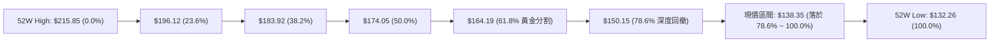

- **位置意義解讀**：現價 **$138.35** 已經深度跌破斐波那契 78.6%（$150.15）。在技術分析理論中，跌破 78.6% 回調位意味著前一輪自 $132.26 至 $215.85 的牛市上漲浪潮已基本被完全抹平，市場進入「熊市終極測底」階段。
- **支撐重疊度**：100.0% 回調位 **$132.26** 與關鍵支撐位 **S3** 完全重合，構建了不可跌破的絕對鋼鐵防線；若此防線失守，技術形態將演變為無支撐破底走勢。

---

## 5. 技術指標深度解讀

### 🎛️ 指標訊號總覽

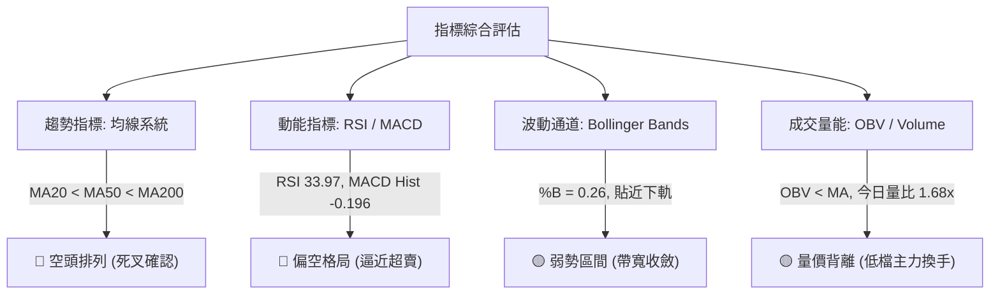

---

### 📈 移動平均線排列分析

| 移動平均線 | 當前價位 | 價格相對位置 | 斜率與方向 | 排列狀態與技術解讀 |
|------------|----------|--------------|------------|--------------------|
| **MA 5** | $138.72 | -0.27% (下方) | ▼ 下彎 (-0.37) | 超短期壓制，多頭短線第一道反撲門檻 |
| **MA 10** | $139.65 | -0.93% (下方) | ▼ 下彎 (-1.30) | 短線空方防線，限制日線反彈空間 |
| **MA 20** | $142.60 | -2.98% (下方) | ▼ 下彎 (-4.25) | 月線生命線下行，為波段空頭的核心防守點 |
| **MA 50** | $144.23 | -4.08% (下方) | ▼ 下彎 | 中期反壓，確認中期跌勢確立 |
| **MA 60** | $146.43 | -5.52% (下方) | ▼ 下彎 (-8.08) | 季線下壓，籌碼沉澱需要時間 |
| **MA 120** | $150.64 | -8.16% (下方) | ▼ 下彎 (-12.29) | 半年線持續下移，形成中期厚重套牢壓 |
| **MA 200** | $154.74 | -10.59% (下方) | ▼ 下彎 | 長期牛熊分水嶺失守，長線多頭結構破壞 |
| **MA 240** | $159.10 | -13.04% (下方) | ▼ 下彎 (-20.75) | 年線徹底拐頭向下，宣告長期下行通道確立 |

- **結論**：MA20 < MA50 < MA200 呈現教科書級別的「空頭發散排列」，所有均線斜率均向下，壓抑任何急速多頭行情。多頭若要逆轉局勢，必須首先放量站穩 MA20（$142.60）。

---

### 📉 RSI(14) 分析

```
RSI(14) 當前水平: 33.97 (弱勢盤整偏超賣)
0       10      20      30      40      50      60      70      80      90     100
├───────┼───────┼───────┼───────┼───────┼───────┼───────┼───────┼───────┼───────┤
█████████████████████░░░░░░░░░░░░░░░░░░░░░░░░░░░░░░░░░░░░░░░░░░░░░░░░░░░░░░░░░░░░░░░
                        ▲
                     [33.97]
```

- **超買超賣區間判斷**：RSI 數值為 33.97，雖處於弱勢空頭區間（< 50），但尚未跌破 30 的極端超賣門檻。這表明市場處於「陰跌」走勢，而非「恐慌性拋售」。
- **背離狀況檢驗**：
  - 價格前低為 2026-08-23 的收盤價 $135.99（對應週 RSI 為 26.1）。
  - 當前價格 $138.35 高於前低，日線 RSI 為 33.97。
  - **結論**：目前 RSI 與價格走勢保持同步，**未出現標準的底背離或頂背離現象**，技術面上不支持 V 型暴力反轉，支持區間反覆夯實底部的推論。

---

### 📊 MACD(12,26,9) 訊號解讀

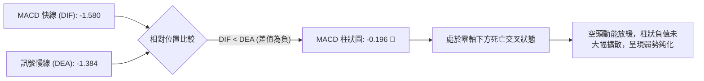

- **量化數值解析**：MACD 線為 **-1.580**，Signal 線為 **-1.384**，柱狀圖（Histogram）為 **-0.196**。
- **背離判定**：週線級別 MACD 柱狀圖在 2026-08-09 曾下探至 -1.870，而最新收盤柱狀圖收縮至 -0.196，顯示儘管價格仍在低位震盪，但中期的下行殺跌動能已經顯著衰竭，空方動能呈現邊際遞減。

---

### 📦 布林通道分析

```
VST 布林通道 (20, 2) 結構圖
══════════════════════════════════════════════════════════════════════════
$151.39 ─────────────────────────────── 上軌 (強大超買壓力區)
         │
         │  
$142.60 ─┼───────────────────────────── 中軌 MA20 (多空動態分界嶺)
         │  
$138.35 ─┼────────── ★ 現價 ($138.35，處於弱勢下半區，%B = 0.26)
         │
$133.81 ─────────────────────────────── 下軌 (動態超賣支撐區)
══════════════════════════════════════════════════════════════════════════
```

- **通道帶寬與位置**：上軌 **$151.39**，中軌（MA20）**$142.60**，下軌 **$133.81**。
- **通道指標 %B = 0.26**：價格位於下軌與中軌之間（靠近下軌）。%B < 0.3 意味著短線下行空間已被壓縮，下軌 **$133.81** 與波段強支撐 **S2 ($134.50)** 形成密集共振支撐區，價格在下軌處具備技術性均值回歸（Mean Reversion）反彈至中軌 **$142.60** 的內在動力。

---

### 💹 成交量分析（量價配合度）

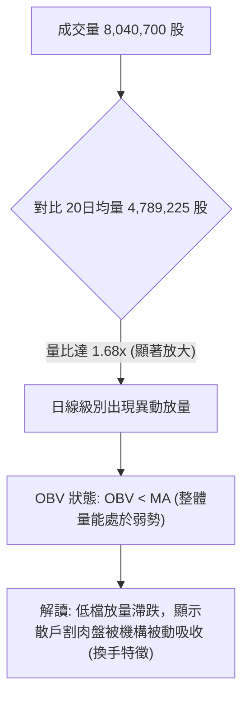

- **量能異動特徵**：最新單日成交量為 **8,040,700 股**，較 20 日均量（4,789,225 股）放大 **67.89%**（量比 1.68x）。在價格收出十字星橫盤之際爆出巨量，呈現典型的「低檔放量滯跌」形態。
- **OBV 趨勢檢驗**：目前 OBV 仍處於均線下方，這說明中長期累計能量尚未正式由流出轉為強烈流入。短線的放量更傾向於法人機構在 52 週低點 S3（$132.26）上方的防禦性承接，而非主動性進攻推升。

---

## 6. 動能與波動率

### ⚡ 動能評估四象限

根據「趨勢動能（RSI/MACD）」與「波動率（ATR/通道帶寬）」交叉評估，VST 當前處於 **弱動能・低/中波動** 的區間：

| 象限分佈 | 動能維度 | 波動維度 | 歷史常態特徵 | 當前狀態判定 | 操作指引 |
|----------|----------|----------|--------------|--------------|----------|
| **象限 I** | 強動能 | 低波動 | 穩步上行單邊牛市 | 否 | 積極做多順勢持股 |
| **象限 II** | **弱動能** | **低/中波動** | **築底震盪 / 陰跌磨底** | **✓ (VST 當前所處位置)** | **嚴禁追高，以區間逆勢交易為主** |
| **象限 III**| 強動能 | 高波動 | 暴漲狂熱或突破追擊 | 否 | 突破跟隨高風險高回報 |
| **象限 IV** | 弱動能 | 高波動 | 恐慌性崩盤殺跌 | 否 | 嚴格停損空倉觀望 |

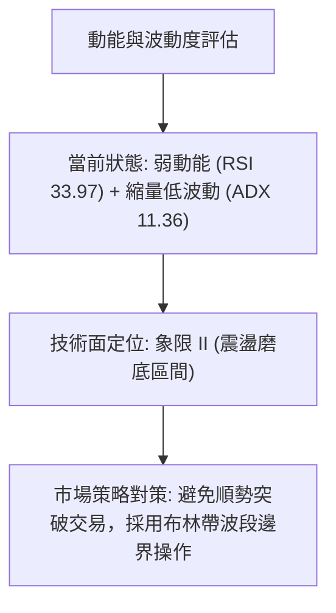

---

### 📊 ATR 波動率分析

- **ATR(14) 數值**：**$4.27**，佔當前價格比例為 **3.08%**。
- **日間交易波幅指引**：在常態市況下，VST 每日潛在價格波動範圍為 $134.08 至 $142.62。
- **風控止損距離量化建議**：
  - **1.0 倍 ATR（短線緊密止損）**：距離進場點 **$4.27**。
  - **1.5 倍 ATR（波段安全止損）**：距離進場點 **$6.41**。
  - **2.0 倍 ATR（寬鬆趨勢止損）**：距離進場點 **$8.54**。
- 若在當前價位 $138.35 建立多頭試倉，以 1.5 倍 ATR 設防，止損位約在 $131.94，此位置剛好有效覆蓋 52 週最低點 S3（$132.26），具備絕佳的結構保護效果。

---

### 📐 Beta 與市場相關性

- **Beta 係數**：**1.414**。
- **高敏感性解讀**：作為公用事業（Utilities）板塊個股，VST 的 Beta 達 1.414，顯著高於板塊平均值（公用事業傳統 Beta 普遍在 0.5–0.7 之間）。這表明 VST 具備獨立發電商（IPP）與 AI 資料中心電力需求概念的高彈性特質，對標普 500 指數與宏觀流動性變化極具放大效應。當大盤反彈時其彈性較大，反之在大盤調整時跌幅亦加劇。

---

## 7. 多時框架總結

### 📋 時框架評分表

| 時框架週期 | 趨勢方向 | 動能狀態 | 均線排列特徵 | 圖表形態 | 綜合評分 | 戰略建議 |
|------------|----------|----------|--------------|----------|----------|----------|
| **月線 (長期)** | 🔴 下行調整 | 弱勢 (自超買大幅回落) | 跌破長週期中樞 | 高位雙頂派發回調 | 32/100 | 規避中長線左側重倉 |
| **週線 (中期)** | 🟡 橫盤築底 | 鈍化 (-0.196) | 均線發散壓制 | $132–$163 寬幅箱體 | 45/100 | 波段邊界高拋低吸 |
| **日線 (短期)** | 🔴 弱勢磨底 | 逼近超賣 (RSI 33.97) | 完全空頭排列 | 考驗 S1/S2 密集支撐帶 | 41/100 | 支撐位附近輕倉博反彈 |

---

### 🔲 綜合訊號矩陣

```
╔════════════════════════════════════════════════════════════════════════╗
║                        多時框技術訊號共振矩陣                          ║
╠══════════════╦══════════════╦══════════════╦═══════════════════════════╣
║ 指標維度     ║ 長期 (月線)  ║ 中期 (週線)  ║ 短期 (日線)               ║
╠══════════════╬══════════════╬══════════════╬═══════════════════════════╣
║ 趨勢 (Trend) ║ 🔴 空頭修復  ║ 🟡 箱型震盪  ║ 🔴 弱勢下探               ║
║ 動能 (Moment)║ 🔴 負向釋放  ║ 🟡 殺跌衰竭  ║ 🟡 逼近超賣               ║
║ 均線 (MAs)   ║ 🟡 測試年線  ║ 🔴 死叉發散  ║ 🔴 空頭壓制               ║
║ 量價 (Volume)║ 🟡 縮量整理  ║ 🟢 低檔放量  ║ 🟢 異動承接 (量比 1.68x)  ║
╠══════════════╬══════════════╬══════════════╬═══════════════════════════╣
║ 綜合共振結論 ║ 🔴 壓制強烈  ║ 🟡 平台構築  ║ 🟡 底部支撐強烈           ║
╚══════════════╩══════════════╩══════════════╩═══════════════════════════╝
```

---

### ⚖️ 多時框收斂結論（嚴格收斂規則 14 執行）

依據規範第 14 條多時框收斂原則進行最終判定：
1. **行情類型界定**：當前 ADX(14) 讀數為 **11.36**，遠小於 25 的趨勢行情閥值，**嚴格判定當前處於「無趨勢的盤整行情（Consolidation Market）」**。
2. **時框優先級裁決**：在 ADX < 25 的盤整環境中，單邊趨勢追隨失效，交易主導時框降級收斂至**日線布林通道（$133.81 ~ $151.39）與已計算之關鍵支撐/阻力區間**。
3. **方向性唯一結論**：**中性偏弱區間震盪（Neutral-Bearish Range-bound）**。策略邏輯必須以「**防守型低吸、依託強支撐尋求均值回歸反彈**」為主，反彈至均線壓制位（MA20/R1）則逢高減碼，嚴禁追單。

---

## 8. 交易策略建議

### 🗺️ 策略決策流程圖

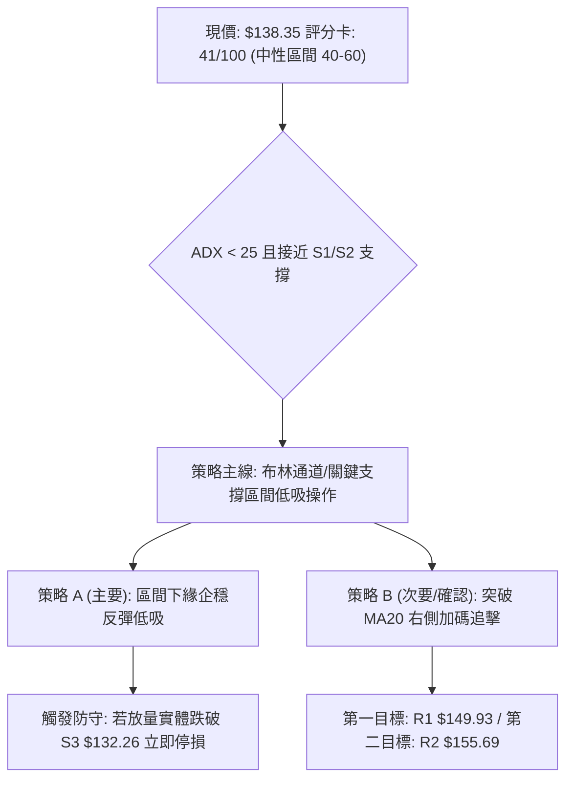

---

### 🧭 策略路由

**當前主策略方向 = 中性偏弱區間波段操作（依據綜合評分 41/100，落於 40–60 區間震盪範疇）**。  
由於價格極度貼近波段下邊界支撐（距離 S1 僅 -0.46%，距離 S3 僅 -4.40%），盲目在超賣區做空盈虧比極差；因此採取「**依託強支撐 S2/S3 逢低吸納，博弈回抽布林中軌 MA20 與阻力 R1**」的均值回歸策略，同時設立嚴格防守破位停損點。

---

### 🎯 價格情境階梯（Price Scenarios）

價位嚴格引用第 4 章及數據庫之計算數值：

| 價格觸發條件 | 下一階段目標 | 後續延伸位置 | 技術面情境含義與對策 |
|--------------|--------------|--------------|----------------------|
| **強勢突破 R1 ($149.93)** | **R2 ($155.69)** | **R3 ($168.66)** | 雙底形態確立，突破頸線，中期趨勢翻多，空單全數退場 |
| **反彈站上 MA20 ($142.60)** | **R1 ($149.93)** | **R2 ($155.69)** | 短線超跌修復，解除日線超賣警報，波段多單可減碼鎖利 |
| **維持現價區間 ($137–$142)** | — | — | 於布林下軌與中軌間弱勢磨底，洗盤蓄勢，持倉觀望 |
| **跌破第一支撐 S1 ($137.71)**| **S2 ($134.50)** | **S3 ($132.26)** | 空方試探波段低位，考驗 52 週最低點支撐強度 |
| **有效跌破 S3 ($132.26)** | — | 尋找未知新低 | 創 52 週新低，宣告所有形態破位，多頭策略徹底終止離場 |

---

### 📊 情境機率分佈

| 運行情境 | 發生機率 | 主要技術與量化依據 |
|----------|----------|--------------------|
| **情境一：區間震盪築底** | **55%** | ADX=11.36 確立無單邊趨勢；布林 %B=0.26 貼近下軌，今日成交量比達 1.68x 出現換手 |
| **情境二：跌破 S3 深度探底**| **25%** | 均線空頭排列（MA20/50/200 齊跌）；MACD 柱狀仍為負值（-0.196）；大盤 Beta 波動拖累 |
| **情境三：直接強勢反轉衝刺**| **20%** | RSI 僅 33.97 且未現底背離；上方 R1 ($149.93) 處有大量密集成交套牢盤壓制 |

---

### 🟢 主策略詳情（區間操作與破位防守）

| 策略維度要素 | 策略 A（區間下緣低吸 — 主要策略） | 策略 B（右側突破跟進 — 確認策略） |
|--------------|-----------------------------------|-----------------------------------|
| **交易邏輯** | 依託 S1/S2 支撐博弈均值回歸反彈 | 突破 MA20 站穩布林中軌順勢加碼 |
| **進場價格** | **$137.71**（S1 支撐掛單，容差至現價 $138.35）| **$142.60**（放量突破並站穩 MA20） |
| **目標價 T1** | **$142.60**（布林中軌 / MA20，預期 +3.55%）| **$149.93**（阻力 R1 / 頸線，預期 +5.14%） |
| **目標價 T2** | **$149.93**（阻力 R1，預期 +8.87%） | **$155.69**（阻力 R2 / 年線，預期 +9.18%） |
| **止損價格** | **$132.26**（嚴格以 52W Low 止損，-3.96%） | **$137.71**（跌回 S1 下方認賠，-3.43%） |
| **風險報酬比** | **1 : 2.24**（以 T2 計算） | **1 : 2.67**（以 T2 計算） |
| **歷史勝率估計** | **62%** | **54%** |
| **建議配置倉位** | **10% ~ 15%**（輕倉試單） | **10%**（右側確認後加碼） |

---

### 🔴 反向風險觸發點（對沖提示）

若出現以下訊號，意味著「弱勢震盪」將全面惡化為「新一輪單邊破位暴跌」，必須立即撤銷多頭計畫並啟動對沖：
1. **收盤跌破 S3 ($132.26)**：跌破 52 週最低點，確認無底深淵開啟，必須全線無條件砍倉多單。
2. **ADX 突發放量向上突破 25** 同時 **-DI 急速上揚擴大至 35 以上**：確認新一輪單邊主跌浪形成，此時切不可抄底。
3. **反彈至 MA20 ($142.60) 遭遇長上影線壓制且成交量萎縮**：短線弱反彈結束，可在 $142.60 附近少量買入 PUT 選擇權或賣出個股對沖。

---

### ⭐ 整體訊號強度評星

```
╔══════════════════════════════════════════════════════════════╗
║ 做多訊號強度：★★☆☆☆  (2.0/5星 — 僅屬超賣支撐防禦型低吸)      ║
║ 做空訊號強度：★★★☆☆  (3.0/5星 — 均線空頭排列，但空間受阻)   ║
║ 整體可信度：  ★★★☆☆  (3.5/5星 — ADX 顯示盤整，指標無矛盾)   ║
╚══════════════════════════════════════════════════════════════╝
```

---

## 9. 風險提示與監控

### ✅ 關鍵監控指標 Checklist

```
╔══════════════════════════════════════════════════════════════════════╗
║                     技術面關鍵監控檢查清單 (Daily Checklist)         ║
╠══════════════════════════════════════════════════════════════════════╣
║ [ ] 價格是否跌破 52 週核心支撐 S3: $132.26 (破位即走)                 ║
║ [ ] 每日收盤價能否重返短期均線 MA5 ($138.72) 之上                    ║
║ [ ] RSI(14) 是否跌破 30 陷入極端超賣鈍化（防範加速恐慌盤）           ║
║ [ ] MACD 柱狀圖是否持續收斂至 0 軸上方（觀察紅柱何時翻綠）           ║
║ [ ] 成交量能否維持在 20 日均量 (4.79M) 之上，確認機構持續接盤        ║
║ [ ] 大盤標普 500 指數是否出現系統性大跌（Beta 1.414 放大風險）       ║
╚══════════════════════════════════════════════════════════════════════╝
```

---

### ⚠️ 風險場景分析

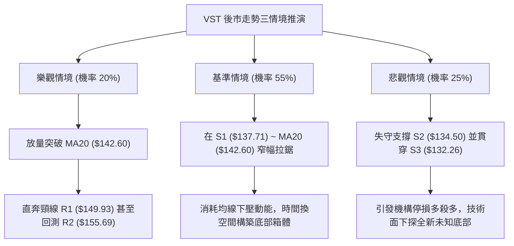

---

### 🛡️ 風險管理重要提醒

1. **嚴禁左側重倉**：儘管 VST 本益比（Forward P/E 13.35）與分析師目標價（均價 $212.79）展現長期基本面價值，但技術面處於完整的均線空頭排列之下。在技術右側訊號（如放量站上 MA50 $144.23）出現前，倉位上限不得超過總資金的 15%。
2. **ATR 波動適應**：由於每日 ATR 達 $4.27（3.08%），日內正常震盪劇烈，若設置過於狹窄的止損（如 < $2.00）極易被噪音洗出場。建議止損以重要關鍵價位（如 S3: $132.26）為剛性基準，而非微小百分比。
3. **公用事業板塊聯動性**：關注美債 10 年期殖利率動態。若殖利率攀升，將對高負債的公用事業板塊造成估值壓制，可能壓制反彈動能。

---

## 📋 報告總結

```
╔══════════════════════════════════════════════════════════════════════╗
║                     VST 技術分析報告核心總結                         ║
╠══════════════════════════════════════════════════════════════════════╣
║ 報告日期：2026-10-01              當前價格：$138.35                 ║
║ 綜合技術評分：41 / 100            分析評級：⚖️ 中性偏弱 (弱勢區間震盪)║
╠══════════════════════════════════════════════════════════════════════╣
║ 關鍵結論要點：                                                       ║
║ ├─ 長期趨勢：🔴 跌破年線 MA200 ($154.74)，回撤自峰值近40%，處於熊市修復║
║ ├─ 中期趨勢：🟡 ADX=11.36，單邊趨勢消退，確立 $132–$163 區間箱型震盪 ║
║ ├─ 短期趨勢：🟡 價格處於布林通道下軌極限，RSI=33.97 逼近超賣，跌勢趨緩║
║ ├─ 核心阻力位：R1: $149.93 ｜ R2: $155.69 ｜ R3: $168.66             ║
║ ├─ 核心支撐位：S1: $137.71 ｜ S2: $134.50 ｜ S3: $132.26 (52W Low)  ║
║ └─ 華爾街共識：Strong Buy（19位分析師目標均價 $212.79，潛在空間大）  ║
╠══════════════════════════════════════════════════════════════════════╣
║ 最優操作策略組合：                                                   ║
║ 1. 🥇 最佳機會（策略 A）：依託 S1 ($137.71) ~ S2 ($134.50) 輕倉吸納， ║
║               停損設於 S3 ($132.26)，博弈反彈 T1: $142.60 / T2: $149.93║
║ 2. 🥈 次選機會（策略 B）：耐心等待日線放量實體突破 MA20 ($142.60) 後，║
║               右側加碼進場，目標直指 R1 ($149.93)                    ║
║ 3. 🥉 保守選擇：完全空倉觀望，直至價格站上 MA50 ($144.23) 扭轉均線型態║
╚══════════════════════════════════════════════════════════════════════╝
```

---

> ⚠️ **免責聲明**：本報告為依據客觀技術分析模型與歷史交易數據生成之量化研究報告，所有技術價位、形態判斷與機率估算僅供學術交流與投資決策參考，**不構成任何形式的要約、招攬或具體投資建議**。金融市場瞬息萬變，個股受宏觀政策、市場情緒及非系統性風險影響巨大，投資人應獨立評估風險並自行承擔交易損益。

---
*報告生成時間：2026-10-01 ｜ 數據來源：Yahoo Finance ｜ 分析框架：資深多時框圖表與量化指標系統*