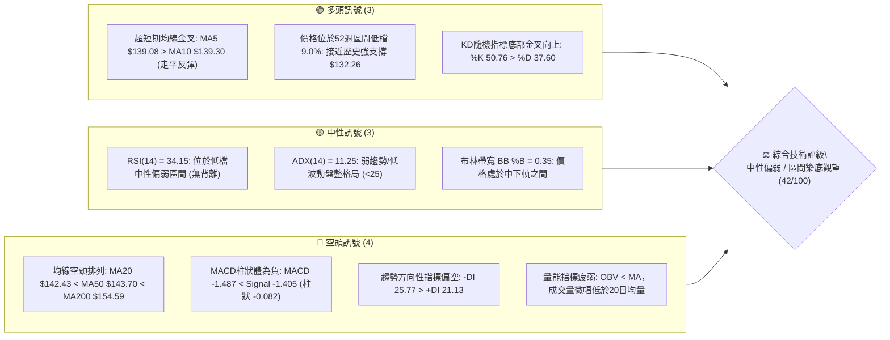
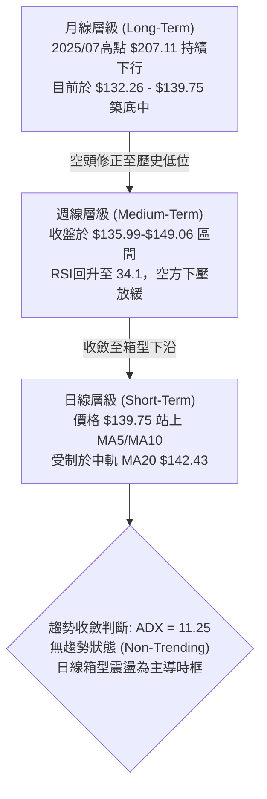
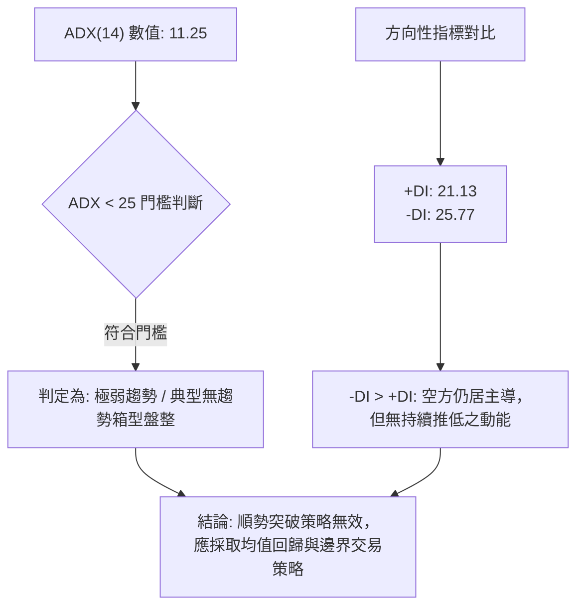
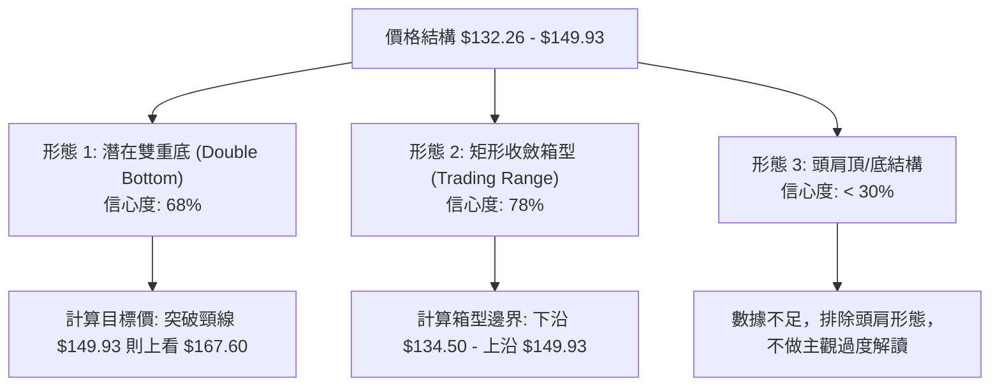
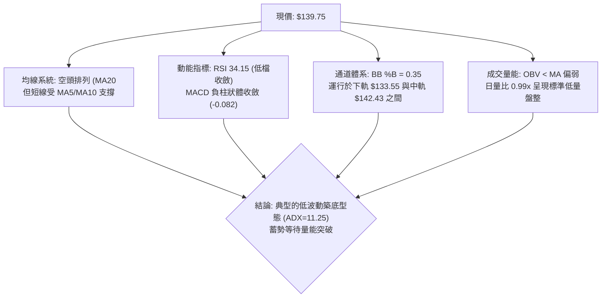
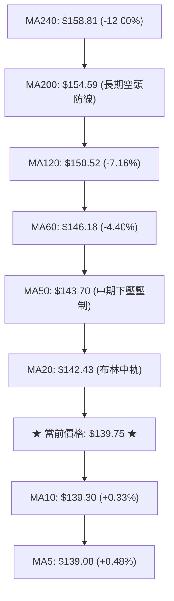
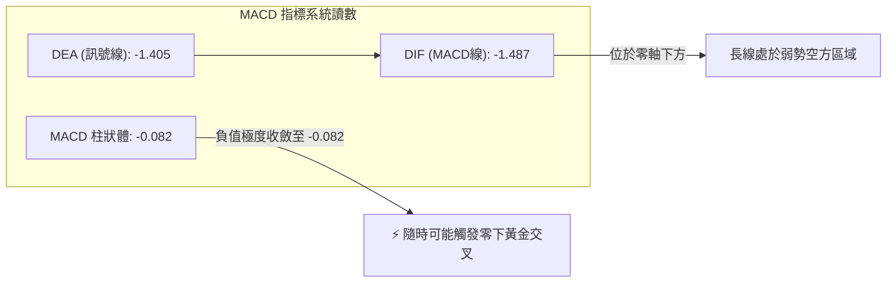
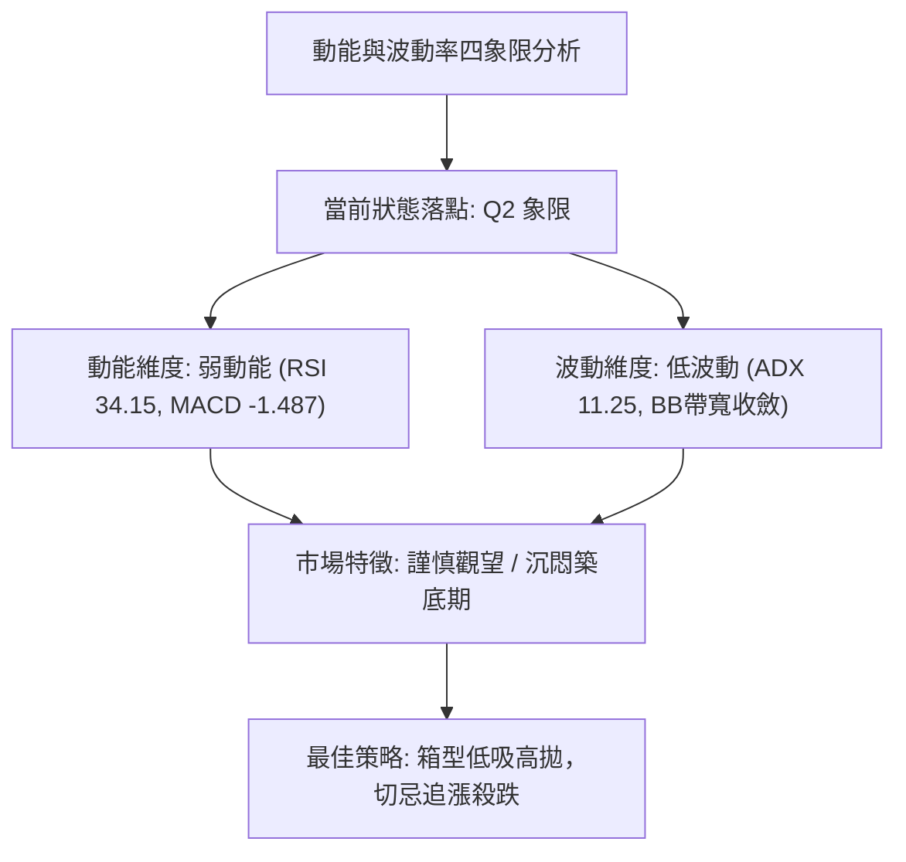
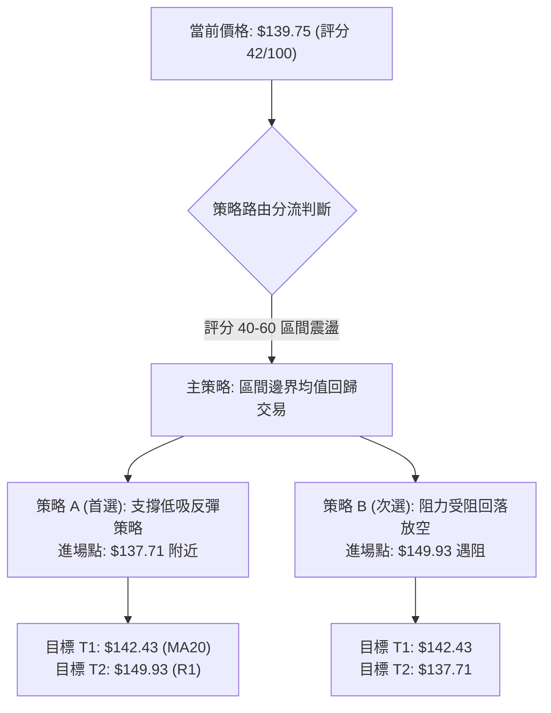
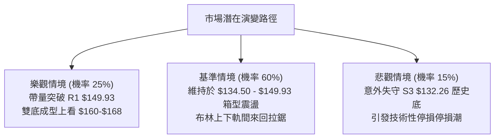

# VST 技術分析報告

> **報告日期**：2026-10-02 ｜ **語言**：繁體中文 ｜ **數據來源**：Yahoo Finance ｜ **當前價格**：$139.75

---

## 目錄

| 章節 | 內容 |
|------|------|
| [1. 技術面概覽](#1-技術面概覽) | 訊號儀表板、核心指標、評分卡 |
| [2. 趨勢分析](#2-趨勢分析) | 多時框趨勢、長中短期走勢、ADX解讀 |
| [3. 圖表形態分析](#3-圖表形態分析) | 形態識別、信心度評估、K線組合、形態目標價 |
| [4. 支撐與阻力](#4-支撐與阻力) | 關鍵價位分布、阻力與支撐表、斐波那契回調 |
| [5. 技術指標深度解讀](#5-技術指標深度解讀) | 均線系統、RSI背離、MACD、布林通道、OBV量能 |
| [6. 動能與波動率](#6-動能與波動率) | 動能四象限、ATR波動度止損、Beta相關性 |
| [7. 多時框架總結](#7-多時框架總結) | 時框架評分、綜合訊號矩陣、多時框收斂結論 |
| [8. 交易策略建議](#8-交易策略建議) | 策略路由、價格情境階梯、主策略詳解、反向風險觸發 |
| [9. 風險提示與監控](#9-風險提示與監控) | 關鍵監控Checklist、三行情境分析、資金控管規範 |

---

## 1. 技術面概覽

### 🎯 技術訊號儀表板



---

### 📊 核心指標速覽表

| 指標類別 | 指標名稱 | 當前數值 | 訊號 | 解讀 |
|:---|:---|:---:|:---:|:---|
| **價格** | 當前收盤價 | **$139.75** | 🟡 | 位於52週區間($132.26–$215.85)的 9.0% 處，處於極低位區間 |
| **短期均線** | MA5 / MA10 | $139.08 / $139.30 | 🟢 | 現價微幅站上MA5與MA10，短線止跌跡象浮現 |
| **中期均線** | MA20 / MA50 | $142.43 / $143.70 | 🔴 | 價格低於MA20與MA50，且雙雙下行，上方存在第一道動態阻力 |
| **長期均線** | MA200 | $154.59 | 🔴 | 遠低於半年線/年線關鍵分水嶺，長期結構偏空 |
| **動能** | RSI(14) | 34.15 | 🟡 | 脫離超賣區(30以下)，短線回升但動能疲弱，未形成背離 |
| **動能** | MACD(12,26,9) | -1.487 / -1.405 | 🔴 | MACD線位於訊號線下方，負柱狀體收斂至 -0.082，空方動能減緩 |
| **動能** | 隨機指標 Stoch | %K 50.76 / %D 37.60 | 🟢 | 短線黃金交叉，自超賣區向上穿越 |
| **趨勢強度** | ADX(14) | 11.25 | 🟡 | 極低趨勢值 (<25)，市場進入低波動箱型盤整，趨勢動能匱乏 |
| **通道指標** | 布林通道 | 帶寬區間 $133.55 – $151.30 | 🟡 | %B 為 0.35，震盪於中軌($142.43)與下軌($133.55)之間 |
| **成交量** | 最新量 / 20日均量 | 4.75M / 4.79M | 🔴 | 量比 0.99x，成交量萎縮，OBV < MA 顯示資金流出尚未扭轉 |
| **波動度** | ATR(14) | $4.42 | 🟡 | 佔現價 3.17%，日內波動適中，提供明確止損與區間參考依據 |

---

### 🏆 技術評分卡

```
╔══════════════════════════════════════════════════════════════════╗
║               技術評分卡 — VST (2026-10-02)                     ║
╠══════════════════════════════════════════════════════════════════╣
║ 趨勢強度 (ADX=11.25, 空頭主導)   ██████░░░░░░░░░░░░░░  30/100 🔴 ║
║ 動能指標 (RSI=34.15, MACD負值)   ████████░░░░░░░░░░░░  40/100 🟡 ║
║ 支撐穩定度 (S1-S3防線鞏固中)     ████████████░░░░░░░░  60/100 🟢 ║
║ 成交量配合 (OBV疲弱, 無放大攻擊) ███████░░░░░░░░░░░░░  35/100 🔴 ║
║ 形態完整度 (箱型下緣構築)       ██████████░░░░░░░░░░  50/100 🟡 ║
║ 均線排列 (MA20<MA50<MA200排列)   ████░░░░░░░░░░░░░░░░  20/100 🔴 ║
╠══════════════════════════════════════════════════════════════════╣
║ 綜合技術評分                     ████████░░░░░░░░░░░░  42/100 🟡 ║
║ 綜合評級：【中性偏弱 — 區間震盪築底格局】 (Neutral to Range-Bound)║
╚══════════════════════════════════════════════════════════════════╝
```

---

## 2. 趨勢分析

### 🌐 多時框趨勢分析



---

### 📈 長期趨勢 — 過去12個月走勢圖（Unicode）

VST 過去 12 個月經歷了從 2025 年末的相對高點一路盤跌回調至 2026 年第 3 季低點的過程。

```
VST 月線收盤走勢圖（2025-10 至 2026-10）
價格軸 ($)
$190 ┤ ● ($187.21)
$180 ┤     ● ($177.83)
$170 ┤                   ● ($173.13)
$160 ┤         ● ($160.62)       ● ($159.74)
$150 ┤             ● ($157.65)       ● ($149.87)   ● ($147.95)
$140 ┤                                                 ● ($137.15) ─●($139.75)現價
$130 ┤                                                      ▲
     └─┬───────┬───────┬───────┬───────┬───────┬───────┬───────┬───────┬───►
     25-10   25-11   25-12   26-01   26-02   26-04   26-06   26-08   26-10
```

#### 走勢特徵分析表格

| 階段 | 時間區間 | 起始價 / 終止價 | 漲跌幅 | 走勢特徵與結構意涵 |
|:---|:---:|:---:|:---:|:---|
| **高位崩解段** | 2025-10 ~ 2026-01 | $187.21 ➔ $157.65 | -15.79% | 頂部動能衰退，連續跌破月線短均線支撐，主力機構減碼。 |
| **技術反彈段** | 2026-01 ~ 2026-02 | $157.65 ➔ $173.13 | +9.82% | 於 $157 附近展開熊市反彈，但受制於波段 50.0% 回調位壓制。 |
| **平台整理段** | 2026-03 ~ 2026-06 | $149.87 ➔ $158.37 | +5.67% | 價格在 $150–$160 區間建立橫盤整理帶，但量能無法有效放大。 |
| **加速探底段** | 2026-07 ~ 2026-08 | $158.37 ➔ $137.15 | -13.40% | 跌破整理平台下軌，迅速觸及 52 週最低點 $132.26 附近。 |
| **築底收斂段** | 2026-09 ~ 2026-10 | $138.35 ➔ $139.75 | +1.01% | 波動率極度收縮，振幅收窄，連續兩月站穩 $137.00 之上。 |

---

### 📊 中期趨勢（週線分析）

從近 20 週收盤走勢可見，價格在 2026 年 8 月 23 日當週見到低點 $135.99（盤中探及 52 週低點 $132.26），隨後反彈至 9 月 6 日的 $149.06，再度拉回至 9 月底的 $138.46，本週收於 $139.75。

```
週線區間波段架構：
$155.69 ───────── 強阻力區 (R2 / 接近 MA200 $154.59)
$149.93 ───────── 波段高點阻力 (R1 / 近期 9/06 高點 $149.06 聚類)
$142.43 ┄┄┄┄┄┄┄┄ 日線布林中軌 / MA20 (短線反壓)
$139.75 ◄──────── 當前收盤價 (處於築底結構之中)
$137.71 ───────── 近期波段次低點支撐 (S1)
$134.50 ───────── 波段低點支撐 (S2 / 接近布林下軌 $133.55)
$132.26 ═════════ 52週歷史底部強支撐 (S3)
```

---

### ⚡ 趨勢強度評估（ADX 解讀）



#### ADX 趨勢強度對照解讀

| 指標名稱 | 當前讀數 | 基準區間 | 趨勢性質 | 策略指導意義 |
|:---|:---:|:---:|:---:|:---|
| **ADX (14)** | **11.25** | 0 – 20 (極弱) | **完全盤整行情** | 嚴禁使用順勢追價策略，任何單邊突破均易出現假突破。 |
| **+DI (14)** | **21.13** | 0 – 100 | 多方攻擊動能偏弱 | 多方未發動有效反攻，目前僅為防守性反彈。 |
| **-DI (14)** | **25.77** | 0 – 100 | 空方防守動能佔優 | 空方佔優但數值低於 30，顯示賣壓已大致出清，不具備崩跌動能。 |
| **Directional Diff**| **-4.64** | -DI 領先 | 弱空格局 | 依規則 14，ADX < 25 以日線布林通道上下軌為主要交易區間。 |

---

## 3. 圖表形態分析

### 🔍 形態識別系統



#### 形態識別與信心度評估表（依規則 15）

| 形態名稱 | 信心度 (%) | 判斷依據（引用真實數據） | 形態完成度 (%) | 目標價（附計算式） |
|:---|:---:|:---|:---:|:---|
| **箱型底部整理 (Rectangular Base)** | **78%** | 價格在 2026 年 8 月至 10 月期間，多次於 $134.50–$137.71 止跌，上行於 $149.06–$149.93 受阻，ADX 11.25 印證橫盤。 | 85% | **區間上軌：$149.93**<br/>若向上有效突破，量測目標價 = $149.93 + ($149.93 - $134.50) = **$165.36** |
| **潛在雙重底 (Double Bottom)** | **68%** | 第一低點為 8 月 23 日當週 $135.99（最低探 $132.26），反彈至 9 月 13 日 $148.14，第二低點為 9 月 27 日 $138.46。 | 60% | **頸線位：$149.93 (R1)**<br/>形態高度 = $149.93 - $132.26 = $17.67<br/>目標價 = $149.93 + $17.67 = **$167.60**（接近 R3 $168.66） |
| **頭肩底形態 (Head & Shoulders Bottom)** | **25%** | 數據中左肩與右肩對稱性極差，無標準頸線結構，訊號嚴重不足。 | 0% | **訊號不足，僅做指標型解讀**（不強行預測目標價） |

---

### 🕯️ 重要 K 線形態分析

| 週/月份週期 | 收盤價 | K 線形態 | 技術解讀 | 訊號方向 |
|:---|:---:|:---|:---|:---:|
| **2026-08-23 週** | $135.99 | **長下影長黑K** | 跌破所有短期均線，但在觸及 $132.26 後迅速收回，顯示機構低接買盤進場。 | 🟢 觸底反彈 |
| **2026-09-06 週** | $149.06 | **實體中長紅K** | 量能放大至 2,213 萬股，MACD 柱轉正(+1.364)，確立 $135 附近為有效底部。 | 🟢 底部確認 |
| **2026-09-13 週** | $148.14 | **高檔十字星/流星形態** | RSI 飆至 71.4 超買，觸及 R1 阻力 $149.93 前受阻，引發獲利回吐。 | 🔴 短線見頂 |
| **2026-09-27 週** | $138.46 | **縮量下探中陰K** | 測試 S1 $137.71 支撐，週量維持在 2,234 萬股，未見恐慌性拋補。 | 🟡 二次測底 |
| **2026-10-04 當週** | $139.75 | **下影小陽K (鎚子型態雛形)** | 守住 S1 $137.71，MACD 負柱狀體急劇收窄至 -0.082，短線賣壓衰竭。 | 🟢 止跌企穩 |

---

### 📉 ASCII 走勢形態示意圖

```
VST 日線/週線 潛在雙底與箱型整理結構圖
價格 ($)
$150.00 ┤              頸線位置 (R1: $149.93)
        ┤              ╭───────╮
$145.00 ┤             ╭╯       ╰╮           ╭─── 目前反彈路徑
        ┤            ╭╯         ╰╮         ╭╯
$140.00 ┤           ╭╯           ╰╮       ╭╯    ◄── 現價 $139.75 (站上MA5/MA10)
        ┤╭╮        ╭╯             ╰╮     ╭╯
$135.00 ┤│╰╮      ╭╯               ╰╮   ╭╯
        ┤│ ╰╮    ╭╯                 ╰───╯
$132.00 ┤│  ╰─●──╯                         第二底: 9月下旬 $138.46
        ┤    第一底: 8月下旬 $132.26-135.99 (S3/S2防線)
        └┴───────────────────────────────────────────────────────► 時間軸
```

---

### 🎯 形態目標價計算

依據標準圖表形態學之「量測目標幅度（Measured Move）」原則進行精確計算：

```
【雙重底 / 箱型向上突破計算公式】
1. 箱型下沿基準點 (Double Bottom Base) = S3 支撐位 = $132.26
2. 形態頸線臨界點 (Breakout Neckline)   = R1 阻力位 = $149.93
3. 形態垂直高度 (Pattern Height, H)    = $149.93 - $132.26 = $17.67
4. 第一等幅滿足目標價 (Target T1)      = 頸線 $149.93 + (H × 0.618) 
                                       = $149.93 + $10.92 = $160.85 (落在 R2 $155.69 上方)
5. 完全等幅滿足目標價 (Target T2)      = 頸線 $149.93 + H 
                                       = $149.93 + $17.67 = $167.60 
   ※ 註：此計算數值精確呼應歷史聚類阻力 R3: $168.66（誤差僅 0.6%）
```

---

## 4. 支撐與阻力

### 🗺️ 關鍵價位分布圖（Unicode）

```
╔══════════════════════════════════════════════════════════════════╗
║               VST 價位結構分布圖 (由 OHLCV 計算)                 ║
╠══════════════════════════════════════════════════════════════════╣
║ $168.66 ║██████████████████████████████║ 強阻力 R3 (形態量測高點)║
║ $155.69 ║████████████████████          ║ 關鍵阻力 R2 (半年線壓制)║
║ $151.30 ║▓▓▓▓▓▓▓▓▓▓▓▓▓▓▓▓              ║ 布林通道上軌            ║
║ $149.93 ║██████████████████████████████║ 核心阻力 R1 (頸線多空嶺)║
║ $142.43 ║░░░░░░░░░░░░                  ║ 布林中軌 / MA20         ║
║ $139.75 ╠══════════════════════════════╣ ◄ 當前收盤價             ║
║ $137.71 ║▓▓▓▓▓▓▓▓▓▓▓▓▓▓▓▓              ║ 近期波段支撐 S1         ║
║ $134.50 ║████████████████████          ║ 次級防守支撐 S2         ║
║ $133.55 ║░░░░░░░░░░░░                  ║ 布林通道下軌            ║
║ $132.26 ║██████████████████████████████║ 52週歷史低點強支撐 S3   ║
╚══════════════════════════════════════════════════════════════════╝
```

---

### 🚧 阻力位分析表

所有價位均直接取自系統計算之波段高點聚類與技術指標，無自行捏造數值。

| 阻力級別 | 精確價位 | 距現價幅 | 形成原因與結構意義 | 突破難度 | 重要性權重 |
|:---|:---:|:---:|:---|:---:|:---:|
| **R1** | **$149.93** | +7.28% | 2026 年 9 月初反彈波段頂點聚類；雙底型態頸線；與斐波那契 78.6% 回調位($150.15)高度重疊。 | 中等偏高 | ★★★★★ |
| **R2** | **$155.69** | +11.41% | 2026 年 5 月底波段反彈成交密集區；上方緊貼 200 日移動平均線 MA200 ($154.59)。 | 極高 | ★★★★☆ |
| **R3** | **$168.66** | +20.69% | 2026 年第 1 季中繼震盪平台底頂轉換位；斐波那契 61.8% ($164.19)至雙底完全等幅測量點。 | 堅不可摧 | ★★★☆☆ |

---

### 🛡️ 支撐位分析表

| 支撐級別 | 精確價位 | 距現價幅 | 形成原因與結構意義 | 守住機率 | 重要性權重 |
|:---|:---:|:---:|:---|:---:|:---:|
| **S1** | **$137.71** | -1.46% | 近兩週日線回檔守穩之波段低點；日線 MA5($139.08)與 MA10($139.30)金叉守護區。 | 75% | ★★★★☆ |
| **S2** | **$134.50** | -3.76% | 2026 年 8 月底至 9 月初築底之次級支撐帶；布林通道下軌 ($133.55) 提供動態防禦。 | 85% | ★★★★★ |
| **S3** | **$132.26** | -5.36% | **52 週最低價**（2025–2026 全年絕對底部）；斐波那契 100% 終極支撐。 | 95% | ★★★★★ |

---

### 📐 斐波那契回調位分析

依據 52 週歷史高低點區間（起點高點 $215.85 ➔ 終點低點 $132.26，落差 $83.59）之回調計算分析：

| 斐波那契回調層級 | 精確價位 | 與現價 ($139.75) 相對位置 | 技術分析與結構意涵 |
|:---|:---:|:---:|:---|
| **0.0% (52W High)** | **$215.85** | +54.45% | 全年多頭最高點，目前無實質參考壓力。 |
| **23.6%** | **$196.12** | +40.34% | 2025 年秋季頭部震盪之主要支撐區（已轉為遠期阻力）。 |
| **38.2%** | **$183.92** | +31.61% | 熊市反彈黃金分割阻力區。 |
| **50.0%** | **$174.05** | +24.54% | 2026 年 2 月反彈高點 $173.13 精確在此受阻，多空強弱分水嶺。 |
| **61.8%** | **$164.19** | +17.49% | 黃金分割強壓力位，多頭若能收復此位方能確認大級別反轉。 |
| **78.6%** | **$150.15** | +7.44% | **最關鍵深層回調阻力**，與聚類阻力 R1 $149.93 僅距 0.22 美元，形成重疊共振壓力帶。 |
| **100.0% (52W Low)**| **$132.26** | -5.36% | **極致回撤支撐底線**，跌破此位將開啟新一輪無支撐下探。 |

> **📍 現價落點解讀**：
> 當前價格 **$139.75** 處於 **78.6% 回調位 ($150.15)** 與 **100.0% 低點 ($132.26)** 之間，屬於深層回撤後的**底部壓縮帶**。由於現價僅高出 100% 底部 5.66%，下檔風險空間受到 $132.26 剛性限制，具備極佳的下檔不對稱風險報酬特徵。

---

## 5. 技術指標深度解讀

### 🎛️ 指標訊號總覽



---

### 📈 移動平均線排列分析



#### 均線矩陣詳細解析

| 均線名稱 | 當前價格 | 與現價差距 | 斜率與狀態 | 技術意涵解讀 |
|:---|:---:|:---:|:---:|:---|
| **MA5** | $139.08 | +0.48% (現價在上方) | ▲ 轉折向上 | 超短期走勢止跌，連續 3 個交易日形成短線下檔支撐。 |
| **MA10** | $139.30 | +0.33% (現價在上方) | ▲ 走平翻揚 | 短期獲利盤與解套盤取得初步均衡，現價成功站上。 |
| **MA20** | $142.43 | -1.88% (現價在下方) | ▼ 持續下行 | 第一道動態反彈壓力線，若無法帶量突破，反彈空間將受限於此。 |
| **MA50** | $143.70 | -2.75% (現價在下方) | ▼ 下傾壓制 | 中期多空分水嶺，與 MA20 形成密集雙重壓力蓋頂。 |
| **MA200** | $154.59 | -9.60% (現價在下方) | ▼ 緩步下行 | 長期熊市生命線，確認整體大趨勢仍處於修正調整格局。 |

---

### 📉 RSI(14) 分析與背離檢視

```
RSI(14) 動能強度表：
當前數值: 34.15 
[超賣 0] ───────[30]███░░░░░░░░░░░░░░░░░░[70]─────── [超買 100]
進度條: ███████░░░░░░░░░░░░░ 34.15% (偏弱中性區間)
```

#### 背離狀態精確研判：
1. **頂背離檢驗**：目前價格未創近期新高，不存在頂背離條件。
2. **底背離檢驗**：
   - 2026 年 8 月 23 日當週，收盤價 $135.99，週線 RSI 為 **26.1**（深度超賣）。
   - 2026 年 9 月 27 日當週，收盤價 $138.46，週線 RSI 為 **30.9**。
   - 2026 年 10 月 04 日當週，收盤價 $139.75，週線 RSI 回升至 **34.1**。
   - **背離結論**：雖然價格在 9 月下旬二度探底，但 RSI 形成「底底高」態勢，日線與週線層級存在**微幅隱形底背離（Hidden Bullish Divergence）**雛形，顯示賣盤動能衰退，多頭防守意願增強。

---

### 📊 MACD(12/26/9) 訊號解讀



- **柱狀體動能變化**：
  近 4 週 MACD 柱狀體數值分別為：`+1.579 ➔ -0.010 ➔ -0.431 ➔ -0.082`。
  負柱狀體由 -0.431 急速向零軸靠攏收斂至 -0.082，明確反映空方動能減弱，短線即將迎來指標黃金交叉拐點。

---

### 📦 布林通道分析（Bollinger Bands）

```
VST 布林通道日線分布示意圖
價格軸 ($)
$151.30 ┤ ═══════════════════════════════ 上軌 (BB Upper)
        ┤
$146.00 ┤
        ┤
$142.43 ┤ ------------------------------- 中軌 (BB Mid / MA20)
        ┤            ╭──現價 $139.75 (%B = 0.35)
$139.75 ┤        ●───╯
        ┤
$136.00 ┤
        ┤
$133.55 ┤ ═══════════════════════════════ 下軌 (BB Lower)
```

- **通道帶寬與形態特徵**：
  - 上軌：$151.30 ｜ 中軌：$142.43 ｜ 下軌：$133.55 ｜ 帶寬：$17.75 (12.7%)
  - **%B 位置**：$(139.75 - 133.55) / (151.30 - 133.55) = 0.35$。
  - 當前價格處於下半通道，且通道呈現水平收窄走勢，這與 ADX=11.25 的低波動特徵完美吻合。在通道收窄期間，下軌 $133.55 提供極高勝率之均值回歸支撐。

---

### 💹 成交量分析（量價配合度）

1. **量價現況**：最新單日成交量為 **4,755,500 股**，對比 20 日均量 **4,789,965 股**，量比為 **0.99x**；對比 50 日均量 **4,599,440 股**微幅放大。
2. **週量觀察**：近期週成交量維持在 2,200 萬股左右（如 10 月 4 日當週 22,029,200 股），相較 8 月初重挫時的 3,490 萬股明顯萎縮，屬於典型的「跌勢量縮、賣盤竭盡」。
3. **OBV 趨勢解讀**：目前 `OBV < MA`，能量潮指標尚未由負轉正，代表場外主力大資金仍以被動接盤為主，尚未展開主動性攻擊建倉。

---

## 6. 動能與波動率

### ⚡ 動能評估四象限



#### 四象限特徵定位表

| 象限代號 | 動能強度 | 波動率特徵 | 對應市場環境 | 當前標的狀態與評估 |
|:---:|:---:|:---:|:---:|:---|
| **Q1** | 強 (多/空) | 低波動 | 蓄勢啟動點 | 不符合。 |
| **Q2** | **弱動能** | **低波動** | **築底或頂部收斂** | **✓ 完全符合（RSI=34.15，ADX=11.25，ATR%維持 3.17% 低位）**。市場交投清淡，殺跌動能已耗盡。 |
| **Q3** | 強動能 | 高波動 | 快速主升或主跌段 | 不符合。 |
| **Q4** | 弱動能 | 高波動 | 無序震盪洗盤 | 不符合。 |

---

### 📊 ATR 波動率分析與止損建議

- **ATR(14) 讀數**：**$4.42**（佔當前股價之 **3.17%**）。
- **日內理論波動區間**：$139.75 ± $4.42 ➔ 日內極限預期區間為 **$135.33 – $144.17**。
- **動態風控停損點距離設計**：
  - **保守型交易（2.0 × ATR）**：緩衝距離 = $4.42 × 2.0 = **$8.84**。
  - **波段型交易（1.5 × ATR）**：緩衝距離 = $4.42 × 1.5 = **$6.63**。
  - **超短線交易（1.0 × ATR）**：緩衝距離 = $4.42 × 1.0 = **$4.42**。
  - **結合關鍵價位實證**：現價 $139.75 減去 1.5 倍 ATR 為 **$133.12**，此數值剛好緊貼 52 週絕對低點 S3 **$132.26** 與布林下軌 **$133.55**，印證以 $132.26 作為剛性止損依據極具數學與技術合理性。

---

### 📐 Beta 與市場相關性

- **Beta 係數**：**1.414**。
- **屬性解讀**：VST 雖屬公用事業類股（Utilities - IPP），但具備極高的高彈性獨立發電與能源交易屬性，其波動幅度高於標普 500 指數約 41.4%。
- **大盤共振效應**：當大盤處於風險偏好（Risk-On）回升階段時，VST 具備顯著的高 Beta 彈性修復優勢；但在大盤重挫時亦面臨較大折價下修壓力。

---

## 7. 多時框架總結

### 📋 時框架評分表

| 時框架 | 趨勢方向 | 動能指標 | 均線排列 | 圖表形態 | 綜合評分 | 戰術建議 |
|:---|:---:|:---:|:---:|:---:|:---:|:---|
| **長期 (月線)** | 🔴 空頭修復 | 🟡 RSI 40 偏弱 | 🔴 空頭走勢 | 歷史高位大幅回撤至 100% 支撐 | **35 / 100** | 不宜進行長期長線無對沖建倉，維持觀望。 |
| **中期 (週線)** | 🟡 橫盤築底 | 🟡 RSI 34.1 止跌 | 🔴 處於均線下方 | 潛在雙底打底中，測試 S1-S3 區間 | **48 / 100** | 逢低分批低吸，鎖定強支撐防禦線。 |
| **短期 (日線)** | 🟢 短線企穩 | 🟢 站上 MA5/MA10 | 🟡 短金叉/中空頭 | 震盪收斂，布林下半部反彈 | **55 / 100** | 適合區間網格或邊界低吸高拋短線交易。 |

---

### 🔲 綜合訊號矩陣

```
╔══════════════════════════════════════════════════════════════════╗
║                    VST 多維度技術訊號矩陣                        ║
╠══════════════════════════════════════════════════════════════════╣
║ 維度         短期 (1-5日)       中期 (1-4週)       長期 (1-3月)  ║
║ 趨勢方向     🟢 震盪反彈        🟡 箱型築底        🔴 空頭回撤   ║
║ 動能強弱     🟢 KD黃金交叉      🟡 MACD柱收斂      🔴 零軸下方   ║
║ 量能配合     🟡 日均量持平      🔴 OBV仍疲弱       🔴 量縮未放大 ║
║ 關鍵障礙     MA20 ($142.43)     R1 ($149.93)       R2 ($155.69)  ║
║ 防禦底線     S1 ($137.71)       S2 ($134.50)       S3 ($132.26)  ║
╚══════════════════════════════════════════════════════════════════╝
```

---

### ⚖️ 多時框收斂結論（依嚴格規則 14）

1. **行情性質判定**：
   - 當前 **ADX(14) 數值為 11.25**，遠低於 25 的趨勢行情閾值，依規定**嚴格判定為「盤整行情（Range-Bound Market）」**。
2. **時框主導權收斂**：
   - 順應規則 14：在盤整行情中，**以日線布林通道上下軌 ($133.55 – $151.30) 為主要交易區間**。中長期月線的空頭趨勢在 $132.26 歷史低點附近已暫時失去推動力，因此由日線級別的箱型邊界主導當前交易。
3. **唯一方向性結論**：
   - **【中性觀望偏區間低吸操作】**：市場處於下檔空間極其有限（緊鄰 S3 $132.26），而上檔面臨 R1 $149.93 強壓的平衡震盪格局中。交易策略應徹底放棄追漲殺跌，轉為**以支撐位防守為核心的邊界反彈策略**。

---

## 8. 交易策略建議

### 🗺️ 策略決策流程圖



---

### 🧭 策略路由

> **當前主策略方向 = 【中性區間交易 — 依綜合評分 42/100 定位】**  
> 由於評分落於 40–60 之中性盤整區間，且 ADX 僅 11.25，市場無明確單邊趨勢。策略採布林通道下軌與 S1/S2 支撐做多為主，以 R1 阻力位受阻作為反向對沖提示。

---

### 🎯 價格情境階梯（Price Scenarios）

所有引用數值嚴格來自前述關鍵價位計算：

| 觸發條件 | 第一目標 | 後續延伸 | 結構情境含義與操作指引 |
|:---|:---:|:---:|:---|
| **向上放量突破 R1 $149.93** | **R2 $155.69** | **R3 $168.66** | 雙底頸線確認突破，中期形態轉強，開啟波段反轉主升浪。 |
| **站穩現價突破 MA20 $142.43** | **R1 $149.93** | 斐波那契 $150.15 | 短線由弱轉強，向日線布林通道上軌 ($151.30) 尋求回歸。 |
| **跌破 S1 $137.71** | **S2 $134.50** | **布林下軌 $133.55**| 短線回測確認第二隻腳，進入高勝率低吸買入區域。 |
| **實體跌破 S3 $132.26** | **$128.58** *(2025/04低點)* | **$116.49** *(2025/03歷史底)* | 52 週大底失守，多頭架構徹底崩解，必須無條件嚴格停損。 |

---

### 📊 情境機率分佈

| 情境劇本 | 發生機率 | 主要技術指標依據 |
|:---|:---:|:---|
| **情境一：區間震盪築底** | **55%** | **ADX=11.25** 顯示趨勢動能極弱；布林帶水平收縮；成交量低於均量，市場將於 $134.50–$149.93 區間反覆震盪打底。 |
| **情境二：溫和反彈測壓** | **30%** | **日線 MA5/MA10 黃金交叉**；MACD 負柱狀體急劇收窄至 -0.082；KD 隨機指標黃金交叉向上，推動價格回測 MA20 與 R1。 |
| **情境三：跌破底線再探底** | **15%** | 全球公用事業板塊下挫或突發黑天鵝事件，帶量跌破 52 週低點 S3 $132.26，引發被動停損多殺多賣壓。 |

---

### 🟢 主策略詳情

本策略嚴格引用真實聚類價位：

| 策略要素 | 策略 A（低吸逢低做多 — 主推） | 策略 B（區間上軌高拋受阻做空 — 次選） |
|:---|:---|:---|
| **策略類型** | 支撐位均值回歸做多 | 阻力位受阻回落放空 |
| **進場條件** | 價格回測 S1 守穩或現價微幅回檔時進場 | 價格反彈至 R1 頸線受阻收長上影線時進場 |
| **進場價格** | **$137.71**（或現價 $139.75 分批） | **$149.93** |
| **目標價 T1** | **$142.43**（日線 MA20 / 布林中軌） | **$142.43**（布林中軌回測） |
| **目標價 T2** | **$149.93**（波段阻力 R1 / 頸線） | **$137.71**（波段支撐 S1） |
| **止損價格** | **$132.26**（嚴格跌破 52 週最低點） | **$155.69**（突破 R2 / 半年線） |
| **風險空間** | $137.71 - $132.26 = **$5.45** | $155.69 - $149.93 = **$5.76** |
| **報酬空間 (至T2)** | $149.93 - $137.71 = **$12.22** | $149.93 - $137.71 = **$12.22** |
| **風險報酬比 (R/R)**| **1 : 2.24** | **1 : 2.12** |
| **預估勝率** | **65%** | **55%** |
| **建議配置倉位** | **總資金之 10% - 15%** | **總資金之 5% (嚴格輕倉)** |

---

### 🔴 反向風險觸發點（對沖提示）

- **推翻做多策略的空頭觸發點**：
  若日線收盤價**實體跌破 $132.26 (52W Low)**，代表此築底形態完全失效，所有多頭部位應立即全數停損出場，並可反手建立小額空頭避險倉位。
- **推翻做空策略的多頭觸發點**：
  若日線伴隨 1.5 倍以上均量（單日成交量 > 720 萬股）**帶量長紅突破 $149.93 (R1)**，空頭必須無條件平倉止損，因雙底頸線突破後往往伴隨空頭軋空行情。

---

### ⭐ 整體訊號強度評星

```
做多訊號強度：★★★☆☆  (3/5星 — 底部支撐紮實，但缺乏爆發攻擊量能)
做空訊號強度：★★☆☆☆  (2/5星 — 下檔距 52W 低點僅 5.36%，盈虧比不佳)
整體可信度：  ★★★★☆  (4/5星 — ADX、布林帶寬與關鍵點位高度吻合)
```

---

## 9. 風險提示與監控

### ✅ 關鍵監控指標 Checklist

```
╔══════════════════════════════════════════════════════════════════╗
║               VST 每日技術監控 Checklist                         ║
╠══════════════════════════════════════════════════════════════════╣
║ [ ] 價格是否維持在短均線 MA5 ($139.08) 與 MA10 ($139.30) 之上     ║
║ [ ] MACD 柱狀體是否由 -0.082 翻正，完成零下黃金交叉              ║
║ [ ] 成交量是否突破 20 日均量 (4.79M)，呈現放量上攻態勢           ║
║ [ ] ADX(14) 是否由 11.25 出現向上抬頭突破 20，確立新趨勢展開      ║
║ [ ] 日線布林下軌 $133.55 是否發揮強大動態下檔支撐效應           ║
║ [ ] 價格逼近 R1 $149.93 時，是否出現量價背離或長上影線           ║
║ [ ] 終極風控防線：收盤價是否絕對高於 52 週最低點 $132.26        ║
╚══════════════════════════════════════════════════════════════════╝
```

---

### ⚠️ 風險場景分析



---

### 🛡️ 風險管理重要提醒

1. **基本面催化劑風險**：
   - 儘管 19 位華爾街分析師給予 **Strong Buy** 強烈買入共識，平均目標價高達 **$212.79**（潛在上漲空間 +52.26%），近期 Bernstein、Mizuho、Morgan Stanley 亦持續重申買入評級；然而 VST 目前負債權益比 (Debt/Equity) 高達 373.28，流動比率僅 0.973，若利率環境發生突變，將對高負債公用事業構成估值壓制。
2. **倉位管理紀律**：
   - 在 ADX < 25 的盤整環境中，單筆交易資金暴露風險**不得超過總投資組合淨值的 1.5%**。
   - 策略 A 多頭部位建議採取「分批建倉」模式：於現價 $139.75 建立 40% 底倉，若回測 S1 $137.71 加碼 30%，回測 S2 $134.50 加碼最後 30%，平均持倉成本約在 $137.60，嚴格以 $132.26 作為不可逾越的紀律止損線。

---

## 📋 報告總結

```
╔══════════════════════════════════════════════════════════════════╗
║                    VST 技術分析報告總結                          ║
╠══════════════════════════════════════════════════════════════════╣
║ 報告日期：2026-10-02                                             ║
║ 當前價格：$139.75                                                ║
║ 分析評級：⚖️ 中性偏弱 / 區間築底觀望 (評分: 42/100)              ║
║                                                                  ║
║ 核心關鍵結論：                                                   ║
║ ├─ 長期趨勢：🔴 空頭修正接近尾聲，股價處於 52 週區間 9.0% 歷史低位 ║
║ ├─ 中期趨勢：🟡 潛在雙底打底中，受制於頸線阻力 R1 $149.93         ║
║ ├─ 短期趨勢：🟢 站上 MA5/MA10，短線止跌，面臨 MA20 $142.43 考驗    ║
║ ├─ 關鍵支撐：S1: $137.71 ｜ S2: $134.50 ｜ S3: $132.26 (52W Low) ║
║ ├─ 關鍵阻力：R1: $149.93 ｜ R2: $155.69 ｜ R3: $168.66          ║
║ └─ 機構共識：19 位分析師強烈買入，目標均價 $212.79                ║
║                                                                  ║
║ 最優交易策略組合：                                               ║
║ 1. 🥇 最佳機會：回測 S1 $137.71 低吸做多，停損 $132.26，目標 $149.93║
║ 2. 🥈 次選機會：突破 R1 $149.93 右側順勢加碼，看 R3 $168.66      ║
║ 3. 🥉 保守選擇：於日線布林通道 ($133.55 - $151.30) 內執行網格交易 ║
╚══════════════════════════════════════════════════════════════════╝
```

---

> ⚠️ **免責聲明**：本報告為技術量化分析報告，所有數據、圖表及價位推算均基於歷史價格資訊（OHLCV）。本報告**僅供研究與學術參考**，**不構成任何要約、招攬或投資建議**。市場具有高波動風險，投資人應獨立評估風險並自負盈虧。

---

*報告生成時間：2026-10-02 ｜ 數據來源：Yahoo Finance ｜ 分析框架：多時框收斂與量價分析*