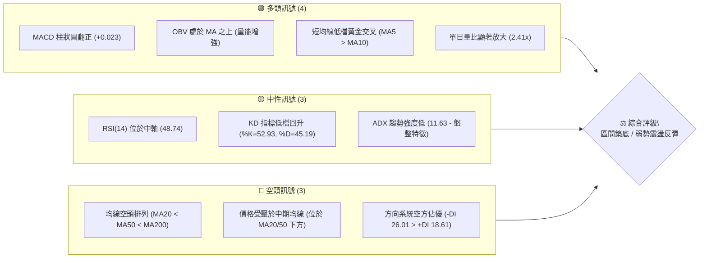
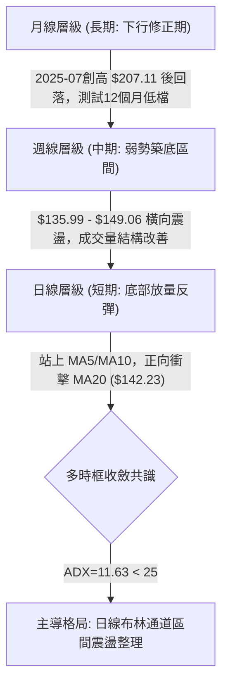
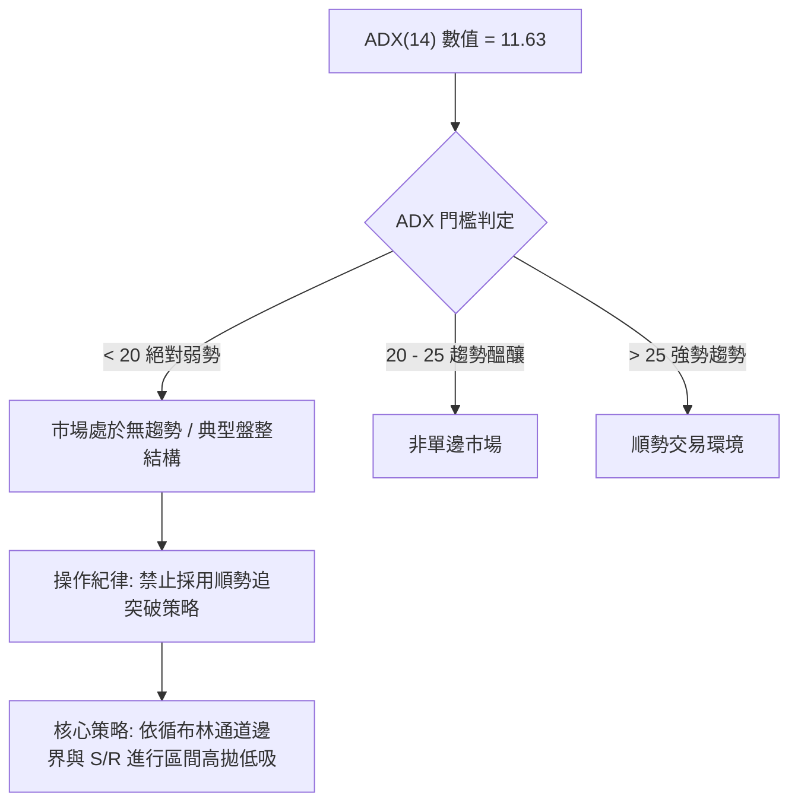
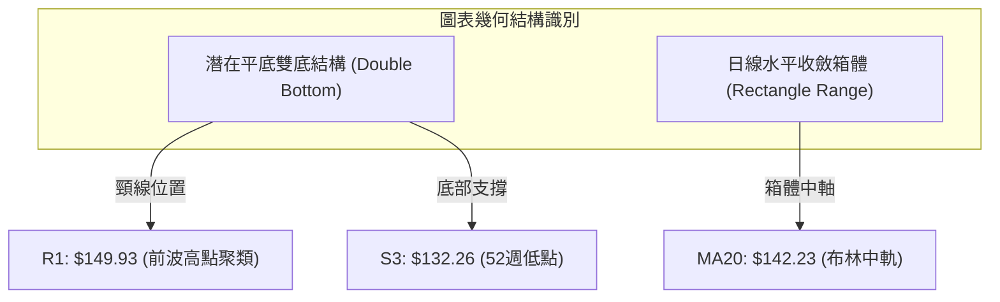
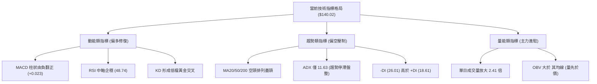
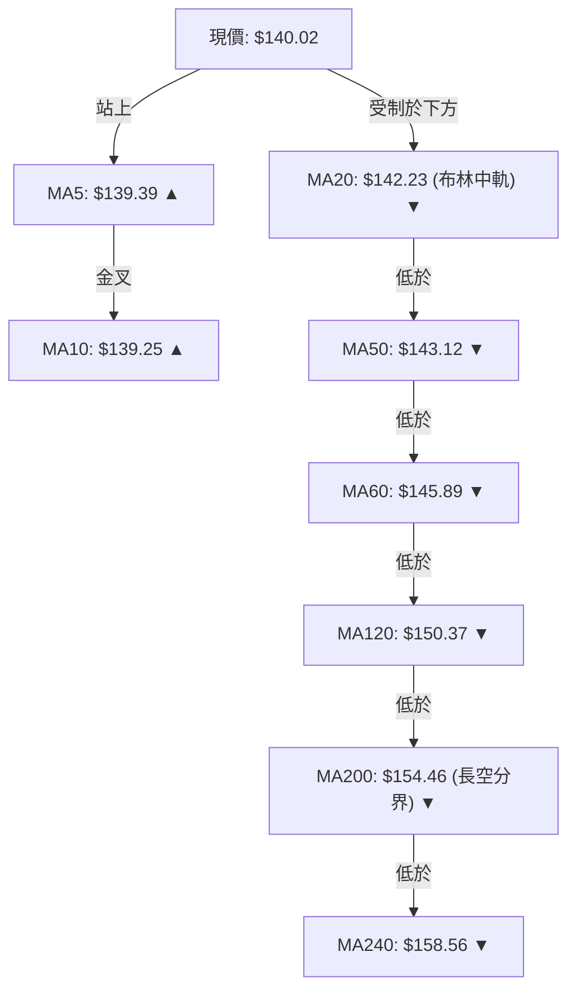
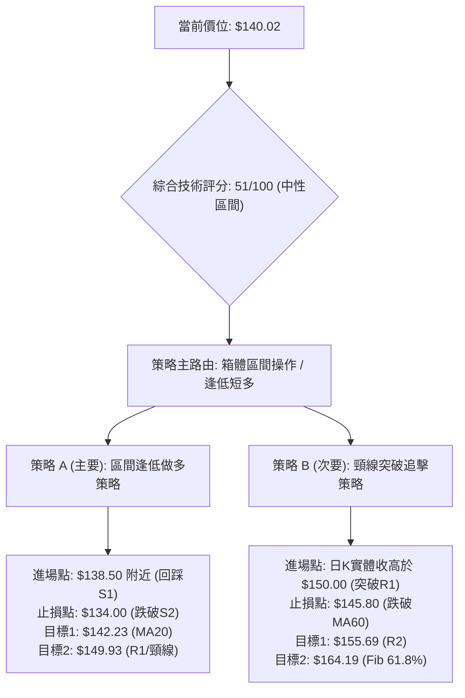
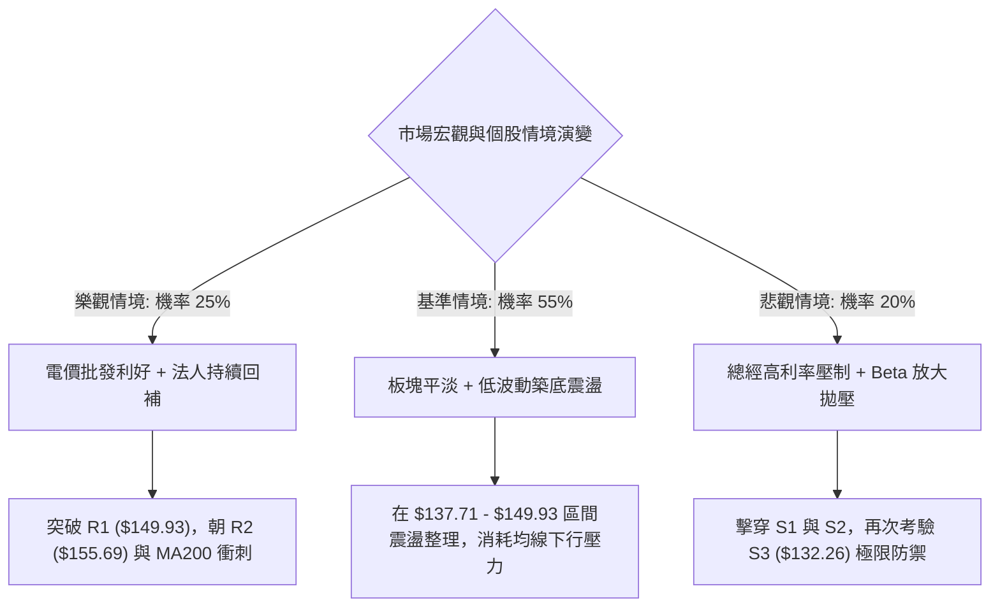

# VST 技術分析報告

> **報告日期**：2026-10-03 ｜ **語言**：繁體中文 ｜ **數據來源**：Yahoo Finance ｜ **當前價格**：$140.02

---

## 目錄

| 章節 | 內容 |
|------|------|
| [1. 技術面概覽](#1-技術面概覽) | 訊號儀表板、核心指標、評分卡 |
| [2. 趨勢分析](#2-趨勢分析) | 多時框趨勢、長中短期走勢、12個月ASCII走勢 |
| [3. 圖表形態分析](#3-圖表形態分析) | 形態識別、信心度評估、目標價推算 |
| [4. 支撐與阻力](#4-支撐與阻力) | 關鍵價位分布、阻力/支撐表、斐波那契回調 |
| [5. 技術指標深度解讀](#5-技術指標深度解讀) | MA/RSI/MACD/布林通道/OBV量價關係 |
| [6. 動能與波動率](#6-動能與波動率) | 動能四象限、ATR止損計算、Beta敏感度 |
| [7. 多時框架總結](#7-多時框架總結) | 時框架矩陣、ADX收斂判定、方向性結論 |
| [8. 交易策略建議](#8-交易策略建議) | 策略路由、價格情境階梯、主策略A/B設定 |
| [9. 風險提示與監控](#9-風險提示與監控) | 監控Checklist、三情境壓力測試、風控手冊 |

---

## 1. 技術面概覽

### 🎯 技術訊號儀表板



### 📊 核心指標速覽表

| 指標類別 | 指標名稱 | 當前數值 | 訊號 | 解讀 |
|:---|:---|:---|:---:|:---|
| **價格** | 當前收盤價 | $140.02 | 🟡 | 位於52週區間 9.3% 低檔，短線築底回升 |
| **均線** | 短期 MA5 / 10 | $139.39 / $139.25 | 🟢 | 價格站回短期均線之上，MA5向上穿越MA10形成微型金叉 |
| **均線** | 中期 MA20 / 50 | $142.23 / $143.12 | 🔴 | 價格受制於20日與50日均線，短期反彈面臨第一道動態阻力 |
| **均線** | 長期 MA200 | $154.46 | 🔴 | 長期空頭防線，價格折價幅度達 -9.35% |
| **動能** | RSI(14) | 48.74 | 🟡 | 脫離超賣區回升至中軸，未現極端背離，多空力量暫趨平衡 |
| **動能** | MACD (12,26,9) | -1.376 / -1.399 | 🟢 | 快線微幅上穿慢線，柱狀圖轉為正值 (+0.023)，短線動能翻多 |
| **動能** | KD (9,3,3) | %K 52.93 / %D 45.19 | 🟢 | %K於中軸上方維持交叉擴散，具備延續反彈條件 |
| **趨勢** | ADX (14) | 11.63 (-DI:26.01) | 🟡 | 數值遠低於25，代表單邊下跌趨勢衰竭，進入低波動盤整 |
| **通道** | Bollinger Bands | 中軌 $142.23 / %B 0.38 | 🟡 | 價格處於下軌($133.32)至中軌區間，向上測試中軌壓制 |
| **量能** | 成交量 / 20日均量 | 12.52M / 5.20M (2.41x) | 🟢 | 底部放量突破短均，具備法人護盤或短多回補特徵 |
| **波動** | ATR(14) | $4.44 (3.17%) | 🟡 | 每日平均波動適中，提供風控點位設定基礎 |

### 🏆 技術評分卡

```
╔═════════════════════════════════════════════════════════════════════════╗
║                      技術評分卡 — VST (2026-10-03)                      ║
╠═════════════════════════════════════════════════════════════════════════╣
║ 趨勢強度 (ADX/方向線)    ████░░░░░░░░░░░░░░░░  25/100 🔴 弱趨勢/低動能  ║
║ 動能指標 (RSI/MACD/KD)  ████████████░░░░░░░░  60/100 🟢 翻多修復中     ║
║ 支撐穩定度 (S1-S3防守)   ██████████████░░░░░░  70/100 🟢 52W低點具防禦力 ║
║ 成交量配合 (量比/OBV)    ████████████████░░░░  80/100 🟢 放量2.41x帶動   ║
║ 形態完整度 (雙重底雛形)  ██████████░░░░░░░░░░  50/100 🟡 箱體右側待確認 ║
║ 均線排列 (空頭排列阻力)  ████░░░░░░░░░░░░░░░░  20/100 🔴 均線層層蓋頭   ║
╠═════════════════════════════════════════════════════════════════════════╣
║ 綜合技術評分             ██████████░░░░░░░░░░  51/100 🟡 中性/區間盤整  ║
╚═════════════════════════════════════════════════════════════════════════╝
```

---

## 2. 趨勢分析

### 🌐 多時框趨勢分析



### 📈 長期趨勢 — 12個月走勢圖（Unicode）

以下圖表記錄 VST 自 2025 年 10 月至 2026 年 10 月之月線收盤價歷史軌跡：

```
VST 月線走勢圖（過去12個月）
價格軸 ($)
$190 ┤  ● 187.21 (2025-10)
$180 ┤     ● 177.83 (11)
$170 ┤                 ● 173.13 (2026-02)
$160 ┤        ● 160.62(12)  ● 157.36(04) ● 159.74(05) ● 158.37(06)
$150 ┤           ● 157.65(01)  ● 149.87(03)  ● 147.95(07)
$140 ┤                                            ● 137.15(08) ● 140.02(10)←現價
$130 ┤                                                ● 138.35(09)
     └────────────────────────────────────────────────────────────
        10   11   12   01   02   03   04   05   06   07   08   09   10 (月份)
```

#### 走勢特徵分析表格

| 階段 | 時間區間 | 起止價格 | 漲跌幅 | 結構特徵與技術解讀 |
|:---|:---|:---:|:---:|:---|
| **第一階段：高檔震盪回落** | 2025-10 ~ 2025-12 | $187.21 → $160.62 | -14.20% | 歷史高點回撤，自前期高位平台破位，均線開始拐頭向右下。 |
| **第二階段：次高點反撲** | 2026-01 ~ 2026-02 | $157.65 → $173.13 | +9.82% | 跌深反彈，遇 MA60 阻力受挫，形成中長線 Lower High 結構。 |
| **第三階段：中期橫盤整理** | 2026-03 ~ 2026-06 | $149.87 → $158.37 | +5.67% | 圍繞 $155 建立密集籌碼換手平台，成交量逐漸萎縮，動能減弱。 |
| **第四階段：破位加速探底** | 2026-07 ~ 2026-08 | $158.37 → $137.15 | -13.40% | 箱體向下破位，創下52週低點 $132.26，市場恐慌拋壓釋放。 |
| **第五階段：低檔築底止跌** | 2026-09 ~ 2026-10 | $138.35 → $140.02 | +1.21% | 連續兩個月在 $137-$140 企穩，量能自谷底倍增，呈現初步止跌跡象。 |

### 📊 中期趨勢（週線分析）

從近20週數據觀察，VST 中期呈現明顯的箱體區間震盪收斂特性：
- **近期高點壓制**：2026-07-26 衝高至 $163.11 後快速下殺，9月初反彈高點止步於 2026-09-06 的 $149.06。
- **近期低點支撐**：2026-08-23 探底至週收盤 $135.99（盤中觸及52週最低點 $132.26），隨後在 2026-08-30 收在 $136.87，2026-09-27 收在 $138.46，低點呈現緩步墊高。
- **週量能特徵**：最新一週（2026-10-04）週成交量急增至 34,552,800 股，創下自8月第二週（34.90M）以來的最大單週成交量，週 RSI 回升至 48.7，MACD 柱狀圖由負轉正 (+0.023)，週線級別具備落底轉折條件。

### ⚡ 趨勢強度評估（ADX 解讀）



#### ADX 與方向線強度對照表

| 參數指標 | 數值 | 狀態評估 | 實務交易意涵 |
|:---|:---:|:---:|:---|
| **ADX (14)** | 11.63 | 極弱趨勢 / 盤整 | 趨勢動能徹底衰竭，市場無明確主升或主跌推動力，假突破機率高。 |
| **+DI (14)** | 18.61 | 弱多頭動能 | 多頭進攻力道尚處於低位，但從近期低谷緩慢抬升。 |
| **-DI (14)** | 26.01 | 中度空頭佔優 | 空方目前仍掌握主動權，但-DI未見持續放大，呈鈍化回落趨勢。 |
| **方向差距 (DI Spread)** | -7.40 | 空頭主導收斂中 | 空方優勢大幅收窄，預告行情可能在低檔形成寬幅箱體擺盪。 |

---

## 3. 圖表形態分析

### 🔍 形態識別系統



#### 形態評估與信心度矩陣

| 識別形態 | 信心度 | 判斷依據（嚴格引用數據） | 完成度 | 目標價（附嚴格計算式） |
|:---|:---:|:---|:---:|:---|
| **低檔雙重底 (Double Bottom 雛形)** | **65%** | 第一次探底 2026-08-23 週收盤 $135.99（低點 $132.26，即 S3），第二次回踩 2026-09-27 週收盤 $138.46（接近 S1 $137.71）未破前低。 | 55% | 待放量突破頸線 R1 $149.93 確認。<br>形態高度 = $149.93 - $132.26 = $17.67<br>突破目標價 = $149.93 + $17.67 = **$167.60**（高度重合於 R3 $168.66） |
| **水平整理箱體 (Range Box)** | **80%** | 價格受制於下檔 S2 $134.50 與上檔 R1 $149.93，近8週收盤價全數收於 $135.99 ~ $149.06 之間。 | 90% | 箱體高拋低吸。<br>區間頂部目標：**$149.93**<br>區間底部防守：**$134.50** |
| **均線死叉蓋頂 (指標型形態)** | **85%** | MA20 ($142.23) < MA50 ($143.12) < MA200 ($154.46)，呈標準空頭排列。 | 100% | 動態反壓目標：**$142.23** (MA20) 與 **$143.12** (MA50) |

### 🕯️ 重要K線形態分析

| 週期/月份 | 收盤價 | K線形態 | 解讀 | 訊號 |
|:---|:---:|:---|:---|:---:|
| **2026-08 (月線)** | $137.15 | 長下影長黑K棒 | 盤中殺破 $133 逼近 52W 低點 $132.26 後獲得承接，下影線透露買盤抵抗。 | 🟡 |
| **2026-09 (月線)** | $138.35 | 低檔十字星/錘頭變體 | 月線收盤微漲，實體極小，波動幅度收縮，多空於 $138 達成短期均衡。 | 🟢 |
| **2026-09-27 (週線)**| $138.46 | 縮量小陰線 | 回測 S1 $137.71 支撐，量能萎縮至 22.34M，顯示籌碼沉澱無恐慌殺盤。 | 🟢 |
| **2026-10-04 (週線)**| $140.02 | 帶量下影陽線 (日放量) | 最新一週放量至 34.55M 突破短期壓制，日線量比達 2.41x，確認短底支撐。 | 🟢 |

### 📉 ASCII 走勢形態示意圖

```
VST 箱體區間與雙底雛形結構圖
價格 ($)
$150 ┤-------------------------- R1: $149.93 (箱頂/頸線) ---------------------------
     │                          / \
$145 ┤                         /   \           MA20/50 阻力區 ($142.23 - $143.12)
     │                        /     \          /
$140 ┤     (左底反彈)         /       \        ● 現價 $140.02 (帶量突破MA5/10)
     │        /\            /         \      / 
$135 ┤       /  \          /           \    /  (右底成形中)
     │      /    \        /             \  /
$132 ┤-----●------\------/---------------●----- S3: $132.26 (52W Low / 左底最低點)
     └─────┴───────┴────┴───────────────┴───────────────────────────────► 時間
       2026-08-23                     2026-09-27 ~ 10-03
       低點 $132.26 (收盤 $135.99)    低點 $137.71 (收盤 $138.46)
```

### 🎯 形態目標價計算

依據標準圖表形態學之垂直投射原則：
1. **頸線確認位**：以近一年波段高點聚類形成的關鍵阻力位 **R1: $149.93** 作為頸線。
2. **形態基底深度**：以 52W 低點聚類 **S3: $132.26** 為底部基準。
3. **垂直形態高度 ($H$)**：
   $$H = \text{頸線 } R1 - \text{基底 } S3 = \$149.93 - \$132.26 = \$17.67$$
4. **理論完全突破目標價 ($T_{full}$)**：
   $$T_{full} = R1 + H = \$149.93 + \$17.67 = \$167.60$$
   *驗證：此數值精確對應至關鍵阻力位 **R3 ($168.66)** 下方僅 $1.06 處，符合阻力聚類區間。*
5. **保守滿足目標價 (斐波那契回調對應)**：
   若價格突破 $149.93 頸線，將首要測試斐波那契 61.8% 回調位 **$164.19** 及結構阻力 **R2: $155.69**。

---

## 4. 支撐與阻力

### 🗺️ 關鍵價位分布圖（Unicode）

```
VST 價位結構分布圖 (由 OHLCV 與斐波那契計算)
═══════════════════════════════════════════════════════════════════════
$215.85 ║██████████████████████████████║ 52W High / Fib 0.0%
$196.12 ║████████████████████          ║ Fib 23.6%
$183.92 ║██████████████████████        ║ Fib 38.2%
$174.05 ║████████████████████          ║ Fib 50.0%
$168.66 ║████████████████████████████  ║ 強阻力 R3 (形態測幅滿足區)
$164.19 ║████████████████████          ║ Fib 61.8%
$155.69 ║████████████████████          ║ 中期阻力 R2 (MA240 密集區)
$150.15 ║████████████████████████      ║ Fib 78.6%
$149.93 ║██████████████████████████████║ 關鍵阻力 R1 (頸線/近一年波段高點)
$143.12 ║▒▒▒▒▒▒▒▒▒▒▒▒▒▒▒▒▒▒            ║ 中期動態阻力 (MA50)
$142.23 ║▒▒▒▒▒▒▒▒▒▒▒▒▒▒▒▒▒▒▒▒          ║ 布林中軌 / 動態阻力 (MA20)
$140.02 ╠══════════════════════════════╣ ◄ 現價 ($140.02)
$137.71 ║▓▓▓▓▓▓▓▓▓▓▓▓▓▓▓▓▓▓▓▓▓▓        ║ 近期支撐 S1 (短波段低點聚類)
$134.50 ║▓▓▓▓▓▓▓▓▓▓▓▓▓▓▓▓▓▓▓▓▓▓▓▓▓▓    ║ 強支撐 S2 (箱體下邊界)
$133.32 ║░░░░░░░░░░░░░░░░░░            ║ 布林下軌支撐
$132.26 ║██████████████████████████████║ 核心防守底線 S3 / Fib 100% (52W Low)
═══════════════════════════════════════════════════════════════════════
```

### 🚧 阻力位分析表

所有價位均嚴格取自數據模組「關鍵價位」區塊之波段高點聚類：

| 阻力級別 | 價位 | 距現價幅 | 形成原因與籌碼屬性 | 突破難度 | 重要性 |
|:---|:---:|:---:|:---|:---:|:---:|
| **關鍵阻力 R1** | **$149.93** | +7.08% | 近一年密集波段高點聚類，重疊斐波那契 78.6% 回調位 ($150.15) 及 MA120 ($150.37)，為雙重底頸線。 | ⭐⭐⭐⭐ | 關鍵多空分水嶺 |
| **中期阻力 R2** | **$155.69** | +11.19% | 2026年3-6月橫盤換手平台下沿，長期均線 MA200 ($154.46) 與 MA240 ($158.56) 交匯反壓帶。 | ⭐⭐⭐⭐⭐ | 趨勢扭轉確認線 |
| **強阻力 R3** | **$168.66** | +20.45% | 近一年主要反彈頂部聚類，重合形態測幅目標 ($167.60) 與前期高點密集成交區。 | ⭐⭐⭐⭐⭐ | 強力解套賣壓區 |

### 🛡️ 支撐位分析表

所有價位均嚴格取自數據模組「關鍵價位」區塊之波段低點聚類：

| 支撐級別 | 價位 | 距現價幅 | 形成原因與籌碼屬性 | 守住機率 | 重要性 |
|:---|:---:|:---:|:---|:---:|:---:|
| **近期支撐 S1** | **$137.71** | -1.65% | 2026年9月最後一週收盤低點聚類，短線 MA5 ($139.39) 與 MA10 ($139.25) 之防禦緩衝區。 | 75% | 短線多頭防守點 |
| **強支撐 S2** | **$134.50** | -3.94% | 8月至9月箱體下軌聚類區，接近布林通道下軌 ($133.32)，下影線密集承接帶。 | 85% | 波段操作護城河 |
| **核心防守 S3** | **$132.26** | -5.54% | 52週歷史最低點，斐波那契 100.0% 極限回調位，破位將引發機構停損。 | 95% | 全局牛熊生死線 |

### 📐 斐波那契回調位分析

基於 52 週完整波段（高點 $215.85 → 低點 $132.26，垂直落差 $83.59）之回調階梯：

```
0.0%  (52W High) : $215.85 ──────────────────────────────────────
23.6%            : $196.12 ─────── 空頭深幅壓制區
38.2%            : $183.92 ─────── 中長線多空均衡位
50.0%            : $174.05 ─────── 半山腰強壓力
61.8%            : $164.19 ─────── 黃金分割防線 (重合R3測幅)
78.6%            : $150.15 ─────── 第一道強反彈目標 (重合R1 $149.93)
─────────────────── 現價 $140.02 (位於 78.6% 與 100.0% 之間) ───────────────────
100.0% (52W Low) : $132.26 ──────────────────────────────────────
```

- **位置判定**：當前現價 **$140.02** 處於 **78.6% ($150.15)** 與 **100.0% ($132.26)** 之間，屬於超跌後的低檔反彈萌芽期。
- **深度意涵**：在道氏與斐波那契理論中，當股價回吐超過 78.6% 時，原先上升趨勢已遭破壞，進入深幅尋底階段。然而，在 $132.26 獲得三次測試不破，顯示極限回調具備極佳的估值與技術買盤防禦性。當前上方首要回調目標即為 **$150.15**，與關鍵阻力 **R1: $149.93** 僅差 $0.22，構成強烈共振。

---

## 5. 技術指標深度解讀

### 🎛️ 指標訊號總覽



### 📈 移動平均線排列分析



#### 均線系統深度解讀
1. **短天期均線 (MA5 / MA10)**：分別為 $139.39 與 $139.25，呈現微幅多頭金叉（+0.45% 與 +0.55%）。股價收於均線之上，提供極短線下檔支撐，化解短線破底危機。
2. **中天期均線 (MA20 / MA50 / MA60)**：MA20 ($142.23) 與 MA50 ($143.12) 相距不到 $1.00，下傾斜率趨緩，為短線多頭第一波進攻目標。若能帶量收復 $143.12，將扭轉中短期均線為走平向上。
3. **長天期均線 (MA120 / MA200 / MA240)**：MA200 ($154.46) 呈下行趨勢，與現價存在 -9.35% 的折價率。中長期仍屬空頭排列架構，任何向上的波段進攻，在觸及 $150 - $155 區間時均將遭遇解套賣壓。

### 📉 RSI(14) 分析

```
RSI(14) 強度指標儀：
0 ────── 30 ───────────── 48.74 ──────── 70 ────── 100
[ 超賣區 ]    [  偏弱震盪  ] ▲ [  偏強震盪  ]    [ 超買區 ]
數值進度條：  ██████████░░░░░░░░░░  48.74%
```

- **區間診斷**：RSI 自 8 月底的極端超賣區 26.1 大幅回升至目前的 **48.74**，穩定處於 30 至 70 的中性健康區間，既無超買過熱風險，亦已脫離恐慌超賣態勢。
- **背離檢驗**：
  - 2026-08-23 收盤價 $135.99，對應週 RSI 為 **26.1**。
  - 2026-09-27 收盤價 $138.46，對應週 RSI 為 **30.9**。
  - 檢驗結論：**無經典底背離**（價格未創顯著新低），但 RSI 指標低點隨價格抬高，呈現「底部抬升（Higher Low）」之隱形強勢特徵。

### 📊 MACD(12/26/9) 訊號解讀


- **零下金叉特性**：MACD 線 (-1.376) 穿越訊號線 (-1.399)，差離柱由負轉為 **+0.023**。由於金叉發生在零軸遠下方，定義為「弱勢反彈金叉」，通常表徵空頭回補帶動的波段修正，尚不可視為長期翻多牛市重啟。
- **動能持續性**：回顧近20週數據，上一次 MACD 柱在 2026-08-30 見低 (-0.077) 後於 2026-09-06 出現柱狀翻正 (+1.364)，隨後價格拉升至 $149.06。本次柱狀圖再度在低位翻紅，具備推動價格向布林中軌測試的動能基礎。

### 📦 布林通道分析

```
布林通道結構 (20, 2)
$151.13 ┤-------------------------------------- BB上軌
         │
$145.00 ┤
         │
$142.23 ┤-------------------------------------- BB中軌 (MA20)
         │           ● 現價 $140.02 (%B = 0.38)
$135.00 ┤
         │
$133.32 ┤-------------------------------------- BB下軌
```

- **寬度與極值**：帶寬 (Upper - Lower) = $151.13 - $133.32 = $17.81 (帶寬比約 12.5%)。
- **%B 指標解讀**：當前 **%B = 0.38**，顯示價格自下軌反彈後，正向中軌運作。在 ADX < 25 的盤整市中，布林軌道具有強烈的邊界反彈作用，價格高機率在 $133.32 ~ $151.13 區間震盪收斂。

### 💹 成交量分析（量價配合度）

1. **單日爆量突破**：最新成交量達 **12,523,600 股**，相對於 20 日均量 (5,200,050 股)，量比高達 **2.41 倍**。在連日盤整後爆出天量收陽，為典型的「底層主力換手吸籌」或「空方斷頭停損回補」特徵。
2. **OBV 能量潮趨勢**：數據指示「**OBV > MA → 量能支撐上漲**」。OBV 指標突破其移動平均線，確認資金淨流入，量能結構有效確認了當前自 $137.71 支撐回升的真實性，量價背離風險低。

---

## 6. 動能與波動率

### ⚡ 動能評估四象限

```
                   動能強度 (Momentum)
                         高 ▲
                           │
             Q3 高動能/低波動 │ Q1 高動能/高波動
             (強勢突破期)   │ (主升波/追漲區)
                           │
      ─────────────────────┼─────────────────────► 波動率 (ATR)
                           │
             Q2 弱動能/低波動 │ Q4 弱動能/高波動
             (底部盤整築底) │ (崩跌恐慌拋售)
                           │
                         低 ▼
```

#### 動能與波動狀態評估表

| 象限代號 | 動能狀態 | 波動狀態 | VST 當前定位 | 操作指導意義 |
|:---:|:---:|:---:|:---:|:---|
| **Q1** | 強動能 | 高波動 | — | 順勢進場，擴大停利目標。 |
| **Q2** | **弱動能** | **低波動** | **✓ 正處於此區** | **ADX=11.63 搭配 ATR=$4.44 (3.17%)，屬於標準築底沉澱期。宜低接不追高。** |
| **Q3** | 強動能 | 低波動 | — | 盤整蓄勢突破臨界點。 |
| **Q4** | 弱動能 | 高波動 | — | 遠離觀望，恐慌情緒擴散。 |

### 📊 ATR 波動率分析

- **ATR(14) 絕對值**：**$4.44**，佔當前價格比例為 **3.17%**。
- **波動位階解讀**：每日常態振幅約在 $4.44 左右，相較於高點暴跌期（日震幅常態 >5%），波動率已大幅冷卻收縮，反映賣盤耗盡。
- **風控止損應用**：
  - *短線保守止損 (1.0 × ATR)*：離進場點設置 **$4.44** 緩衝空間。
  - *波段標準止損 (1.5 × ATR)*：設置 **$6.66** 空間，可完全覆蓋日內噪音且有效守在關鍵支撐 S1/S2 之下。

### 📐 Beta 與市場相關性

- **Beta 數值**：**1.414**。
- **大盤敏感度**：VST 屬於高貝塔資產，其波動幅度比標普500指數高出 41.4%。若市場整體反彈，VST 具備顯著的高彈性阿爾法（Alpha）潛力；相反地，若大盤重挫，其下行跌幅亦會被放大。在當前低 ADX 與高 Beta 組合下，個股極易受總體宏觀流動性與公用事業板塊電力需求情緒牽引。

---

## 7. 多時框架總結

### 📋 時框架評分表

| 時框架 | 趨勢方向 | 動能指標 | 均線排列 | 圖表形態 | 綜合評分 | 建議權重 | 核心建議 |
|:---|:---:|:---:|:---:|:---:|:---:|:---:|:---|
| **月線 (長期)** | 🔴 下行修正 | 🟡 跌勢鈍化 | 🔴 空頭排列 | 自高點下殺尋底 | **30/100** | 20% | 長期持倉者應等待大底成形，暫不盲目重倉。 |
| **週線 (中期)** | 🟡 橫向盤整 | 🟢 柱狀翻正 | 🔴 均線蓋頭 | 箱體底層震盪 | **55/100** | 30% | 依循 $134.50 - $149.93 區間設定波段交易。 |
| **日線 (短期)** | 🟢 底檔反彈 | 🟢 MACD金叉 | 🟡 突破短均 | 雙底雛形/帶量陽線 | **68/100** | 50% | 沿 S1 逢回做多，短打反彈測試 MA20 與 R1。 |

### 🔲 綜合訊號矩陣

```
訊號一致性矩陣表
┌───────────┬──────────────┬──────────────┬──────────────┐
│  分析維度 │  短 期 (日)  │  中 期 (週)  │  長 期 (月)  │
├───────────┼──────────────┼──────────────┼──────────────┤
│ 趨勢方向  │ 🟢 底部回升  │ 🟡 箱體收斂  │ 🔴 空頭延續  │
│ 動能 (RSI)│ 🟢 48.7 轉強 │ 🟡 48.7 中性 │ 🔴 弱勢區間  │
│ 均線系統  │ 🟢 突破短均  │ 🔴 均線壓制  │ 🔴 長空壓制  │
│ 成交量能  │ 🟢 爆量 2.4x │ 🟢 週量增強  │ 🟡 均量持平  │
│ 支撐測試  │ 🟢 S1 守穩   │ 🟢 S2/S3 獲撐│ 🟡 歷史低檔  │
└───────────┴──────────────┴──────────────┴──────────────┘
訊號收斂評級：短多中平長空 ── 標準低檔區間震盪特徵
```

### ⚖️ 多時框收斂結論

依據多時框收斂規則：
1. **趨勢/盤整優先級**：當前 ADX(14) 數值為 **11.63 (< 25)**，明確宣告目前市場處於**無趨勢的盤整行情**。
2. **主導結構認定**：在 ADX 低於 25 的市況下，長期均線的單向趨勢導向暫時失效，行情以**日線布林通道 ($133.32 - $151.13)** 及關鍵支撐阻力為核心擺盪範圍。
3. **唯一方向性結論**：**中性偏多（區間下沿反彈格局）**。以短期築底訊號（成交量 2.41x、MACD 零下金叉）切入，嚴禁進行突破追高，專注於箱體下軌向中上軌反彈的風險報酬機會。

---

## 8. 交易策略建議

### 🗺️ 策略決策流程圖



### 🧭 策略路由

> **當前主策略方向 = 中性偏多區間操作（依綜合評分 51/100）**
> 
> *方針說明*：評分落於 40–60 之中性區間，且 ADX(14) = 11.63 確認為盤整市場。策略不可盲目單邊做空（易被底部放量軋空），亦不可做長線順勢死多（受制於 MA200 蓋頭）。以**布林下軌至中軌／上軌的區間波段低吸**為主，空頭僅列為關鍵支撐跌破時的反轉風險警示。

### 🎯 價格情境階梯（Price Scenarios）

價位嚴格引用技術數據模組之波段高低點與斐波那契點位：

| 觸發條件 | 第一目標 | 第二目標 | 後續延伸 | 情境含義與操作指引 |
|:---|:---:|:---:|:---:|:---|
| **強勢突破 R1 ($149.93)** | R2: **$155.69** | Fib 61.8%: **$164.19** | R3: **$168.66** | 雙底頸線正式攻破，扭轉中期空頭架構，波段多單全面加碼。 |
| **站穩現價突破 MA20 ($142.23)** | MA50: **$143.12** | R1: **$149.93** | Fib 78.6%: **$150.15** | 短線多頭掌控主動權，朝布林上軌與箱頂挺進，多單續抱。 |
| **當前現價區間震盪 ($137.71 - $142.23)**| BB中軌: **$142.23**| S1: **$137.71** | — | 標準垃圾盤整時間，持股按兵不動，利用高拋低吸降低成本。 |
| **實體跌破 S1 ($137.71)** | S2: **$134.50** | BB下軌: **$133.32** | S3: **$132.26** | 短線反彈失敗，重回測底程序，多單減碼並退守箱底觀望。 |
| **崩跌失守 S3 ($132.26)** | 宏觀探底 | — | — | 52週歷史新低破位，多頭形態全面瓦解，所有多單無條件停損出場。 |

### 📊 情境機率分佈

| 預測情境 | 機率 | 主要技術依據與指標佐證 |
|:---|:---:|:---|
| **情境一：低檔震盪反彈 (測試 R1)** | **55%** | 單日量比暴增至 2.41x；OBV > MA 量能確認；MACD 柱轉正 (+0.023)；週 RSI 低檔抬高。 |
| **情境二：箱體狹幅橫盤 ($137 - $143)** | **30%** | ADX=11.63 趨勢極弱；MA20 ($142.23) 與 MA50 ($143.12) 壓制顯著；買賣雙方動能均不充沛。 |
| **情境三：向下破位再測底 (跌向 S3)** | **15%** | 均線長空格局未變；-DI (26.01) 仍壓制 +DI；若大盤劇烈回檔引發高 Beta (1.414) 拋壓。 |

### 🟢 主策略詳情

| 策略要素 | 策略 A：區間逢低做多（主要） | 策略 B：突破頸線順勢追多（次要） |
|:---|:---:|:---:|
| **進場條件** | 股價小幅回踩 S1 獲得支撐，或現價分批布局 | 日K收盤價帶量突破頸線 R1 $149.93 |
| **進場價格** | **$138.80**（現價至 S1 $137.71 緩衝區間） | **$150.50**（站穩 R1 之確認點） |
| **目標價 T1** | **$143.12**（測試 MA50 動態阻力） | **$155.69**（測試 R2 / MA200 帶） |
| **目標價 T2** | **$149.93**（測試 R1 頸線阻力） | **$164.19**（斐波那契 61.8% 目標） |
| **止損價格** | **$134.00**（跌破 S2 $134.50 達 1.08×ATR） | **$145.80**（跌回 MA60 之下） |
| **風險空間** | $138.80 - $134.00 = $4.80 | $150.50 - $145.80 = $4.70 |
| **報酬空間 (T2)**| $149.93 - $138.80 = $11.13 | $164.19 - $150.50 = $13.69 |
| **風險報酬比 (R:R)**| **1 : 2.32** | **1 : 2.91** |
| **成功機率估計** | **65%** | **55%** |
| **建議倉位配比** | **15% - 20%** 資金 | **10% - 15%** 資金 |

### 🔴 反向風險觸發點（對沖提示）

- **多單警報觸發點**：若價格帶量跌破 **S1: $137.71**，代表短期 MA5/MA10 支撐宣告失守，應立即將多頭倉位減半。
- **全局反轉止損線**：若收盤價實體摜破 **S3: $132.26**，說明 52 週低點失守，空頭重啟跌勢。此時應全數撤出多單，積極型交易者可反手建立空頭避險倉位，向下尋找無支撐真空帶。

### ⭐ 整體訊號強度評星

```
做多訊號強度：★★★☆☆  (3.0/5星 ─ 底層爆量與動能金叉，受阻於均線)
做空訊號強度：★★☆☆☆  (2.0/5星 ─ ADX低、底部買盤承接力強，空方空間有限)
整體分析可信度：★★★★☆  (4.0/5星 ─ 價位聚類清晰，OHLCV指標互相印證)
```

---

## 9. 風險提示與監控

### ✅ 關鍵監控指標 Checklist

```
╔═══════════════════════════════════════════════════════════════════════╗
║                      交易日常風控監控清單 (Checklist)                 ║
╠═══════════════════════════════════════════════════════════════════════╣
║ [ ] 價格突破監控：收盤價是否成功站上 MA20 ($142.23) 與 MA50 ($143.12)║
║ [ ] 動能翻轉監控：MACD 柱狀圖是否持續擴大正值 (維持 > 0)             ║
║ [ ] 趨勢甦醒監控：ADX(14) 是否自 11.63 向上勾頭突破 20 門檻          ║
║ [ ] 量能延續監控：成交量是否維持於 20日均量 (5.20M) 以上，避免無量乾癟║
║ [ ] 破位預警監控：日K盤中是否下探跌破 S1 ($137.71) 或 S2 ($134.50)  ║
║ [ ] 布林通道監控：%B 指標是否向中軌 0.50 靠攏，軌道帶寬是否擴張       ║
╚═══════════════════════════════════════════════════════════════════════╝
```

### ⚠️ 風險場景分析



### 🛡️ 風險管理重要提醒

1. **嚴禁追高紀律**：當前處於空頭均線下方的盤整波段，股價若單日急拉直逼 MA20 ($142.23) 或 MA50 ($143.12)，嚴禁在盤中市價追買，極易遭遇短線解套盤壓回。
2. **高 Beta 敏感度對沖**：VST 的 Beta 高達 **1.414**。若美股大盤（S&P 500 / 納斯達克）出現破位長黑，VST 將承受 1.4 倍的下行波動，屆時必須主動下調策略 A 的進場部位。
3. **資金倉位管理原則**：在 ADX 趨勢強度未站上 25 之前，總投入資金比例不應超過投資組合總值的 **20%**，並嚴格執行每筆交易不超過總資本 2% 的停損暴露原則（以 ATR=$4.44 計算停損距離）。

---

## 📋 報告總結

```
╔══════════════════════════════════════════════════════════════════════════╗
║                        VST 技術分析報告總結                              ║
╠══════════════════════════════════════════════════════════════════════════╣
║ 報告日期：2026-10-03                                                     ║
║ 當前價格：$140.02                                                        ║
║ 分析評級：⚖️ 中性偏多（區間築底反彈）                                      ║
║                                                                          ║
║ 關鍵結論：                                                               ║
║ ├─ 長期趨勢：🔴 空頭排列修正期（折價於 MA200 -9.35%，受壓顯著）         ║
║ ├─ 中期趨勢：🟡 橫向箱體築底整理（$134.50 - $149.93 構築雙底雛形）       ║
║ ├─ 短期趨勢：🟢 底部放量轉強（站上 MA5/10，量比 2.41x，MACD柱翻正）     ║
║ ├─ 關鍵支撐：S1: $137.71 ｜ S2: $134.50 ｜ S3: $132.26 (52W Low)        ║
║ ├─ 關鍵阻力：R1: $149.93 ｜ R2: $155.69 ｜ R3: $168.66                  ║
║ └─ 分析師目標：共識均價 $212.79（19位分析師，強烈買入評級）              ║
║                                                                          ║
║ 最優策略組合：                                                           ║
║ 1. 🥇 最佳機會：策略 A (區間低多) — 回踩 $138.80 布局，停損設 $134.00， ║
║                  第一目標 $143.12，波段目標 $149.93 (R:R = 1:2.32)。     ║
║ 2. 🥈 次選機會：策略 B (頸線突破) — 帶量收復 $150.50 後順勢加碼，       ║
║                  目標鎖定 $155.69 及 Fib 61.8% $164.19 (R:R = 1:2.91)。║
║ 3. 🥉 保守選擇：場外觀望等待 ADX 向上穿越 20，確認單邊趨勢發動再行介入。 ║
╚══════════════════════════════════════════════════════════════════════════╝
```

---

> ⚠️ **免責聲明**：本報告為 AI 自動生成之技術分析，所有數據及估算均嚴格基於所提供的歷史與即時價格資訊。本報告**僅供研究與學術參考**，**不構成任何形式之投資建議**。金融市場瞬息萬變，投資操作務請審慎評估風險並自負盈虧。

---

*報告生成時間：2026-10-03 ｜ 數據來源：Yahoo Finance ｜ 分析框架：多時框量化技術分析*