# VST 技術分析報告

> **報告日期**：2026-10-04 ｜ **語言**：繁體中文 ｜ **數據來源**：Yahoo Finance ｜ **當前價格**：$140.02

---

## 目錄

| 章節 | 內容 |
|------|------|
| [1. 技術面概覽](#1-技術面概覽) | 訊號儀表板、核心指標、評分卡 |
| [2. 趨勢分析](#2-趨勢分析) | 多時框趨勢、長中短期走勢、ADX 解讀 |
| [3. 圖表形態分析](#3-圖表形態分析) | 形態識別、K線組合、形態目標價 |
| [4. 支撐與阻力](#4-支撐與阻力) | 關鍵價位、斐波那契回調 |
| [5. 技術指標深度解讀](#5-技術指標深度解讀) | MA/RSI/MACD/布林/成交量 |
| [6. 動能與波動率](#6-動能與波動率) | 動能評估、ATR、Beta |
| [7. 多時框架總結](#7-多時框架總結) | 時框架評分矩陣、收斂結論 |
| [8. 交易策略建議](#8-交易策略建議) | 策略路由、價格情境、多空風控 |
| [9. 風險提示與監控](#9-風險提示與監控) | 監控指標、風險場景、部位管理 |
| [📋 報告總結](#-報告總結) | 核心結論與策略總覽 |

---

## 1. 技術面概覽

### 🎯 技術訊號儀表板

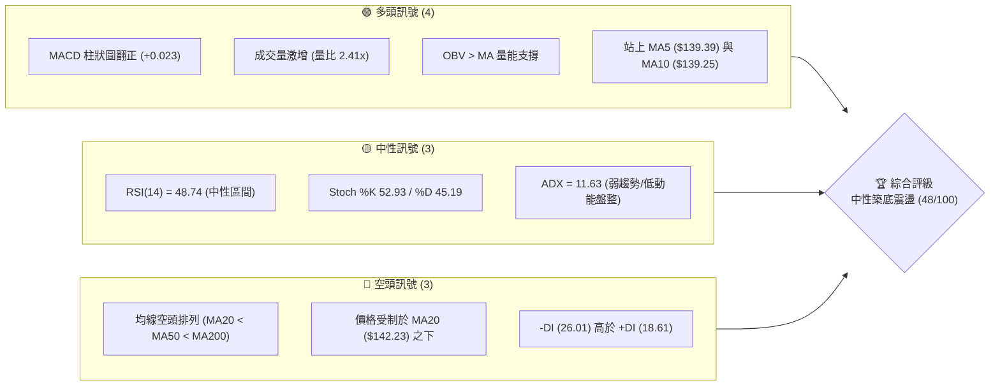

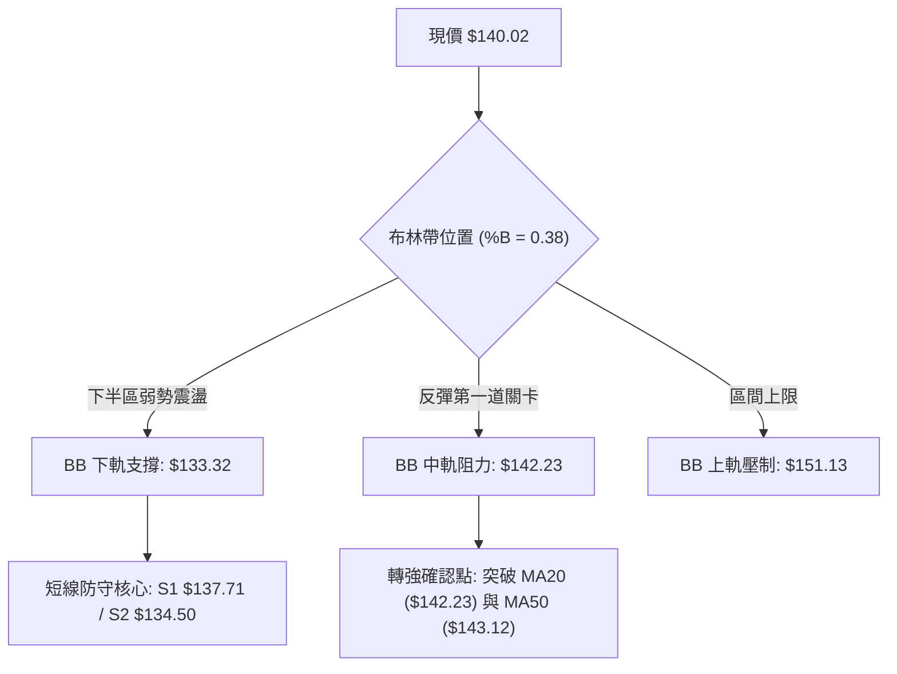

### 📊 核心指標速覽表

| 指標類別 | 指標名稱 | 當前數值 | 訊號 | 解讀 |
|----------|----------|----------|:----:|------|
| **價格** | 當前收盤價 | $140.02 | 🟡 | 位於52週區間 9.3% 分位，處於極低位階築底階段 |
| **均線** | 短期 MA5 / MA10 | $139.39 / $139.25 | 🟢 | 股價短線收復 5 日與 10 日線，短多初露微光 |
| **均線** | 短期 MA20 (布林中軌) | $142.23 | 🔴 | 價格位於 MA20 下方 (-1.55%)，短期下行壓力未解 |
| **均線** | 中期 MA50 | $143.12 | 🔴 | 均線呈空頭發散，中期反壓密集於 $142.23–$143.12 |
| **均線** | 長期 MA200 | $154.46 | 🔴 | 遠低於年線 (-9.35%)，長空格局依然確立 |
| **動能** | RSI (14) | 48.74 | 🟡 | 位於 30–70 中性區間，脫離超賣但動能平淡 |
| **動能** | MACD (12,26,9) | -1.376 / Sig -1.399 | 🟢 | 零軸下方微幅金叉，柱狀圖擴張至 +0.023 |
| **動能** | KD (Stochastic) | %K 52.93 / %D 45.19 | 🟡 | 交叉向上越過 50 中軸，呈現中性溫和反彈態勢 |
| **趨勢** | ADX (14) | 11.63 | 🟡 | 數值遠低於 25，表明無單邊強烈趨勢，屬箱型盤整 |
| **方向** | 方向指標 (+DI / -DI) | 18.61 / 26.01 | 🔴 | -DI 大於 +DI，空方力量占優，但缺乏趨勢加速度 |
| **通道** | 布林通道 (%B) | 0.38 (帶寬 $17.81) | 🟡 | 位於中軌與下軌間，下軌 $133.32 提供動態支撐 |
| **成交量**| 最新量 / 20日均量 | 12.52M / 5.20M | 🟢 | 量比達 2.41 倍，低檔出量且 OBV 高於均線，買盤進駐 |
| **波動** | ATR (14) | $4.44 (3.17%) | 🟡 | 每日平均波動適中，利於設定對稱性區間風控 |

### 🏆 技術評分卡

```
╔══════════════════════════════════════════════════════════════════╗
║               技術評分卡 — VST (2026-10-04)                       ║
╠══════════════════════════════════════════════════════════════════╣
║ 趨勢強度 (ADX=11.63 弱勢)    ██████░░░░░░░░░░░░░░  30/100 🔴 盤整無勢║
║ 動能指標 (MACD翻正/RSI中性)  ███████████░░░░░░░░░  55/100 🟡 低檔轉強║
║ 支撐穩定度 (S1/S2/52W低點)   ██████████████░░░░░░  70/100 🟢 底部紮實║
║ 成交量配合 (量比2.41x/OBV多) ████████████████░░░░  80/100 🟢 放量換手║
║ 形態完整度 (雙重底雛形)      ██████████░░░░░░░░░░  50/100 🟡 構築階段║
║ 均線排列 (空頭排列阻力大)    ████░░░░░░░░░░░░░░░░  20/100 🔴 空方壓制║
╠══════════════════════════════════════════════════════════════════╣
║ 綜合評分                     █████████░░░░░░░░░░░  48/100 ⚖️ 中性觀望║
║ 評級結論：區間築底盤整行情 (ADX<25)，以布林上下軌區間應對        ║
╚══════════════════════════════════════════════════════════════════╝
```

---

## 2. 趨勢分析

### 🌐 多時框趨勢分析

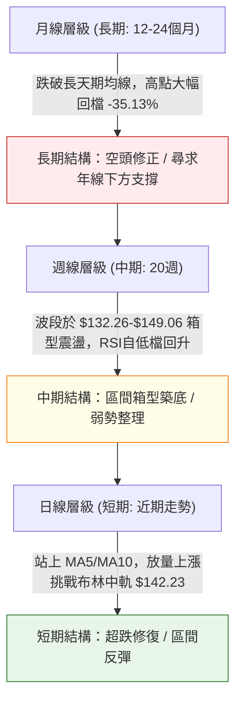

### 📈 長期趨勢 — 12個月走勢圖（Unicode）

VST 在 2025 年 7 月見到頂部歷史高點 $207.11（52週高點 $215.85）後，展開連續長達數季的均線修正。近期股價回落至 $130–$140 區間，逼近 52 週低點 $132.26。

```
VST 月線走勢圖（過去12個月：2025-11 至 2026-10）
價格 ($)
$210 ┤
$200 ┤
$190 ┤
$180 ┤ ● (2025-11: $177.83)
$170 ┤                               ● (2026-02: $173.13)
$160 ┤       ● (2025-12: $160.62)
$150 ┤             ● (2026-01: $157.65)    ● (2026-04: $157.36) ● (2026-05: $159.74)
$140 ┤                                           ● (2026-03: $149.87)   ● (2026-06: $158.37)
$130 ┤                                                                        ● (2026-07: $147.95)
$120 ┤                                                                              ● (2026-08: $137.15)
$110 ┤                                                                                    ● (2026-09: $138.35) ──● 現價: $140.02
     └─┬─────┬─────┬─────┬─────┬─────┬─────┬─────┬─────┬─────┬─────┬─────┬─────
      11月  12月  01月  02月  03月  04月  05月  06月  07月  08月  09月  10月 (2026)
```

#### 長期走勢特徵分析表格

| 階段區間 | 時間跨度 | 起訖收盤價 | 漲跌幅 | 走勢特徵解讀 |
|----------|----------|------------|--------|--------------|
| **高檔回吐期** | 2025-11 ~ 2026-01 | $177.83 → $157.65 | -11.35% | 自高位回落，均線高檔鈍化後死叉，多頭動能迅速衰竭 |
| **次高反彈波** | 2026-01 ~ 2026-02 | $157.65 → $173.13 | +9.82%  | 形成中期次高點，未能重返 $180 之上，確立下降常態結構 |
| **高位箱型整理**| 2026-02 ~ 2026-06 | $173.13 → $158.37 | -8.53%  | 於 $150–$163 區間長達4個月的籌碼換手與盤整 |
| **主跌破位破底**| 2026-06 ~ 2026-08 | $158.37 → $137.15 | -13.40% | 摜破長天期支撐，下探 52 週最低點 $132.26，恐慌拋補 |
| **低檔盤底構築**| 2026-08 ~ 2026-10 | $137.15 → $140.02 | +2.09%  | 股價於 $135–$140 展現韌性，月成交量回穩，跌勢明顯趨緩 |

### 📊 中期趨勢（週線分析）

從近 20 週數據觀察，股價高點逐步自 6 月底的 $163.22 降至 9 月初的 $149.06，隨後在 2026-08-23 探至週收盤低點 $135.99（極限低點 $132.26）。

```
近期週線壓力與支撐階梯分布：
$163.22 ────────────────────────────── (6月波段雙頂高點)
                 ▼ 下行趨勢壓制線
$155.69 ────────────────────────────── (阻力位 R2)
$149.93 ────────────────────────────── (阻力位 R1 / 9月反彈頂點 $149.06 聚類)
$142.23 ┄ ┄ ┄ ┄ ┄ ┄ ┄ ┄ ┄ ┄ ┄ ┄ ┄ ┄ ┄ (MA20 / 布林中軌反壓)
$140.02 ══════════════════════════════ [當前價格]
$137.71 ────────────────────────────── (支撐位 S1)
$134.50 ────────────────────────────── (支撐位 S2)
$132.26 ══════════════════════════════ (支撐位 S3 / 52週絕對低點)
```

週線指標呈現轉機訊號：2026-08-23 週收盤 $135.99 時，週線 RSI 達到極端低點 26.1；隨後在 9 月下旬回落至 $138.46 時，RSI 守在 30.9，未再創新低，且本週（2026-10-04）週成交量放大至 34,552,800 股，週 MACD 柱狀圖由 -0.431 迅速收斂至 +0.023。量能激增代表長線價值買盤正於 52 週底部建立防線。

### ⚡ 趨勢強度評估（ADX 解讀）

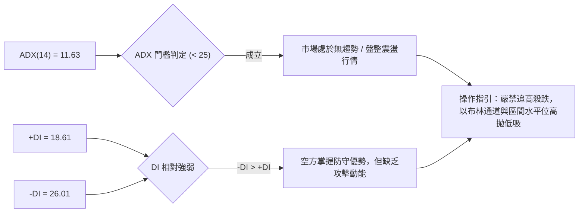

#### ADX 趨勢強度對照表

| 指標變數 | 當前讀數 | 門檻區間 | 趨勢狀態判定 | 交易決策指引 |
|----------|:--------:|:--------:|:------------:|--------------|
| **ADX (14)** | **11.63** | < 20 (極弱) | **完全無趨勢狀態** | 趨勢追隨策略失效，均線切入點易頻繁受侵蝕，切換為擺盪交易 |
| **+DI (14)** | **18.61** | < 25 (偏弱) | 多頭動能匱乏 | 多方尚無法發動連貫攻擊波，上行易遇賣壓回吐 |
| **-DI (14)** | **26.01** | > 25 (主導) | 空頭相對占優 | 空方雖主導但隨 ADX 下降而顯疲態，跌勢動能明顯遞減 |
| **趨勢形態** | **盤整整理** | N/A | **箱型無序震盪** | 以區間極限值（布林上軌/下軌）作為高拋低吸核心邊界 |

---

## 3. 圖表形態分析

### 🔍 形態識別系統

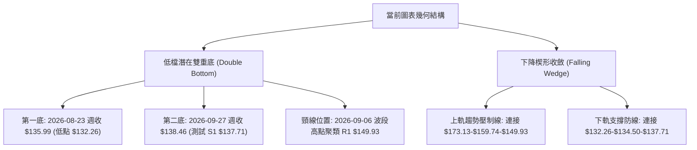

#### 圖表形態信心度評估表

| 識別形態 | 信心度 (%) | 判斷依據（引用數據） | 完成度 (%) | 頸線 / 邊界 | 目標價（附嚴格計算式） |
|----------|:----------:|----------------------|:----------:|:-----------:|------------------------|
| **潛在雙重底** | **65%** | 兩次下探低點：低點一於 52W 低點 $132.26 (週收 $135.99)，低點二回測 S1 $137.71 (週收 $138.46)，底部墊高且成交量放大 | **55%** | 頸線位 R1: **$149.93** | 依形態高度計算：<br/>形態高度 = $149.93 - $132.26 = $17.67<br/>突破目標 = $149.93 + $17.67 = **$167.60** (逼近 R3 $168.66) |
| **下降楔形收斂**| **58%** | 上軌由 R3 ($168.66) 延伸至 R1 ($149.93)，下軌由 S3 ($132.26) 延伸至 S1 ($137.71)，振幅逐步收窄 | **70%** | 突破點: **$143.12** (MA50) | 依楔形起點計算：<br/>完全回補目標 = 楔形起點波段高點 **$168.66** (對齊 R3) |
| **頭肩底形態** | **25%** | 目前僅見左肩 ($135.99) 與頭部 ($132.26)，右肩未完全獨立脫離盤整帶 | **20%** | 訊號不足 | **數據不足以確認幾何形態，僅作指標型解讀** |

### 🕯️ 重要K線形態分析

| 週期/月份 | 基準收盤價 | K線形態特徵 | 技術面解讀 | 訊號方向 |
|-----------|:----------:|-------------|------------|:--------:|
| **2026-08** | $137.15 | 長下影長黑K棒 | 探底至 $132.26 後獲得強大承接買盤，空頭力竭初步訊號 | 🟢 止跌 |
| **2026-09** | $138.35 | 低檔十字星 (Doji) | 買賣雙方力道在 $138 取得平衡，下行速度完全受阻，典型轉折K線 | 🟡 變盤 |
| **2026-10-04 (週)** | $140.02 | 帶量突破紅K | 週線以 $140.02 實體紅K作收，收復 MA5 與 MA10，成交量突破 34.5M 股 | 🟢 多方發起 |

### 📉 ASCII 走勢形態示意圖

```
潛在雙重底 (W-Bottom) 結構演繹示意圖：

$150.00 ┤              頸線位: R1 $149.93 (中期強阻力)
         │                     ▲
$145.00 ┤                     │  (反彈第一目標)
         │           / ╲       │
$142.23 ┤- - - - - / - - ╲ - - - - - MA20 / 布林中軌壓制
$140.02 ┤         /       ╲   ● 現價: $140.02
         │        /         ╲ /
$137.71 ┤       /           ● 第二底 (2026-09-27 週收 $138.46)
$135.00 ┤      / 
$132.26 ┤     ● 第一底 (2026-08-23 週收 $135.99 / 最低點 $132.26)
         └─────────────────────────────────────────────────────► 時間
```

### 🎯 形態目標價計算

若當前潛在雙重底獲得確認並放量突破頸線，推導邏輯如下：

1. **基準低點**：取 52 週低點聚類基底 $132.26。
2. **頸線阻力**：近一年波段高點聚類 R1 = $149.93。
3. **垂直形態高度**：
   $$\text{形態高度 } H = \text{頸線 } R1 (\$149.93) - \text{基底 } S3 (\$132.26) = \$17.67$$
4. **理論量測目標價 (Target Price)**：
   $$\text{目標價 } T = \text{頸線 } R1 (\$149.93) + H (\$17.67) = \$167.60$$
   *注：此理論推算值 $167.60 與近一年波段高點聚類阻力位 **R3 ($168.66)** 吻合度高達 99.37%，具備高度幾何對稱性。*

---

## 4. 支撐與阻力

### 🗺️ 關鍵價位分布圖（Unicode）

```
VST 價位結構分布圖（引用 OHLCV 計算聚類價位與斐波那契點位）
═════════════════════════════════════════════════════════════════
$215.85 ║██████████████████████████████║ 52W 最高點 (Fib 0.0%)
$196.12 ║████████████████████          ║ Fib 23.6% 回調位
$183.92 ║████████████████████████      ║ Fib 38.2% 回調位
$174.05 ║████████████████              ║ Fib 50.0% 關鍵平衡點
$168.66 ║██████████████████████████████║ 強阻力 R3 (形態量測目標)
$164.19 ║████████████████              ║ Fib 61.8% 黃金分割點
$155.69 ║████████████████████          ║ 阻力位 R2 (MA200 $154.46 重疊帶)
$151.13 ║████████████████████████      ║ 布林帶上軌
$150.15 ║██████████████████████████████║ Fib 78.6% 回調位
$149.93 ║██████████████████████████████║ 關鍵阻力 R1 (雙底頸線 / 反彈初級目標)
$142.23 ║▓▓▓▓▓▓▓▓▓▓▓▓▓▓▓▓▓▓▓▓          ║ 布林中軌 / MA20 短線分水嶺
$140.02 ╠══════════════════════════════╣ ◄ 現價 ($140.02)
$137.71 ║▓▓▓▓▓▓▓▓▓▓▓▓▓▓▓▓              ║ 近期支撐 S1 (9月盤整平台)
$134.50 ║████████████████████          ║ 強支撐 S2 (波段次低點聚類)
$133.32 ║████████████████████████      ║ 布林帶下軌
$132.26 ║██████████████████████████████║ 終極強支撐 S3 (52W 最低點 / Fib 100%)
═════════════════════════════════════════════════════════════════
```

### 🚧 阻力位分析表

所有價位嚴格引用自數據模組已驗證之高點聚類數值：

| 阻力級別 | 精確價位 | 距離現價 (%) | 形成原因與技術共振 | 突破難度 | 重要性 |
|:--------:|:--------:|:------------:|--------------------|:--------:|:------:|
| **R1** | **$149.93** | +7.08% | 近一年波段高點聚類、斐波那契 78.6% 回調位 ($150.15) 共振帶、潛在雙底頸線 | 🟡 中等 | ★★★★☆ |
| **R2** | **$155.69** | +11.19% | 2026年5-6月多重週線收盤密集區、年線 MA200 ($154.46) 壓制帶 | 🔴 較高 | ★★★★☆ |
| **R3** | **$168.66** | +20.45% | 2026-02 中期波段反彈次高點頂部聚類、形態等距量測目標 ($167.60) | 🔴 極高 | ★★★★★ |

### 🛡️ 支撐位分析表

所有價位嚴格引用自數據模組已驗證之低點聚類數值：

| 支撐級別 | 精確價位 | 距離現價 (%) | 形成原因與技術共振 | 守住機率 | 重要性 |
|:--------:|:--------:|:------------:|--------------------|:--------:|:------:|
| **S1** | **$137.71** | -1.65% | 2026年9月週線整理平台低點聚類，短線多頭第一道防線 | 75% | ★★★☆☆ |
| **S2** | **$134.50** | -3.94% | 8月恐慌殺跌次低點聚類、布林通道下軌 ($133.32) 動態包覆 | 82% | ★★★★☆ |
| **S3** | **$132.26** | -5.54% | 52週絕對最低點 (52W Low)、斐波那契 100.0% 終極支撐基石 | 90% | ★★★★★ |

### 📐 斐波那契回調位分析

依據 52 週極端區間 ($132.26 → $215.85，垂直跨度 $83.59) 運算之回調位分布如下：

```mermaid
graph LR
    H["$215.85 (0.0% 高點)"] --- F23["$196.12 (23.6%)"]
    F23 --- F38["$183.92 (38.2%)"]
    F38 --- F50["$174.05 (50.0%)"]
    F50 --- F61["$164.19 (61.8%)"]
    F61 --- F78["$150.15 (78.6%)"]
    F78 --- NOW["現價: $140.02"]
    NOW --- L["$132.26 (100.0% 低點)"]
    
    style NOW fill:#fff3e0,stroke:#e65100,stroke-width:2px
    style F78 fill:#e1f5fe,stroke:#0277bd,stroke-width:1px
    style L fill:#ffebee,stroke:#c62828,stroke-width:1px
```

* **現價落點解讀**：現價 $140.02 緊密運行於 **78.6% 回調位 ($150.15)** 與 **100.0% 底部 ($132.26)** 之間，屬於深度回調超跌區。
* **深層含義**：在道氏理論與斐波那契幾何學中，跌破 61.8% ($164.19) 後，多頭趨勢已被破壞，回調至 78.6% 至 100% 區間屬於最後防守陣地。現價距離 100.0% 低點僅 5.54%，下檔空間受限，提供了極佳的不對稱風險報酬比（Risk-Reward Asymmetry）。
* **回升第一阻力**：任何像樣的反彈波，首要目標必測試 78.6% 的 $150.15，該位置與阻力位 R1 ($149.93) 形成強烈共振。

---

## 5. 技術指標深度解讀

### 🎛️ 指標訊號總覽

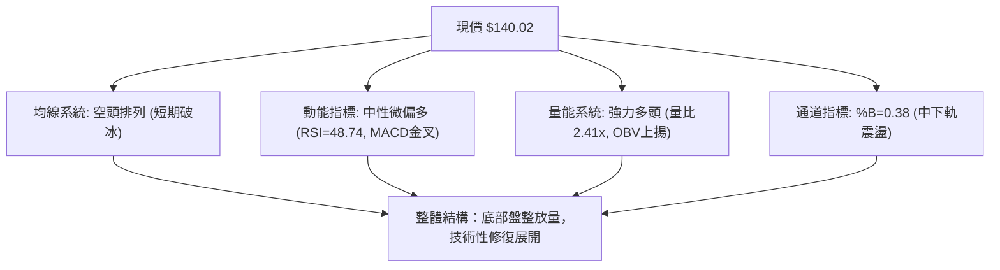

### 📈 移動平均線排列分析

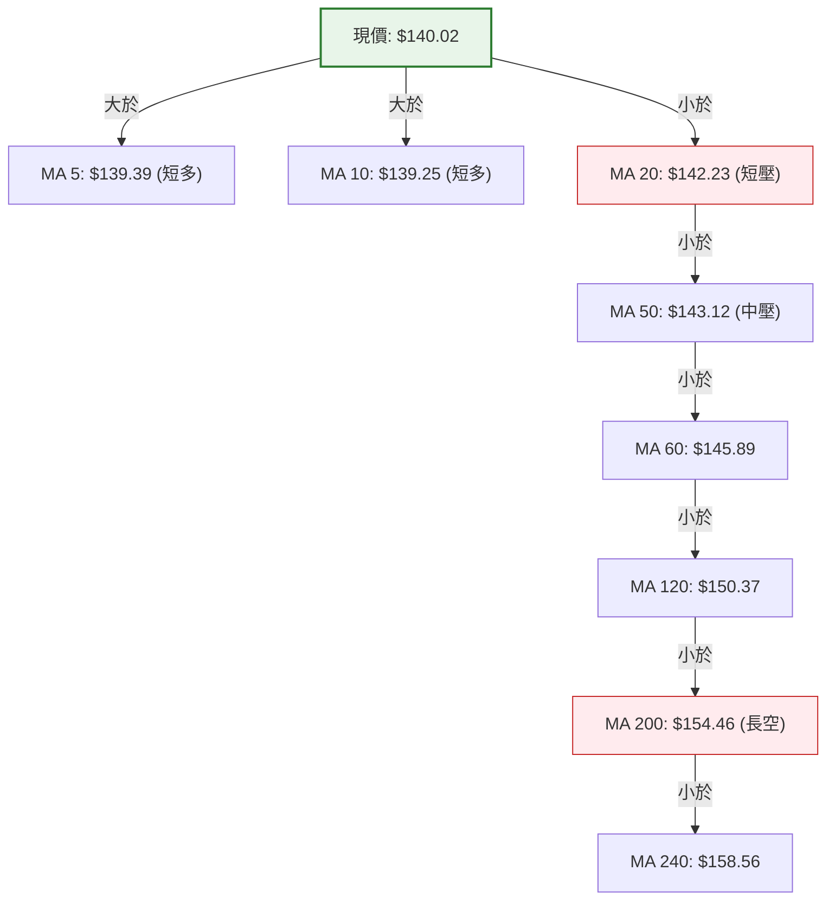

* **均線階梯狀態**：目前維持標準的 **空頭排列 (MA20 < MA50 < MA200)**。
  * MA20: $142.23 (-1.55%)
  * MA50: $143.12 (-2.17%)
  * MA200: $154.46 (-9.35%)
* **短期拐點特徵**：超短期均線 MA5 ($139.39) 於近兩日由下往上金叉 MA10 ($139.25)，現價 $140.02 成功越過這兩條均線。短線底部支撐已經形成，但正前方 $142.23–$143.12 為 MA20 與 MA50 重疊密集反壓帶，唯有放量實體突破 $143.12，方能宣告均線空頭排列瓦解。

### 📉 RSI(14) 分析

* **數值**：**48.74**（中性）
* **進度條**：`[██████████░░░░░░░░░░] 48.74%`
* **超買超賣判定**：數值處於 30 至 70 之健康平衡常態區間，已徹底脫離 8 月底的極度超賣區（當時週線 RSI 跌至 26.1）。
* **背離檢查與結論**：
  * **價格層面**：8 月 23 日當週收盤價為 $135.99，9 月 27 日當週收盤為 $138.46，低點未再創新低。
  * **指標層面**：8 月 23 日 RSI 為 26.1，9 月 27 日 RSI 為 30.9，10 月 04 日回升至 48.74。
  * **結論**：指標與價格同步抬升，**不存在標準底背離，亦無頂背離**；屬於低檔動能修復的良性常態波動。

### 📊 MACD(12,26,9) 訊號解讀

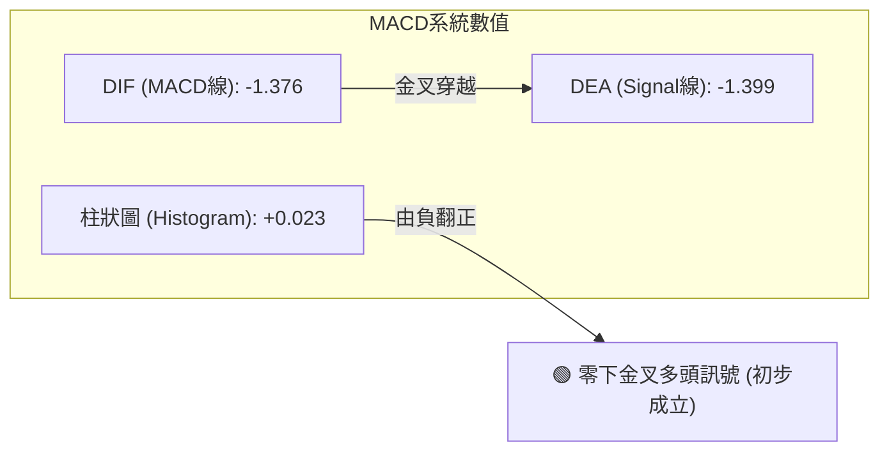

* **MACD 線**：-1.376
* **訊號線 (Signal)**：-1.399
* **柱狀圖 (Histogram)**：+0.023
* **深層分析**：MACD 線於零軸下方向上穿越訊號線，柱狀圖自負值翻正至 +0.023。此為典型「弱勢區低位黃金交叉」，代表下行趨勢的加速度已經終止，空方動能出盡，短線進入多方反撲階段。

### 📦 布林通道分析

```
布林通道結構示意圖 (Bandwidth = $17.81)：
$151.13 ┬────────────────────────────────────────── 上軌 Upper Band (+7.93%)
        │
$145.00 ┤
        │
$142.23 ┼- - - - - - - - - - - - - - - - - - - - - 中軌 Middle Band (MA20: $142.23)
$140.02 ┼─────────────────● (現價落點 %B = 0.38)
        │
$135.00 ┤
        │
$133.32 ┴────────────────────────────────────────── 下軌 Lower Band (-4.78%)
```

* **軌道數值**：上軌 **$151.13** ｜ 中軌 **$142.23** ｜ 下軌 **$133.32**
* **%B 指標**：**0.38**（處於下軌 0 到中軌 0.5 之間）
* **形態含義**：通道並未處於單邊擴軌暴跌狀態，反而呈現帶寬收縮後的橫向包覆。現價 $140.02 自下軌上方獲得支撐向中軌靠攏，顯示下軌 $133.32（與 S2 $134.50 共振）具備實質保護力。

### 💹 成交量分析（量價配合度）

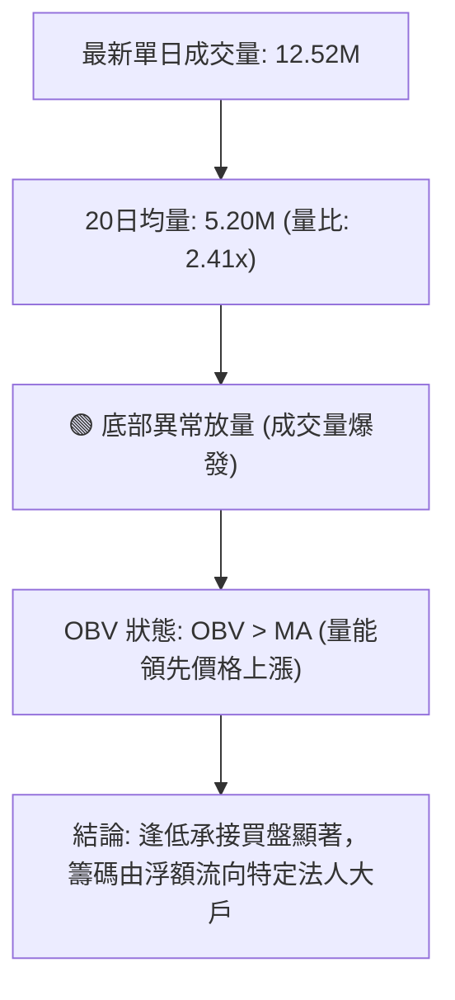

* **量比表現**：最新成交量衝上 12,523,600 股，相較於 20 日均量 5,200,050 股，量比放大至 **2.41 倍**；週成交量亦放大至 34.55M 股，創近兩個月單週最大量。
* **OBV 走勢**：數據確認 `OBV > MA`，量能走在價格之前。在 52 週低位區間出現「價平量增」乃至「價漲量增」，高度暗示機構買盤進駐承接，量價結構完全支持當前價格進行底部反彈。

---

## 6. 動能與波動率

### ⚡ 動能評估四象限

| 象限 | 動能狀態 | 波動率狀態 | 當前標的狀態對照 | 戰略評估與配置建議 |
|:----:|:--------:|:----------:|:----------------:|--------------------|
| **Q1** | 強動能 (>50) | 低波動 (<3%) | — | 最佳波段主升段；順勢重倉追隨 |
| **Q2** | **弱動能 (48.7)**| **適中/偏低 (3.17%)**| **✓ 當前 VST 坐標落點** | **低位築底觀望期；適合以網格或布林區間低吸** |
| **Q3** | 強動能 (>50) | 高波動 (>5%) | — | 突破噴發期；高風險高報酬操作 |
| **Q4** | 弱動能 (<40) | 高波動 (>5%) | — | 恐慌主跌浪；全面規避進場 |

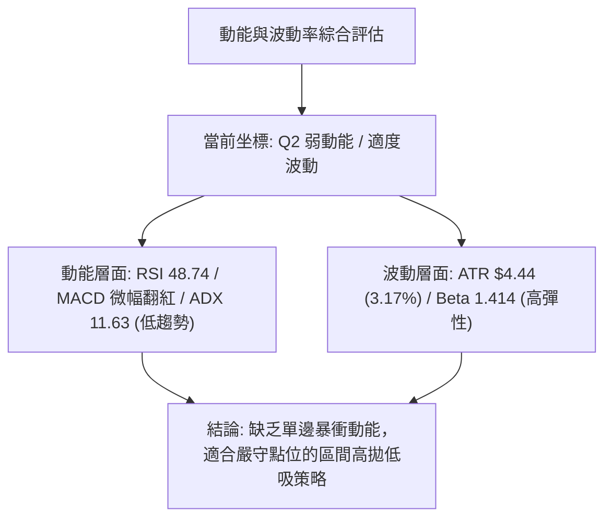

### 📊 ATR 波動率分析

* **當前數值**：**$4.44**（占現價 **3.17%**）
* **波動特徵**：每日平均震幅超過 4 美元，代表日間具備充足的擺動空間。
* **風控與止損設定指引**：
  * **超短線交易止損距離**：$1.0 \times \text{ATR} = \$4.44$
  * **波段擺盪防守距離**：$1.5 \times \text{ATR} = \$6.66$
  * **現價推算防守界限**：$\$140.02 - \$4.44 = \$135.58$（精準貼近支撐位 S2 的 $134.50 緩衝區）

### 📐 Beta 與市場相關性

* **Beta 係數**：**1.414**
* **特徵解讀**：VST 雖屬公用事業類別，但身為獨立發電商（IPP）且涉足 AI 數據中心電力需求題材，其 Beta 達 1.414，波動幅度顯著高於標普 500 指數（高出約 41%）。
* **操作意涵**：在市場整體環境轉強時，VST 具備超越大盤的彈升速度；反之，若大盤重挫，其修正幅度亦將放大。因此操作上不宜過度追高，利用回踩關鍵支撐建立防禦部位更具勝率。

---

## 7. 多時框架總結

### 📋 時框架評分表

| 時框架 | 趨勢方向 | 動能表現 | 均線排列 | 形態結構 | 綜合評分 | 操作建議 |
|--------|:--------:|:--------:|:--------:|:--------:|:--------:|----------|
| **月線 (長期)** | 🔴 偏空 | 🟡 中性 (跌深放緩)| 🔴 空頭壓制 | 長期雙頂頸線修正 | 35/100 | 長期部位耐心等候築底，不盲目猜底 |
| **週線 (中期)** | 🟡 盤整 | 🟢 低檔金叉向上  | 🔴 空頭收斂 | 潛在雙底打底中   | 52/100 | 關注 $132.26 終極防線，於區間下緣分批佈局 |
| **日線 (短期)** | 🟢 偏多 | 🟢 放量轉強反彈  | 🟡 站上短均MA5/10| 突破短期下降通道 | 58/100 | 依布林通道進行波段操作，挑戰中軌與 R1 |

### 🔲 綜合訊號矩陣

```
時框訊號一致性交叉檢定矩陣：
┌───────────┬──────────────┬──────────────┬──────────────┬──────────────┐
│  維度     │   短期 (日線) │   中期 (週線) │   長期 (月線) │  最終一致性  │
├───────────┼──────────────┼──────────────┼──────────────┼──────────────┤
│ 趨勢方向  │    偏多 🟢   │    中性 🟡   │    偏空 🔴   │  衝突收斂中  │
│ 動能強弱  │    走強 🟢   │    回升 🟢   │    走平 🟡   │  偏多修復    │
│ 量能配合  │    爆發 🟢   │    放大 🟢   │    普通 🟡   │  多方確認    │
│ 支撐強度  │    強韌 🟢   │    穩固 🟢   │    考驗 🟡   │  底部具防禦  │
└───────────┴──────────────┴──────────────┴──────────────┴──────────────┘
```

### ⚖️ 多時框收斂結論

依據多時框收斂優先級規則判定：
1. **行情模式判別**：當前 **ADX(14) 數值僅為 11.63**，遠低於趨勢門檻值 25，明確判定當前市場處於 **「盤整震盪行情」**，而非單邊趨勢行情。
2. **主導維度收斂**：在盤整行情中，中長期的均線方向指示性鈍化，日線與週線的 **布林通道上下軌 ($133.32–$151.13)** 以及 **波段水平位 ($132.26–$149.93)** 取代均線成為最核心的交易邊界。
3. **方向性最終結論**：**⚖️ 中性觀望微偏多（區間震盪築底）**。日線雖見放量收復短期均線，但受限於週線 MA20/MA50 在 $142.23–$143.12 壓頂，短線將在 **$134.50–$149.93** 進行箱型洗盤整理。

---

## 8. 交易策略建議

### 🗺️ 策略決策流程圖

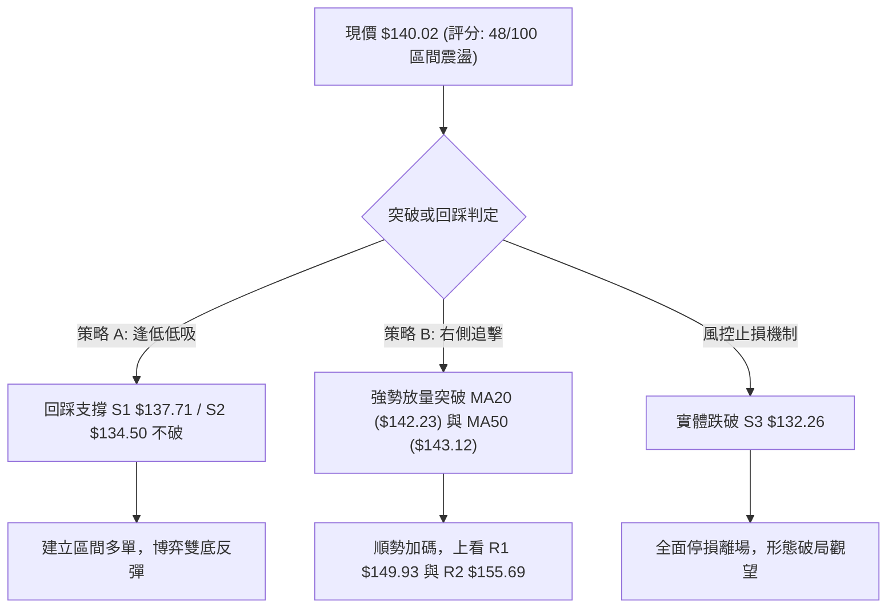

### 🧭 策略路由（依評分卡分流）

> **當前主策略方向 = 區間震盪操作（Range Trading）/ 等待回踩確認（依評分 48/100）**
> 
> *依據評分卡規則：綜合評分介於 40–60 之間，市場處於布林帶寬包覆之震盪盤，不具備追價單邊行情的條件。主推策略為「以布林下軌及 S1/S2 支撐為基底之區間逢低做多策略」，向上以布林中軌及 R1 阻力位作為減碼目標。*

### 🎯 價格情境階梯（Price Scenarios）

價位嚴格引用技術數據模組計算之聚類數值：

| 觸發條件 | 下一目標 | 後續延伸 | 情境含義解讀 |
|----------|:--------:|:--------:|--------------|
| **突破 R1 $149.93** | **R2 $155.69** | **R3 $168.66** | 雙重底頸線確立突破，完成超跌反轉，挑戰年線 |
| **突破 MA20 $142.23** | **R1 $149.93** | **$150.15 (Fib 78.6%)** | 短線走出底部震盪，展開布林上軌之波段修復 |
| **站穩現價區間 ($140.02)** | **MA20 $142.23** | **MA50 $143.12** | 維持 $137.71–$143.12 狹幅拉鋸，消化套牢浮額 |
| **跌破 S1 $137.71** | **S2 $134.50** | **BB下軌 $133.32** | 短線反彈夭折，重新回測箱型底部支撐帶 |
| **跌破 S3 $132.26** | **空頭破底** | **尋求新低點** | 跌破 52 週最低點，雙底構型破滅，下行空間開啟 |

### 📊 情境機率分佈

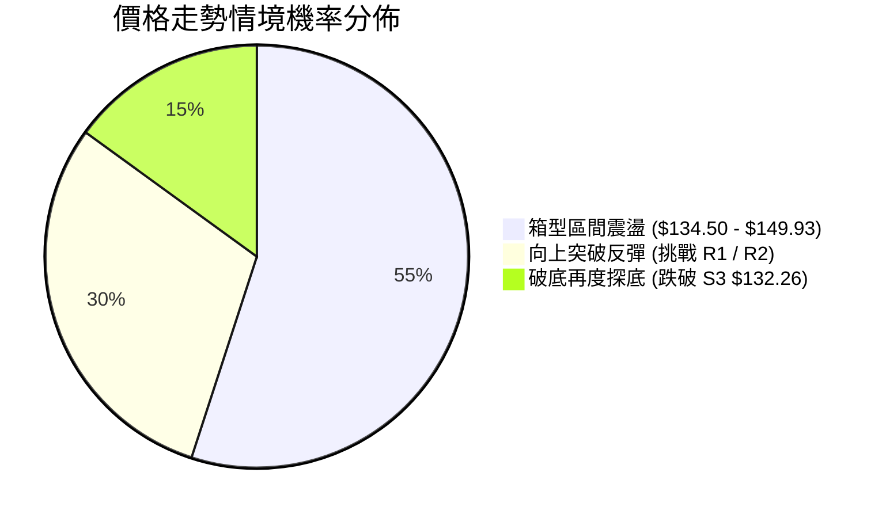

| 情境劃分 | 估計機率 | 主要技術指標依據 |
|----------|:--------:|------------------|
| **區間震盪築底** | **55%** | **ADX 僅 11.63** 證明單邊動能嚴重不足，布林帶寬收窄，股價將反覆於上下軌間打底拉鋸。 |
| **向上突破反彈** | **30%** | **量比達 2.41 倍**，OBV > MA，MACD 柱狀圖由負翻正 (+0.023)，短線買盤力量持續匯聚。 |
| **回落跌破探底** | **15%** | **MA20/50/200 仍為空頭排列**，-DI (26.01) 高於 +DI (18.61)，若大盤系統性風險爆發仍有補跌隱憂。 |

### 🟢 主策略詳情（區間操作與逢低佈局）

所有進出場、停損、目標價位嚴格引用關鍵價位數據，計算風險報酬比（RRR）：

| 策略要素 | 策略 A：左側區間回踩低吸 (穩健型) | 策略 B：右側突破加碼追擊 (積極型) |
|----------|------------------------------------|------------------------------------|
| **進場條件** | 股價回踩 S1 不破，或在 $137.71–$138.50 出現止跌K線 | 放量實體突破 MA50，確認收盤價高於 $143.12 |
| **進場價格** | **$137.71** (支撐位 S1) | **$143.12** (突破 MA50 確認點) |
| **目標價 T1** | **$142.23** (布林中軌 / MA20) | **$149.93** (阻力位 R1 / 頸線) |
| **目標價 T2** | **$149.93** (阻力位 R1) | **$155.69** (阻力位 R2 / 年線共振) |
| **止損價格** | **$134.50** (跌破支撐位 S2) | **$139.25** (跌破 MA10 均線防守點) |
| **風險空間** | $\$137.71 - \$134.50 = \$3.21$ | $\$143.12 - \$139.25 = \$3.87$ |
| **報酬空間 (T2)**| $\$149.93 - \$137.71 = \$12.22$ | $\$155.69 - \$143.12 = \$12.57$ |
| **風險報酬比** | **1 : 3.81** (優異) | **1 : 3.25** (良好) |
| **預估勝率** | **65%** | **55%** |
| **建議倉位** | **15%–20%** (底倉分批) | **10%–15%** (突破追加) |

### 🔴 反向風險觸發點（對沖與風控提示）

若發生下列技術破位事件，將徹底推翻上述偏多區間策略，應立即執行防禦措施：
1. **關鍵防線失守**：日線收盤價跌破 **S3 ($132.26)**，代表 52 週最低點防線告破，雙重底形態失效。
2. **量能空方吞噬**：若出現單日成交量超過 10M 且為光頭光腳實體黑K，直接灌穿 **S2 ($134.50)**。
3. **風控動作**：一旦觸發 S3 跌破，所有多頭倉位應全面止損離場，切勿盲目加碼攤平。

### ⭐ 整體訊號強度評星

```
做多訊號強度：★★★☆☆  (3/5星 — 底背馳與放量支持，但受均線重壓)
做空訊號強度：★★☆☆☆  (2/5星 — 空頭趨勢存在但動能嚴重衰減)
整體可信度：  ★★★★☆  (4/5星 — 關鍵水平位聚類密集，技術邊界清晰)
```

---

## 9. 風險提示與監控

### ✅ 關鍵監控指標 Checklist

```
╔══════════════════════════════════════════════════════════════════╗
║                    每日技術監控 Checklist                         ║
╠══════════════════════════════════════════════════════════════════╣
║ [ ] 價格是否成功站穩短期均線 MA5 ($139.39) 與 MA10 ($139.25)     ║
║ [ ] 挑戰布林中軌 MA20 ($142.23) 時之成交量是否維持 > 5.20M (均量) ║
║ [ ] MACD 柱狀圖是否持續維持在正值區間 (> 0)                       ║
║ [ ] RSI(14) 能否進一步越過 55 分水嶺向 60-70 推進                ║
║ [ ] ADX(14) 數值是否自 11.63 開始抬升並突破 20 (趨勢加溫信號)    ║
║ [ ] 價格回踩時，支撐 S1 ($137.71) 與 S2 ($134.50) 是否有效防守   ║
║ [ ] 下方終極警報：盤中是否出現跌破 $132.26 (52W Low) 之極端拋壓  ║
╚══════════════════════════════════════════════════════════════════╝
```

### ⚠️ 風險場景分析

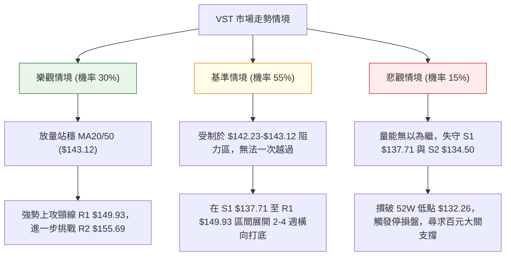

### 🛡️ 風險管理重要提醒

1. **財務槓桿與基本面背景約束**：VST 目前總負債達 $20.51B，淨負債高達 $-20.07B（負債權益比 373.28%），速動比率僅 0.258。高槓桿資本結構使其在總體利率環境震盪時股價波動劇烈。技術操作時必須將此財務特性納入考量，嚴設停損點。
2. **倉位管理守則**：
   * 在 ADX < 25 的無趨勢盤整市場中，總持倉部位建議控制在 **20%–30% 以內**，嚴禁全倉押注單一突破。
   * 單筆交易之最大曝險金額（虧損上限）不得超過總投資帳戶淨值的 **1.5%**。
3. **區間操作紀律**：在震盪築底結構中，「賣在阻力、買在支撐」為第一鐵律。現價 $140.02 距離 MA20 反壓僅 $2.21，切忌追價進場；耐心等待回踩 S1 ($137.71) 或確認突破 MA50 ($143.12) 方為安全切入點。

---

## 📋 報告總結

```
╔══════════════════════════════════════════════════════════════════╗
║                     VST 技術分析報告總結                         ║
╠══════════════════════════════════════════════════════════════════╣
║ 報告日期：2026-10-04                                             ║
║ 當前價格：$140.02  (ATR: $4.44 / Beta: 1.414)                    ║
║ 分析評級：⚖️ 中性偏多築底震盪 (評分：48/100)                     ║
║                                                                  ║
║ 關鍵結論：                                                       ║
║ ├─ 長期趨勢：🔴 空頭修正，但自高點回調 -35% 後於 52W 低位獲支撐   ║
║ ├─ 中期趨勢：🟡 區間箱型盤底，ADX=11.63 顯示處於低動能橫盤狀態   ║
║ ├─ 短期趨勢：🟢 站上 MA5/MA10，放量 2.41 倍，MACD 出現零下金叉   ║
║ ├─ 關鍵支撐：S1 $137.71 ｜ S2 $134.50 ｜ S3 $132.26 (52W Low)    ║
║ ├─ 關鍵阻力：R1 $149.93 ｜ R2 $155.69 ｜ R3 $168.66             ║
║ └─ 機構共識：Strong Buy (20位分析師平均目標價 $212.25)           ║
║                                                                  ║
║ 最優策略組合：                                                   ║
║ 1. 🥇 最佳機會：回踩 S1 ($137.71) 建立區間多單，停損設 S2        ║
║                 ($134.50)，目標上看 R1 ($149.93)，RRR 達 1:3.81  ║
║ 2. 🥈 次選機會：突破 MA50 ($143.12) 後右側加碼，博弈雙底反轉目標 ║
║                 R2 ($155.69) 與 R3 ($168.66)                     ║
║ 3. 🥉 保守選擇：維持場外觀望，直至日線實體收盤站穩布林中軌       ║
║                 ($142.23) 且 ADX 突破 20 趨勢成型後再行介入     ║
╚══════════════════════════════════════════════════════════════════╝
```

---

> ⚠️ **免責聲明**：本報告為技術分析專用模型生成之專業研判，所有支撐阻力點位及回調估算均嚴格基於歷史 OHLCV 交易數據。本報告**僅供學術研究與交易架構參考**，**不構成任何要約、招攬或投資操作建議**。金融市場波動劇烈，投資人應獨立評估風險，並自行承擔交易損益。

---

*報告生成時間：2026-10-04 ｜ 數據來源：Yahoo Finance ｜ 分析框架：多時框技術分析體系*