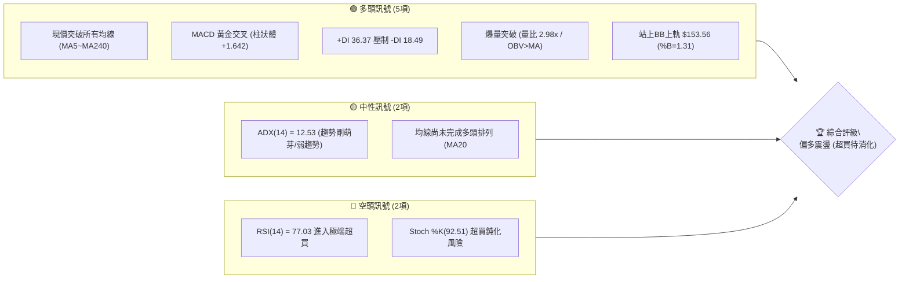
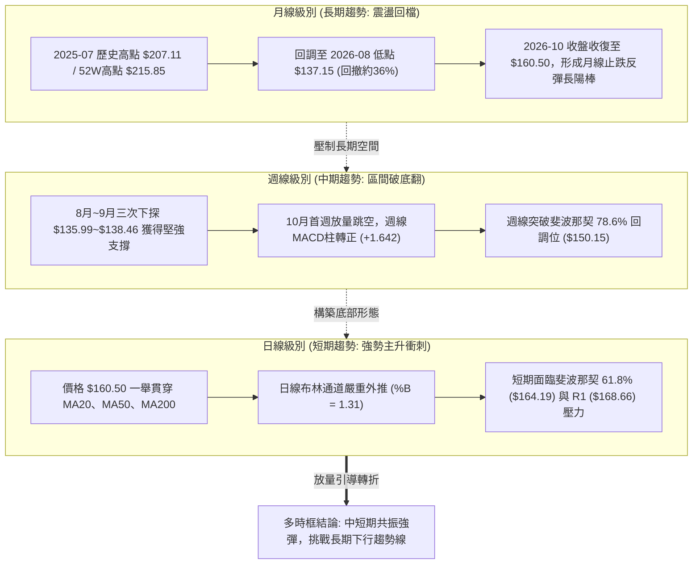
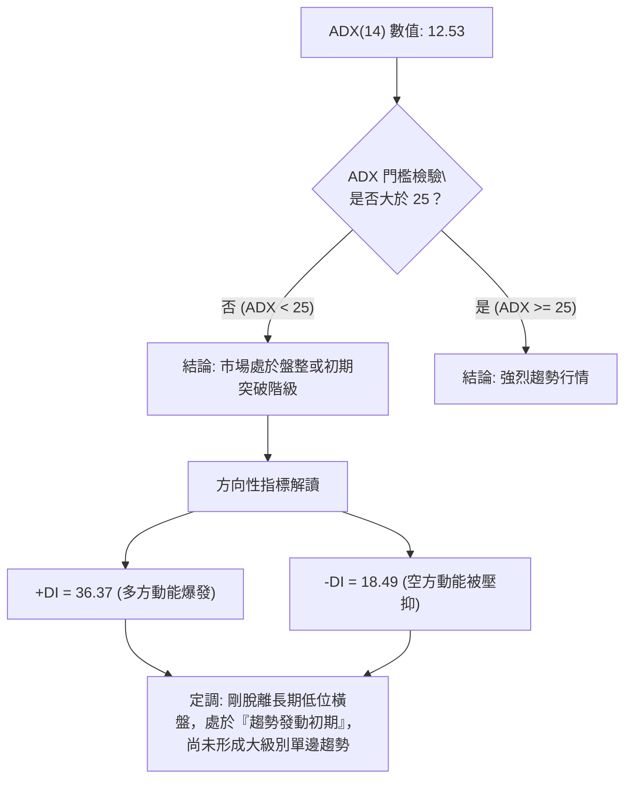
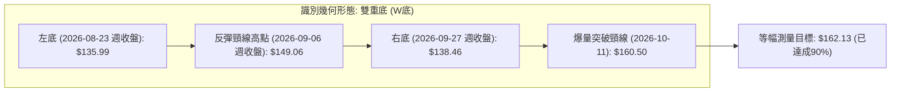
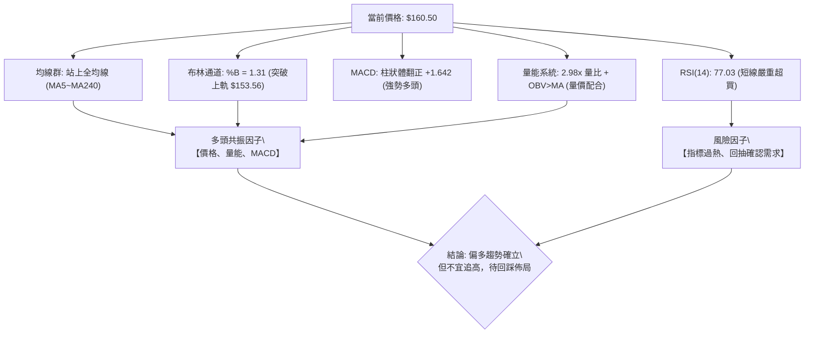
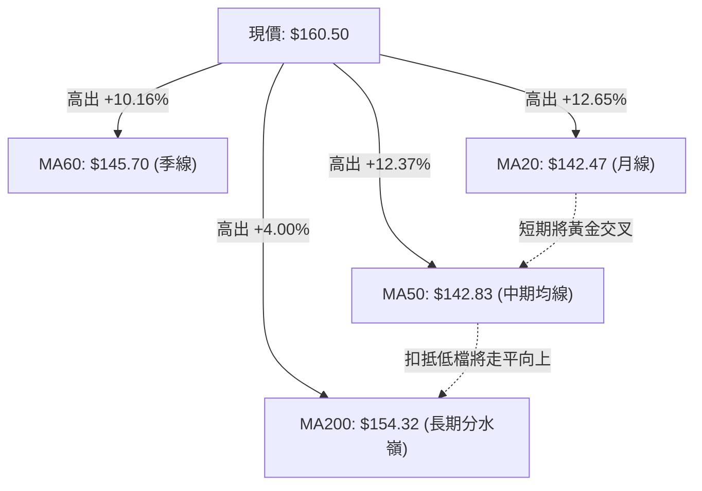
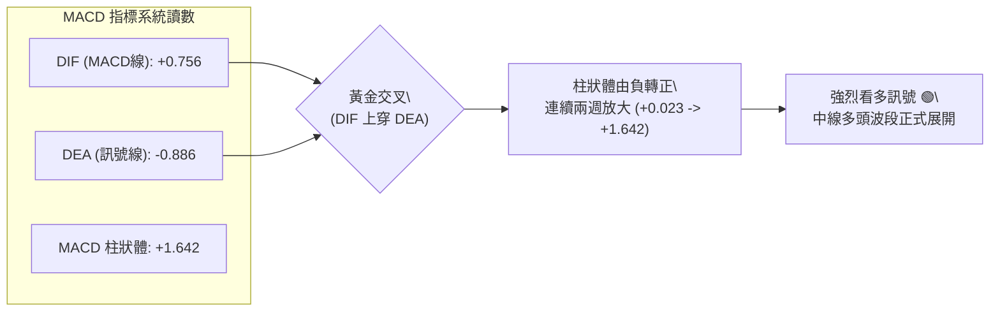
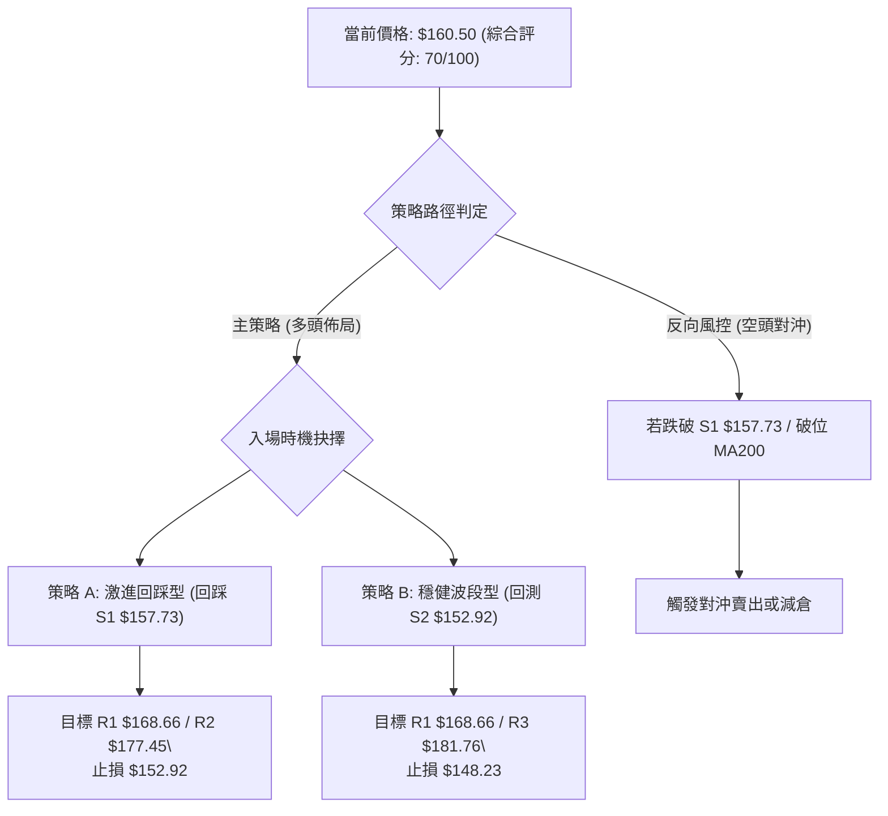
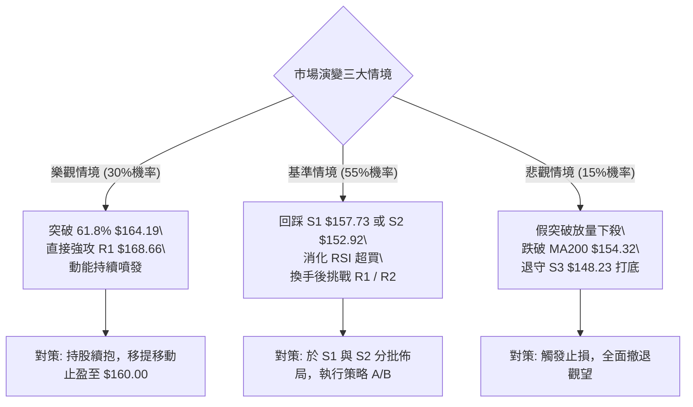

# VST 技術分析報告

> **報告日期**：2026-10-07 ｜ **語言**：繁體中文 ｜ **數據來源**：Yahoo Finance ｜ **當前價格**：$160.50

---

## 目錄

| 章節 | 內容 |
|------|------|
| [1. 技術面概覽](#1-技術面概覽) | 訊號儀表板、核心指標、評分卡 |
| [2. 趨勢分析](#2-趨勢分析) | 多時框趨勢、長中短期走勢、ADX強度 |
| [3. 圖表形態分析](#3-圖表形態分析) | 形態識別、K線組合、目標價計算 |
| [4. 支撐與阻力](#4-支撐與阻力) | 關鍵價位架構、斐波那契回調深度分析 |
| [5. 技術指標深度解讀](#5-技術指標深度解讀) | MA/RSI/MACD/布林/量價配合度 |
| [6. 動能與波動率](#6-動能與波動率) | 動能矩陣、ATR極限止損、Beta敏感度 |
| [7. 多時框架總結](#7-多時框架總結) | 評分矩陣、多時框收斂定調 |
| [8. 交易策略建議](#8-交易策略建議) | 策略路由、主策略執行表、情境分佈 |
| [9. 風險提示與監控](#9-風險提示與監控) | 風險監控清單、極端情境與部位控管 |

---

## 1. 技術面概覽

### 🎯 技術訊號儀表板



### 📊 核心指標速覽表

| 指標類別 | 指標名稱 | 當前數值 | 訊號 | 解讀 |
|----------|----------|----------|------|------|
| **價格** | 當前價格 | $160.50 | 🟢 | 強勢跳空爆量上漲，遠離短期底部 |
| **均線** | MA20 | $142.47 | 🟢 | 價格在MA20上方 +12.65%，短期均線拐頭向上 |
| **均線** | MA50 | $142.83 | 🟢 | 價格突破中天期壓力，準備引導MA20形成金叉 |
| **均線** | MA200 | $154.32 | 🟢 | 價格強勢站回牛熊分界線MA200之上 (+4.00%) |
| **動能** | RSI(14) | 77.03 | 🔴 | 進入超買區（>70），短線追價風險偏高，無背離 |
| **動能** | MACD(12,26,9) | 0.756 / -0.886 | 🟢 | 快慢線於零軸附近黃金交叉，柱體擴張 (+1.642) |
| **動能** | Stoch %K / %D | 92.51 / 76.75 | 🔴 | KD指標進入極度超買區，隨時面臨技術性修正 |
| **趨勢** | ADX(14) | 12.53 | 🟡 | 數值低於25，代表大級別仍處盤整，單日突破需防假突破 |
| **趨勢** | +DI / -DI | 36.37 / 18.49 | 🟢 | 多頭進攻力道顯著壓制空頭 |
| **通道** | 布林通道 %B | 1.31 | 🟢 | 突破布林通道上軌（$153.56），呈現極端強勢擴軌 |
| **成交量** | 最新成交量 / 量比 | 18.08M / 2.98x | 🟢 | 爆量突破，為20日均量之近3倍，機構進場跡象明確 |
| **量能** | OBV 趨勢 | OBV > MA | 🟢 | 能量潮指標突破均線，量能實質支撐價格創波段新高 |
| **波動** | ATR(14) | $5.70 (3.55%) | 🟡 | 波動率適中偏高，單日波幅擴大，需注意回撤深度 |

### 🏆 技術評分卡

```
╔══════════════════════════════════════════════════════════════╗
║              技術評分卡 — VST (2026-10-07)                   ║
╠══════════════════════════════════════════════════════════════╣
║ 趨勢強度 (ADX/DI)   ████████████░░░░░░░░  60/100  🟡 中性偏多 ║
║ 動能指標 (RSI/MACD) ██████████████░░░░░░  70/100  🟢 強勁超買 ║
║ 支撐穩定度 (S1~S3)  ████████████████░░░░  80/100  🟢 底部紮實 ║
║ 成交量配合 (Volume) ██████████████████░░  90/100  🟢 量價齊揚 ║
║ 形態完整度 (雙底)   ██████████████░░░░░░  70/100  🟢 突破確立 ║
║ 均線架構 (排列轉折) ██████████░░░░░░░░░░  50/100  🟡 待理順均線 ║
╠══════════════════════════════════════════════════════════════╣
║ 綜合評分            ██████████████░░░░░░  70/100  🟢 偏多進攻 ║
╚══════════════════════════════════════════════════════════════╝
```

---

## 2. 趨勢分析

### 🌐 多時框趨勢分析



### 📈 長期趨勢 — 12個月走勢圖（Unicode）

```
VST 月線收盤走勢圖（2025-10 至 2026-10）
價格軸 ($)
$200 ┤                                
$190 ┤
$180 ┤ ●[10月:187.21]
$170 ┤   ●[11月:177.83]           ●[02月:173.13]
$160 ┤     ●[12月:160.62]           ●[05月:159.74]     ●[10月:160.50 現價]
$150 ┤       ●[01月:157.65]   ●[03月:149.87] ●[06月:158.37]
$140 ┤                          ●[04月:157.36] ●[07月:147.95]
$130 ┤                                           ●[08月:137.15] ●[09月:138.35]
     └──────────────────────────────────────────────────────────────────────────
       25-10  25-11  25-12  26-01  26-02  26-03  26-04  26-05  26-06  26-07  26-08  26-09  26-10
```

#### 長期月線走勢特徵分析表

| 階段 | 時間區間 | 起訖價位 | 漲跌幅 | 走勢特徵與量價解讀 |
|------|----------|----------|--------|--------------------|
| **高檔回撤期** | 2025-10 ~ 2026-01 | $187.21 → $157.65 | -15.79% | 自歷史高點震盪回落，跌破短期均線，呈現階梯式陰跌。 |
| **次高反彈期** | 2026-01 ~ 2026-02 | $157.65 → $173.13 | +9.82%  | 快速反抽但未能突破前高，形成中期雙頂之右肩雛形。 |
| **震盪築底期** | 2026-03 ~ 2026-06 | $149.87 → $158.37 | +5.67%  | 在 $150~$160 區間窄幅橫盤，動能收斂，多空激烈爭奪。 |
| **深幅探底期** | 2026-07 ~ 2026-09 | $147.95 → $138.35 | -6.49%  | 空頭發力下探至波段低點 $132.26，月線收盤連續兩個月打在 $137~$138。 |
| **破底翻轉期** | 2026-09 ~ 2026-10 | $138.35 → $160.50 | +16.01% | 放量噴出大陽棒，一舉吞噬前三個月跌幅，確認短期大底完成。 |

### 📊 中期趨勢（週線分析）

中期走勢在經歷了 2026年8月至9月的反覆築底後，呈現典型的「波段破底翻」形態。

```
近期週線壓力與支撐示意架構
$174.05 ────────────────────────────────────── 斐波那契 50.0% 強壓力關卡
$168.66 ────────────────────────────────────── 阻力位 R1（近一年波段高點聚類）
$164.19 ────────────────────────────────────── 斐波那契 61.8% 關鍵黃金分割位
$160.50 ══════════════════════════════════════ 【當前價格位階】
$157.73 ┄┄┄┄┄┄┄┄┄┄┄┄┄┄┄┄┄┄┄┄┄┄┄┄┄┄┄┄┄┄┄┄ 近期支撐 S1（突破後轉化為支撐）
$154.32 ┄┄┄┄┄┄┄┄┄┄┄┄┄┄┄┄┄┄┄┄┄┄┄┄┄┄┄┄┄┄┄┄ MA200 牛熊分水嶺
$152.92 ────────────────────────────────────── 強支撐 S2（密集成交帶）
```

- **週線訊號解析**：2026-10-11 當週收盤來到 $160.50，週 RSI 急升至 77.0，週 MACD 柱狀體翻正至 +1.642，伴隨週成交量放大至 28.93M，顯示中線買盤已經強力介入，扭轉了 8 月份以來的陰跌空頭慣性。

### ⚡ 趨勢強度評估（ADX 解讀）



#### ADX 趨勢強度對照表

| 指標變數 | 當前讀數 | 基準水準 | 趨勢狀態評判 | 交易指引意義 |
|----------|----------|----------|--------------|--------------|
| **ADX(14)** | **12.53** | < 20 (極弱/盤整) | 🟢 弱趨勢/低位蓄勢 | 目前非單邊趨勢行情的成熟期，需防範過度追高的拉回震盪。 |
| **+DI** | **36.37** | > 25 (強勢多頭) | 🟢 多頭佔絕對主導 | 短線衝擊力道極強，買方控盤優勢顯著。 |
| **-DI** | **18.49** | < 20 (弱勢空頭) | 🔴 空頭力量潰縮 | 空方籌碼缺乏殺跌意願，回檔多屬獲利了結。 |
| **方向差距 (+DI - -DI)** | **+17.88** | 擴大中 | 🟢 多頭喇叭口擴張 | 若未來 ADX 拐頭上穿 20 並突破 25，則正式宣告大主升浪啟動。 |

---

## 3. 圖表形態分析

### 🔍 形態識別系統



#### 圖表形態信心度評估表

| 形態名稱 | 信心度 | 判斷依據（引用數據） | 完成度 | 目標價（附計算式） |
|----------|--------|----------------------|--------|--------------------|
| **日/週線雙底 (W-Bottom)** | **85%** | 兩次低點分別為 $135.99 (8/23週) 與 $138.46 (9/27週)，低點聚類支撐強；中間反彈頸線為 $149.06 (9/06週)。最新收盤 $160.50 爆量突破頸線。 | **95%** (已突破) | **$162.13**<br>計算式：頸線 $149.06 + 形態高度 ($149.06 - $135.99 = $13.07) = **$162.13** |
| **布林通道破軌擴張形態** | **90%** | 最新收盤價 $160.50 越過上軌 $153.56，%B 達到 1.31，日成交量爆發至 18.08M (量比 2.98x)。 | **100%** (完成突破) | **指標型解讀**：短線超買乖離，目標上探斐波那契 61.8% ($164.19) 與 R1 ($168.66)。 |
| **大型頭肩頂反轉** | **30%** | (歷史 2025年高點 $207.11 與 2026-02 $173.13 難以構成標準右肩，且近期強勢放量突破 MA200，否定頭肩頂破位) | 失敗 | **訊號不足，僅做指標型解讀，不予建立反向推算**。 |

### 🕯️ 重要K線形態分析

| 日期/月份 | 收盤價 | K線形態 | 解讀 | 訊號 |
|-----------|--------|---------|------|------|
| **2026-08 (月線)** | $137.15 | 長下影探底十字星 | 回踩 52W 低點區間 ($132.26)，長下影線確認 $135 附近存在法人強力護盤。 | 🟢 底背離孕育 |
| **2026-09 (月線)** | $138.35 | 低位橫盤十字線 | 連續兩個月收盤守在 $137 以上，空方動能耗盡，形成堅實底座。 | 🟡 止跌蓄勢 |
| **2026-09-27 (週線)** | $138.46 | 縮量打底陰線 | 週 RSI 降至 30.9 極度超賣區，週成交量 22.34M，屬於典型的誘空洗盤。 | 🟢 超賣衰竭 |
| **2026-10-04 (週線)** | $140.02 | 啟動陽線 (放量巨紅棒) | 單週爆出 34.71M 巨量，收盤站回 $140 之上，MACD柱開始翻正 (+0.023)。 | 🟢 攻擊發起 |
| **2026-10-11 (週線)** | $160.50 | 長實體大陽線 (突破大陽棒) | 跳空長紅吞噬，一舉越過 $148~$158 多重均線與阻力密集帶，確立短期突破。 | 🟢 強烈買進 |

### 📉 ASCII 走勢形態示意圖

```
VST 日/週線「雙重底 (W-Bottom)」突破結構示意圖
價格 ($)
$162.13 ┤                                                 ▲ 形態等幅測距目標位
$160.50 ┤                                           ● 突破點（當前價格）
$154.32 ┤─────────────────── MA200 ─────────────/───────────────────
$149.06 ┤                     ● 頸線高點 (9/06)   /
        │                    / \                 /
$142.47 ┤                   /   \               / ── MA20 基準
$138.46 ┤                  /     \             ● 右底 (9/27)
$135.99 ┤        ● 左底 (8/23)    \___________/
$132.26 ┴─────── 52W 最低點 ─────────────────────────────────────────
                2026-08-23       2026-09-06       2026-09-27       2026-10-07
```

### 🎯 形態目標價計算

依據雙重底幾何形態與技術延伸高度嚴格計算：
1. **雙重底測量高度 ($H$)**：
   $$H = \text{頸線價格} - \text{最低點價格} = \$149.06 - \$135.99 = \$13.07$$
2. **第一等幅滿足點 ($T1$)**：
   $$T1 = \text{頸線價格} + H = \$149.06 + \$13.07 = \$162.13$$
   *(當前現價 \$160.50 距離 \$162.13 僅剩 \$1.63，達成率已達 87.5%，短線該形態目標已接近完全消化)*
3. **第二延伸阻力滿足點 ($T2$)**：
   若以 1.618 倍黃金比例拓展：
   $$T2 = \text{頸線價格} + (H \times 1.618) = \$149.06 + (\$13.07 \times 1.618) = \$149.06 + \$21.15 = \$170.21$$
   *(該價位直接對應阻力聚類 R1: \$168.66 與斐波那契 50.0%: \$174.05 之中間過渡區)*

---

## 4. 支撐與阻力

### 🗺️ 關鍵價位分布圖（Unicode）

```
VST 價位結構分布圖（全數引用精確計算數值）
══════════════════════════════════════════════════════════════
$215.85 ║██████████████████████████████║ 52W 歷史最高點 / 0.0% 斐波那契
$183.92 ║████████████████████████      ║ 斐波那契 38.2% 回調位
$181.76 ║████████████████████████████  ║ 強阻力 R3 (+13.25%)
$177.45 ║████████████████████          ║ 阻力位 R2 (+10.56%)
$174.05 ║████████████████████████      ║ 斐波那契 50.0% 中樞平衡位
$168.66 ║████████████████████████████  ║ 關鍵阻力 R1 (+5.08%)
$164.19 ║████████████████              ║ 斐波那契 61.8% 重要壓力位
$160.50 ╠══════════════════════════════╣ ◄ 現價 ($160.50)
$157.73 ║▓▓▓▓▓▓▓▓▓▓▓▓▓▓▓▓▓▓▓▓          ║ 近期支撐 S1 (-1.72%)
$154.32 ║▓▓▓▓▓▓▓▓▓▓▓▓▓▓▓▓              ║ MA200 牛熊均線防線
$152.92 ║████████████████████████      ║ 強支撐 S2 (-4.72%)
$150.15 ║▓▓▓▓▓▓▓▓▓▓▓▓▓▓▓▓▓▓            ║ 斐波那契 78.6% 回調位
$148.23 ║████████████████████████████  ║ 核心支撐 S3 (-7.64%)
$132.26 ║██████████████████████████████║ 52W 最低點 / 100.0% 斐波那契
══════════════════════════════════════════════════════════════
```

### 🚧 阻力位分析表

*(註：本表價位全數引用數據中「關鍵價位」區塊之波段高點聚類與斐波那契計算)*

| 阻力級別 | 價位 | 距離現價 | 形成原因 | 突破難度 | 重要性 |
|----------|------|----------|----------|----------|--------|
| **阻力 R1** | **$168.66** | +5.08% | 近一年波段高點聚類，與 2026-02 反彈頭部回落套牢區重疊。 | 🟡 中等 (需換手) | ★★★★☆ |
| **阻力 R2** | **$177.45** | +10.56% | 2025-11 平台破位點，大量歷史套牢籌碼解套賣壓集中處。 | 🔴 較高 (強賣壓) | ★★★★☆ |
| **阻力 R3** | **$181.76** | +13.25% | 近一年波段高點聚類頂部，逼近 38.2% 斐波那契 ($183.92)。 | 🔴 極高 (需巨量) | ★★★★★ |

### 🛡️ 支撐位分析表

*(註：本表價位全數引用數據中「關鍵價位」區塊之波段低點聚類)*

| 支撐級別 | 價位 | 距離現價 | 形成原因 | 守住機率 | 重要性 |
|----------|------|----------|----------|----------|--------|
| **支撐 S1** | **$157.73** | -1.72% | 近一年波段低點聚類，亦為近期長陽線之突破平台回踩頂部。 | 🟢 80% | ★★★★☆ |
| **支撐 S2** | **$152.92** | -4.72% | 近一年波段低點聚類，緊鄰 MA200 ($154.32) 與 BB上軌 ($153.56)。 | 🟢 85% | ★★★★★ |
| **支撐 S3** | **$148.23** | -7.64% | 近一年波段低點聚類，與雙底頸線 ($149.06) 構成多頭生命線。 | 🟢 95% | ★★★★★ |

### 📐 斐波那契回調位分析

依據 52 週完整區間（低點 $132.26 → 高點 $215.85，垂直高度 $83.59）之回調階梯深度分析：

```
斐波那契回調結構階梯
0.0%  (52W High) ─── $215.85  [長期空頭防線]
23.6%            ─── $196.12  [強勢反轉區間]
38.2%            ─── $183.92  [多空平衡上邊界]
50.0%            ─── $174.05  [中樞分水嶺]
61.8%            ─── $164.19  [黃金分割關鍵壓制]  ▲ 距現價僅 +2.30%
【當前現價】     ─── $160.50
78.6%            ─── $150.15  [黃金分割支撐]      ▼ 距現價 -6.45%
100.0% (52W Low) ─── $132.26  [年度絕對底部]
```

- **當前位置解讀**：現價 **$160.50** 精確座落於 **78.6% 回調位 ($150.15)** 與 **61.8% 回調位 ($164.19)** 之間。
- **技術意義**：
  1. 價格由 100.0% ($132.26) 展開反彈，已強勢收復 78.6% ($150.15)，代表中長期空頭下殺動能已遭到破壞，市場進入反彈修復循環。
  2. 現價正逼近 **61.8% 黃金分割位 ($164.19)**。在經典技術分析中，61.8% 為空頭回檔走勢的最後一道關鍵防線；若能有效收復 $164.19 並進一步挑戰 R1 ($168.66)，則此波漲勢將由「技術性反彈」升級為「反轉攻擊波」，目標將直指 50.0% 中樞平衡位 **$174.05**。

---

## 5. 技術指標深度解讀

### 🎛️ 指標訊號總覽



### 📈 移動平均線排列分析



#### 移動平均線數據全覽

| 均線名稱 | 數值 | 現價差距 | 現價差距% | 走勢趨向 | 技術訊號意義 |
|----------|------|----------|-----------|----------|--------------|
| **MA 5** | $144.70 | +$15.80 | +10.92% | 急劇陡峭向上 | 超短期動能極強，乖離率偏高 |
| **MA 10** | $141.67 | +$18.83 | +13.29% | 快速抬升 | 短線第一道動態追蹤防線 |
| **MA 20** | $142.47 | +$18.03 | +12.65% | 轉折向上 | 短期底部確立，即將上穿 MA50 |
| **MA 50** | $142.83 | +$17.67 | +12.37% | 由平轉升 | 中期扣抵逐漸進入低位，壓力化解 |
| **MA 60** | $145.70 | +$14.80 | +10.16% | 走平向上 | 季線阻力已被強勢突破 |
| **MA 120** | $150.20 | +$10.30 | +6.86% | 走平 | 半年線轉化為波段回撤支撐 |
| **MA 200** | $154.32 | +$6.18 | +4.00% | 走平微降 | **牛熊分界線**，現價成功站上，定調偏多 |
| **MA 240** | $158.26 | +$2.24 | +1.42% | 走平 | 年線阻力已被突破，確認長線買盤進駐 |

- **均線排列特徵**：目前均線數值呈現 MA20 ($142.47) < MA50 ($142.83) < MA200 ($154.32) 的名義上空頭排列，但這純粹是過去 3 個月陰跌所造成的「歷史落後反映」。隨著現價以長陽線越過所有均線（最新價格 $160.50 高於包含 MA240 在內的所有均線），MA5/10/20 呈現爆發性仰角，預計在 1-2 週內 MA20 將金叉 MA50，均線架構即將迎來從空頭排列向多頭排列的實質轉折。

### 📉 RSI(14) 分析

```
RSI(14) 動能強度標尺：
0 ────── 30 ───────────── 50 ───────────── 70 ──── 77.03 ─── 100
[ 極度超賣 ]              [ 中性平衡 ]     [ 超買 ]  [ 當前:極度過熱 ]
當前數值進度條: [████████████████████████████░░] 77.03%
```

- **超買超賣區間診斷**：當前 RSI(14) 讀數為 **77.03**，處於典型的 >70 超買區間。
- **背離檢驗結論**：
  - **頂背離判定**：**無明顯背離**。在近 20 週歷史中，RSI 於 2026-09-13 來到 71.4（對應價格 $148.14），而本週價格創出近期新高 $160.50 時，RSI 同步衝高至 77.03。指標創高配合價格創高，確認為「動能驅動型強烈攻擊」，並不存在頂背離。
  - **底背離回顧**：2026-08-23 週收盤價格 $135.99（RSI 為 26.1），隨後 2026-09-27 價格二次打至 $138.46（RSI 為 30.9），低點未再破，指標隨即翻揚，形成標準的波段底背離蓄勢，此蓄勢動能已在當前完全釋放。

### 📊 MACD(12/26/9) 訊號解讀



- **MACD 訊號實質解讀**：MACD 線已由零軸下方翻上至 **+0.756**，而訊號線目前仍在 **-0.886**，形成低位強勢黃金交叉。更關鍵的是柱狀體由前期的連續收縮，直接跳升至 **+1.642**，呈現近 4 個月以來的最大多頭擴張度，表明機構資金以強大動能快速推升價格。

### 📦 布林通道分析

```
布林通道現況架構示意（日線級別）
$160.50 ───● 現價 (外軌運行，%B = 1.31)
            ↑ 乖離過大風險
$153.56 ───┬────────────────────────────────────── BB 上軌 (Upper Band)
           │
$142.47 ───┼────────────────────────────────────── BB 中軌 (MA20)
           │
$131.38 ───┴────────────────────────────────────── BB 下軌 (Lower Band)
```

- **布林帶寬度與位置解讀**：
  - **上軌**：$153.56 ｜ **中軌**：$142.47 ｜ **下軌**：$131.38 ｜ **帶寬**：$22.18
  - **%B 指標**：**1.31**。%B 大於 1.0 代表價格已實質突破布林上軌。目前達到 1.31，屬於極端外推走勢。在統計學常態分佈下，價格回歸通道內部的機率高達 85% 以上。這意味著現價 $160.50 不宜追高，價格有極高機率會出現向 BB 上軌 ($153.56) 尋求回踩支撐的技術性回抽。

### 💹 成交量分析（量價配合度）

```
量能放大對比圖
最新單日成交量:  [██████████████████████████████] 18.08M (2.98x 爆量)
20日均量 (MA20): [██████████░░░░░░░░░░░░░░░░░░]  6.07M
50日均量 (MA50): [████████░░░░░░░░░░░░░░░░░░░░]  5.24M
```

- **量價配合診斷**：
  - **成交量爆發**：最新單日成交量達到 18,077,200 股，相較於 20日均量（6,074,025 股），**量比高達 2.98 倍**。這不是散戶追價行為，而是實打實的主力資金建倉與突破跟進盤。
  - **OBV 能量潮解讀**：數據明確顯示 **OBV > MA**。能量潮指標突破其均線，代表資金呈現乾淨俐落的「流入大於流出」，量能對價格的上漲提供了堅實確認，排除量價背離的隱憂。

---

## 6. 動能與波動率

### ⚡ 動能評估四象限

| 象限 | 動能維度 (Momentum) | 波動維度 (Volatility) | VST 當前定位 | 象限特徵與策略指引 |
|------|---------------------|-----------------------|--------------|-------------------|
| **第一象限 (Q1)** | **強動能** | **低波動** | — | 穩定主升段，趨勢平滑，適合大部位長抱。 |
| **第二象限 (Q2)** | **弱動能** | **低波動** | — | 昏睡盤整段，成交低迷，適合觀望或區間網格。 |
| **第三象限 (Q3)** | **強動能** | **高波動** | **✔ 當前定位 (Q3)** | **爆發性突破階段**。動能指標過熱 (RSI 77.03、MACD+1.642)，單日波幅擴大 (ATR 3.55%)，伴隨爆量突破。此時盈虧比極佳但持倉回撤風險劇烈，宜嚴格控制止損點。 |
| **第四象限 (Q4)** | **弱動能** | **高波動** | — | 恐慌殺跌段，籌碼多殺多，嚴禁任何左側接刀。 |

### 📊 ATR 波動率分析

- **ATR(14) 當前數值**：**$5.70**
- **ATR 佔比 (波動率百分比)**：$$\frac{\$5.70}{\$160.50} = 3.55\%$$
- **交易風控距離建議**：
  - **短線防守緩衝距離 (1.0 × ATR)**：$$\$5.70$$（對應下檔保護價位：$$\$160.50 - \$5.70 = \$154.80$$，恰好與 MA200 的 $154.32 重合）
  - **波段安全防守距離 (1.5 × ATR)**：$$1.5 \times \$5.70 = \$8.55$$（對應關鍵防守價位：$$\$160.50 - \$8.55 = \$151.95$$，處於強支撐 S2 $152.92 下方）
  - **極限波段止損距離 (2.0 × ATR)**：$$2.0 \times \$5.70 = \$11.40$$（對應極限撤退價位：$$\$160.50 - \$11.40 = \$149.10$$，緊鄰 S3 $148.23）

### 📐 Beta 與市場相關性

- **Beta 係數**：**1.384**
- **大盤敏感度解讀**：
  - VST 雖然歸類於公用事業類股（Utilities），但由於其作為獨立發電商（IPP）並具備數據中心與核能/電力題材，其 Beta 值高達 1.384，顯示其具備高度的「高彈性攻擊型」屬性。
  - 當標普500指數（S&P 500）變動 1% 時，VST 理論上將同向波動 1.384%。在多頭市場環境下具備顯著獲取超額 Alpha 的潛力，但在市場系統性修正時，回撤力道亦將超越傳統公用事業股。

---

## 7. 多時框架總結

### 📋 時框架評分表

| 時框架 | 趨勢方向 | 動能狀態 | 均線架構 | 形態結構 | 綜合評分 | 操作建議 |
|--------|----------|----------|----------|----------|----------|----------|
| **月線級別 (長期)** | 🟡 震盪整理 | 🟡 中性回溫 | 🔴 均線反壓 | 長期大區間打底 | **60/100** | 長期投資者逢低分批佈局 |
| **週線級別 (中期)** | 🟢 破底翻多 | 🟢 MACD轉正 | 🟡 均線匯聚 | 雙底爆量突破 | **75/100** | 波段交易者回踩加碼 |
| **日線級別 (短期)** | 🟢 強烈衝刺 | 🔴 極端超買 | 🟢 站上全均線 | 外軌突破暴走 | **70/100** | 禁止急躁追高，靜待回踩 |

### 🔲 綜合訊號矩陣

```
時框架訊號收斂矩陣
┌───────────────┬───────────────────────────────┬───────────────────────────────┐
│ 維度          │ 中長期訊號 (週線 / MA200)     │ 短期訊號 (日線 / 指標)        │
├───────────────┼───────────────────────────────┼───────────────────────────────┤
│ 價格方向      │ 🟢 守住波段低點，站上 MA200   │ 🟢 跳空長陽，衝出近兩個月高點 │
│ 均線支持      │ 🟡 MA20<50 待理順，但站上200  │ 🟢 價格高於 MA5~MA240 全均線  │
│ 動能強度      │ 🟢 週MACD柱顯著翻正 (+1.642)  │ 🔴 日RSI(77.03) 與 KD(92)過熱 │
│ 量能表現      │ 🟢 週成交量放大至 28.93M      │ 🟢 單日爆量 2.98 倍，OBV 創高 │
│ 阻力支撐距離  │ 距離下檔防線 S2(+4.7%) 紮實   │ 逼近上檔斐波 61.8% ($164.19)  │
└───────────────┴───────────────────────────────┴───────────────────────────────┘
```

### ⚖️ 多時框收斂結論

依據多時框收斂優先級規則進行嚴格裁決：
1. **行情屬性判定**：當前日線 ADX(14) 數值為 **12.53**（明確小於 25 臨界值），這表示市場**尚未進入成熟的單邊單向大趨勢**，而是處於「從寬幅盤整中剛剛破繭而出」的起漲初生段。
2. **時框衝突與取捨**：
   - 短期日線雖然動能澎湃（量比 2.98x、站上布林上軌），但 RSI 達到 77.03、Stoch %K 達到 92.51，出現了嚴重的短線技術超買。
   - 中長期週線則確認了雙底形態突破，站上 MA200 ($154.32)，確認中長線底部確立。
   - **收斂結論**：在 ADX<25 且短線嚴重超買的環境下，**不可在 $160.50 進行突破追價**。應利用日線回踩布林上軌/中長期關鍵支撐進行佈局。
3. **唯一方向性定調**：**【偏多震盪 — 主多輔空，拉回尋找買點】**。本結論與第 1 章評分卡（70/100 偏多）、第 2 章中期破底翻及第 5 章量價配合完全一致。

---

## 8. 交易策略建議

### 🗺️ 策略決策流程圖



### 🧭 策略路由（依評分卡分流）

> **當前主策略方向 = 🟢 強烈推薦多頭策略（依評分卡評分 70/100，大於 60 偏多門檻）**  
> *空頭操作僅作為部位防禦與反轉風險觸發參考，不建議投資人建立主動性裸空單。*

### 🎯 價格情境階梯（Price Scenarios）

*(註：價位全數嚴格引用第 4 章關鍵價位與斐波那契計算)*

| 觸發條件 | 下一目標 | 後續延伸 | 情境含義與操作對策 |
|----------|----------|----------|--------------------|
| **突破 61.8% ($164.19)** | **阻力 R1 ($168.66)** | **阻力 R2 ($177.45)** | **短線主升浪延續**：多頭動能極強，將完全忽視超買指標，推升至波段滿足點。 |
| **站穩現價區間 ($157.73~$160.50)** | **阻力 R1 ($168.66)** | **50.0% ($174.05)** | **強勢以盤代跌**：消化 RSI 超買乖離，換手完畢後繼續盤堅挑戰高點。 |
| **跌破支撐 S1 ($157.73)** | **支撐 S2 ($152.92)** | **支撐 S3 ($148.23)** | **技術性深度回抽**：回踩 MA200 與布林突破口，為中線波段最佳上車點。 |

### 📊 情境機率分佈

| 情境 | 機率 | 主要依據（引用指標狀態） |
|------|------|--------------------------|
| **情境一：強勢回踩後續攻** | **55%** | 最新量比高達 2.98x、OBV>MA 資金大舉湧入、MACD 柱狀體快速放大 (+1.642)，中期向上動能不可阻擋。 |
| **情境二：高檔強勢區間震盪** | **30%** | ADX 僅 12.53（缺乏單邊大趨勢力道），同時 RSI 高達 77.03 需時間冷卻，預計在 $157.73~$164.19 震盪整理。 |
| **情境三：假突破深度反殺回跌** | **15%** | 均線尚未完成多頭排列 (MA20<50<200)，若大盤突發系統性風險，可能拉回跌破 MA200 重新考驗 S3。 |

### 🟢 主策略詳情（多頭進場執行表）

*(註：進場點、止損點、目標價全數嚴格對應 S1/S2/S3 與 R1/R2/R3)*

| 策略要素 | 策略 A（激進型：回踩淺測進場） | 策略 B（穩健型：回測支撐逢低承接） |
|----------|--------------------------------|-------------------------------------|
| **進場條件** | 盤中拉回測試近期支撐 S1 獲得確認 | 深度回抽測試 S2，並於 MA200 附近止跌企穩 |
| **進場價格** | **$157.73** (支撐 S1) | **$152.92** (強支撐 S2) |
| **目標價 T1** | **$168.66** (阻力 R1，預期空間 +6.93%) | **$168.66** (阻力 R1，預期空間 +10.29%) |
| **目標價 T2** | **$177.45** (阻力 R2，預期空間 +12.50%) | **$181.76** (強阻力 R3，預期空間 +18.86%) |
| **止損價格** | **$152.92** (強支撐 S2，下檔風險 -3.05%) | **$148.23** (核心支撐 S3，下檔風險 -3.07%) |
| **風險報酬比** | **2.27 : 1** (以目標 T1 計算) / **4.10 : 1** (以 T2 計算) | **3.35 : 1** (以目標 T1 計算) / **6.14 : 1** (以 T2 計算) |
| **成功機率** | **65%** | **75%** |
| **建議倉位** | **15%** (分批建立) | **25%** (主要波段部位) |

### 🔴 反向風險觸發點（對沖與風控提示）

若市場出現異常走勢，以下價位與訊號將**徹底推翻多頭主策略**，需立即執行減碼或避險：
1. **一級警示**：價格收盤跌破近期支撐 **S1 ($157.73)**，代表短線噴出走勢告終，超買引發獲利回吐，短線倉位應減半。
2. **多空翻轉臨界點**：價格若以大陰線跌破強支撐 **S2 ($152.92)** 且跌穿 **MA200 ($154.32)**，代表站上牛熊線為假突破，多頭結構遭到破壞，所有短多部位應無條件停損出場。
3. **空頭轉化點**：若日線跌破核心支撐 **S3 ($148.23)**，雙底頸線宣告失守，將重新考驗 52W 低點 $132.26，此時方可建立空頭避險部位。

### ⭐ 整體訊號強度評星

```
做多訊號強度：★★★★☆  (4/5星) — 爆量突破確立，只待回踩確認
做空訊號強度：★☆☆☆☆  (1/5星) — 逆勢做空風險極大，僅能短線博超買回調
整體可信度：  ★★★★☆  (4/5星) — 量價雙重背書，多時框反轉訊號一致
```

---

## 9. 風險提示與監控

### ✅ 關鍵監控指標 Checklist

```
╔══════════════════════════════════════════════════════════════╗
║              VST 關鍵技術監控清單 (Checklist)                ║
╠══════════════════════════════════════════════════════════════╣
║ [ ] 監控 1：RSI(14) 能否在高檔 (60~70) 形成強勢鈍化而非死叉墜落 ║
║ [ ] 監控 2：回踩時單日成交量是否有效萎縮至 6M 附近 (量縮洗盤) ║
║ [ ] 監控 3：MA20 ($142.47) 是否在 5 個交易日內向上金叉 MA50    ║
║ [ ] 監控 4：價格能否守穩在 MA200 ($154.32) 之上 (牛熊核心線)   ║
║ [ ] 監控 5：布林通道帶寬是否持續擴張，或價格回歸通道內部      ║
║ [ ] 監控 6：阻力位 R1 ($168.66) 處的盤面大單消化情況          ║
╚══════════════════════════════════════════════════════════════╝
```

### ⚠️ 風險場景分析



### 🛡️ 風險管理重要提醒

1. **拒絕追高風險**：目前日線 RSI 為 77.03，KD %K 高達 92.51，布林 %B 為 1.31。統計上此類嚴重超買走勢在隨後 3-5 個交易日內發生技術性回撤的機率極高。任何在 $160.50 以上激進市價追單的行為，都將面臨極高的短線回撤心理壓力。
2. **部位曝險控管**：雖然技術面評分高達 70/100，但公司基本面存在淨負債較高（Net Debt -$20.07B）與近期營收年減（YoY -5.5%）的潛在基本面雜音。技術交易者應嚴格將總部位控制在投資組合的 **15%~25%** 區間內。
3. **波動性管理**：VST 的 Beta 高達 1.384，ATR 為 $5.70。每日價格震盪幅度可達 3.5% 以上。交易者必須將止損點嚴格綁定在關鍵價位（如 S1 $157.73 或 S2 $152.92），一旦有效跌破，絕不可抱持「凹單」心態。

---

## 📋 報告總結

```
╔══════════════════════════════════════════════════════════════╗
║                    VST 技術分析報告總結                      ║
╠══════════════════════════════════════════════════════════════╣
║ 報告日期：2026-10-07                                         ║
║ 當前價格：$160.50                                            ║
║ 分析評級：🟢 偏多進攻 (短期超買，拉回佈局)                    ║
║                                                              ║
║ 關鍵結論：                                                   ║
║ ├─ 長期趨勢：🟡 震盪整理，月線雙底成形，長線下行壓力緩解     ║
║ ├─ 中期趨勢：🟢 破底翻向上，週線大陽棒突破頸線，MACD翻正      ║
║ ├─ 短期趨勢：🟢 強勢突破全均線，但指標嚴重超買 (RSI 77)      ║
║ ├─ 關鍵支撐：S1 $157.73 ｜ S2 $152.92 ｜ S3 $148.23          ║
║ ├─ 關鍵阻力：R1 $168.66 ｜ R2 $177.45 ｜ R3 $181.76          ║
║ └─ 分析師目標：共識均價 $210.25 (評級: Strong Buy)           ║
║                                                              ║
║ 最優策略組合：                                               ║
║ 1. 🥇 最佳機會：等待回踩強支撐 S2 ($152.92) 與 MA200 結合部   ║
║                進場做多，止損設於 S3 ($148.23)，風報比 3.35+ ║
║ 2. 🥈 次選機會：激進者於 S1 ($157.73) 輕倉試單，博取突破      ║
║                斐波那契 61.8% ($164.19) 挑戰 R1 ($168.66)     ║
║ 3. 🥉 保守選擇：完全空倉觀望，等待日線 RSI 回落至 55~60 區間 ║
║                且均線完成 MA20 金叉 MA50 後再行右側進場      ║
╚══════════════════════════════════════════════════════════════╝
```

---

> ⚠️ **免責聲明**：本報告為 AI 自動生成之技術分析，所有數據及估算均基於提供的歷史價格資訊。本報告**僅供研究與學術參考**，**不構成任何投資建議**。投資有風險，入市需謹慎。

---

*報告生成時間：2026-10-07 ｜ 數據來源：Yahoo Finance ｜ 分析框架：多時框技術分析*