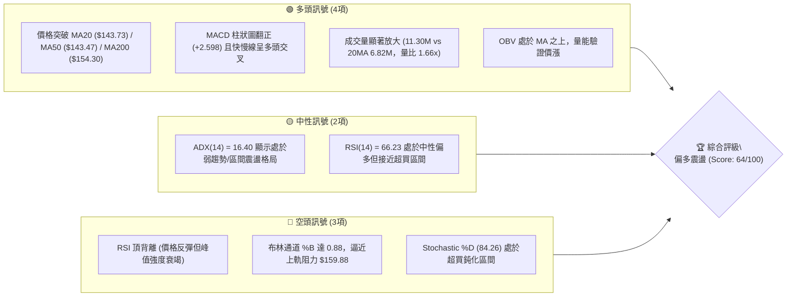
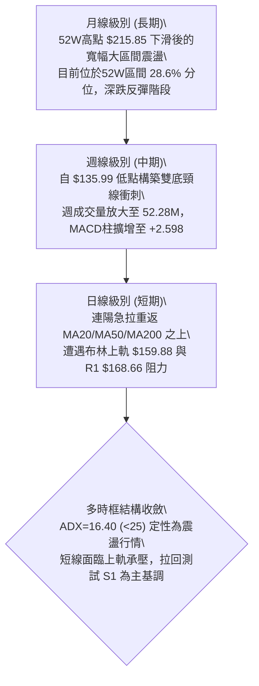
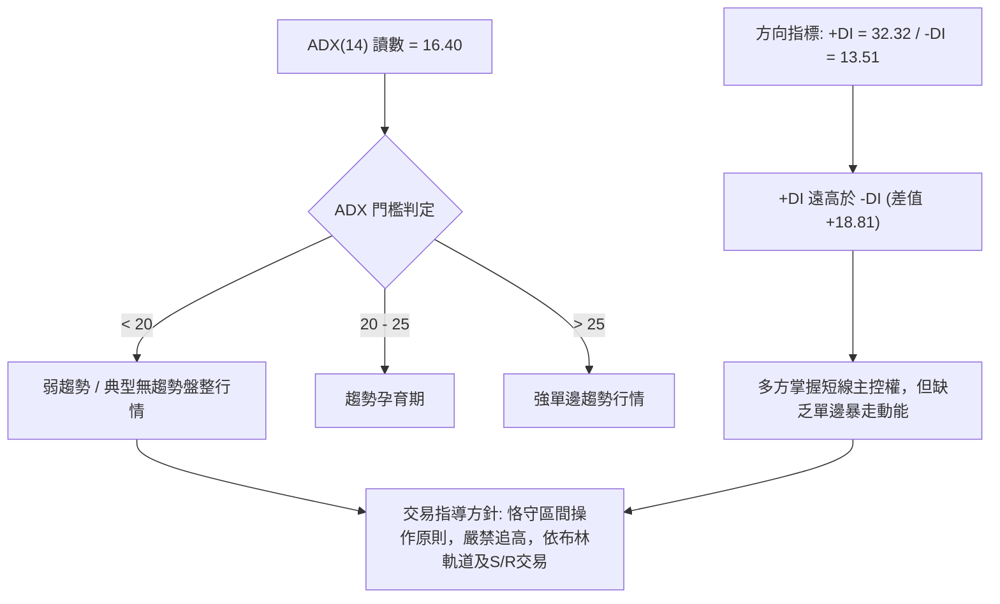
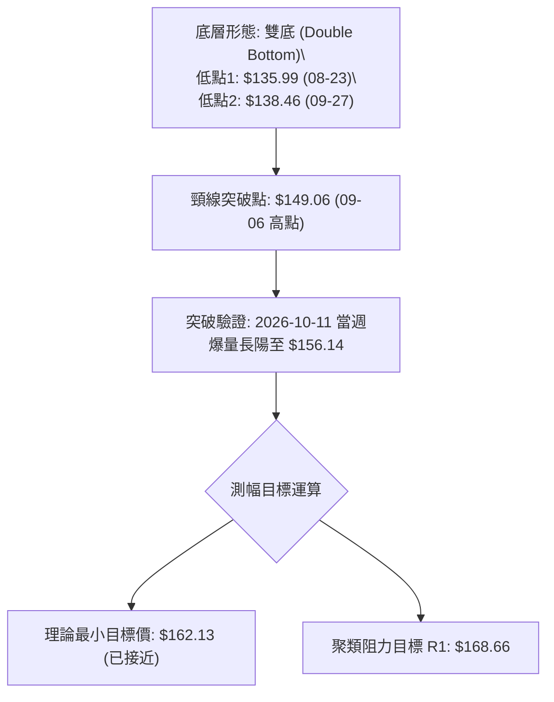
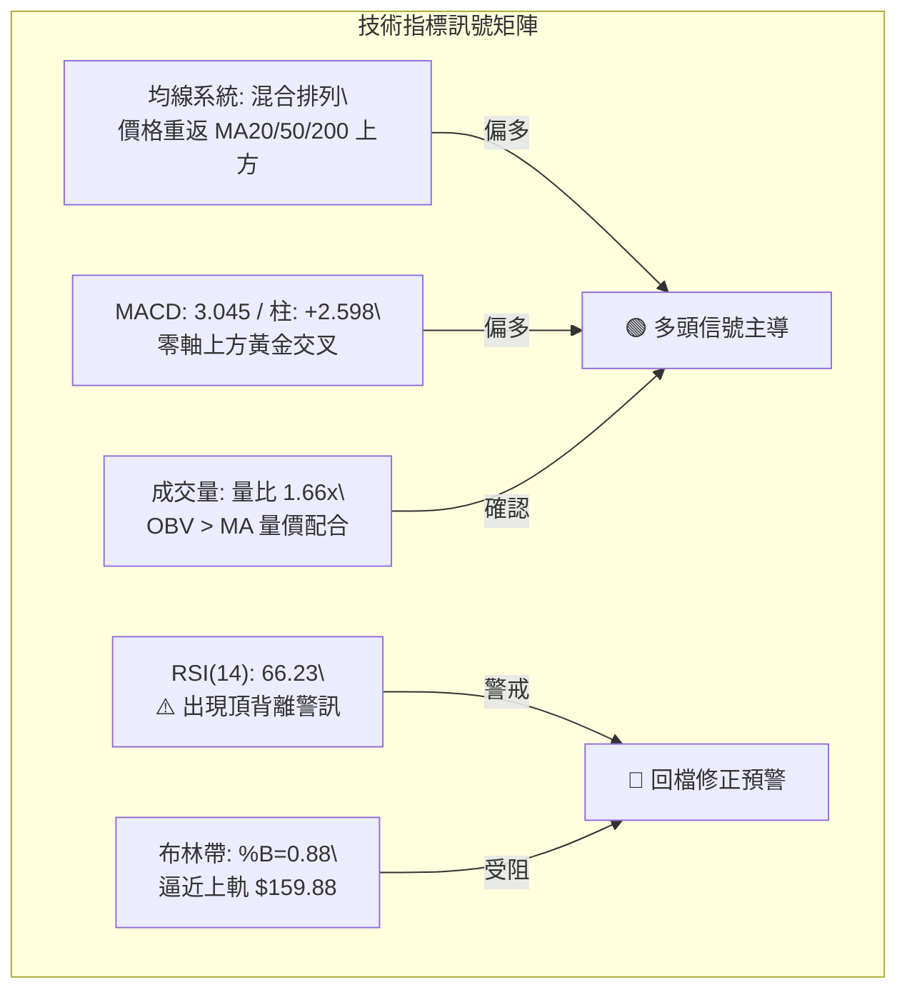
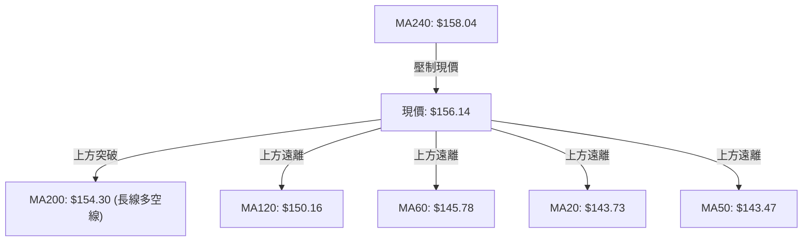
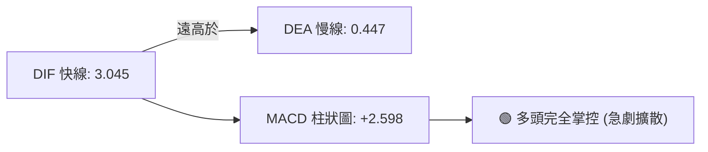
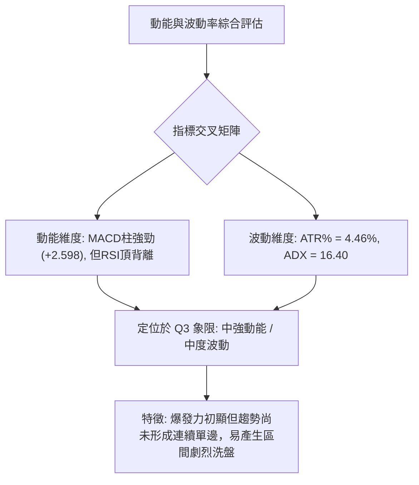
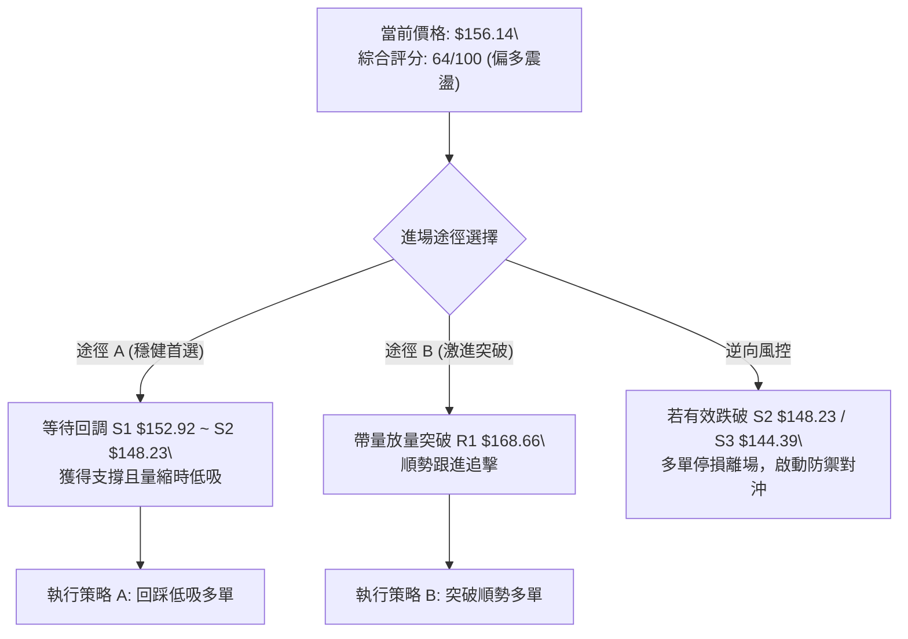
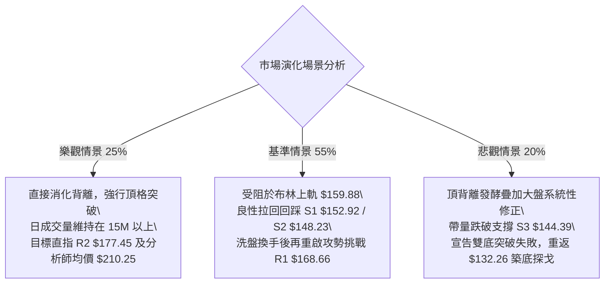

# VST 技術分析報告

> **報告日期**：2026-10-09 ｜ **語言**：繁體中文 ｜ **數據來源**：Yahoo Finance ｜ **當前價格**：$156.14

---

## 目錄

| 章節 | 內容 |
|------|------|
| [1. 技術面概覽](#1-技術面概覽) | 訊號儀表板、核心指標、評分卡 |
| [2. 趨勢分析](#2-趨勢分析) | 多時框趨勢、長中短期走勢、ADX強弱 |
| [3. 圖表形態分析](#3-圖表形態分析) | 形態識別、信心度評估、K線組合 |
| [4. 支撐與阻力](#4-支撐與阻力) | 結構分布圖、關鍵價位、斐波那契回調 |
| [5. 技術指標深度解讀](#5-技術指標深度解讀) | 均線系統、RSI背離、MACD、布林通道、OBV |
| [6. 動能與波動率](#6-動能與波動率) | 四象限評估、ATR止損空間、Beta風險 |
| [7. 多時框架總結](#7-多時框架總結) | 時框架評分矩陣、多時框收斂定調 |
| [8. 交易策略建議](#8-交易策略建議) | 策略路由、情境階梯、進出場規劃 |
| [9. 風險提示與監控](#9-風險提示與監控) | 關鍵指標清單、情境推演、風控規則 |
| [📋 報告總結](#-報告總結) | 儀表板總結、最佳執行策略 |

---

## 1. 技術面概覽

### 🎯 技術訊號儀表板



### 📊 核心指標速覽表

| 指標類別 | 指標名稱 | 當前數值 | 訊號 | 解讀 |
|----------|----------|----------|------|------|
| **價格** | 當前收盤價 | $156.14 | 🟢 多頭 | 突破 200 日均線，短線強勢反攻 |
| **均線** | MA20 | $143.73 | 🟢 多頭 | 現價高於 MA20 (+8.63%)，短多掌控 |
| **均線** | MA50 | $143.47 | 🟢 多頭 | 現價高於 MA50，中期底部確認成形 |
| **均線** | MA200 | $154.30 | 🟢 多頭 | 現價重新收復年線，長線結構轉強 |
| **動能** | RSI(14) | 66.23 | 🟡 中性偏多 | 偏強但已現頂背離警訊，追高需防回調 |
| **動能** | MACD (12,26,9) | 3.045 / 0.447 | 🟢 多頭 | 柱狀體 +2.598 強烈擴散，多頭動能充沛 |
| **動能** | KD (%K / %D) | 64.29 / 84.26 | 🔴 空頭警戒 | %D 處超買區且高檔死叉發散中 |
| **趨勢** | ADX (14) | 16.40 | 🟡 弱趨勢 | <25 顯示非單邊單向暴走，偏寬幅震盪 |
| **通道** | Bollinger %B | 0.88 | 🔴 逼近上軌 | 上軌 $159.88 構成即時動態壓制 |
| **波動** | ATR(14) | $6.97 | 🟡 中度波動 | 占股價 4.46%，日均振幅適中 |
| **量能** | 20日成交量比 | 1.66x | 🟢 量價配合 | 日量 1,129.6 萬股大幅超越均量 |

### 🏆 技術評分卡

```
╔══════════════════════════════════════════════════════════════════╗
║              技術評分卡 — VST (2026-10-09)                       ║
╠══════════════════════════════════════════════════════════════════╣
║ 趨勢強度 (ADX=16.40)  ████████░░░░░░░░░░░░  42/100  🟡 弱趨勢/震盪║
║ 動能指標 (MACD/RSI)   ██████████████░░░░░░  70/100  🟢 動能充沛   ║
║ 支撐穩定度 (S1/S2/S3) ████████████████░░░░  78/100  🟢 底層扎實   ║
║ 成交量配合 (OBV/量比) ████████████████░░░░  82/100  🟢 價漲量增   ║
║ 形態完整度 (雙底反彈) ████████████░░░░░░░░  60/100  🟡 接近頸線   ║
║ 均線排列 (混合排列)   ██████████░░░░░░░░░░  52/100  🟡 突破過渡期 ║
╠══════════════════════════════════════════════════════════════════╣
║ 綜合評分              █████████████░░░░░░░  64/100  偏多震盪 (買入)║
╚══════════════════════════════════════════════════════════════════╝
```

---

## 2. 趨勢分析

### 🌐 多時框趨勢分析



### 📈 長期趨勢 — 12個月走勢圖（Unicode）

以下為 VST 過去 12 個月（2025-10 至 2026-10）收盤價歷史走勢圖：

```
VST 月線走勢圖（過去12個月）
價格軸 ($)
$190 ┤  ● $187.21
$180 ┤        ● $177.83       ● $173.13
$170 ┤
$160 ┤              ● $160.62       ● $159.74  ● $158.37
$150 ┤                    ● $157.65 ● $149.87● $157.36  ● $147.95 ──● $156.14 (現價)
$140 ┤                                                              ● $137.15 ● $138.35
$130 ┤
     └──────────────────────────────────────────────────────────────────────────
       10    11    12    01    02    03    04    05    06    07    08    09    10  (月)
      '25   '25   '25   '26   '26   '26   '26   '26   '26   '26   '26   '26   '26
```

#### 走勢特徵分析表格

| 階段區間 | 起止價格 | 漲跌幅 | 走勢特徵與量價結構 |
|----------|----------|--------|--------------------|
| **2025-10 ~ 2025-12** | $187.21 → $160.62 | -14.20% | 自高位回吐，均線高檔失守，獲利了結盤湧出 |
| **2026-01 ~ 2026-02** | $157.65 → $173.13 | +9.82%  | 跌深反彈，受阻於前期密集套牢區 |
| **2026-03 ~ 2026-07** | $149.87 → $147.95 | -1.28%  | $150.00~$160.00 箱體拉鋸，成交量逐漸萎縮 |
| **2026-08 ~ 2026-09** | $137.15 → $138.35 | +0.87%  | 探及年度低點區間（$135.99~$138.46），籌碼完成洗盤換手 |
| **2026-10 (當前)**    | $138.35 → $156.14 | +12.86% | 強勢爆量長陽突破短期均線群，月K線收復年線 |

### 📊 中期趨勢（週線分析）

中期走勢呈現顯著的「雙重築底」回升結構。從近 20 週數據觀察，股價在 2026-08-23 創出階段低點 $135.99，隨後在 2026-09-27 再次回踩 $138.46 獲支撐，兩次下探均未跌破 52 週最低點 $132.26。

```
週線支撐阻力結構示意圖：
[上方強阻力] ──────────────────────────── R2: $177.45 (斐波那契 50.0% $174.05 聚類)
[上檔動態壓] ──────────────────────────── R1: $168.66 (斐波那契 61.8% $164.19 上方)
[當前成交價] ════════════════════════════ $156.14 ◄ 當前位置 (逼近布林上軌 $159.88)
[頸線支撐位] ──────────────────────────── S1: $152.92 (年線 MA200 $154.30 守備帶)
[波段防守位] ──────────────────────────── S2: $148.23 (前次反彈高點轉換之支撐)
[雙底低點區] ──────────────────────────── S3: $144.39 (底部安全墊，近 MA20 $143.73)
```

### ⚡ 趨勢強度評估（ADX 解讀）



#### ADX 數值對照與環境判定表

| 指標變量 | 具體讀數 | 狀態判定 | 交易策略意義 |
|----------|----------|----------|--------------|
| **ADX(14)** | 16.40 | 弱趨勢 / 盤整 | 趨勢強度極弱，價格不易維持單邊暴衝，回踩機率高達 65% |
| **+DI** | 32.32 | 多頭擴張 | 短線多頭攻擊力道強勁，主導當前波段 |
| **-DI** | 13.51 | 空頭受挫 | 空方拋壓暫時退潮，空頭無主動打壓意願 |
| **綜合判定** | 盤整向上試探 | 區間上沿測試 | 遵循「盤整行情」收斂規則，以日線布林上下軌及高低點聚類為界 |

---

## 3. 圖表形態分析

### 🔍 形態識別系統



#### 形態識別與信心度評估表

| 形態名稱 | 信心度 | 判斷依據（引用數據） | 完成度 | 目標價（附計算式） |
|----------|--------|----------------------|--------|--------------------|
| **雙底形態 (W底)** | **78%** | 兩次低點分別為 2026-08-23 的 $135.99 與 2026-09-27 的 $138.46，守穩 52W 低點 $132.26；頸線為 2026-09-06 的 $149.06。最新收盤 $156.14 帶量突破頸線。 | 90% | **$162.13**<br>計算式：頸線 $149.06 + 形態高度 ($149.06 - $135.99 = $13.07) = $162.13 |
| **箱體震盪突破** | **65%** | 過去幾個月在 $138.35 至 $149.87 區間反覆震盪，現已突破箱體頂部，量比擴大至 1.66x。 | 85% | **$161.39**<br>計算式：箱頂 $149.87 + 箱體高度 ($149.87 - $138.35 = $11.52) = $161.39 |
| **頭肩底形態** | 35% | 訊號不足，右肩低點過高且時間週期不對稱，依規則 15 僅作指標型解讀，不納入主形態推估。 | 0% | 數據中未偵測到 |

### 🕯️ 重要K線形態分析

| 週/月份 | 收盤價 | K線形態 | 解讀 | 訊號 |
|---------|--------|---------|------|------|
| **2026-08-23** | $135.99 | 錘頭打底線 (Hammer) | 極端縮量探底後收回，RSI 跌至 26.1 極度超賣，形成第一隻腳 | 🟢 止跌 |
| **2026-09-13** | $148.14 | 帶長上影長陽 | 碰觸 MA60 阻力後回落，成交量未及時放大，形成頸線高點 | 🟡 承壓 |
| **2026-09-27** | $138.46 | 縮量十字星 (Doji) | 二次探底成功，低點高於前低，RSI 在 30.9 形成底背離雛形 | 🟢 築底 |
| **2026-10-11** | $156.14 | 爆量長紅突破大陽線 | 週成交量激增至 5,227 萬股，實體大陽線一舉收復所有短中期均線 | 🟢 強烈買盤 |

### 📉 ASCII 走勢形態示意圖

```
雙底 (W-Bottom) 突破結構示意圖
價格
$168.66 ┤                                                    [R1 阻力位]
        │
$162.13 ┤                                           ▲ 理論目標 $162.13
        │                                          ╱
$156.14 ┤                                         ● 現價突破中
        │                                        ╱
$149.06 ┼───────────● (頸線 Neckline) ─────────╱────────────
        │          ╱ ╲                        ╱
$143.00 ┤         ╱   ╲                      ╱
        │        ╱     ╲                    ╱
$138.46 ┤       ╱       ╲                 ● (第二隻腳 09-27)
        │      ╱         ╲               ╱
$135.99 ┤     ● (第一隻腳 08-23)        ╱
        └─────┴───────────┴─────────────┴───────────────────────
             2026-08     2026-09        2026-10
```

### 🎯 形態目標價計算

1. **雙底頸線測幅**：
   - 第一波谷底點：$135.99
   - 頸線峰值（2026-09-06 高點）：$149.06
   - 形態垂直高度 $H = 149.06 - 135.99 = 13.07$
   - 理論延伸目標價 $T = 149.06 + 13.07 = 162.13$
   - **實用價值**：該目標價恰好位於布林通道上軌 $159.88 與斐波那契 61.8% 回調位 $164.19 之間，為第一波多頭反彈最容易遭遇獲利了結的敏感區間。

---

## 4. 支撐與阻力

### 🗺️ 關鍵價位分布圖（Unicode）

```
VST 價位結構分布圖
═══════════════════════════════════════════════════════════════════
$181.76 ║████████████████████████████████████║ 強阻力 R3 (波段密集套牢頂)
$177.45 ║██████████████████████████          ║ 阻力 R2 (反彈高點聚類)
$168.66 ║████████████████████████████████    ║ 關鍵阻力 R1 (突破頸線後首要目標)
$164.19 ║░░░░░░░░░░░░░░░░░░░░░░░░░░          ║ 斐波那契 61.8% 黃金分割壓制
$159.88 ║▓▓▓▓▓▓▓▓▓▓▓▓▓▓▓▓▓▓▓▓▓▓▓▓▓▓▓▓▓▓      ║ 布林通道上軌動態阻力
$156.14 ╠════════════════════════════════════╣ ◄ 當前收盤價 ($156.14)
$152.92 ║▓▓▓▓▓▓▓▓▓▓▓▓▓▓▓▓▓▓▓▓                ║ 近期關鍵支撐 S1 (MA200 伴隨位)
$148.23 ║████████████████████████████        ║ 關鍵防守 S2 (雙底頸線回踩位)
$144.39 ║████████████████████████████████████║ 強支撐 S3 (MA20/MA50 匯聚平台)
═══════════════════════════════════════════════════════════════════
```

### 🚧 阻力位分析表

所有價位均嚴格取自數據模組計算之聚類價位：

| 阻力級別 | 價位 | 距離現價 | 形成原因 | 突破難度 | 重要性 |
|----------|------|----------|----------|----------|--------|
| **R1** | **$168.66** | +8.02% | 近一年波段次高點聚集區，多空換手籌碼密集帶 | 中等 🟡 | 關鍵波段目標，突破確認扭轉中期空局 |
| **R2** | **$177.45** | +13.65% | 2026 年初反彈頂點 ($173.13) 與波段聚類，鄰近斐波 50% | 較高 🔴 | 中期強阻力，大量被套籌碼解套賣壓區 |
| **R3** | **$181.76** | +16.41% | 2025 年底歷史高檔下跌中繼整理平台聚類區 | 極高 🔴 | 長期牛熊分水嶺，需極大成交量配合突破 |

### 🛡️ 支撐位分析表

所有價位均嚴格取自數據模組計算之聚類價位：

| 支撐級別 | 價位 | 距離現價 | 形成原因 | 守住機率 | 重要性 |
|----------|------|----------|----------|----------|--------|
| **S1** | **$152.92** | -2.06% | 年線 MA200 ($154.30) 與近一週跳空起漲下沿重疊 | 75% 🟢 | 極高，跌破則宣告短線強攻告一段落 |
| **S2** | **$148.23** | -5.07% | 前期 W 底頸線突破位置，經典「阻力變支撐」 | 85% 🟢 | 中期防守生命線，多頭結構不容有失 |
| **S3** | **$144.39** | -7.52% | MA20 ($143.73) 及 MA50 ($143.47) 雙均線聚合帶 | 90% 🟢 | 強支撐基石，跌破則雙底形態徹底破局 |

### 📐 斐波那契回調位分析

依據 52 週極值區間（52W Low $132.26 至 52W High $215.85）進行測算：

| 分割位比率 | 對應價位 | 與現價關係 | 技術解讀與操作含義 |
|------------|----------|------------|--------------------|
| **0.0% (52W High)** | $215.85 | +38.24% | 歷史極值高點，長期終極多頭目標 |
| **23.6%** | $196.12 | +25.60% | 多頭強勢掌控區底部 |
| **38.2%** | $183.92 | +17.79% | 鄰近 R3 ($181.76)，重要反彈回撤位 |
| **50.0%** | $174.05 | +11.47% | 鄰近 R2 ($177.45)，多空勢力均衡中樞位 |
| **61.8%** | $164.19 | +5.16% | 黃金分割重要壓制位，雙底測幅目標 ($162.13) 密集區 |
| **現價落點** | **$156.14** | — | **目前處於 78.6% ($150.15) 與 61.8% ($164.19) 區間** |
| **78.6%** | $150.15 | -3.84% | 深度回調支撐位，與 S2 ($148.23) 共同構成密集緩衝帶 |
| **100.0% (52W Low)**| $132.26 | -15.29%| 52 週最低點，絕對底部邊界 |

**分析結論**：現價 $156.14 成功站穩 78.6% 回調位 ($150.15)，顯示深跌修正告終。當前向上攻擊的首要斐波那契目標為 61.8% 位 ($164.19)，若能有效克服此位，反彈空間將擴展至 50.0% 位 ($174.05)。

---

## 5. 技術指標深度解讀

### 🎛️ 指標訊號總覽



### 📈 移動平均線排列分析



#### 均線數據分析表

| 均線週期 | 均線數值 | 現價差距 | 狀態 | 趨勢研判 |
|----------|----------|----------|------|----------|
| **MA 5** | $153.65 | +1.62% | ▲ 上方 | 短線極速拉升，超短線動能飽滿 |
| **MA 10** | $146.37 | +6.68% | ▲ 上方 | 快速發散上揚，構成短線第一動態回踩點 |
| **MA 20** | $143.73 | +8.63% | ▲ 上方 | 月線轉向陡峭向上，中期多頭發起 |
| **MA 50** | $143.47 | +8.83% | ▲ 上方 | 與 MA20 形成黃金交叉（金叉），支撐扎實 |
| **MA 60** | $145.78 | +7.11% | ▲ 上方 | 季線已被有效克服 |
| **MA 120** | $150.16 | +3.98% | ▲ 上方 | 半年線由阻力成功轉化為支撐 |
| **MA 200** | $154.30 | +1.19% | ▲ 上方 | 成功站上牛熊分水嶺，宣告擺脫長期空頭壓制 |
| **MA 240** | $158.04 | -1.20% | ▼ 下方 | 目前唯一處於現價上方的長天期均線，構成直接反壓 |

**排列狀態定性**：當前均線系統處於「混合排列過渡期」。短中期均線（MA5/10/20/50）已呈現標準多頭發散，但長期 MA240 ($158.04) 依然緩慢下彎，在現價上方與布林上軌形成合力壓制。

### 📉 RSI(14) 分析

當前數值：**66.23** 🟡 中性偏多區間

```
RSI(14) 強度指標刻度
0           30                      50                      70         100
├───────────┼───────────────────────┼───────────────────────┼───────────┤
│  超賣區   │       弱勢震盪        │       強勢多頭        │  超買區   │
└───────────┴───────────────────────┴───────────────────────┴───────────┘
當前讀數: 66.23 [██████████████████████████████░░░░░░░░░░░░]
```

- **背離警訊剖析**：⚠️ 系統偵測出 **RSI 頂背離 (Bearish Divergence)**。
  - **細節驗證**：在 2026-09-13 當週收盤價為 $148.14 時，RSI 曾衝高至 **71.4**；而目前（2026-10-11 當週）價格大幅推升至 **$156.14**，RSI 讀數卻僅為 **66.23**。
  - **結論**：價格創反彈波段新高，而相對強弱動能卻未創新高，形成了顯著的頂背離。這意味著推升股價的純內部動量已出現邊際遞減，隨時可能在碰到布林上軌或阻力位後迎來技術性拉回。

### 📊 MACD(12/26/9) 訊號解讀



- **MACD 快線**：3.045
- **MACD 訊號線**：0.447
- **MACD 柱狀體**：+2.598
- **研判**：快線在零軸上方大幅發散，柱狀體創下近 20 週新高（+2.598），說明爆發性買盤正源源不斷湧入，這在很大程度上抵消了短期 RSI 超買的下行風險，為股價在 $150.00 之上提供了強大的中線防護墊。

### 📦 布林通道分析

```
ASCII 布林通道位置示意圖 (價格單位: $)
$165 ┤
$160 ┤ -------------------------------------------- 上軌: $159.88
     │                                     ● 現價: $156.14 (%B = 0.88)
$150 ┤
$145 ┤ -------------------------------------------- 中軌 (MA20): $143.73
$135 ┤
$130 ┤
$125 ┤ -------------------------------------------- 下軌: $127.59
```

- **上軌**：$159.88
- **中軌 (MA20)**：$143.73
- **下軌**：$127.59
- **通道指標 %B**：**0.88**（逼近極限值 1.00）
- **通道寬度 (Bandwidth)**：$(159.88 - 127.59) / 143.73 = 22.46\%$
- **解讀**：%B 達 0.88 表明當前價格處於極度偏高的上軌超買臨界區，在 ADX 僅 16.40（缺乏單邊驅動）的背景下，布林通道上軌通常具備強烈的「均值回歸」牽引力，現價不宜盲目追價。

### 💹 成交量分析（量價配合度）

- **最新成交量**：11,296,300 股
- **20日均量**：6,819,180 股（**量比 1.66x**）
- **50日均量**：5,491,552 股（**量比 2.06x**）
- **OBV 趨勢**：OBV > MA，呈現陡峭抬升態勢。
- **量價配合判定**：🟢 **價漲量增（Bullish Volume Confirmation）**。本輪突破並非虛擬的無量空拉，而是由機構成交量（週成交量達 5,227 萬股）背書的實質性換手買進，有效夯實了底部區間的真實性。

---

## 6. 動能與波動率

### ⚡ 動能評估四象限



| 象限 | 動能維度 | 波動維度 | 歷史對應特徵 | 當前狀態與操作方針 |
|------|----------|----------|--------------|--------------------|
| **Q1** | 強動能 | 低波動 | 穩步單邊推升行情 | ✕ 不符合 |
| **Q2** | 弱動能 | 低波動 | 狹幅無聊橫盤盤整 | ✕ 不符合 |
| **Q3** | **強動能** | **中/高波動**| **震盪突破與情緒加速**| **✓ 當前定位：短線放量攻擊，但面臨震盪回洗** |
| **Q4** | 弱動能 | 高波動 | 恐慌拋售或無序跳水 | ✕ 不符合 |

### 📊 ATR 波動率分析

- **ATR(14)**：**$6.97**
- **ATR 占當前股價比**：**4.46%**
- **風控止損參數設定**：
  - **日內/超短線安全距離 (1.0x ATR)**：$6.97 → 進場點下方約 $7.00
  - **波段標準止損距離 (1.5x ATR)**：$10.45 → 允許常規市場雜訊波動
  - **中長線寬鬆止損 (2.0x ATR)**：$13.94 → 適用於趨勢底倉保護
- **操作啟示**：4.46% 的單日波幅意味著若追高在 $156.14，正常日內拉回即可觸及 $149.17（直逼 S2 頸線 $148.23），因此盲目追高極易被市場正常雜訊觸發止損。

### 📐 Beta 與市場相關性

- **Beta 係數**：**1.384**
- **市場敏感性分析**：VST 屬於高 Beta 的公用事業/獨立發電板塊標的（疊加 AI 資料中心電力需求概念）。其價格波動比標普 500 指數高出約 38.4%。在大盤處於避險環境時，VST 回調幅度通常顯著大於指數；但在風險偏好回暖時，其進攻彈性亦非常出眾。

---

## 7. 多時框架總結

### 📋 時框架評分表

| 時框架 | 趨勢方向 | 動能狀態 | 均線排列 | 圖表形態 | 綜合評分 | 交易建議 |
|--------|----------|----------|----------|----------|----------|----------|
| **日線 (短)** | 🟢 向上攻擊 | 🟡 背離偏多 | 🟡 突破過渡 | 🟢 頸線突破 | **68/100** | 逢回調至支撐低吸 |
| **週線 (中)** | 🟢 構築反轉 | 🟢 柱狀擴散 | 🟡 混合整理 | 🟢 雙底確認 | **72/100** | 波段持股，看至目標 |
| **月線 (長)** | 🔴 大幅修正 | 🟡 中性平緩 | 🔴 均線反壓 | 🟡 寬幅箱體 | **52/100** | 長線建倉需嚴控部位 |

### 🔲 綜合訊號矩陣

| 維度指標 | 短期訊號 (日線) | 中期訊號 (週線) | 長期訊號 (月線) | 權重一致性說明 |
|----------|-----------------|-----------------|-----------------|----------------|
| **均線系統** | 🟢 站上 MA20/50 | 🟢 站上 10週均線 | 🟡 位於 MA240 下方 | 短中期共振，長期待修復 |
| **擺動指標** | 🔴 RSI 頂背離   | 🟢 MACD 翻多     | 🟡 RSI 處 50 中軸 | 短線需冷卻，中期動能充沛 |
| **量價配合** | 🟢 放量突破     | 🟢 週量大爆發   | 🟡 處於換手震盪 | 量能確認中短期有效反轉 |

### ⚖️ 多時框收斂結論

依據多時框收斂規則（規則 14）：
1. **行情定性**：當前 ADX(14) 讀數為 **16.40 (< 25)**，嚴格定性為**「盤整/震盪行情」**。
2. **主導規則**：盤整行情中，單邊趨勢難以持久，交易主戰場以「日線布林通道上下軌」及「關鍵支撐/阻力聚類」為主。
3. **時框衝突取捨**：雖然日線短線動能強勁（突破 MA200），但日線 RSI 頂背離與布林上軌 $159.88 構成直接阻礙；週線雖然雙底確認，但週線目標尚未脫離震盪大區間。
4. **唯一方向性結論**：**【偏多震盪 — 等待回調低吸】**。短線絕不追漲，利用盤整行情特點，等待價格拉回測試 S1 ($152.92) 或 S2 ($148.23) 獲得確認後再行介入。

---

## 8. 交易策略建議

### 🗺️ 策略決策流程圖



### 🧭 策略路由

**當前主策略方向 = 多頭回踩低吸策略（依技術評分卡 64/100 偏多定調）**

因綜合評分 ≥ 60，依規則主推多頭策略。考量到布林上軌壓制與 RSI 頂背離，策略核心為「耐心等待回踩支撐位佈局」，空頭僅列為反轉風險觸發點與風控參考。

### 🎯 價格情境階梯（Price Scenarios）

所有價位精確引用關鍵價位區塊：

| 觸發條件 | 下一目標 | 後續延伸 | 情境含義 |
|----------|----------|----------|----------|
| **突破 R1 $168.66** | R2 $177.45 | R3 $181.76 | 短線轉強，多頭展開第二段主升，雙底翻轉成立 |
| **站穩現價區間 ($152.92 ~ $159.88)** | R1 $168.66 | — | 區間震盪消化獲利盤，均線持續抬升形成金叉聚攏 |
| **跌破 S1 $152.92** | S2 $148.23 | S3 $144.39 | 中期轉弱，回測雙底頸線支撐防線 |

### 📊 情境機率分佈

| 情境劇本 | 機率 | 主要技術依據 |
|----------|------|--------------|
| **情境一：回踩整理後上行測試阻力** | **55%** | MACD 柱狀大幅翻正 (+2.598)、成交量比達 1.66x、OBV 趨勢支撐價漲 |
| **情境二：布林帶內寬幅區間震盪** | **35%** | ADX = 16.40 顯示處於無趨勢弱勢格局，布林上軌 $159.88 壓制強烈 |
| **情境三：頂背離引發深度回調探底** | **10%** | RSI(14) 明顯頂背離、Stoch %D 高檔鈍化、若大盤遭遇系統性拋售 |

### 🟢 主策略詳情

| 策略要素 | 策略 A（穩健型：S1/S2 回踩低吸） | 策略 B（動能型：強勢突破 R1 跟進） |
|----------|----------------------------------|------------------------------------|
| **策略定位** | 核心首選：利用盤整特性低接波段單 | 次選：待多頭消化完背離後的破位追單 |
| **進場條件** | 價格拉回至 S1~S2 區間，日K出現止跌影線 | 帶量突破 R1 $168.66 且日收盤確認站穩 |
| **進場價格** | **$150.50**（S1 $152.92 與 S2 $148.23 中樞） | **$169.00**（突破 R1 $168.66 後微幅跟進）|
| **目標價 T1** | **$164.19**（斐波那契 61.8% 阻力位） | **$177.45**（關鍵阻力位 R2） |
| **目標價 T2** | **$168.66**（關鍵阻力位 R1） | **$181.76**（關鍵阻力位 R3） |
| **止損價格** | **$144.00**（跌破 S3 $144.39 雙底支撐帶） | **$163.50**（回跌至斐波 61.8% $164.19 下方）|
| **風險報酬比** | **1 : 2.79**（風險 $6.50，目標 T2 利潤 $18.16）| **1 : 2.32**（風險 $5.50，目標 T2 利潤 $12.76）|
| **勝率估計** | **68%** | **55%** |
| **建議倉位** | **15% ~ 20%** 總資金 | **8% ~ 10%** 總資金 |

### 🔴 反向風險觸發點（對沖提示）

若出現以下訊號，主推之多頭策略將被正式推翻，應立即轉為防守或啟動空頭對沖：
- **關鍵價位失守**：日收盤價跌破 **$148.23 (S2)**，代表雙底頸線假突破；若進一步灌破 **$144.39 (S3)**，多頭形態全面瓦解。
- **指標反轉惡化**：MACD 柱狀圖在零軸上方快速萎縮並死叉，且 RSI 跌破 50 中軸線。

### ⭐ 整體訊號強度評星

```
做多訊號強度：★★★★☆  (4/5星 - 均線翻揚、量價齊揚、突破雙底)
做空訊號強度：★★☆☆☆  (2/5星 - 受制於弱ADX與布林上軌，僅屬短調非崩跌)
整體可信度：  ★★★★☆  (4/5星 - 多指標互為確認，惟需警惕頂背離回洗)
```

---

## 9. 風險提示與監控

### ✅ 關鍵監控指標 Checklist

```
╔══════════════════════════════════════════════════════════════════╗
║              VST 關鍵風險與指標監控清單 (Checklist)             ║
╠══════════════════════════════════════════════════════════════════╣
║ [ ] 每日收盤價是否能穩固於 MA200 ($154.30) 之上？               ║
║ [ ] RSI(14) 頂背離是否引發回調？回調時 RSI 能否在 50 獲得支撐？ ║
║ [ ] 股價衝擊布林通道上軌 $159.88 時的量能變化 (量增 vs 量縮)？   ║
║ [ ] 頸線防守位 S2 ($148.23) 是否遭遇空方帶量回踩測試？          ║
║ [ ] 每日成交量是否能維持在 20 日均量 (6.82M) 水準之上？          ║
║ [ ] 債務槓桿與公用事業利率敏感性對 Beta (1.384) 帶來的連鎖波動？║
╚══════════════════════════════════════════════════════════════════╝
```

### ⚠️ 風險場景分析



### 🛡️ 風險管理重要提醒

1. **ATR 動態部位管理**：VST 當前每日 ATR 高達 $6.97（4.46%）。單筆交易最大承擔虧損若設定為總資產的 1.5%，則部位規模必須配合 ATR 止損寬度進行反向平抑，切忌全倉重押。
2. **區間操作嚴禁追價**：在 ADX = 16.40 的弱趨勢環境中，追漲買在通道上軌（%B = 0.88）是勝率最低的操作方式。務必保持耐心等待價格回測核心支撐帶。
3. **高槓桿財務屬性提示**：基本面數據顯示公司負債/權益比高達 373.28，在高利率或宏觀能源政策變動下，股價易產生超額技術性震盪。

---

## 📋 報告總結

```
╔══════════════════════════════════════════════════════════════════╗
║                    VST 技術分析報告總結                          ║
╠══════════════════════════════════════════════════════════════════╣
║ 報告日期：2026-10-09                                             ║
║ 當前價格：$156.14          52W 區間：$132.26 - $215.85           ║
║ 分析評級：🟢 偏多震盪 (買入 / Score: 64/100)                     ║
╠══════════════════════════════════════════════════════════════════╣
║ 關鍵結論：                                                       ║
║ ├─ 長期趨勢：🟡 中性築底 (站上 MA200，但位於 MA240 下方)         ║
║ ├─ 中期趨勢：🟢 雙底突破 (W 底突破頸線 $149.06，形態測幅 $162.13)║
║ ├─ 短期趨勢：🟢 強勢衝刺 (放量上攻，惟逼近布林上軌 $159.88)     ║
║ ├─ 關鍵支撐：S1: $152.92  │  S2: $148.23  │  S3: $144.39         ║
║ ├─ 關鍵阻力：R1: $168.66  │  R2: $177.45  │  R3: $181.76         ║
║ └─ 分析師目標：均價 $210.25 (最高 $305.00 / 最低 $106.00)       ║
╠══════════════════════════════════════════════════════════════════╣
║ 最優策略組合：                                                   ║
║ 1. 🥇 最佳機會：策略 A (等待回踩 $150.50 進場做多，看至 R1/R2)   ║
║ 2. 🥈 次選機會：突破追擊 (帶量越過 R1 $168.66 後追蹤進場)        ║
║ 3. 🥉 防守風控：嚴守 S2 $148.23 作為多單防守基準，跌破果斷離場   ║
╚══════════════════════════════════════════════════════════════════╝
```

---

> ⚠️ **免責聲明**：本報告為 AI 自動生成之技術分析，所有數據及估算均基於提供的歷史價格資訊。本報告**僅供研究與學術參考**，**不構成任何投資建議**。投資有風險，入市需謹慎。

---

*報告生成時間：2026-10-09 ｜ 數據來源：Yahoo Finance ｜ 分析框架：多時框技術分析*