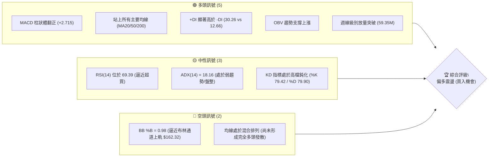
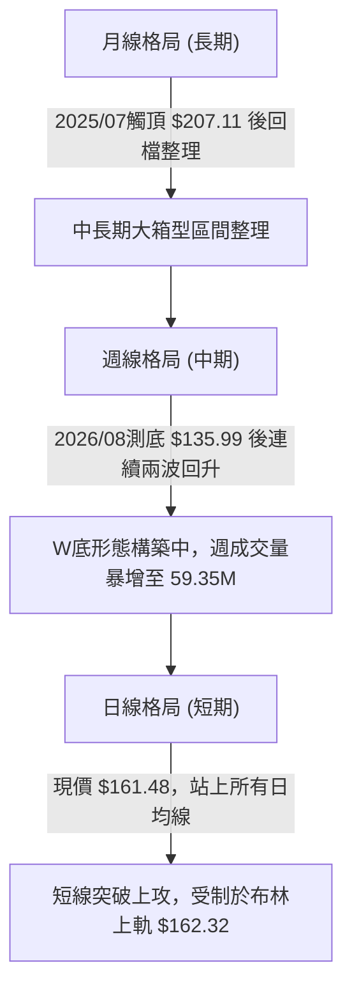
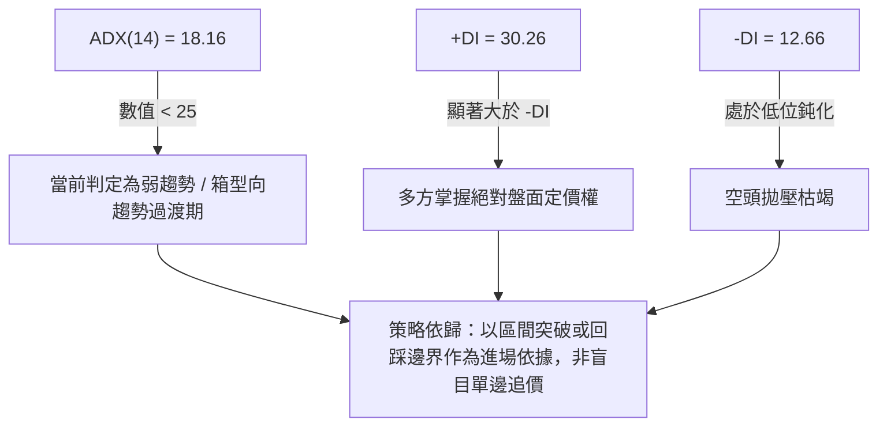
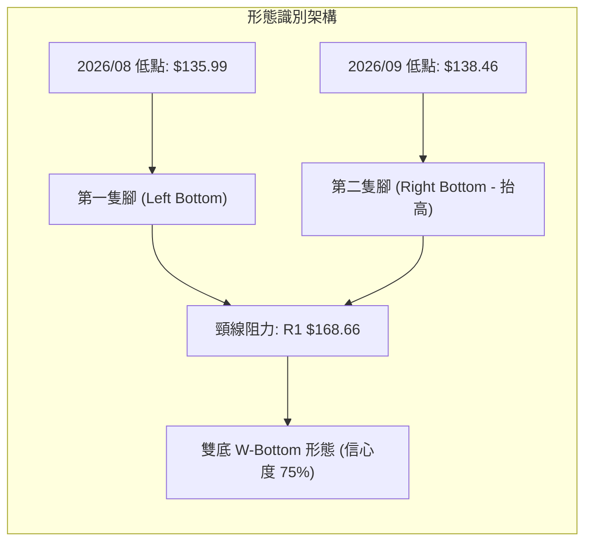
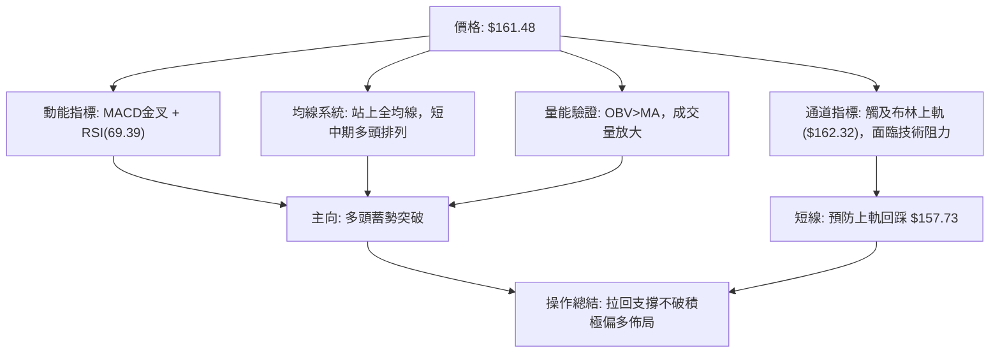
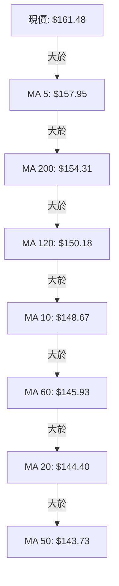
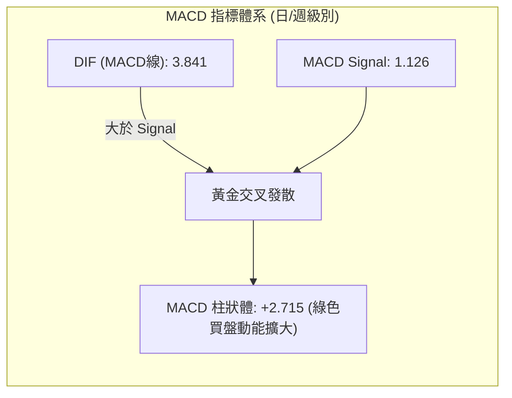
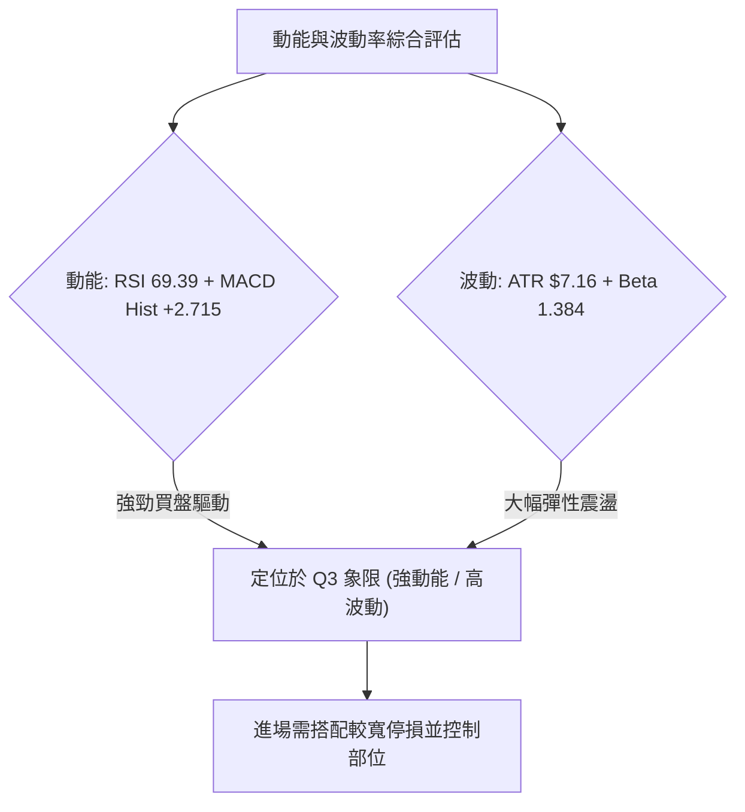
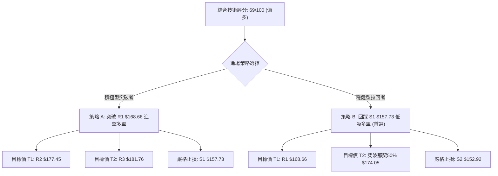
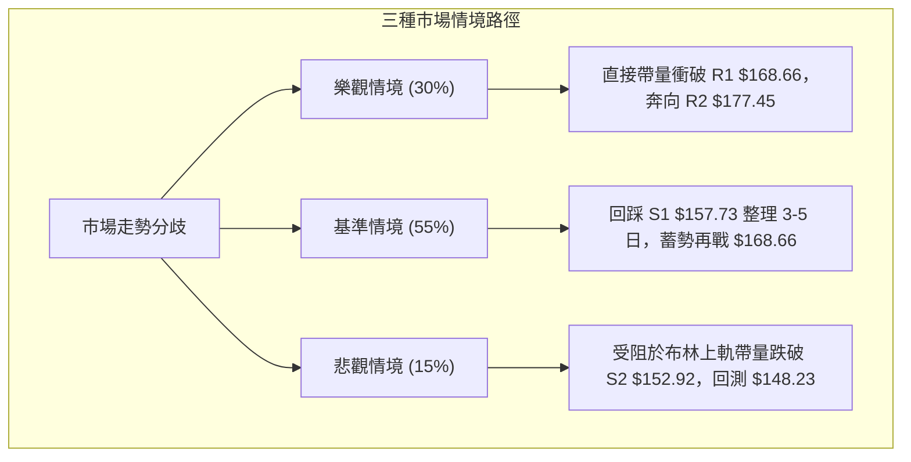

# VST 基本面深度分析報告

> **報告日期**：2026-10-10 ｜ **語言**：繁體中文 ｜ **數據來源**：Yahoo Finance ｜ **當前價格**：$161.48

---

## 目錄

| 章節 | 內容 |
|------|------|
| [1. 技術面概覽](#1-技術面概覽) | 訊號儀表板、核心指標、評分卡 |
| [2. 趨勢分析](#2-趨勢分析) | 多時框趨勢、長中短期走勢 |
| [3. 圖表形態分析](#3-圖表形態分析) | 形態識別、K線組合、目標價 |
| [4. 支撐與阻力](#4-支撐與阻力) | 關鍵價位、斐波那契回調 |
| [5. 技術指標深度解讀](#5-技術指標深度解讀) | MA/RSI/MACD/布林/成交量 |
| [6. 動能與波動率](#6-動能與波動率) | 動能評估、ATR、Beta |
| [7. 多時框架總結](#7-多時框架總結) | 時框架評分矩陣 |
| [8. 交易策略建議](#8-交易策略建議) | 多空策略、風險報酬比 |
| [9. 風險提示與監控](#9-風險提示與監控) | 監控指標、風險場景 |

---

## 1. 技術面概覽

### 🎯 技術訊號儀表板



### 📊 核心指標速覽表

| 指標類別 | 指標名稱 | 當前數值 | 訊號 | 解讀 |
|----------|----------|----------|------|------|
| **價格** | 當前價格 | $161.48 | 🟢 | 突破多條中短期均線，週漲幅達顯著水準 |
| **均線** | MA20 | $144.40 | 🟢 | 價格在 MA20 上方 +11.83%，短線動能強勁 |
| **均線** | MA50 | $143.73 | 🟢 | 價格在 MA50 上方 +12.35%，中期底線確立 |
| **均線** | MA200 | $154.31 | 🟢 | 價格成功收復長期年線，多方取得制空權 |
| **動能** | RSI(14) | 69.39 | 🟡 | 逼近 70 超買警戒線，短線追高風險略增 |
| **動能** | MACD | 3.841 (Hist +2.715) | 🟢 | DIF 高於 MACD Signal (1.126)，紅柱擴張強烈 |
| **波動** | ATR(14) | $7.16 (4.43%) | 🟡 | 每日平均震幅較大，進出場需寬設防守空間 |

### 🏆 技術評分卡

```
╔══════════════════════════════════════════════════════════════╗
║                 技術評分卡 — VST (2026-10-10)                ║
╠══════════════════════════════════════════════════════════════╣
║ 趨勢強度      ██████████░░░░░░░░░░  52/100  🟡 中性 (ADX=18.16)║
║ 動能指標      ████████████████░░░░  80/100  🟢 看多 (MACD/RSI) ║
║ 支撐穩定度    ██████████████░░░░░░  72/100  🟢 看多 (均線集群) ║
║ 成交量配合    ██████████████████░░  88/100  🟢 看多 (OBV/週量) ║
║ 形態完整度    ████████████░░░░░░░░  62/100  🟡 中性 (雙底雛形) ║
║ 均線排列      ████████████░░░░░░░░  60/100  🟡 中性 (混合發散) ║
╠══════════════════════════════════════════════════════════════╣
║ 綜合評分      ██████████████░░░░░░  69/100  🟢 偏多進攻態勢    ║
╚══════════════════════════════════════════════════════════════╝
```

---

## 2. 趨勢分析

### 🌐 多時框趨勢分析



### 📈 長期趨勢 — 12個月走勢圖（Unicode）

```
VST 月線走勢圖（過去12個月：2025-11 至 2026-10）
價格軸 ($)
$190 ┤
$180 ┤● (11月:177.83)
$170 ┤                 ● (2月:173.13)
$160 ┤    ●(12月:160.62)                                    ●←現在 (10月:161.48)
$150 ┤        ●(1月:157.65)   ●(3月:149.87) ●(5月:159.74)
$140 ┤                                  ●(4月:157.36) ●(6月:158.37)
$130 ┤                                             ●(7月:147.95) ●(8月:137.15) ●(9月:138.35)
     └─────────────────────────────────────────────────────────────────────────────
       11M   12M   01M   02M   03M   04M   05M   06M   07M   08M   09M   10M
```

**走勢特徵分析表格**：

| 階段區間 | 起訖月份 | 起訖價格 ($) | 漲跌幅 (%) | 量價走勢特徵與結構分析 |
|----------|----------|--------------|------------|------------------------|
| **高檔回吐期** | 2025/11 - 2025/12 | 177.83 → 160.62 | -9.68% | 自前波歷史高點降溫，月K呈現弱勢陰線 |
| **春季反彈期** | 2026/01 - 2026/02 | 157.65 → 173.13 | +9.82% | 跌深反彈，受阻於 $175 附近籌碼密集區 |
| **中期二次探底** | 2026/03 - 2026/08 | 173.13 → 137.15 | -20.78% | 震盪走低，於 8 月打出全年度波段低點 $132.26 |
| **強勢突破反轉** | 2026/09 - 2026/10 | 138.35 → 161.48 | +16.72% | 連續放量陽線收復多條均線，月線呈現長紅突破 |

### 📊 中期趨勢（週線分析）

中期走勢在 2026 年 8 月 23 日當週見到低點 $135.99，隨後在 9 月下旬再次打出低點 $138.46，未跌破 52 週最低點 $132.26。隨後於 2026 年 10 月展開暴力拉升，週成交量由 2,234 萬股放大至 5,935 萬股，週線 MACD 柱狀體從負值急遽轉為 +2.715。

```
中期支撐與壓力區間示意圖：
$168.66 ────────────────────── 阻力 R1 (前波反彈高點聚類)
          ▲ (現價推升中)
$161.48 ──┼─────────────────── 當前價格
          ▼ (拉回防守)
$157.73 ────────────────────── 支撐 S1 (週線關鍵頸線/MA5)
$152.92 ────────────────────── 支撐 S2 (密集換手區間)
$135.99 ────────────────────── 中期波段雙底低點
```

### ⚡ 趨勢強度評估（ADX 解讀）



**ADX 強度對照與解讀表**：

| 指標名稱 | 當前數值 | 參考臨界值 | 狀態評估 | 實戰意涵 |
|----------|----------|------------|----------|----------|
| **ADX(14)** | 18.16 | 25.00 | 弱趨勢/震盪 | 尚未形成大級別單邊單行道，行情處於由盤整向單邊發散的初生期 |
| **+DI** | 30.26 | 20.00 | 強勢多頭 | 買盤攻擊力度強，多方佔據主導 |
| **-DI** | 12.66 | 20.00 | 弱勢空頭 | 賣盤無連續下殺動能，空方退守 |
| **DI 差值** | +17.60 | 0.00 | 多頭擴張 | 多頭動能優勢擴大，有利後續 ADX 上衝突破 25 |

---

## 3. 圖表形態分析

### 🔍 形態識別系統



**形態信心度與目標價評估表**：

| 形態名稱 | 信心度 | 判斷依據（引用數據） | 完成度 | 目標價（附計算式） |
|----------|--------|----------------------|--------|--------------------|
| **雙底形態 (W-Bottom)** | 75% | 8/23 低點 $135.99 與 9/27 低點 $138.46 構成底底高，頸線為近一年高點聚類 R1 $168.66 | 85% | 依形態高度推算：$168.66 + ($168.66 - $135.99) = **$201.33** |
| **布林帶上軌突破形態** | 70% | 現價 $161.48 貼近 BB 上軌 $162.32，%B 達到 0.98，伴隨週量放大至 59.35M | 90% | 依布林帶擴張測幅：短線先看 R1 **$168.66** |
| **均線黃金交叉發散** | 60% | MA5 ($157.95) 與 MA10 ($148.67) 向上金叉貫穿長期均線 | 75% | 指標型動能延續：以斐波那契 50.0% **$174.05** 為波段滿足 |

### 🕯️ 重要K線形態分析

| 週/月份 | 收盤價 ($) | K線形態 | 解讀 | 訊號 |
|---------|------------|---------|------|------|
| **2026-08** | 137.15 | 帶長下影線鎚頭陰線 | 52週低點 $132.26 附近出現強勁逢低承接買盤 | 🟢 初步築底 |
| **2026-09** | 138.35 | 止跌小陽十字星 | 兩次下探 $138.46 未破前低，量縮震盪沉澱籌碼 | 🟡 蓄勢待發 |
| **2026-10-04** | 140.02 | 啟動陽線 | 週量由 22.34M 增至 34.71M，MACD 柱狀體翻正 (+0.023) | 🟢 轉折確認 |
| **2026-10-11** | 161.48 | 大陽線實體向上突破 | 單週量暴增至 59.35M，長紅貫穿多條均線壓力 | 🟢 強烈買訊 |

### 📉 ASCII 走勢形態示意圖

```
VST 雙底形態 (W-Bottom) 與突破示意圖
價格軸 ($)
$170 ┤                                        [R1: $168.66 頸線位]
     │                                        ╭───────────────
$165 ┤                                       ╭╯
$160 ┤               ╭───╮                  ╭╯  ● 現價 $161.48
$155 ┤              ╭╯   ╰╮                ╭╯
$150 ┤  ╭───────────╯     ╰╮              ╭╯
$145 ┤ ╭╯                  ╰╮            ╭╯
$140 ┤ │                    ╰╮          ╭╯
$135 ┤ │   ● 第1底 ($135.99) ╰──────────╯ ● 第2底 ($138.46 - 底底高)
$130 ┤ ╰───────────────────────────────────────────────
       08/16      08/23     09/06      09/27    10/11
```

### 🎯 形態目標價計算

1. **頸線確認**：取近一年波段高點聚類阻力位 **R1 = $168.66** 為雙底形態頸線基準。
2. **形態低點**：取雙底最低波段點為 2026/08/23 之 **$135.99**。
3. **形態垂直高度**：
   $$\text{形態高度} = \$168.66 - \$135.99 = \$32.67$$
4. **理論突破滿足點**：
   $$\text{第一目標價} = \text{頸線} + \text{形態高度} = \$168.66 + \$32.67 = \$201.33$$
   *(此價位接近歷史回調位與分析師共識平均目標價 $210.25)*。

---

## 4. 支撐與阻力

### 🗺️ 關鍵價位分布圖（Unicode）

```
╔══════════════════════════════════════════════════════════════╗
║               VST 價位結構分布圖 (由 OHLCV 判定)              ║
╠══════════════════════════════════════════════════════════════╣
║ $181.76 ║██████████████████████████████║ 強阻力 R3 (波段高點)║
║ $177.45 ║██████████████████████        ║ 阻力 R2 (反彈高點)  ║
║ $174.05 ║──────────────────────────────║ 斐波那契 50.0%      ║
║ $168.66 ║██████████████████████████████║ 關鍵阻力 R1 (頸線)  ║
║ $164.19 ║──────────────────────────────║ 斐波那契 61.8%      ║
║ $162.32 ║~~~~~~~~~~~~~~~~~~~~~~~~~~~~~~║ 布林通道上軌        ║
║ $161.48 ╠══════════════════════════════╣ ◄ 現價 (Current)    ║
║ $157.73 ║▓▓▓▓▓▓▓▓▓▓▓▓▓▓▓▓▓▓▓▓▓▓▓▓▓▓▓▓▓▓║ 近期支撐 S1 (MA5)   ║
║ $154.31 ║──────────────────────────────║ MA200 (長期年線)    ║
║ $152.92 ║████████████████████████      ║ 強支撐 S2 (波段密集)║
║ $150.15 ║──────────────────────────────║ 斐波那契 78.6%      ║
║ $148.23 ║██████████████████████████████║ 防守支撐 S3 (平台底)║
╚══════════════════════════════════════════════════════════════╝
```

### 🚧 阻力位分析表

| 阻力級別 | 價位 ($) | 形成原因（依數據聚類） | 突破難度 | 重要性評級 |
|----------|----------|------------------------|----------|------------|
| **R1** | 168.66 | 近一年波段高點聚類，前波週線平台反彈高點 | 中等 (需日量維持 700 萬股以上) | 🟢 關鍵多空分水嶺 |
| **R2** | 177.45 | 2025/11 與 2026/02 波段反彈頭部聚類區 | 偏高 (前期套牢籌碼密集解套區) | 🟡 重要波段阻力 |
| **R3** | 181.76 | 逼近斐波那契 38.2% ($183.92) 之前波高壓密集帶 | 極高 (獲利盤與套牢盤共振賣壓) | 🔴 長期結構強壓力 |

### 🛡️ 支撐位分析表

| 支撐級別 | 價位 ($) | 形成原因（依數據聚類） | 守住機率 | 重要性評級 |
|----------|----------|------------------------|----------|------------|
| **S1** | 157.73 | 近一年波段低點聚類，貼近 MA5 ($157.95) 與 MA240 | 75% | 🟢 短線多頭防守第一線 |
| **S2** | 152.92 | 波段低點聚類，下方緊鄰 MA200 ($154.31) 支撐帶 | 85% | 🟢 中期生命線強支撐 |
| **S3** | 148.23 | 近一年深層波段低點聚類，靠近 MA10 ($148.67) | 95% | 🔴 趨勢翻轉終極防守點 |

### 📐 斐波那契回調位分析

依 52 週波動區間 **$132.26 → $215.85** 計算各回調位：

- **0.0% (52W High)**：$215.85
- **23.6%**：$196.12
- **38.2%**：$183.92
- **50.0%**：$174.05
- **61.8%**：$164.19
- **78.6%**：$150.15
- **100.0% (52W Low)**：$132.26

**位置解讀**：
當前價格 **$161.48** 正精準運行於 **78.6% 回調位 ($150.15)** 與 **61.8% 黃金分割回調位 ($164.19)** 之間。在技術結構上，站穩 78.6% 回調位意味著自 52 週低點的反彈已脫離破底危機；目前正向上叩關 61.8% 重要壓力線 ($164.19)，若能有效收復 $164.19，多方將開啟向 50.0% 回調位 ($174.05) 及 38.2% 回調位 ($183.92) 邁進的波段空間。

---

## 5. 技術指標深度解讀

### 🎛️ 指標訊號總覽



### 📈 移動平均線排列分析



**均線狀態解讀**：
當前短線均線系統（MA5、MA10、MA20）呈現陡峭多頭發散，價格全數運行於所有移動平均線上方。由於長期均線（MA200 $154.31 與 MA240 $157.88）仍處於走平至微幅下滑階段，均線整體定義為「**混合排列**」。然而，價格強勢站回年線 MA200 之上，且 MA20 ($144.40) 已向上穿過 MA50 ($143.73) 形成黃金交叉，中期底層籌碼轉為穩固支撐。

### 📉 RSI(14) 分析

```
RSI(14) 當前數值: 69.39
超賣區 (0-30)          中性區間 (30-70)                 超買區 (70-100)
├──────────────┼───────────────────────────────┼──────────────┤
0             30                              70 73.9        100
░░░░░░░░░░░░░░░█████████████████████████████████▓░░░░░░░░░░░░░░
                                                ▲ (現值: 69.39)
```

- **超買超賣狀態**：數值 69.39 緊貼 70 警戒線，顯示多方買盤極具侵略性，但尚未進入 >80 的極端鈍化超買區。
- **背離分析判斷**：
  - 前次 2026/09/13 週線收盤 $148.14，RSI 為 71.4；當前 2026/10/11 收盤價來到 $161.48，RSI 為 69.39。
  - 價格創出近期波段新高，而 RSI 略低於前次極端值，呈現**微幅動能背離跡象**；但由於週線 MACD 柱狀體大幅推升至 +2.715，此背離傾向於「突破前的指標修正震盪」，而非崩跌型頂背離。結論：**暫無嚴重頂背離，但警示不可盲目追價**。

### 📊 MACD(12/26/9) 訊號解讀



MACD 線 (3.841) 明顯拉開與訊號線 (1.126) 之距離，正乖離擴大，柱狀體 (+2.715) 連續兩週呈倍數增長，顯示中期波段動能完全由多頭掌控，具備攻擊型行情的典型特徵。

### 📦 布林通道分析

```
VST 布林通道 (20日, 2.0σ) 價位示意
$162.32 ┬─────────────────────────────── 上軌 (Upper Band)
$161.48 ┼ - - - - - - - - - - - - - - - 現價 (Current Price, %B = 0.98)
        │
$144.40 ┼─────────────────────────────── 中軌 (Middle Band = MA20)
        │
$126.48 ┴─────────────────────────────── 下軌 (Lower Band)
```

- **通道寬度與位置**：上軌 $162.32、中軌 $144.40、下軌 $126.48，帶寬達 $35.84。
- **%B 指標解讀**：現價處於 **%B = 0.98**，代表價格已經完全貼合布林通道上軌運行。在 ADX 尚未突破 25 的盤整結構中，此位置通常代表短線超買，容易引發「回踩中軌或於上軌外緣拉回」之震盪整理。

### 💹 成交量分析（量價配合度）

- **量能規模**：日最新成交量 7,048,600 股，與 20 日均量 7,014,270 股相當 (量比 1.00x)，高於 50 日均量 5,541,092 股 (+27.2%)。
- **週級別放量**：2026/10/11 當週成交量達 59,354,500 股，創下過去 20 週以來的歷史天量（前週僅 3,471 萬股），放量大陽線實體確立了法人大單進場吸籌。
- **OBV (能量潮指標)**：官方指標確認 `OBV > MA`，能量潮呈現持續階梯式墊高，量能完全確認價格上漲，無量價背離隱憂。

---

## 6. 動能與波動率

### ⚡ 動能評估四象限

| 象限 | 動能強度 (RSI/MACD) | 波動率水準 (ATR/Beta) | 當前判定 | 戰術應對與特徵 |
|:----:|:-------------------:|:---------------------:|:--------:|:--------------|
| **Q1** | **強動能** | **低波動** | — | 最佳無摩擦主升浪 |
| **Q2** | 弱動能 | 低波動 | — | 沉悶牛皮整理，避開 |
| **Q3** | **強動能** | **高波動** | **✓ 當前狀態** | **高爆發、高震幅。動能指標 (MACD+2.715/RSI 69.4) 極強，伴隨 Beta 1.38 與 ATR 4.43% 高波動，需嚴守風控點位進攻** |
| **Q4** | 弱動能 | 高波動 | — | 崩跌與洗盤風險區，嚴禁介入 |



### 📊 ATR 波動率分析

- **ATR(14) 數值**：**$7.16**，佔現價之 **4.43%**。
- **波動特性解讀**：每日平均波動空間超過 7 美元，意味著當前標的具備極佳的波段操作利差，但短線雜訊較大。
- **止損距離建議**：
  - *短線當沖/隔日沖*：以 1.0 倍 ATR ($7.16) 作為防守緩衝。
  - *波段持倉*：建議設定 1.5 倍至 2.0 倍 ATR ($10.74 - $14.32) 的追蹤止損距離，避免被正常的日內波動震盪洗出場。

### 📐 Beta 與市場相關性

- **Beta 係數**：**1.384**。
- **公用事業板塊異類**：傳統公用事業（Utilities）之 Beta 多在 0.5 - 0.7 之間，VST 具備 1.384 的高 Beta，主因其轉型獨立電力生產商（IPP），深度受惠於 AI 資料中心供電需求與批發電價高彈性，展現高成長科技股之價格彈性。當 S&P 500 指數上揚 1% 時，VST 理論平均上揚 1.38%；反之回檔時跌幅亦會放大，操作時需高度防範大盤系統性風險。

---

## 7. 多時框架總結

### 📋 時框架評分表

| 時框架 | 趨勢方向 | 動能狀態 | 均線排列 | 圖表形態 | 綜合評分 | 戰術建議 |
|--------|----------|----------|----------|----------|:--------:|----------|
| **月線 (長期)** | 🟡 震盪整理 | 🟡 中性平緩 | 🟡 混合糾結 | 自高點回調之大箱型 | **58/100** | 長線持有，靜待結構突破 |
| **週線 (中期)** | 🟢 轉強向上 | 🟢 MACD翻正放量 | 🟢 站回MA200 | 雙底雛形構築接近頸線 | **75/100** | 波段積極作多，拉回加碼 |
| **日線 (短期)** | 🟢 多頭推升 | 🔴 RSI逼近超買 | 🟢 短期均線發散 | 觸及布林通道上軌 | **68/100** | 待拉回至支撐 S1 再行介入 |

### 🔲 綜合訊號矩陣

| 維度 | 短期 (日線) | 中期 (週線) | 長期 (月線) | 多時框一致性評估 |
|------|-------------|-------------|-------------|------------------|
| **趨勢方向** | 多頭上攻 | 轉折向上 | 區間震盪 | 🟢 中短期方向高度共振，長期提供區間保護 |
| **成交量配合**| 正常量能 (1.0x) | 爆量長紅 (59.35M) | 溫和回升 | 🟢 資金大單主力在中期級別入場 |
| **動能訊號** | RSI 逼近超買 | MACD 綠柱激增 | KD 低檔回升 | 🟡 短線有過熱降溫需求，中期動能充沛 |
| **關鍵阻力點**| BB 上軌 $162.32 | 頸線位 $168.66 | 50% 回調 $174.05 | 關鍵阻力目標清晰，步步為營 |

### ⚖️ 多時框收斂結論

**行情性質收斂判定**：
當前 **ADX(14) 數值為 18.16 (<25)**，嚴格界定為「**盤整/箱型向趨勢行情的初生轉折過渡期**」。依據多時框收斂規則第 14 條：
- 雖然處於 ADX<25 的盤整結構，現價 $161.48 已頂到日線布林通道上軌 ($162.32)；然而，週線級別爆發出 5,935 萬股的天量，且均線 MA20、MA50、MA200 全數收復，中長期底層已形成扎實的雙底抬高結構。
- 取捨結論：**以週線多頭突破作為主導方向，日線布林上軌超買則作為進場節奏的微調點**。整體技術面給出**唯一方向性結論：【偏多震盪，拉回關鍵支撐佈局買入】**。此結論與第 8 章之多頭主策略完全一致。

---

## 8. 交易策略建議

### 🗺️ 策略決策流程圖



### 🧭 策略路由（依評分卡分流）

**當前主策略方向 = 【多頭進攻策略】（綜合評分 69/100，處於 ≥60 偏多區間）。**
基於盤面已收復 MA200 且週線天量長紅，嚴禁在當前位置盲目開空，空方訊號僅作為「多頭部位風控減碼之警戒觸發條件」。

### 🎯 價格情境階梯（Price Scenarios）

| 觸發條件 | 下一目標 | 後續延伸 | 情境含義 |
|----------|----------|----------|----------|
| **強勢突破 R1 $168.66** | **R2 $177.45** | **R3 $181.76** | 雙底形態頸線正式攻克，啟動波段主升浪 |
| **維持於現價至 S1 震盪** | **$164.19 (61.8%)** | **$168.66** | 消化日線超買賣壓，良性換手蓄勢 |
| **跌破 S1 $157.73** | **S2 $152.92** | **S3 $148.23** | 突破假訊號，行情退守年線 MA200 尋求重構 |

### 📊 情境機率分佈

| 情境劇本 | 估計機率 | 主要技術依據 |
|----------|:--------:|--------------|
| **回踩確認後向上突破** | **60%** | 週線 59.35M 天量長紅、OBV 支撐多頭、MACD 柱狀體大幅翻正 (+2.715) |
| **高檔區間箱型震盪** | **25%** | ADX=18.16 趨勢未完全展開、布林 %B=0.98 面臨上軌阻力、RSI 逼近 70 |
| **假突破回落再探底** | **15%** | 長期均線混合排列、盤面系統性高 Beta (1.384) 帶來的非預期殺盤 |

### 🟢 主策略詳情

本報告主推**策略 B（拉回支撐佈局，最佳性價比）**，次選**策略 A（突破順勢追擊）**：

| 策略要素 | 策略 A（強勢突破追擊型） | 策略 B（拉回支撐低吸型 - ★主推） |
|----------|--------------------------|---------------------------------|
| **進場條件** | 日K收盤有效突破阻力 R1 | 價格回踩支撐 S1 不破且出現止跌K線 |
| **進場價格** | **$168.66** | **$157.73** |
| **目標價 T1** | **$177.45** (R2 阻力位) | **$168.66** (R1 阻力位) |
| **目標價 T2** | **$181.76** (R3 阻力位) | **$174.05** (斐波那契 50.0% 回調位) |
| **止損價格** | **$157.73** (跌破支撐 S1 立即止損) | **$152.92** (跌破強支撐 S2 立即止損) |
| **風險報酬比** | **1 : 1.20** | **1 : 2.27** (至T1) / **1 : 3.39** (至T2) |
| **成功機率** | 55% | 70% |
| **建議倉位** | 10% - 15% (部位從輕) | 20% - 25% (標準核心部位) |

*策略 B 風險報酬比計算式*：
- 風險成本 = $\$157.73 - \$152.92 = \$4.81$
- 潛在收益 (T1) = $\$168.66 - \$157.73 = \$10.93$ $\rightarrow$ 風報比 = $10.93 / 4.81 \approx 2.27 : 1$
- 潛在收益 (T2) = $\$174.05 - \$157.73 = \$16.32$ $\rightarrow$ 風報比 = $16.32 / 4.81 \approx 3.39 : 1$

### 🔴 反向風險觸發點（對沖提示）

若發生以下事件，原有多頭進攻邏輯即遭推翻，必須啟動多單防護或減碼：
1. **日線收盤價實體跌破支撐 S1 ($157.73)**：代表突破布林上軌為假突破，部位應主動減碼 50%。
2. **跌破強支撐 S2 ($152.92)**：意味著長線年線 MA200 ($154.31) 失守，多頭波段結構遭到破壞，所有多單強制離場。
3. **RSI 出現極端反轉並跌破 50 中軸**：動能完全轉弱，不宜盲目加碼。

### ⭐ 整體訊號強度評星

```
做多訊號強度：★★★★☆  (4/5星 - 週線巨量發動，均線支撐完備)
做空訊號強度：★☆☆☆☆  (1/5星 - 逆勢放空風險極高，缺乏結構依據)
整體可信度：  ★★★★☆  (4/5星 - 指標共振程度高，惟需留意短線震幅)
```

---

## 9. 風險提示與監控

### ✅ 關鍵監控指標 Checklist

```
╔══════════════════════════════════════════════════════════════╗
║               VST 核心技術指標每日監控 Checklist             ║
╠══════════════════════════════════════════════════════════════╣
║ [ ] 價格能否守住支撐 S1 ($157.73) 及 MA5 ($157.95)           ║
║ [ ] 日成交量是否維持在 700 萬股以上（維持攻擊換手動能）       ║
║ [ ] ADX(14) 是否向上突破 25（確認由盤整正式轉為單邊趨勢）    ║
║ [ ] RSI(14) 是否在進入超買區 (>70) 後能維持高檔鈍化而非崩跌   ║
║ [ ] 布林通道帶寬是否持續擴張（驗證多頭主升浪展開）           ║
║ [ ] 年線 MA200 ($154.31) 支撐是否受到任何盤中實質挑戰        ║
╚══════════════════════════════════════════════════════════════╝
```

### ⚠️ 風險場景分析



### 🛡️ 風險管理重要提醒

1. **高 Beta 波動防範**：VST 擁有高達 **1.384 的 Beta**，且 **ATR 高達 $7.16 (4.43%)**。在進場建立倉位時，務必將每筆交易的最大虧損金額限制在總投資組合淨值的 **1.0% - 1.5%** 以內。若以策略 B 止損空間 $4.81 計算，每 10,000 美元風險額度至多配置約 2,079 股。
2. **財報與電價基本面雜訊**：雖然技術面轉強，但公司營收與獲利成長率仍為負值（營收 YoY -5.5%），本質上當前推升動能源於市場對資料中心電力需求的預期交易。若大盤科技板塊劇烈拉回，可能造成公用事業投機資金快速抽離，因此必須嚴守技術止損線。
3. **布林通道邊界紀律**：當前現價位於布林上軌極端位置 (%B = 0.98)，歷史統計顯示在 ADX<25 時直接於布林上軌追高的勝率通常低於 40%。**極度建議採取「拉回進場（Pullback Entry）」原則**，耐心等待回測均線再行出手。

---

## 📋 報告總結

```
╔══════════════════════════════════════════════════════════════╗
║                   VST 技術分析報告總結                       ║
╠══════════════════════════════════════════════════════════════╣
║ 報告日期：2026-10-10                                         ║
║ 當前價格：$161.48                                            ║
║ 分析評級：🟢 偏多震盪 / 逢低買入 (技術綜合評分: 69/100)       ║
║                                                              ║
║ 關鍵結論：                                                   ║
║ ├─ 長期趨勢：🟡 箱型沉澱，跌勢止穩回升                       ║
║ ├─ 中期趨勢：🟢 雙底形態確立，週線天量暴增至 59.35M          ║
║ ├─ 短期趨勢：🟢 強勢突破，但面臨布林上軌 $162.32 短壓       ║
║ ├─ 關鍵支撐：S1 $157.73  /  S2 $152.92                       ║
║ ├─ 關鍵阻力：R1 $168.66  /  R2 $177.45                       ║
║ └─ 分析師目標：平均共識價 $210.25 (具備 +30.2% 潛在空間)     ║
║                                                              ║
║ 最優策略組合：                                               ║
║ 1. 🥇 最佳機會：回踩支撐 S1 $157.73 低吸多單 (風報比 1:2.27)  ║
║ 2. 🥈 次選機會：帶量突破阻力 R1 $168.66 順勢加碼追擊         ║
║ 3. 🥉 保守選擇：等待日線 ADX 站上 25 且回測 MA200 不破再進場  ║
╚══════════════════════════════════════════════════════════════╝
```

---

> ⚠️ **免責聲明**：本報告為技術分析研究成果，所有數據、圖表及價位推演均基於 Yahoo Finance 提供的歷史量價資料。本報告**僅供研究與學術參考**，**不構成任何形式的投資要約或買賣建議**。金融市場投資具有高度風險，交易者應獨立評估自身風險承受能力並嚴格執行風控紀律。

---

*報告生成時間：2026-10-10 ｜ 數據來源：Yahoo Finance ｜ 分析框架：多時框技術分析體系*