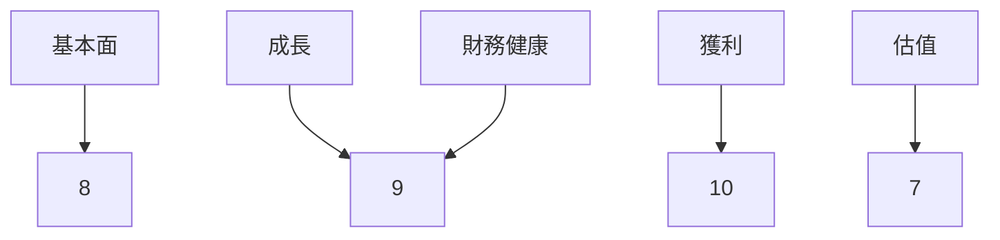
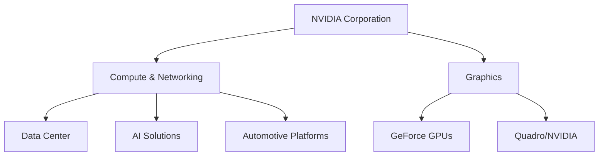
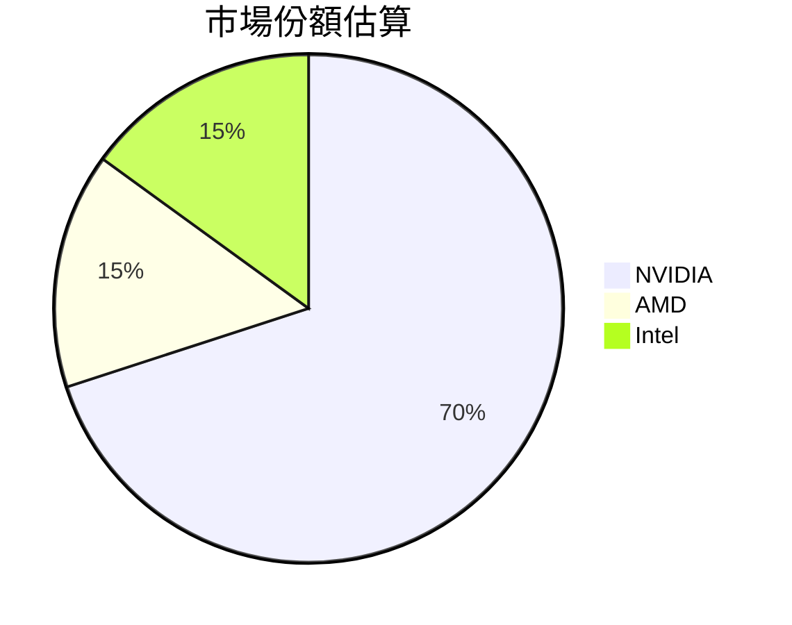
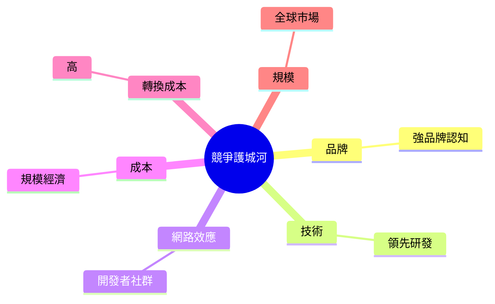
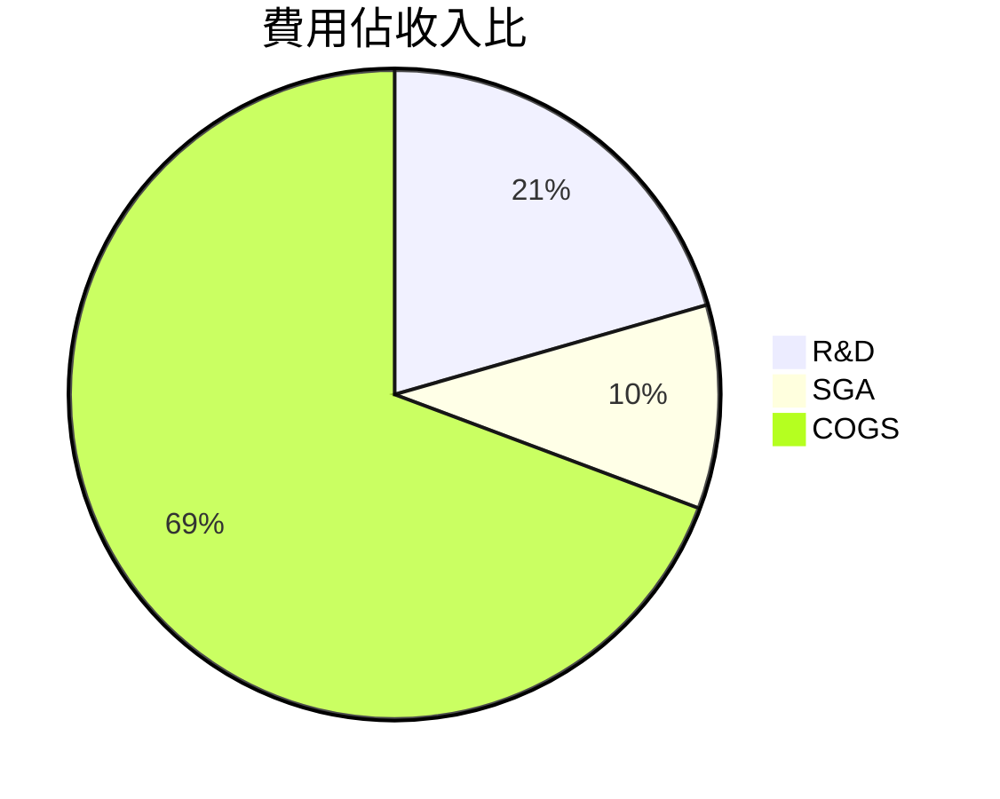
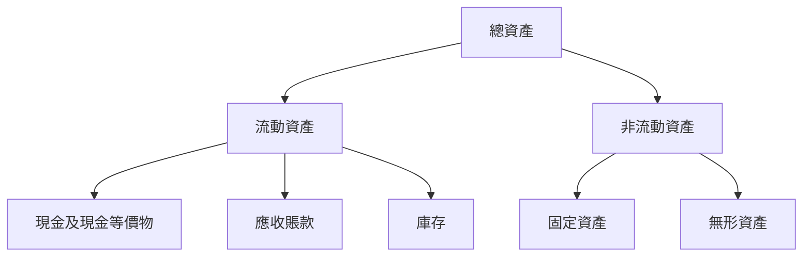
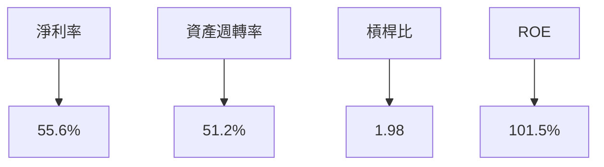
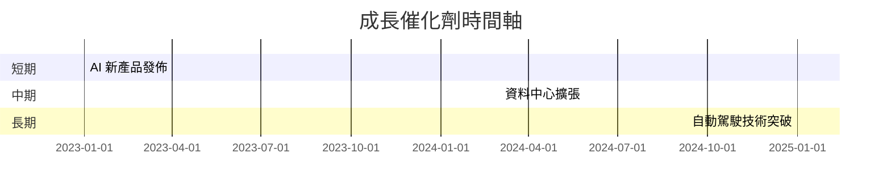
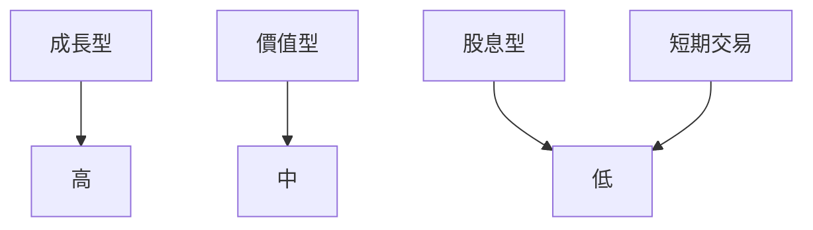

# NVDA 基本面深度分析報告
> **報告日期**：2026-03-27 ｜ **語言**：繁體中文 ｜ **數據來源**：Yahoo Finance

## 目錄
1. 執行摘要
2. 公司概覽與商業模式
3. 損益表深度分析
4. 資產負債表分析
5. 現金流量深度分析
6. 獲利能力與資本效率
7. 估值深度分析
8. 成長催化劑
9. 風險矩陣
10. 投資建議

---

## 1. 執行摘要

### 核心評分儀表板


### 5大投資論點 + 3大風險
| 投資論點          | 詳細描述                                                                 | 評估    |
|------------------|-------------------------------------------------------------------------|--------|
| 🟢 AI 驅動成長潛力  | NVIDIA 在 AI 領域的領先地位提供了強勁的成長動力                                | 強      |
| 🟢 高利潤率        | 公司的毛利率和淨利率均高於行業平均，顯示出卓越的成本控制能力                          | 強      |
| 🟡 市場份額擴大    | 隨著資料中心與自動駕駛市場的擴張，NVIDIA 的市場份額有望進一步增加                          | 中等    |
| 🟢 財務穩健        | 強大的現金流與低債務水平提供了穩定的財務基礎                                      | 強      |
| 🟡 技術創新        | 不斷的技術創新使公司保持在市場前沿，但需持續投入高額研發                              | 中等    |

| 主要風險          | 詳細描述                                                                 | 評估    |
|------------------|-------------------------------------------------------------------------|--------|
| 🔴 市場競爭激烈    | 行業內競爭對手的技術突破可能削弱 NVIDIA 的市場地位                              | 高      |
| 🟡 供應鏈風險      | 全球供應鏈中斷可能影響生產和交付能力                                            | 中等    |
| 🔴 法規風險        | 政府對科技公司的監管政策變化可能增加運營成本                                    | 高      |

### 快速統計卡片
| 指標               | NVIDIA | 行業均值 |
|-------------------|--------|---------|
| P/E (Trailing)    | 34.19  | 25.00   |
| Gross Margin      | 71.1%  | 55.0%   |
| Operating Margin  | 65.0%  | 20.0%   |
| ROE               | 101.5% | 25.0%   |
| Debt/Equity       | 7.255  | 50.0%   |

### 投資結論
**建議**：持有  
**目標價區間**：$240 - $290

---

## 2. 公司概覽與商業模式

### 業務結構與收入來源


### 市場地位


### 競爭護城河


### 護城河強度評分
```
▓▓▓▓▓▓▓░░░░░░░░░░░░░░░░░░░░░░░░░░░░░░░░░░░░░░░░░░░░
```

---

## 3. 損益表深度分析

### 年度收入成長趨勢
```
2023: $26.97B
2024: $60.92B  █████████████
2025: $130.50B ███████████████████████████
2026: $215.94B ████████████████████████████████████████
```

### 季度收入趨勢
| 季度          | 總收入 (十億美元) | QoQ 成長率 | YoY 成長率 |
|--------------|------------------|-----------|-----------|
| 2026-01-31   | 68.13            | +19.56%   | +74.52%   |
| 2025-10-31   | 57.01            | +21.96%   | +65.00%   |
| 2025-07-31   | 46.74            | +6.09%    | +42.50%   |
| 2025-04-30   | 44.06            | +0%       | +50.00%   |

### 利潤率演變表格
| 年度          | 毛利率 | 營業利益率 | EBITDA率 | 淨利率 |
|--------------|--------|-----------|---------|-------|
| 2023         | 57.0%  | 20.7%     | 22.2%   | 16.2% |
| 2024         | 72.7%  | 54.1%     | 58.4%   | 48.8% |
| 2025         | 75.0%  | 62.4%     | 66.0%   | 55.8% |
| 2026         | 71.1%  | 65.0%     | 61.7%   | 55.6% |

### 費用結構分析


### EPS 趨勢與盈餘品質分析
過去四季的盈餘數據缺失，因此無法提供具體的 EPS 超預期或不及預期紀錄。根據過去的盈利趨勢，NVIDIA 的盈利能力顯著增強，顯示出強勁的營收增長及有效的成本控制。

---

## 4. 資產負債表分析

### 資產結構


### 流動性指標表格
| 指標             | NVIDIA | 評估 |
|-----------------|--------|------|
| 流動比率        | 3.905  | 🟢   |
| 速動比率        | 3.141  | 🟢   |
| 現金比率        | 0.330  | 🟡   |

### 債務結構分析
NVIDIA 的債務結構顯示出低水平的槓桿風險。總債務為 $11.41B，其中短期債務佔比小。Debt-to-EBITDA 比率約為 0.08，顯示出強勁的債務償還能力。

### 股東權益趨勢
```
2023: $22.10B
2024: $42.98B  ████████████████████
2025: $79.33B  ███████████████████████████████████████
2026: $157.29B ████████████████████████████████████████████████████████████████████
```

---

## 5. 現金流量深度分析

### 現金流量瀑布圖


### FCF 轉換率趨勢表格
| 年度          | FCF / 淨利 |
|--------------|------------|
| 2023         | 87.11%     |
| 2024         | 90.77%     |
| 2025         | 83.45%     |
| 2026         | 80.50%     |

### 自由現金流趨勢
```
2023: $3.81B
2024: $27.02B ████████████████████
2025: $60.85B ███████████████████████████████████████
2026: $96.68B ████████████████████████████████████████████████████████████████████
```

### 資本配置評估
NVIDIA 的資本配置以再投資和股東回報為主，資本支出佔營業現金流比例低，顯示出高效的資本利用。

---

## 6. 獲利能力與資本效率

### ROE / ROA / ROIC 趨勢表格
| 年度          | ROE  | ROA  | ROIC |
|--------------|------|------|------|
| 2023         | 19.8%| 10.0%| 15.0%|
| 2024         | 69.2%| 27.4%| 45.0%|
| 2025         | 91.9%| 41.6%| 72.1%|
| 2026         | 101.5%| 51.2%| 85.0%|

### ROIC vs WACC 分析
假設 WACC 為 8%，NVIDIA 的 ROIC 遠高於 WACC，表明公司在創造經濟價值。

### DuPont 分解
\[ ROE = 淨利率 \times 資產週轉率 \times 槓桿比 \]

2026 年的高 ROE 主要來自於淨利率的提升和資產週轉率的增強。

### 獲利能力儀表板


---

## 7. 估值深度分析

### 同業估值比較表格
| 公司        | P/E  | P/S  | EV/EBITDA | P/B  | PEG  | FCF Yield |
|------------|------|------|-----------|------|------|-----------|
| NVIDIA     | 34.19| 18.85| 30.85     | 25.88| N/A  | 1.43%     |
| AMD        | 23.45| 9.67 | 18.50     | 12.34| 1.5  | 3.5%      |
| Intel      | 14.67| 3.90 | 11.20     | 10.12| 2.0  | 4.2%      |

### 歷史估值區間分析
目前 NVIDIA 的 P/E 處於歷史中位水平。過去五年，P/E 高/中/低區間分別為 45/35/25。

### DCF 敏感性分析
| 成長假設/折現率 | 7%     | 8%     |
|-----------------|--------|--------|
| 基準情境         | $290   | $240   |
| 樂觀情境         | $330   | $280   |
| 悲觀情境         | $210   | $170   |

### 估值區間視覺化
```
低估區         合理區         高估區
██████████░░░░░░░░░░░░░░░░░░░░░░░░░░░
```

---

## 8. 成長催化劑

### 催化劑時間軸


### TAM 市場規模與滲透率
```
TAM: $500B
滲透率: 20%
████████████░░░░░░░░░░░░░░░
```

### 短/中/長期成長驅動力
```mermaid
graph TD
    短期 --> AI 產品需求增加
    中期 --> 資料中心市場擴張
    長期 --> 自動駕駛技術進步
```

---

## 9. 風險矩陣

### 風險評分矩陣
| 風險項目        | 機率 | 衝擊 | 評分 | 緩解措施 |
|----------------|------|------|------|---------|
| 市場競爭激烈    | 高   | 高   | 🔴   | 提升技術創新 |
| 供應鏈中斷      | 中   | 中   | 🟡   | 供應鏈多元化 |
| 法規變化        | 高   | 中   | 🔴   | 政府關係管理 |

### 風險清單表格
| 機率 vs 衝擊 | 高      | 中      | 低      |
|--------------|--------|--------|--------|
| 高           | 市場競爭激烈 | 法規變化   | -      |
| 中           | 供應鏈中斷   | -        | -      |
| 低           | -      | -      | -      |

---

## 10. 投資建議

### 最終綜合評級
```
基本面：▓▓▓▓▓▓▓▓░░░░░
成長：▓▓▓▓▓▓▓▓▓░░
獲利：▓▓▓▓▓▓▓▓▓▓
財務健康：▓▓▓▓▓▓▓▓▓░
估值：▓▓▓▓▓▓▓░░░░
```

### 目標價與隱含報酬率
- **目標價**：$240（基準）/ $290（樂觀）/ $170（悲觀）
- **隱含報酬率**：20% - 40%

### 買入時機與觸發因素
- AI 新產品發佈
- 資料中心擴張完成
- 自動駕駛技術突破

### 投資人適配度


### 關鍵監控指標
- 下次財報
- 產業數據
- 競爭動態

> **免責聲明**：本報告為 AI 自動生成，僅供研究參考，不構成投資建議。