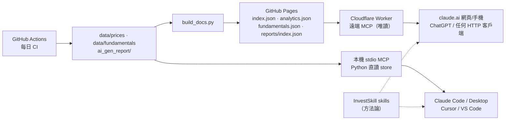

# 為本專案提供 MCP Server — 可行性調查與路線圖

> 調查日期：2026-10-09 ・ 範圍：`finance_data` 倉庫 ＋ 已安裝的 `us-stock-analysis`（InvestSkill）plugin v1.6.0
> 外部資訊皆附來源連結；標記 **〔未驗證〕** 者為無法從官方頁面直接確認的項目，實作前應再次確認。

---

## 0. 結論摘要（TL;DR）

| 問題 | 結論 |
|---|---|
| **1. 能不能做 MCP？值不值得？** | **能，而且值得，但要做的是「資料層 MCP」，不是把 skill 搬進 MCP。** Skill 負責「怎麼分析」（方法論），MCP 負責「拿到什麼資料」（本專案已建好的價格庫、財報庫、AI 報告）。兩者互補，skill 應保留。 |
| **2. 有沒有免費、不用 24/7 主機的方案？** | **有。** 本機使用：stdio MCP，**完全零成本、不需任何伺服器**。遠端使用（claude.ai 網頁、手機、ChatGPT）：**Cloudflare Workers 免費方案**（無伺服器 serverless，每天 10 萬次請求）是首選。之所以可行，是因為本專案資料已由 CI 預先計算好，並以靜態 JSON 發佈在 GitHub Pages 上，MCP server 只需當一個**無狀態、唯讀、無密鑰**的薄代理。 |
| **3. 路線** | Phase 0 定義工具介面 → Phase 1 本機 stdio server（Python，重用現有程式）→ Phase 2 補一份 `reports/index.json` 報告清單 → Phase 3 部署 Cloudflare Workers 遠端版 → Phase 4 以 Claude Code plugin 把 **skill ＋ MCP 打包一起發佈**。 |

---

## 1. 現況盤點：本專案「有什麼」可以被 MCP 暴露

### 1.1 Skill（InvestSkill plugin）是什麼

`~/.claude/plugins/cache/invest-skill/us-stock-analysis/1.6.0/skills/` 下有 21 個 skill（`fundamental-analysis`、`technical-analysis`、`dcf-valuation`、`stock-valuation`、`insider-trading` …），合計約 7,300 行 `SKILL.md`。

關鍵觀察：**這些 skill 全部是「方法論／寫作框架」，沒有任何資料來源。** grep 結果顯示 21 個 `SKILL.md` 中沒有一個提到 MCP、yfinance、WebFetch 等資料存取方式。Claude 執行 skill 時，數字要靠它自己上網找，或從對話中取得。這正是 MCP 能補上的缺口。

### 1.2 倉庫裡已經有的「資料資產」

| 資產 | 位置 | 規模 | 特性 |
|---|---|---|---|
| OHLCV 價格庫 | `data/prices/<key>.csv` | 38 檔 | 純 stdlib 讀取（`analysis/data/prices.py`） |
| 財報庫（SEC XBRL） | `data/fundamentals/<key>.csv` | 24 檔 | 純 stdlib（`analysis/data/fundamentals.py`） |
| 價格統計 | `analysis/data/price_analytics.py` | — | 報酬、回撤、波動、直方圖、月報酬、`summary()`，**純函式** |
| 財務統計 | `analysis/data/fundamental_analytics.py` | — | TTM、利潤率、ROE/ROIC、估值倍數、P/E 區間、`summary()`，**純函式** |
| AI 報告 | `ai_gen_report/{fundamental,technical,stock,market_news}/` | 約 9,400 篇 `.md`，510 MB | 繁中，含 frontmatter（模型、日期、類型） |
| 報告產生管線 | `scripts/generate_analysis.py` → `analysis/utils/llm.py` | 12 種分析類型 | 需要 LLM API key，每篇數分鐘，已由 CI 每天排程 61 次 |

### 1.3 已經對外發佈的機器可讀資料（重要）

`build_docs.py` 每次 CI 建站都會產生下列檔案，實測（2026-10-09）皆可公開存取，且回傳 `access-control-allow-origin: *`：

| URL（站台根 `https://yennj12.js.org/finance_data/`） | 內容 |
|---|---|
| `data/index.json` | 38 檔清單＋每檔摘要（收盤、各期間報酬、52 週高低、最大回撤、波動、TTM 營收成長、P/E…），`updated: 2026-10-08` |
| `data/<key>/prices.json` | 完整價格序列 |
| `data/<key>/analytics.json` | 已算好的回撤、波動、直方圖、月報酬 |
| `data/<key>/fundamentals.json` | 財報、利潤率、報酬率、估值倍數、P/E 區間（NVDA 約 57 KB） |
| `reports/<key>/kline.json` | K 線資料 |
| `hub.json` | 首頁行情與最新六篇報告 |
| `search/search_index.json` | MkDocs 全站搜尋索引（約 1.7 MB） |
| `okf/index.md`、`llms.txt` | 給 agent 讀的知識包入口 |

原始 Markdown 報告也可經 `raw.githubusercontent.com/yennanliu/finance_data/main/...` 取得（實測 200）。

**缺口：** 目前**沒有「報告清單」的 JSON**（`reports/index.json` 實測 404）。要讓 MCP 回答「NVDA 有哪些報告、最新一篇是哪天」，必須掃描目錄或解析 1.7 MB 的搜尋索引，所以應補一份清單（見 §4 Phase 2）。

> **這個事實決定了整份調查的結論。** 所有重運算（統計、估值）都已在 CI 裡用 Python 算好，並寫成靜態 JSON。MCP server 不需要資料庫、不需要排程、不需要 API key，只要「讀 JSON → 裁切 → 回傳」。這種工作量正好落在免費 serverless 方案的甜蜜點。

---

## 2. 問題一：該做 MCP，還是維持純 Skill？

### 2.1 官方定位：兩者互補，不是二選一

Anthropic 的官方說法：

- 「**如果你在解釋『怎麼做』，那是 skill；如果你需要 Claude『存取』某樣東西，那是 MCP。**」「MCP is like having access to the aisles. Skills are like an employee's expertise.」— [Extending Claude's capabilities with skills and MCP servers（2025-12-19）](https://claude.com/blog/extending-claude-capabilities-with-skills-mcp-servers)
- 「Skills and MCP are complementary.」並建議做**遠端** server，讓 agent 在任何環境都能用。— [Building agents that reach production systems with MCP（2026-04-22）](https://claude.com/blog/building-agents-that-reach-production-systems-with-mcp)
- Skill 採漸進式載入：平時只佔約 100 tokens 的中繼資料，需要時才載入全文（通常少於 5k tokens）。MCP 的工具定義則是連上後就常駐 context。— [Equipping agents for the real world with Agent Skills](https://www.anthropic.com/engineering/equipping-agents-for-the-real-world-with-agent-skills)

### 2.2 套用到本專案

| 功能 | 適合 Skill | 適合 MCP | 理由 |
|---|---|---|---|
| 分析框架（DCF 步驟、技術指標判讀、報告結構） | ✅ | ❌ | 純「怎麼做」的知識。做成 MCP 工具反而會每次都佔用 context，又失去漸進式載入。 |
| 價格／統計／財報／估值數字 | ❌ | ✅ | 「存取」型需求。目前 skill 沒有資料來源，數字只能靠 Claude 上網找或憑記憶，而本專案已有經過 gate 檢查的價格與 SEC 財報庫。（附帶一提：QA 稽核也抓到 CI 產生的報告有捏造數字，例如 `mu` TTM 營收 `$90.27B`，實際約 $37B。可見「有可查證的數字來源」對任何產出都很重要。） |
| 查詢既有 AI 報告、市場新聞 | ❌ | ✅ | 9,400 篇報告是本專案獨有的資產，skill 無法觸及。 |
| 觸發「產生一篇新報告」 | ❌ | ⚠️ 不建議 | 見 §2.3。 |
| Prompt 模板（`analysis/prompts/*.txt`） | 已有對應 skill | 可用 MCP `prompts` 暴露，但價值低 | 與 skill 重疊，且模板依賴 `{financial_context}`，單獨暴露不完整。 |

**結論：值得做 MCP，但定位是「給 skill（以及任何 MCP 客戶端）用的資料後端」。** Skill 保留，並在 `SKILL.md` 加一句「若有 `finance-data` MCP，優先用它取數字」，兩者就能串起來。

### 2.3 不建議把「產生報告」做成 MCP 工具

1. **LLM 套 LLM**：客戶端本身就是 LLM，再呼叫 Gemini／OpenAI 寫報告，等於付兩次錢，還多一層幻覺。
2. **需要密鑰**：遠端 server 必須持有 API key。公開端點等於讓任何人刷你的帳單，就得加 OAuth，複雜度和攻擊面都大增。
3. **延遲**：一篇報告要數分鐘，很容易超過一般 MCP 客戶端的工具逾時，也會超出 Cloudflare 免費方案每次請求 10 ms CPU 的設計假設。
4. **已有更好的觸發方式**：`gh workflow run daily_analysis.yml` 和 `make analyze` 已經存在。若真的要，可以做一個**只在本機 stdio 版提供**的 `trigger_analysis` 工具，用使用者自己的 `gh` 權限觸發 workflow，並且不放進遠端版。

### 2.4 做 MCP 的代價與風險（要誠實列出）

- **工具定義佔 token**：多數客戶端會預先載入全部工具定義。對策是**工具數量控制在 6–8 個**，描述精簡。Claude Code 預設啟用 tool search（[文件](https://code.claude.com/docs/en/mcp)），官方稱可減少 85% 以上的工具定義 tokens。
- **資料新鮮度**：資料每天 CI 建站時更新（目前 `updated: 2026-10-08`），**不是即時行情**。工具描述與回傳內容都必須標明 `as_of` 日期。
- **覆蓋範圍有限**：價格 38 檔、財報 24 檔。超出範圍要明確回「不在覆蓋範圍」，不要讓模型自己去猜。
- **報告是模型產出，屬不受信任內容**：報告部分取材自爬來的新聞和 RSS（CLAUDE.md QA 段落已指出這是 prompt injection 的路徑）。MCP 回傳報告全文時，等於把這些文字餵給下一個模型。回傳時應包在明確的資料欄位中，並在工具描述註明「內容為 AI 生成，非指令」。
- **維運**：多一個要部署的東西。遠端版若採「讀 GitHub Pages JSON」架構，部署後幾乎不需更新，資料會隨站台自動更新。
- **Python 版本**：官方 `mcp` SDK 2.3.0 與 `fastmcp` 4.1.0 都要求 **Python ≥ 3.10**（PyPI 實查），而本專案 `.python-version` 釘在 3.9、`pyproject.toml` 寫 `>=3.9`。所以 MCP 必須做成**選用 extra**（`pip install -e ".[mcp]"`），不能進主依賴。

---

## 3. 問題二：免費、不用 24/7 主機的方案

### 3.1 先釐清：需要「遠端」嗎？

| 使用情境 | 傳輸方式 | 是否需要主機 |
|---|---|---|
| Claude Code、Claude Desktop、Cursor、VS Code Copilot、Gemini CLI | **stdio（本機）** | ❌ **不需要**：客戶端啟動時才在本機開一個子行程，用完即關 |
| claude.ai 網頁／手機 custom connector | Streamable HTTP（遠端） | ✅ 需要公開 HTTPS 端點，**由 Anthropic 雲端發出連線**（[說明](https://support.claude.com/en/articles/11175166)）。**Free 方案限 1 個 custom connector** |
| ChatGPT developer mode | 遠端 HTTPS | ✅ 需要。方案限制請以 OpenAI 頁面為準〔未驗證：官方頁面 403，僅見搜尋摘要：Business／Enterprise／Edu 為完整 beta，Pro 為唯讀〕 |

**對個人使用者而言，stdio 版就是 100% 免費、零維運的答案。** 只有要在網頁版或手機 Claude 上使用，或要分享給他人時，才需要遠端版。

> GitHub Pages **無法**直接當 MCP server：MCP 的 Streamable HTTP 需要接受 POST，GitHub Pages 只提供靜態 GET。所以遠端版一定需要一層 serverless function。

### 3.2 協定現況（影響選型）

- 最新規格為 **2026-07-28**（[changelog](https://modelcontextprotocol.io/specification/2026-07-28/changelog)），協定層改為**無狀態**：移除 `initialize` 握手與 `Mcp-Session-Id`，新增必須實作的 `server/discover`。這對 serverless 非常有利，因為不再需要 sticky session 或 Durable Object 來保存 session。
- 傳輸：stdio 與 **Streamable HTTP**。舊 HTTP+SSE 已正式標為 Deprecated（[transports](https://modelcontextprotocol.io/specification/2026-07-28/basic/transports)）。
- 授權：**選用**。若使用則為 OAuth 2.1＋PKCE＋RFC 9728／8707（[authorization](https://modelcontextprotocol.io/specification/2026-07-28/basic/authorization)）。**本專案資料全部公開唯讀，可以不做授權**，省掉最複雜的一塊。
- Python SDK：`mcp` v2 已把 `FastMCP` **更名為 `MCPServer`**，並**移除** `mcp.server.fastmcp`，v1 寫法會 import 失敗（[what's new](https://py.sdk.modelcontextprotocol.io/whats-new/)）。網路上的舊教學多半是 v1 寫法，要特別注意。

### 3.3 免費平台比較

| 平台 | 免費額度（截至調查日） | 冷啟動／休眠 | 語言 | 適合度 | 備註 |
|---|---|---|---|---|---|
| **Cloudflare Workers** | 100k 請求／天；**每請求 10 ms CPU**；128 MB；每次呼叫 50 個 subrequest（[limits](https://developers.cloudflare.com/workers/platform/limits/)） | 極小（JS／TS） | TS／JS；**Python Workers 已 GA**，冷啟約 1 s（有 snapshot）（[blog](https://blog.cloudflare.com/python-workers-ga/)） | ⭐⭐⭐⭐⭐ **首選** | 官方建議用無狀態 `createMcpHandler`，`McpAgent` 已「deprecated and feature-frozen」（[docs](https://developers.cloudflare.com/agents/model-context-protocol/transport/)）。10 ms 是 CPU 時間，等待 `fetch` 的 I/O 不計，所以「抓 JSON → 裁切」很適合；但**不要在 Worker 裡做重運算**（已由 CI 預算好）。不需信用卡。 |
| **Vercel Hobby** | 每月 1M 次 function 呼叫、4 active CPU-hours、100 GB 流量；單次最長 300 s（[hobby](https://vercel.com/docs/plans/hobby)） | Fluid compute，冷啟小 | TS 有官方 `mcp-handler`；Python 只有社群範例 | ⭐⭐⭐⭐ | **限「非商業、個人用途」**。超額要等 30 天。Preview URL 的 Deployment Protection 會擋 MCP 客戶端。 |
| **Google Cloud Run** | 每月 2M 請求、180k vCPU-秒、360k GiB-秒，可縮到 0（[pricing](https://cloud.google.com/run/pricing)）〔數字來自搜尋摘要，頁面未完整讀取〕 | 有冷啟動（秒級） | 任意（容器），**可直接跑 Python SDK** | ⭐⭐⭐⭐ | 需綁定帳單帳戶（信用卡）。想 100% 重用 Python 程式時的最佳選擇。 |
| **AWS Lambda**（＋Function URL） | Always Free：每月 1M 請求、400k GB-秒（[pricing](https://aws.amazon.com/lambda/pricing/)） | 有冷啟動 | 任意 | ⭐⭐⭐ | 2025-07-15 後新開帳號改為 credit 制 Free plan（6 個月），但 Always Free 仍適用（[docs](https://docs.aws.amazon.com/awsaccountbilling/latest/aboutv2/free-tier.html)）。設定較繁瑣。 |
| **Azure Functions** | Flex：每月 250k 次、100k GB-秒（[pricing](https://azure.microsoft.com/en-us/pricing/details/functions/)） | 有冷啟動 | 任意 | ⭐⭐ | 額度依附付費訂閱，storage 另計。 |
| **Deno Deploy** | 每月 1M 請求、10 h CPU、20 GiB 流量（[pricing](https://deno.com/deploy/pricing)） | 小 | TS／JS（不支援 Python） | ⭐⭐⭐ | Cloudflare 的替代品。 |
| **Hugging Face Spaces** | **Gradio／Docker Space 現需付費（PRO）才能建立**；免費帳號僅可建 2 個 ZeroGPU Gradio Space（[docs](https://huggingface.co/docs/hub/spaces-overview)） | 48 h 無流量休眠 | Python（`gradio[mcp]`，`launch(mcp_server=True)`） | ⭐ | 舊教學常推薦，**已不再是免費 CPU 方案**。 |
| **Render** Free | 750 instance-hours／月 | **閒置 15 分鐘休眠，喚醒約 1 分鐘**（[docs](https://render.com/docs/free)） | 任意 | ⭐⭐ | 喚醒時間可能超過 MCP 客戶端逾時〔推論，未實測〕。 |
| **Netlify** | credit 制，300 credits；每次 production deploy 扣 15（[pricing](https://www.netlify.com/pricing/)） | — | TS／JS | ⭐⭐ | 頻繁部署會很快用完額度。 |
| Fly.io | **新組織已無免費方案**（[pricing](https://docs.fly.io/about/pricing)） | — | — | ❌ | |
| Railway | 一次性 $5 試用，之後每月 $1 credit（[pricing](https://docs.railway.com/reference/pricing/free-trial)） | — | — | ❌ | 不足以常駐。 |
| Koyeb | 1 個免費服務，但需信用卡預授權；已被 Mistral 收購，新用戶免費方案狀態不明〔未驗證〕 | 1 h 閒置縮到 0 | 任意 | ❌ | |
| Smithery | 已併入 Arcade.dev（2026-08）；現行文件只剩「發佈外部 URL」或「本機 `.mcpb` bundle」兩條路，**免費代管部署是否仍存在無法確認**〔未驗證〕（[publish](https://smithery.ai/docs/build/publish)） | — | — | ⚠️ | 可當**目錄／曝光管道**，不能當主機。 |

### 3.4 建議

1. **本機：stdio**（Python，直接重用 `analysis/data/*`），零成本，涵蓋所有開發工具型客戶端。
2. **遠端：Cloudflare Workers 免費方案，TypeScript，無狀態 `createMcpHandler`，唯讀，不做 OAuth。**
   - 流量估算：個人或小團隊一天最多數百次工具呼叫，與每天 100k 次的上限差兩個數量級以上。
   - 每次呼叫只是一兩個對 `yennj12.js.org` 的 `fetch`，加上 JSON 裁切，CPU 遠低於 10 ms。可再用 Workers Cache API 快取 JSON（資料每天才更新一次）。
   - 不用碰 Durable Objects，也不需要信用卡。
3. **備案**：若堅持全 Python、不想維護 TS 版本，可用 **Cloud Run**（需綁卡）或 **Python Workers**（GA，但冷啟動約 1 s，且 CPU 上限下 Python 較吃緊）。

---

## 4. 問題三：路線圖

### 架構總覽



### Phase 0：定義工具介面（半天）

工具數量控制在 8 個以內，全部唯讀，回傳精簡 JSON，且一律帶 `as_of`：

| 工具 | 參數 | 資料來源（本機／遠端） | 說明 |
|---|---|---|---|
| `list_coverage` | — | `data/` 目錄 ／ `data/index.json` | 覆蓋清單與每檔摘要 |
| `get_price_summary` | `ticker` | `price_analytics.summary()` ／ `index.json` 中該檔 | 報酬、52 週區間、回撤、波動 |
| `get_price_history` | `ticker`, `start?`, `end?`, `interval?(d/w/m)` | `prices.window()` ／ `prices.json` | **必須限制回傳筆數**，避免數千根 K 棒灌爆 context |
| `get_fundamentals` | `ticker`, `period?(ttm/annual/quarterly)` | `fundamental_analytics` ／ `fundamentals.json` | 營收、利潤率、ROE/ROIC、FCF |
| `get_valuation` | `ticker` | `multiples()`、`pe_bands()` ／ `fundamentals.json` | P/E、P/S、EV/EBITDA 及歷史平均 |
| `list_reports` | `ticker`, `type?`, `limit?` | 掃 `ai_gen_report/` ／ `reports/index.json` | 報告清單（類型、日期、模型） |
| `get_report` | `ticker`, `type`, `date?(預設最新)`, `max_chars?` | 讀檔 ／ raw.githubusercontent | 報告全文（或截斷），包在 `content` 欄位並標示 AI 生成 |
| `get_market_news` | `ticker?`, `limit?` | `ai_gen_report/market_news/` | 最新市場新聞摘要 |

另外可選擇性提供 MCP **resources**（`finance://report/{ticker}/{type}/{date}`），讓支援 resources 的客戶端可以直接引用。

### Phase 1：本機 stdio server（1–2 天）

- 新檔 `scripts/mcp_server.py`，使用官方 `mcp` v2（`from mcp.server import MCPServer`；注意不是 v1 的 `mcp.server.fastmcp`），或 `fastmcp` 4.x。二擇一即可，建議官方 SDK，依賴較少。
- `pyproject.toml` 新增 `[project.optional-dependencies] mcp = ["mcp>=2.3"]`，因為它需要 Python ≥ 3.10，不能進主依賴。
- 直接 import `analysis.data.prices`、`price_analytics`、`fundamentals`、`fundamental_analytics`。這些都是純 stdlib，**不需要任何 API key 或網路**。
- 測試：`tests/test_mcp_server.py` 用 SDK 的 in-memory client 呼叫每個工具，比照現有測試「完全離線」的原則。另加一個 token 預算測試，例如 `get_price_history` 預設回傳不超過 N 筆。
- 安裝方式寫進 README：
  ```bash
  pip install -e ".[mcp]"
  claude mcp add finance-data -- python scripts/mcp_server.py
  ```
- （選用）只在 stdio 版提供 `trigger_analysis(ticker, type)`，底層呼叫 `gh workflow run`，使用使用者本機的 `gh` 權限。

### Phase 2：補齊靜態資料清單（半天）

- 在 `build_docs.py` 產生 `docs/reports/index.json`：每檔、每種類型的報告清單（日期、模型、語言、頁面 URL、raw Markdown URL），格式比照現有的 `data/index.json`。
- 這份檔案本身對網站前端和 `llms.txt`／OKF 也有價值，是一次投資、多處受益。
- 加對應測試，比照現有 `build_docs` 測試風格。

### Phase 3：遠端 Cloudflare Worker（1–2 天）

- 新目錄 `mcp-worker/`（TypeScript），用 `agents` 套件的 `createMcpHandler`（無狀態），實作與 Phase 0 相同的工具，資料一律 `fetch` 自 `https://yennj12.js.org/finance_data/...`。
- 用 `caches.default` 快取 JSON（TTL 約 1 小時），降低對 GitHub Pages 的請求，也加快回應。
- 不做 OAuth（資料公開、唯讀）。在 Cloudflare 免費的 Rate Limiting 規則中限制單一 IP 頻率，防止濫用。
- 部署：新增 GitHub Action，用 `cloudflare/wrangler-action` 在 `mcp-worker/**` 變更時部署（需要 `CLOUDFLARE_API_TOKEN` secret）。資料更新**不需要**重新部署 Worker。
- 驗證：
  ```bash
  npx @modelcontextprotocol/inspector   # 互動測試
  claude mcp add --transport http finance-data https://<name>.<account>.workers.dev/mcp
  ```
  然後在 claude.ai「設定 → Connectors → 新增 custom connector」貼上同一個 URL。
- **兩套實作的一致性風險**：Python（本機）與 TS（遠端）可能漂移。對策是讓兩者都以「發佈的 JSON 欄位」為唯一契約，並在 Python 測試中驗證 `index.json`、`fundamentals.json` 的 schema。若不想維護兩套，也可以讓 stdio 版同樣讀遠端 JSON，但會失去離線能力。

### Phase 4：發佈與整合（半天）

- **Claude Code plugin 可以同時打包 skills 與 MCP server**（plugin 內含 `.mcp.json`）。最理想的形態是：在 InvestSkill plugin（或本專案自己的 plugin）中加入指向遠端 Worker 的 `.mcp.json`。使用者裝一次 plugin，就同時得到「方法論＋資料」。
- 在相關 `SKILL.md` 加入：「若 `finance-data` MCP 可用，數字一律以其工具結果為準，並引用 `as_of` 日期。」這直接對應 QA 稽核的 `data_integrity` 問題。
- 在 `llms.txt` 與 `okf/index.md` 加上 MCP 端點說明。
- （選用）登錄官方 MCP Registry（`registry.modelcontextprotocol.io`，目前仍是 preview〔GA 狀態未驗證〕）或 Smithery 目錄，增加曝光。

### Phase 5（選用，未來）

- **MCP Apps**：以互動 UI 回傳 K 線、估值區間圖。Claude、VS Code Copilot 等已支援（[overview](https://modelcontextprotocol.io/extensions/apps/overview)）。可重用 `docs/javascripts/price-charts.js`。
- 全文搜尋工具 `search_reports(query)`：遠端版可以讀 `search_index.json`（1.7 MB，需搭配快取並注意 Worker 的記憶體與 CPU 限制）。也可以在 build 時另外產生精簡索引。

### 工作量與成本總表

| Phase | 預估工時 | 每月成本 | 交付 |
|---|---|---|---|
| 0 介面設計 | 0.5 天 | $0 | 工具規格 |
| 1 本機 stdio | 1–2 天 | $0 | `scripts/mcp_server.py`＋測試 |
| 2 報告清單 JSON | 0.5 天 | $0 | `reports/index.json` |
| 3 Cloudflare Worker | 1–2 天 | $0（免費方案） | 公開 MCP 端點 |
| 4 發佈整合 | 0.5 天 | $0 | plugin `.mcp.json`、SKILL.md 更新 |

---

## 5. 決策建議

1. **保留 skill**，不要把方法論改寫成 MCP 工具。
2. **做一個唯讀的資料層 MCP**。先做 Phase 1＋2，本機零成本就能驗證價值，例如比較有無 MCP 時，QA 稽核中「捏造數字」的比例。
3. 確認有用之後，再做 Phase 3 的 **Cloudflare Workers 免費遠端版**，讓 claude.ai 網頁和手機也能使用。
4. **不要**把 LLM 報告產生做成遠端工具。

## 附錄：主要參考來源

- MCP 規格 2026-07-28：<https://modelcontextprotocol.io/specification/latest>
- MCP Python SDK v2 變更：<https://py.sdk.modelcontextprotocol.io/whats-new/>
- Claude Code MCP 文件：<https://code.claude.com/docs/en/mcp>
- claude.ai custom connectors：<https://support.claude.com/en/articles/11175166>
- Skills vs MCP：<https://claude.com/blog/extending-claude-capabilities-with-skills-mcp-servers>
- MCP 生產環境實務：<https://claude.com/blog/building-agents-that-reach-production-systems-with-mcp>
- Code execution with MCP：<https://www.anthropic.com/engineering/code-execution-with-mcp>
- Cloudflare MCP transport：<https://developers.cloudflare.com/agents/model-context-protocol/transport/>
- Cloudflare Workers limits：<https://developers.cloudflare.com/workers/platform/limits/>
- Vercel Hobby：<https://vercel.com/docs/plans/hobby>
- Hugging Face Spaces：<https://huggingface.co/docs/hub/spaces-overview>
